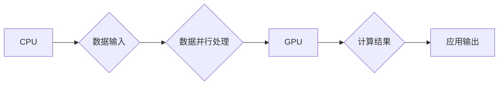

> NVIDIA, GPU, CUDA, 深度学习, 大规模运算, 并行计算, 高性能计算

## 1. 背景介绍

在当今数据爆炸的时代，大规模数据处理和分析已成为各行各业的核心竞争力。从科学研究到金融交易，从医疗诊断到自动驾驶，都需要处理海量数据以获得洞察力和做出明智的决策。然而，传统的CPU架构在处理海量数据时面临着瓶颈，其串行处理模式难以满足对高性能计算的需求。

NVIDIA作为全球领先的图形处理单元（GPU）供应商，凭借其强大的并行计算能力和丰富的软件生态系统，为大规模运算提供了强有力的支持。GPU的架构天生就适合并行计算，其千核架构能够同时处理大量数据，从而大幅提升计算效率。

## 2. 核心概念与联系

### 2.1 GPU架构

GPU（Graphics Processing Unit）最初设计用于处理图形渲染，其核心特点是拥有大量并行处理单元（cores）。与CPU相比，GPU拥有更丰富的并行计算能力，能够同时处理数千个任务，从而实现高效的数据并行处理。

### 2.2 CUDA架构

CUDA（Compute Unified Device Architecture）是NVIDIA开发的并行计算平台，它允许开发者将应用程序移植到GPU上进行加速计算。CUDA提供了一套完整的编程模型和工具，包括编程语言、运行时环境和调试工具，使得开发者能够轻松地利用GPU的并行计算能力。

### 2.3 深度学习

深度学习是一种机器学习的子领域，它利用多层神经网络来模拟人类大脑的学习过程。深度学习算法对计算资源要求极高，GPU的并行计算能力能够有效加速深度学习模型的训练和推理过程。

**Mermaid 流程图**



## 3. 核心算法原理 & 具体操作步骤

### 3.1 算法原理概述

CUDA的核心算法原理是将应用程序中的任务分解成多个小的并行任务，然后将这些任务分配到GPU上的多个处理单元上进行并行执行。

### 3.2 算法步骤详解

1. **代码移植:** 将应用程序代码移植到CUDA编程模型中，将CPU上的数据和操作转换为GPU上的数据和操作。
2. **内核函数定义:** 定义GPU上的内核函数，该函数将执行每个并行任务。
3. **数据传输:** 将数据从CPU传输到GPU的内存中。
4. **内核函数执行:** 将内核函数提交到GPU上执行，GPU上的多个处理单元并行执行内核函数。
5. **数据传输:** 将计算结果从GPU的内存传输到CPU的内存中。

### 3.3 算法优缺点

**优点:**

* 并行计算能力强，能够大幅提升计算效率。
* 适用于大规模数据处理和计算密集型任务。
* 软件生态系统完善，提供丰富的工具和库。

**缺点:**

* 代码移植需要一定的学习成本。
* 数据传输过程可能带来一定的性能开销。
* GPU的内存容量相对较小，需要进行数据管理。

### 3.4 算法应用领域

* 深度学习
* 高性能计算
* 图像处理
* 视频处理
* 科学计算

## 4. 数学模型和公式 & 详细讲解 & 举例说明

### 4.1 数学模型构建

在CUDA编程中，我们可以使用数学模型来描述GPU的并行计算过程。假设一个应用程序需要执行N个任务，每个任务的执行时间为T，GPU拥有M个处理单元，则GPU的并行计算时间可以表示为：

```latex
T_{parallel} = \frac{N}{M} * T
```

### 4.2 公式推导过程

该公式表明，GPU的并行计算时间与任务数量、处理单元数量和每个任务的执行时间成正比。当任务数量和处理单元数量增加时，GPU的并行计算时间会相应减少。

### 4.3 案例分析与讲解

例如，假设一个应用程序需要执行1000个任务，每个任务的执行时间为1毫秒，GPU拥有1024个处理单元，则GPU的并行计算时间为：

```latex
T_{parallel} = \frac{1000}{1024} * 1ms = 0.977ms
```

如果使用CPU进行串行计算，则计算时间为：

```latex
T_{serial} = 1000 * 1ms = 1000ms
```

可见，GPU的并行计算时间比CPU的串行计算时间短了约1023倍。

## 5. 项目实践：代码实例和详细解释说明

### 5.1 开发环境搭建

* 安装NVIDIA驱动程序
* 安装CUDA Toolkit
* 安装深度学习框架（例如TensorFlow或PyTorch）

### 5.2 源代码详细实现

```python
import numpy as np
import tensorflow as tf

# 定义GPU设备
device = '/GPU:0'

# 创建一个简单的卷积神经网络模型
model = tf.keras.models.Sequential([
    tf.keras.layers.Conv2D(32, (3, 3), activation='relu', input_shape=(28, 28, 1)),
    tf.keras.layers.MaxPooling2D((2, 2)),
    tf.keras.layers.Flatten(),
    tf.keras.layers.Dense(10, activation='softmax')
])

# 将模型编译到GPU设备上
model.compile(optimizer='adam',
              loss='sparse_categorical_crossentropy',
              metrics=['accuracy'])

# 加载MNIST数据集
(x_train, y_train), (x_test, y_test) = tf.keras.datasets.mnist.load_data()

# 将数据预处理
x_train = x_train.astype('float32') / 255.0
x_test = x_test.astype('float32') / 255.0
x_train = np.expand_dims(x_train, axis=3)
x_test = np.expand_dims(x_test, axis=3)

# 使用GPU训练模型
with tf.device(device):
    model.fit(x_train, y_train, epochs=5)

# 使用GPU评估模型
with tf.device(device):
    loss, accuracy = model.evaluate(x_test, y_test)
    print('Test loss:', loss)
    print('Test accuracy:', accuracy)
```

### 5.3 代码解读与分析

这段代码演示了如何使用CUDA和TensorFlow框架在GPU上训练一个简单的卷积神经网络模型。

* `tf.device(device)`语句将模型编译和训练操作指定到指定的GPU设备上。
* `model.fit()`函数用于训练模型，`model.evaluate()`函数用于评估模型的性能。

### 5.4 运行结果展示

运行该代码后，会输出模型的训练过程和测试结果，其中包括训练损失、测试损失和测试准确率。

## 6. 实际应用场景

### 6.1 深度学习

NVIDIA GPU在深度学习领域得到了广泛应用，例如图像识别、自然语言处理、语音识别等。

### 6.2 高性能计算

NVIDIA GPU也用于高性能计算领域，例如科学计算、金融建模、天气预报等。

### 6.3 其他应用场景

* 图像处理和视频处理
* 虚拟现实和增强现实
* 自动驾驶

### 6.4 未来应用展望

随着人工智能技术的不断发展，NVIDIA GPU在未来将继续发挥重要作用，例如：

* 更强大的深度学习模型
* 更高效的科学计算
* 更逼真的虚拟现实和增强现实体验

## 7. 工具和资源推荐

### 7.1 学习资源推荐

* NVIDIA CUDA官网：https://developer.nvidia.com/cuda-zone
* CUDA编程指南：https://docs.nvidia.com/cuda/cuda-c-programming-guide/index.html
* 深度学习框架文档：https://www.tensorflow.org/，https://pytorch.org/

### 7.2 开发工具推荐

* NVIDIA CUDA Toolkit
* NVIDIA Nsight Systems
* NVIDIA Nsight Compute

### 7.3 相关论文推荐

* CUDA Programming Guide
* GPU Computing Gems

## 8. 总结：未来发展趋势与挑战

### 8.1 研究成果总结

NVIDIA GPU为大规模运算提供了强大的支持，其并行计算能力和丰富的软件生态系统推动了深度学习、高性能计算等领域的快速发展。

### 8.2 未来发展趋势

* GPU架构的不断演进，例如更强大的计算能力、更大的内存容量和更低的功耗。
* 深度学习算法的不断创新，例如更复杂的模型架构和更有效的训练方法。
* GPU在更多领域应用的扩展，例如边缘计算、物联网和云计算。

### 8.3 面临的挑战

* GPU的开发和维护成本较高。
* GPU的编程模型相对复杂，需要一定的学习成本。
* GPU的内存容量相对较小，需要进行数据管理。

### 8.4 研究展望

未来，研究者将继续探索GPU的潜力，开发更先进的算法和应用，以推动人工智能、高性能计算等领域的进一步发展。

## 9. 附录：常见问题与解答

* **如何选择合适的GPU？**

选择合适的GPU需要考虑应用场景、预算和性能需求。

* **如何进行GPU编程？**

可以使用CUDA编程模型进行GPU编程。

* **如何优化GPU程序的性能？**

可以通过数据传输优化、内核函数优化和内存管理优化等方式提高GPU程序的性能。


作者：禅与计算机程序设计艺术 / Zen and the Art of Computer Programming 
<end_of_turn>