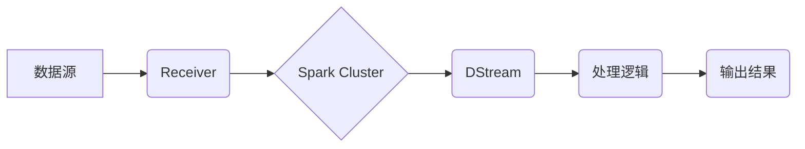

> Spark Streaming, 流式处理, 微批处理, DStream, Receiver, Resilient Distributed Datasets (RDD), Kafka, Flink

## 1. 背景介绍

随着互联网的蓬勃发展，海量数据实时生成和处理的需求日益增长。传统的批处理模式难以满足实时分析和响应的需求。为了解决这一问题，Apache Spark 引入了 Spark Streaming，提供了一种高效的实时数据流处理框架。

Spark Streaming 基于微批处理思想，将流数据划分为小的批次，并将其处理为批处理任务。这种方式结合了批处理的效率和流处理的实时性，使其成为处理实时数据的理想选择。

## 2. 核心概念与联系

Spark Streaming 的核心概念包括：

* **DStream (Discretized Stream):**  DStream 是 Spark Streaming 中表示流数据的抽象数据结构。它将流数据划分为一系列微批，每个微批都对应一个 RDD。
* **Receiver:** Receiver 是 Spark Streaming 中负责接收流数据的组件。它从数据源（如 Kafka、Flume 等）接收数据，并将其发送到 Spark 集群中的各个节点。
* **Resilient Distributed Datasets (RDD):** RDD 是 Spark 的核心数据结构，用于存储和处理数据。每个 DStream 的微批都对应一个 RDD。
* **Spark Core:** Spark Streaming 基于 Spark Core 的计算引擎，利用 Spark Core 的分布式计算和容错机制进行数据处理。

**Spark Streaming 架构流程图:**



## 3. 核心算法原理 & 具体操作步骤

### 3.1  算法原理概述

Spark Streaming 的核心算法是微批处理。它将流数据划分为小的批次，并将其处理为批处理任务。每个微批都对应一个 RDD，可以利用 Spark Core 的分布式计算和容错机制进行处理。

### 3.2  算法步骤详解

1. **数据接收:** Receiver 从数据源接收数据，并将其分组到微批中。
2. **数据转换:** 每个微批都转换为一个 RDD，并可以进行各种数据转换操作，例如过滤、聚合、转换格式等。
3. **数据处理:** Spark Core 的计算引擎将 RDD 分布到各个节点进行并行计算，处理微批中的数据。
4. **结果输出:** 处理后的结果可以输出到各种目标系统，例如数据库、文件系统、消息队列等。

### 3.3  算法优缺点

**优点:**

* **高效率:** 利用 Spark Core 的分布式计算和容错机制，可以实现高吞吐量和低延迟的实时数据处理。
* **易于使用:** 基于 Spark 的 API，可以方便地进行数据处理和转换。
* **灵活扩展:** 可以扩展到多个节点，处理海量数据流。

**缺点:**

* **延迟:** 微批处理的延迟取决于微批大小和数据处理时间。
* **状态管理:** 状态管理相对复杂，需要考虑数据持久化和状态更新。

### 3.4  算法应用领域

Spark Streaming 广泛应用于以下领域:

* **实时数据分析:** 实时监控网站流量、用户行为、市场趋势等。
* **实时告警:** 实时检测异常数据，并触发告警机制。
* **实时推荐:** 基于用户行为数据，实时推荐个性化内容。
* **实时机器学习:** 实时更新机器学习模型，并进行实时预测。

## 4. 数学模型和公式 & 详细讲解 & 举例说明

### 4.1  数学模型构建

Spark Streaming 的微批处理算法可以抽象为一个数学模型：

```
DStream = {R1, R2, R3, ...}
```

其中：

* DStream 表示流数据。
* Ri 表示第 i 个微批，是一个 RDD。

### 4.2  公式推导过程

微批大小的计算公式：

```
batch_size = window_size / interval
```

其中：

* batch_size 表示微批大小。
* window_size 表示滑动窗口的大小。
* interval 表示微批间隔时间。

### 4.3  案例分析与讲解

假设我们有一个实时监控网站流量的应用，需要每分钟统计网站访问量。

* window_size = 60 秒 (1 分钟)
* interval = 1 秒

则微批大小为：

```
batch_size = 60 / 1 = 60
```

这意味着每秒钟收集的数据将被分组为一个微批，每分钟会生成 60 个微批。

## 5. 项目实践：代码实例和详细解释说明

### 5.1  开发环境搭建

* 安装 Java JDK
* 安装 Apache Spark
* 安装 Scala

### 5.2  源代码详细实现

```scala
import org.apache.spark.SparkConf
import org.apache.spark.streaming.{Seconds, StreamingContext}
import org.apache.spark.streaming.kafka010._

object SparkStreamingKafkaWordCount {
  def main(args: Array[String]): Unit = {
    val conf = new SparkConf().setAppName("SparkStreamingKafkaWordCount")
    val ssc = new StreamingContext(conf, Seconds(1))

    // Kafka 参数配置
    val kafkaParams = Map[String, Object](
      "bootstrap.servers" -> "localhost:9092",
      "group.id" -> "spark-streaming-group",
      "key.deserializer" -> "org.apache.kafka.common.serialization.StringDeserializer",
      "value.deserializer" -> "org.apache.kafka.common.serialization.StringDeserializer",
      "auto.offset.reset" -> "latest",
      "enable.auto.commit" -> (false: java.lang.Boolean)
    )

    val topics = Array("test")

    // 创建 Kafka 数据流
    val kafkaStream = KafkaUtils.createDirectStream[String, String](ssc, kafkaParams, topics)

    // 对数据进行处理
    val wordCounts = kafkaStream.flatMap(_.split(" "))
      .map(word => (word, 1))
      .reduceByKey(_ + _)

    // 将结果输出到控制台
    wordCounts.print()

    // 启动 Spark Streaming
    ssc.start()
    ssc.awaitTermination()
  }
}
```

### 5.3  代码解读与分析

* **配置 SparkConf 和 StreamingContext:** 初始化 SparkConf 和 StreamingContext，设置应用程序名称和批处理间隔时间。
* **配置 Kafka 参数:** 设置 Kafka 集群地址、组 ID、序列化器等参数。
* **创建 Kafka 数据流:** 使用 KafkaUtils.createDirectStream 创建 Kafka 数据流，并指定主题和参数配置。
* **对数据进行处理:** 使用 flatMap、map 和 reduceByKey 操作对数据进行处理，统计每个单词的出现次数。
* **输出结果:** 使用 print 操作将结果输出到控制台。
* **启动 Spark Streaming:** 启动 Spark Streaming，并等待应用程序终止。

### 5.4  运行结果展示

运行代码后，会实时输出每个单词的出现次数，例如：

```
(hello, 2)
(world, 1)
(hello, 3)
(world, 2)
```

## 6. 实际应用场景

Spark Streaming 在各种实时数据处理场景中都有广泛的应用，例如：

* **实时监控:** 实时监控网站流量、用户行为、系统性能等指标，及时发现异常情况。
* **实时分析:** 实时分析用户行为数据，进行个性化推荐、精准营销等。
* **实时告警:** 实时检测异常数据，并触发告警机制，及时处理问题。
* **实时机器学习:** 实时更新机器学习模型，并进行实时预测。

### 6.4  未来应用展望

随着数据量的不断增长和实时处理需求的增加，Spark Streaming 将在未来发挥更加重要的作用。

* **更低延迟:** 通过优化算法和架构，实现更低的延迟，满足更苛刻的实时处理需求。
* **更强大的功能:** 支持更多类型的实时数据处理，例如时间序列分析、图数据处理等。
* **更易于使用:** 提供更友好的 API 和工具，降低开发门槛，方便用户使用。

## 7. 工具和资源推荐

### 7.1  学习资源推荐

* **Spark Streaming 官方文档:** https://spark.apache.org/docs/latest/streaming-programming-guide.html
* **Spark Streaming 入门教程:** https://www.tutorialspoint.com/spark/spark_streaming.htm
* **Spark Streaming 实战案例:** https://github.com/apache/spark/tree/master/examples/src/main/scala/org/apache/spark/examples/streaming

### 7.2  开发工具推荐

* **IntelliJ IDEA:** https://www.jetbrains.com/idea/
* **Eclipse:** https://www.eclipse.org/

### 7.3  相关论文推荐

* **Spark Streaming: Leveraging the Power of Micro-Batch Processing for Real-Time Data Analytics:** https://dl.acm.org/doi/10.1145/2508886.2508909

## 8. 总结：未来发展趋势与挑战

### 8.1  研究成果总结

Spark Streaming 作为一种高效的实时数据流处理框架，在数据分析、监控、告警等领域取得了显著的成果。

### 8.2  未来发展趋势

* **更低延迟:** 通过优化算法和架构，实现更低的延迟，满足更苛刻的实时处理需求。
* **更强大的功能:** 支持更多类型的实时数据处理，例如时间序列分析、图数据处理等。
* **更易于使用:** 提供更友好的 API 和工具，降低开发门槛，方便用户使用。

### 8.3  面临的挑战

* **数据处理复杂度:** 随着数据量的增长和处理复杂度的增加，Spark Streaming 的性能和效率面临挑战。
* **状态管理:** 状态管理相对复杂，需要考虑数据持久化和状态更新。
* **生态系统建设:** 需要不断完善 Spark Streaming 的生态系统，提供更多工具和资源，支持用户开发和应用。

### 8.4  研究展望

未来，Spark Streaming 将继续朝着更低延迟、更强大功能、更易于使用的方向发展。

## 9. 附录：常见问题与解答

* **Spark Streaming 和 Flink 的区别:** Spark Streaming 基于微批处理，Flink 基于流处理，两者在延迟和处理复杂度方面各有优劣。
* **如何配置 Spark Streaming 的 Kafka 数据源:** 需要配置 Kafka 的连接参数、主题和组 ID 等信息。
* **如何处理 Spark Streaming 中的状态更新:** 可以使用状态操作 API 或自定义状态管理逻辑。


作者：禅与计算机程序设计艺术 / Zen and the Art of Computer Programming 
<end_of_turn>