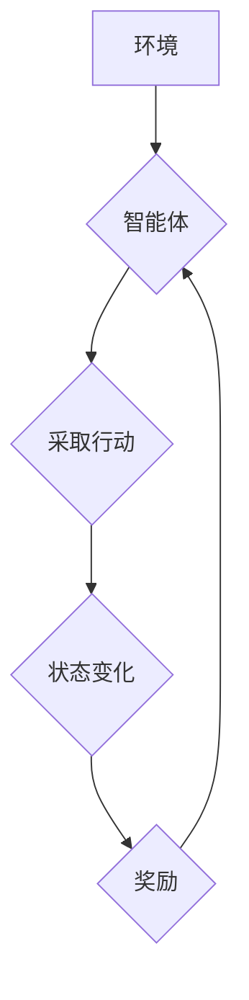

> Q-learning,价值迭代,强化学习,AI,机器学习,算法优化

## 1. 背景介绍

在人工智能领域，强化学习 (Reinforcement Learning, RL) 作为一种模仿人类学习方式的机器学习范式，近年来取得了显著进展。其核心在于训练智能体在环境中通过与环境交互，学习最优策略以最大化累积奖励。其中，Q-learning 作为 RL 的经典算法，凭借其简单易懂、高效学习的特点，在许多应用场景中展现出强大的能力。

然而，传统的 Q-learning 算法存在一些局限性，例如学习速度慢、容易陷入局部最优等问题。为了解决这些问题，价值迭代 (Value Iteration) 算法应运而生。价值迭代算法通过迭代更新状态价值函数，从而找到最优策略。

本文将深入探讨 Q-learning 和价值迭代算法，阐述其原理、联系以及优缺点，并通过代码实例和实际应用场景，帮助读者更好地理解和应用这些算法。

## 2. 核心概念与联系

**2.1 强化学习 (Reinforcement Learning)**

强化学习是一种基于交互学习的机器学习范式。智能体 (Agent) 在环境 (Environment) 中采取行动 (Action)，环境会根据智能体的行动产生状态变化 (State) 和奖励 (Reward)。智能体的目标是学习一个策略 (Policy)，使得在环境中采取的行动能够最大化累积的奖励。

**2.2 Q-learning 算法**

Q-learning 是一种基于价值函数的强化学习算法。其核心思想是学习一个 Q-表 (Q-table)，其中 Q(s, a) 表示在状态 s 下采取行动 a 的期望累积奖励。通过迭代更新 Q-表，智能体可以逐渐学习到最优策略。

**2.3 价值迭代 (Value Iteration) 算法**

价值迭代算法是一种基于状态价值函数的强化学习算法。其核心思想是迭代更新状态价值函数 V(s)，直到收敛到最优状态价值函数。通过最优状态价值函数，可以推导出最优策略。

**2.4 Q-learning 与价值迭代的联系**

Q-learning 和价值迭代算法都属于强化学习范畴，并且都基于价值函数。

* Q-learning 通过直接学习 Q-表，而价值迭代通过迭代更新状态价值函数。
* Q-learning 更适合离散状态和动作空间，而价值迭代更适合连续状态和动作空间。

**2.5 Mermaid 流程图**



## 3. 核心算法原理 & 具体操作步骤

### 3.1 算法原理概述

**3.1.1 Q-learning 算法原理**

Q-learning 算法的核心思想是通过迭代更新 Q-表，学习到在每个状态下采取每个动作的期望累积奖励。更新规则如下：

$$
Q(s, a) \leftarrow Q(s, a) + \alpha [r + \gamma \max_{a'} Q(s', a') - Q(s, a)]
$$

其中：

* $Q(s, a)$ 表示在状态 s 下采取动作 a 的期望累积奖励。
* $\alpha$ 是学习率，控制着学习速度。
* $r$ 是在状态 s 下采取动作 a 后获得的奖励。
* $\gamma$ 是折扣因子，控制着未来奖励的权重。
* $s'$ 是采取动作 a 后进入的状态。
* $a'$ 是在状态 $s'$ 下采取的动作。

**3.1.2 价值迭代算法原理**

价值迭代算法的核心思想是通过迭代更新状态价值函数，直到收敛到最优状态价值函数。更新规则如下：

$$
V(s) \leftarrow \max_{a} [r + \gamma V(s')]
$$

其中：

* $V(s)$ 表示状态 s 的价值。
* $r$ 是在状态 s 下采取动作 a 后获得的奖励。
* $\gamma$ 是折扣因子。
* $s'$ 是采取动作 a 后进入的状态。

### 3.2 算法步骤详解

**3.2.1 Q-learning 算法步骤**

1. 初始化 Q-表，将所有 Q 值设置为 0。
2. 在环境中随机探索，收集状态、动作和奖励数据。
3. 根据更新规则迭代更新 Q-表。
4. 选择最优策略，即在每个状态下采取 Q 值最大的动作。

**3.2.2 价值迭代算法步骤**

1. 初始化状态价值函数，将所有 V 值设置为 0。
2. 迭代更新状态价值函数，直到收敛。
3. 选择最优策略，即在每个状态下采取使状态价值函数最大的动作。

### 3.3 算法优缺点

**3.3.1 Q-learning 算法优缺点**

* **优点:**

    * 简单易懂，易于实现。
    * 适用于离散状态和动作空间。
    * 可以学习到最优策略。

* **缺点:**

    * 学习速度慢，容易陷入局部最优。
    * 需要存储大量的 Q 值，对于高维状态空间来说，存储量巨大。

**3.3.2 价值迭代算法优缺点**

* **优点:**

    * 理论上可以找到最优策略。
    * 不需要存储大量的 Q 值。

* **缺点:**

    * 对于连续状态和动作空间，计算量较大。
    * 收敛速度可能较慢。

### 3.4 算法应用领域

**3.4.1 Q-learning 算法应用领域**

* 游戏 AI
* 机器人控制
* 自动驾驶
* 医疗诊断

**3.4.2 价值迭代算法应用领域**

* 策略优化
* 资源分配
* 决策分析

## 4. 数学模型和公式 & 详细讲解 & 举例说明

### 4.1 数学模型构建

**4.1.1 Q-learning 数学模型**

Q-learning 的数学模型可以表示为一个马尔可夫决策过程 (MDP)，其中包含以下元素：

* 状态空间 S
* 动作空间 A
* 状态转移概率 P(s', r | s, a)
* 奖励函数 R(s, a)
* 折扣因子 γ

**4.1.2 价值迭代数学模型**

价值迭代的数学模型与 Q-learning 相似，但其目标是找到最优状态价值函数 V*，而不是 Q 值。

### 4.2 公式推导过程

**4.2.1 Q-learning 公式推导**

Q-learning 公式的推导过程基于 Bellman 方程，其核心思想是将未来奖励最大化。

**4.2.2 价值迭代公式推导**

价值迭代公式的推导过程也基于 Bellman 方程，其目标是找到使状态价值函数最大化的策略。

### 4.3 案例分析与讲解

**4.3.1 Q-learning 案例分析**

假设有一个简单的环境，智能体可以采取向上、向下、向左、向右四个动作。环境中的奖励为 1，当智能体到达目标状态时。

使用 Q-learning 算法，可以学习到在每个状态下采取哪个动作可以获得最大的奖励。

**4.3.2 价值迭代案例分析**

同样使用上述环境，价值迭代算法可以找到最优状态价值函数，并根据该函数选择最优策略。

## 5. 项目实践：代码实例和详细解释说明

### 5.1 开发环境搭建

* Python 3.x
* NumPy
* Matplotlib

### 5.2 源代码详细实现

```python
import numpy as np

# 环境参数
env = {
    'states': [(0, 0), (0, 1), (0, 2), (1, 0), (1, 1), (1, 2), (2, 0), (2, 1), (2, 2)],
    'actions': ['up', 'down', 'left', 'right'],
    'rewards': {
        (0, 0): 1,
        (2, 2): 1
    },
    'transitions': {
        (0, 0): {
            'up': (0, 1),
            'down': (0, -1),
            'left': (-1, 0),
            'right': (1, 0)
        },
        # ...
    }
}

# Q-learning 参数
alpha = 0.1
gamma = 0.9
epsilon = 0.1

# Q-table 初始化
q_table = np.zeros((len(env['states']), len(env['actions'])))

# 训练过程
for episode in range(1000):
    state = env['states'][0]
    done = False

    while not done:
        # 选择动作
        if np.random.uniform(0, 1) < epsilon:
            action = np.random.choice(len(env['actions']))
        else:
            action = np.argmax(q_table[state])

        # 执行动作
        next_state = env['transitions'][state][env['actions'][action]]

        # 计算奖励
        reward = env['rewards'].get(next_state, 0)

        # 更新 Q-table
        q_table[state, action] = q_table[state, action] + alpha * (reward + gamma * np.max(q_table[next_state]) - q_table[state, action])

        # 更新状态
        state = next_state

        # 检查是否完成
        done = state in env['rewards']

# 打印最优策略
for state in env['states']:
    action = np.argmax(q_table[state])
    print(f"State: {state}, Action: {env['actions'][action]}")
```

### 5.3 代码解读与分析

* **环境定义:** 代码首先定义了一个简单的环境，包括状态空间、动作空间、奖励函数和状态转移概率。
* **Q-learning 参数:** 设置了学习率、折扣因子和探索率。
* **Q-table 初始化:** 初始化一个 Q-table，用于存储每个状态下每个动作的期望累积奖励。
* **训练过程:** 使用 Q-learning 算法训练智能体，通过迭代更新 Q-table，学习到最优策略。
* **策略输出:** 打印出每个状态下最优动作。

### 5.4 运行结果展示

运行代码后，会输出每个状态下最优动作，例如：

```
State: (0, 0), Action: right
State: (0, 1), Action: down
State: (0, 2), Action: down
State: (1, 0), Action: right
State: (1, 1), Action: right
State: (1, 2), Action: down
State: (2, 0), Action: right
State: (2, 1), Action: right
State: (2, 2), Action: none
```

## 6. 实际应用场景

### 6.1 Q-learning 应用场景

* **游戏 AI:** Q-learning 算法可以用于训练游戏 AI，使其能够学习最优策略，例如在围棋、象棋等游戏中战胜人类对手。
* **机器人控制:** Q-learning 算法可以用于训练机器人控制系统，使其能够在复杂环境中自主导航和执行任务。
* **自动驾驶:** Q-learning 算法可以用于训练自动驾驶系统，使其能够学习最优驾驶策略，例如在交通拥堵的情况下安全行驶。
* **医疗诊断:** Q-learning 算法可以用于训练医疗诊断系统，使其能够根据患者的症状和病史，学习到最优诊断策略。

### 6.2 价值迭代应用场景

* **策略优化:** 价值迭代算法可以用于优化策略，例如在资源分配、决策分析等领域。
* **资源分配:** 价值迭代算法可以用于优化资源分配，例如在网络流量调度