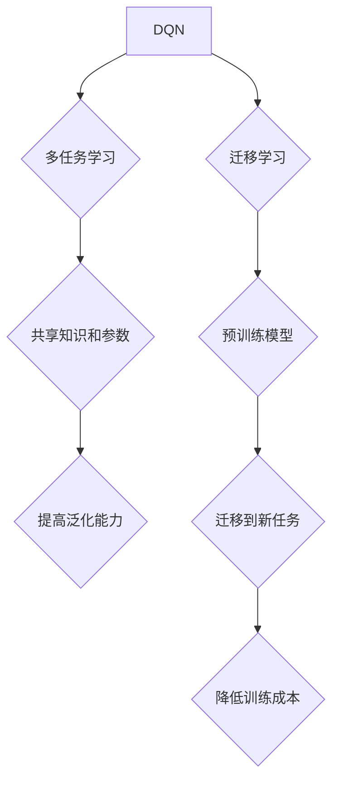

> Deep Q-Network (DQN), 多任务学习, 迁移学习, 强化学习, 策略优化, 映射关系

## 1. 背景介绍

在机器学习领域，深度强化学习 (Deep Reinforcement Learning, DRL) 作为一种强大的学习范式，在解决复杂决策问题方面展现出巨大的潜力。其中，Deep Q-Network (DQN) 作为一种经典的 DRL 算法，通过学习状态-动作价值函数 (Q-value)，能够有效地解决各种强化学习任务。然而，传统的 DRL 算法往往需要针对每个特定任务进行单独训练，这不仅耗时费力，而且难以充分利用已有的知识和经验。

多任务学习 (Multi-Task Learning, MTL) 和迁移学习 (Transfer Learning, TL) 作为解决上述问题的有效策略，近年来得到了广泛的研究和应用。MTL 通过同时训练多个相关任务，能够共享知识和参数，从而提高模型的泛化能力和学习效率。TL 通过将预训练模型的知识迁移到新的任务中，能够降低新任务的训练成本和时间。

## 2. 核心概念与联系

**2.1 多任务学习 (MTL)**

MTL 的核心思想是，多个相关任务共享相同的底层特征表示，从而提高模型的泛化能力和学习效率。MTL 可以通过以下几种方式实现：

* **硬参数共享:** 所有任务共享相同的网络结构和参数。
* **软参数共享:** 所有任务共享一部分参数，而另一部分参数是任务特定的。
* **任务特定的网络结构:** 每个任务都有自己的网络结构，但共享一些底层特征提取模块。

**2.2 迁移学习 (TL)**

TL 的核心思想是，将预训练模型的知识迁移到新的任务中，从而降低新任务的训练成本和时间。TL 可以通过以下几种方式实现：

* **特征提取:** 使用预训练模型提取特征，作为新任务的输入。
* **微调:** 对预训练模型进行微调，使其适应新的任务。
* **知识蒸馏:** 将预训练模型的知识蒸馏到更小的模型中。

**2.3 DQN 与 MTL/TL 的结合**

将 DQN 与 MTL/TL 相结合，可以有效地提高 DQN 的泛化能力和学习效率。例如，可以将多个相关任务的 DQN 模型进行共享训练，或者将预训练的 DQN 模型迁移到新的任务中。



## 3. 核心算法原理 & 具体操作步骤

### 3.1 算法原理概述

DQN 是一种基于深度神经网络的强化学习算法，它通过学习状态-动作价值函数 (Q-value) 来决定在给定状态下采取哪个动作。Q-value 表示在当前状态下采取某个动作，并遵循一定的策略，最终获得的期望回报。

DQN 的核心思想是使用深度神经网络来逼近 Q-value 函数，并通过经验回放 (Experience Replay) 和目标网络 (Target Network) 等技术来稳定训练过程。

### 3.2 算法步骤详解

1. **初始化:** 初始化 DQN 网络参数，并设置经验回放缓冲池。
2. **环境交互:** 与环境交互，收集状态、动作、奖励和下一个状态的经验数据。
3. **经验回放:** 从经验回放缓冲池中随机采样一批经验数据。
4. **Q-value 计算:** 使用 DQN 网络计算每个经验数据对应的 Q-value。
5. **目标 Q-value 计算:** 使用目标网络计算每个经验数据对应的目标 Q-value。目标网络的参数是 DQN 网络参数的固定版本，用于稳定训练过程。
6. **损失函数计算:** 使用 Q-value 和目标 Q-value 计算损失函数。
7. **参数更新:** 使用梯度下降算法更新 DQN 网络的参数。
8. **目标网络更新:** 定期更新目标网络的参数，使其与 DQN 网络的参数保持一致。
9. **重复步骤 2-8:** 直到达到预设的训练目标。

### 3.3 算法优缺点

**优点:**

* 能够学习复杂决策问题。
* 能够利用经验回放和目标网络等技术稳定训练过程。
* 能够应用于各种强化学习任务。

**缺点:**

* 训练过程可能比较耗时。
* 需要大量的训练数据。
* 容易陷入局部最优解。

### 3.4 算法应用领域

DQN 算法在以下领域得到了广泛应用:

* **游戏 AI:** 训练游戏 AI 玩家，例如 AlphaGo 和 AlphaZero。
* **机器人控制:** 控制机器人执行复杂任务，例如导航和抓取。
* **推荐系统:** 建议用户感兴趣的内容，例如电影和商品。
* **医疗诊断:** 辅助医生诊断疾病。

## 4. 数学模型和公式 & 详细讲解 & 举例说明

### 4.1 数学模型构建

DQN 的核心是学习状态-动作价值函数 Q(s, a)，它表示在状态 s 下采取动作 a 的期望回报。

**状态空间:** S = {s1, s2, ..., sn}

**动作空间:** A = {a1, a2, ..., am}

**奖励函数:** R(s, a)

**折扣因子:** γ (0 < γ < 1)

**目标 Q-value:** Q*(s, a)

**DQN 网络输出:** Q(s, a; θ)

其中，θ 是 DQN 网络的参数。

### 4.2 公式推导过程

DQN 的目标是最大化以下目标函数:

```latex
J(θ) = E_{s, a, r, s'} [ (r + γ * max_{a'} Q(s', a'; θ)) - Q(s, a; θ) ]^2
```

其中，E 表示期望，r 是奖励，s' 是下一个状态，a' 是下一个状态的动作。

### 4.3 案例分析与讲解

假设我们有一个简单的游戏，状态空间 S = {0, 1, 2}, 动作空间 A = {left, right}, 奖励函数 R(s, a) = 1 如果状态 s 变成 2，否则为 0。

我们可以使用 DQN 网络来学习 Q-value 函数，并通过最大化目标函数来更新网络参数。

## 5. 项目实践：代码实例和详细解释说明

### 5.1 开发环境搭建

* Python 3.x
* TensorFlow 或 PyTorch
* OpenAI Gym

### 5.2 源代码详细实现

```python
import tensorflow as tf

# 定义 DQN 网络
class DQN(tf.keras.Model):
    def __init__(self, state_size, action_size):
        super(DQN, self).__init__()
        self.dense1 = tf.keras.layers.Dense(64, activation='relu')
        self.dense2 = tf.keras.layers.Dense(64, activation='relu')
        self.output = tf.keras.layers.Dense(action_size)

    def call(self, state):
        x = self.dense1(state)
        x = self.dense2(x)
        return self.output(x)

# 定义 DQN 训练函数
def train_dqn(dqn, experience_replay, optimizer):
    # 从经验回放缓冲池中采样数据
    batch_size = 32
    states, actions, rewards, next_states, dones = experience_replay.sample(batch_size)

    # 计算目标 Q-value
    with tf.GradientTape() as tape:
        # 使用目标网络计算目标 Q-value
        target_q_values = target_dqn(next_states)
        # 计算 Q-value
        q_values = dqn(states)
        # 计算损失函数
        loss = tf.reduce_mean(tf.square(rewards + gamma * tf.reduce_max(target_q_values, axis=1) - q_values[tf.range(batch_size), actions]))

    # 更新 DQN 网络参数
    gradients = tape.gradient(loss, dqn.trainable_variables)
    optimizer.apply_gradients(zip(gradients, dqn.trainable_variables))

# ... 其他代码 ...
```

### 5.3 代码解读与分析

* DQN 网络结构: 使用两层全连接神经网络，激活函数为 ReLU。
* 经验回放: 使用经验回放缓冲池存储训练数据，并随机采样数据进行训练。
* 目标网络: 使用目标网络来稳定训练过程，目标网络的参数是 DQN 网络参数的固定版本。
* 损失函数: 使用均方误差损失函数来计算损失。
* 参数更新: 使用梯度下降算法来更新 DQN 网络参数。

### 5.4 运行结果展示

* 训练过程中，可以监控 Q-value 的变化，以及训练损失的下降趋势。
* 训练完成后，可以测试 DQN 模型在环境中的表现，例如游戏 AI 的得分。

## 6. 实际应用场景

### 6.1 多任务学习应用

* **自然语言处理:** 将多个自然语言处理任务，例如文本分类、机器翻译和问答系统，进行共享训练，提高模型的泛化能力。
* **计算机视觉:** 将多个计算机视觉任务，例如图像分类、目标检测和语义分割，进行共享训练，提高模型的泛化能力。

### 6.2 迁移学习应用

* **医疗诊断:** 使用预训练的图像识别模型，迁移到新的医疗诊断任务中，降低新任务的训练成本和时间。
* **自动驾驶:** 使用预训练的驾驶场景识别模型，迁移到新的自动驾驶任务中，提高模型的鲁棒性和安全性。

### 6.4 未来应用展望

* **个性化推荐:** 使用迁移学习技术，根据用户的历史行为数据，个性化推荐商品或服务。
* **智能客服:** 使用多任务学习技术，训练智能客服机器人，能够处理多种类型的用户咨询。

## 7. 工具和资源推荐

### 7.1 学习资源推荐

* **书籍:**
    * Deep Reinforcement Learning Hands-On
    * Reinforcement Learning: An Introduction
* **在线课程:**
    * Deep Reinforcement Learning Specialization (Coursera)
    * Reinforcement Learning (Udacity)

### 7.2 开发工具推荐

* **TensorFlow:** 开源深度学习框架
* **PyTorch:** 开源深度学习框架
* **OpenAI Gym:** 强化学习环境库

### 7.3 相关论文推荐

* Deep Q-Network (DQN)
* Multi-Task Reinforcement Learning
* Transfer Learning for Deep Reinforcement Learning

## 8. 总结：未来发展趋势与挑战

### 8.1 研究成果总结

DQN 算法及其与 MTL/TL 的结合，为强化学习领域带来了巨大的进步，在解决复杂决策问题方面展现出巨大的潜力。

### 8.2 未来发展趋势

* **更有效的 MTL/TL 方法:** 研究更有效的 MTL/TL 方法，提高模型的泛化能力和学习效率。
* **更强大的 DQN 变体:** 研究更强大的 DQN 变体，例如双DQN、优先经验回放和异步更新等，提高模型的训练效率和性能。
* **应用于更复杂的任务:** 将 DQN 算法应用于更复杂的任务，例如机器人控制、自动驾驶和医疗诊断等。

### 8.3 面临的挑战

* **训练效率:** DQN 算法的训练过程可能比较耗时，需要进一步提高训练效率。
* **数据需求:** DQN 算法需要大量的训练数据，如何获取高质量的训练数据是一个挑战。
* **可解释性:** DQN 算法的决策过程难以解释，如何提高模型的可解释性是一个重要的研究方向。

### 8.4 研究展望

未来，DQN 算法及其与 MTL/TL 的结合将继续是强化学习领域的重要研究方向，相信会有更多创新成果涌现，推动强化学习技术在更多领域得到应用。

