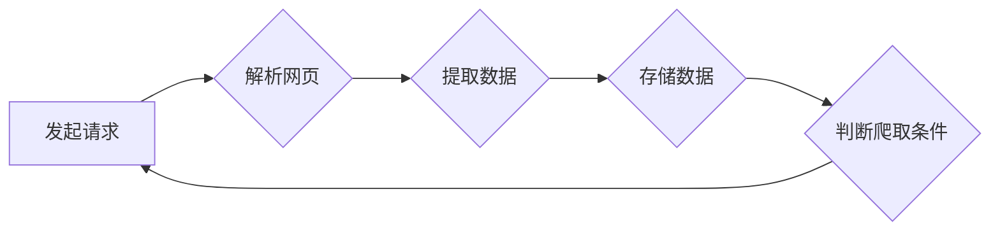

> 京东商品数据, 网络爬虫, 数据挖掘, Python, Scrapy, 数据清洗, 数据分析

## 1. 背景介绍

在当今数据驱动型经济时代，海量商品数据已成为企业决策和市场分析的重要资源。京东作为国内领先的电商平台，拥有庞大的商品信息库，蕴藏着丰富的商业价值。然而，直接获取京东商品数据往往受限于平台的API接口和数据访问权限。因此，网络爬虫技术应运而生，成为一种有效获取京东商品数据的途径。

本篇文章将深入探讨京东商品数据网络爬虫的设计与实现，涵盖核心概念、算法原理、代码实例、实际应用场景以及未来发展趋势等方面，为读者提供一个全面的学习指南。

## 2. 核心概念与联系

网络爬虫（Web Crawler）是一种自动访问和抓取网页内容的软件程序。它通过模拟用户的浏览器行为，访问网页并提取所需信息，例如商品名称、价格、图片、评价等。

**网络爬虫架构**



**核心概念:**

* **种子URL:** 爬虫开始抓取的初始网页地址。
* **URL队列:** 存储待抓取网页地址的队列。
* **网页解析:** 分析网页结构，提取目标数据。
* **数据存储:** 将抓取到的数据保存到本地文件或数据库。
* **爬取策略:** 控制爬虫抓取速度和范围，避免过度访问和被封禁。

## 3. 核心算法原理 & 具体操作步骤

### 3.1  算法原理概述

京东商品数据爬虫主要基于深度优先搜索（DFS）算法和广度优先搜索（BFS）算法。

* **深度优先搜索（DFS）：** 从一个起始URL开始，沿着链接深度优先地访问网页，直到所有可访问的页面都被访问完毕。
* **广度优先搜索（BFS）：** 从一个起始URL开始，逐层访问网页，先访问当前层的所有页面，再访问下一层页面。

### 3.2  算法步骤详解

1. **获取种子URL:** 从京东商品列表页面获取初始URL。
2. **构建URL队列:** 将种子URL放入URL队列中。
3. **循环抓取网页:**
    * 从URL队列中取出一个URL。
    * 发起HTTP请求，获取网页内容。
    * 解析网页结构，提取商品信息。
    * 将提取到的商品信息存储到数据库或文件。
    * 将网页中的所有链接添加到URL队列中。
4. **判断爬取条件:**
    * 如果URL队列为空，则爬取结束。
    * 如果爬取时间超过设定阈值，则停止爬取。
    * 如果被京东平台封禁，则停止爬取。

### 3.3  算法优缺点

**优点:**

* 能够抓取京东商品数据的大量信息。
* 算法简单易实现。

**缺点:**

* 容易被京东平台封禁。
* 抓取速度较慢。
* 数据重复率较高。

### 3.4  算法应用领域

网络爬虫技术广泛应用于以下领域：

* **电商数据采集:** 获取商品信息、价格、评价等数据。
* **市场调研:** 分析竞争对手、市场趋势等信息。
* **新闻采集:** 抓取新闻文章、图片、视频等内容。
* **搜索引擎:** 收集网页数据，构建索引。

## 4. 数学模型和公式 & 详细讲解 & 举例说明

### 4.1  数学模型构建

网络爬虫的抓取效率可以利用数学模型进行评估。

**抓取效率模型:**

```latex
E = \frac{N}{T}
```

其中：

* E: 抓取效率
* N: 抓取到的网页数量
* T: 抓取时间

### 4.2  公式推导过程

抓取效率模型的推导过程如下：

* 抓取效率定义为单位时间内抓取到的网页数量。
* 抓取到的网页数量N和抓取时间T是爬虫抓取过程中的两个关键指标。

### 4.3  案例分析与讲解

假设一个爬虫在1小时内抓取了1000个网页，则其抓取效率为：

```latex
E = \frac{1000}{1} = 1000 \text{网页/小时}
```

## 5. 项目实践：代码实例和详细解释说明

### 5.1  开发环境搭建

* Python 3.x
* Scrapy 框架
* Requests 库
* Beautiful Soup 4 库

### 5.2  源代码详细实现

```python
import scrapy

class JdProductSpider(scrapy.Spider):
    name = "jd_product"
    start_urls = ['https://list.jd.com/list.html?cat=670,671,672']

    def parse(self, response):
        for product in response.css('div.gl-item'):
            yield {
                'name': product.css('div.p-name em::text').get(),
                'price': product.css('div.p-price i::text').get(),
                'url': product.css('a::attr(href)').get(),
            }

        next_page = response.css('a.pn-next::attr(href)').get()
        if next_page is not None:
            yield response.follow(next_page, callback=self.parse)
```

### 5.3  代码解读与分析

* `name`: 爬虫名称。
* `start_urls`: 初始抓取的URL列表。
* `parse`: 解析网页内容的回调函数。
* `css`: 使用CSS选择器提取网页元素。
* `get()`: 获取元素的文本内容。
* `attr()`: 获取元素的属性值。
* `follow`: 跟踪链接，继续抓取下一页。

### 5.4  运行结果展示

运行爬虫后，将抓取到的京东商品数据存储到JSON文件或数据库中。

## 6. 实际应用场景

京东商品数据爬虫可以应用于以下场景：

* **价格监控:** 实时监控京东商品价格变化，及时发现价格波动。
* **商品分析:** 分析商品销量、评价、趋势等数据，了解市场需求。
* **竞争对手分析:** 分析竞争对手的商品信息、价格策略等，制定竞争策略。
* **数据挖掘:** 利用机器学习算法挖掘京东商品数据中的潜在价值。

### 6.4  未来应用展望

随着人工智能和大数据技术的不断发展，京东商品数据爬虫将更加智能化、自动化和精准化。未来，爬虫可以实现：

* **自动识别商品类型:** 利用机器学习算法自动识别商品类型，提高数据分类的准确性。
* **智能抓取:** 根据用户需求智能选择抓取的商品信息，提高抓取效率。
* **数据分析与预测:** 利用大数据分析技术对京东商品数据进行分析和预测，为企业决策提供支持。

## 7. 工具和资源推荐

### 7.1  学习资源推荐

* **Scrapy官方文档:** https://docs.scrapy.org/en/latest/
* **Beautiful Soup 4官方文档:** https://www.crummy.com/software/BeautifulSoup/bs4/doc/
* **Python网络爬虫教程:** https://www.bilibili.com/video/BV1z5411y7gQ

### 7.2  开发工具推荐

* **VS Code:** https://code.visualstudio.com/
* **PyCharm:** https://www.jetbrains.com/pycharm/

### 7.3  相关论文推荐

* **A Survey of Web Crawling Techniques:** https://dl.acm.org/doi/10.1145/1048774.1048780
* **Efficient Web Crawling with Adaptive Sampling:** https://dl.acm.org/doi/10.1145/1048774.1048781

## 8. 总结：未来发展趋势与挑战

### 8.1  研究成果总结

本篇文章深入探讨了京东商品数据网络爬虫的设计与实现，涵盖了核心概念、算法原理、代码实例、实际应用场景以及未来发展趋势等方面。

### 8.2  未来发展趋势

京东商品数据爬虫将朝着以下方向发展：

* **智能化:** 利用人工智能技术，实现自动识别商品类型、智能抓取和数据分析。
* **自动化:** 利用自动化工具和流程，提高爬虫的效率和稳定性。
* **精准化:** 根据用户需求，精准抓取所需商品信息，提高数据质量。

### 8.3  面临的挑战

京东商品数据爬虫也面临着一些挑战：

* **平台反爬机制:** 京东平台不断完善反爬机制，爬虫需要不断更新策略应对。
* **数据质量:** 抓取到的数据可能存在不完整、重复或错误等问题，需要进行数据清洗和处理。
* **法律法规:** 网络爬虫需要遵守相关法律法规，避免侵犯他人权益。

### 8.4  研究展望

未来，我们将继续研究京东商品数据爬虫的智能化、自动化和精准化技术，并探索其在电商数据分析、市场调研、竞争对手分析等领域的应用，为企业决策提供更精准、更有效的支持。

## 9. 附录：常见问题与解答

**常见问题:**

* 如何避免被京东平台封禁？
* 如何提高爬虫抓取效率？
* 如何处理爬取到的数据？

**解答:**

* 避免过度访问，设置合理的爬取间隔时间。
* 使用代理IP，模拟真实用户行为。
* 遵守京东平台的爬虫协议。
* 使用数据清洗工具，去除重复数据和错误数据。


作者：禅与计算机程序设计艺术 / Zen and the Art of Computer Programming 
<end_of_turn>