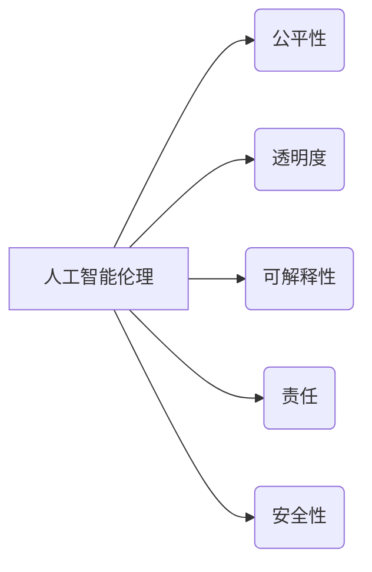

> 人工智能，伦理，道德，责任，算法，偏见，透明度，可解释性，监管

## 1. 背景介绍

人工智能（AI）正以惊人的速度发展，其应用领域不断扩展，从医疗保健和金融到交通和娱乐，AI正在深刻地改变着我们的生活。然而，随着AI技术的进步，也引发了广泛的伦理和社会问题。如何确保AI技术的发展和应用符合人类的价值观和利益，成为一个亟待解决的难题。

本篇文章将探讨人工智能伦理的核心概念，分析AI技术可能带来的伦理风险，并提出一些应对措施，以促进AI技术安全、可持续和负责任的发展。

## 2. 核心概念与联系

**2.1 人工智能伦理**

人工智能伦理是指在人工智能技术研发、应用和监管过程中，遵循人类道德规范和价值观，确保AI技术安全、公平、透明和可控的原则和实践。

**2.2 核心概念**

* **公平性:** AI系统应该公平公正地对待所有用户，避免因种族、性别、宗教等因素而产生歧视。
* **透明度:** AI系统的决策过程应该清晰可解释，用户应该能够理解AI系统是如何做出决定的。
* **可解释性:** AI系统的决策结果应该能够被人类理解和解释，避免“黑箱”问题。
* **责任:** AI系统的开发和应用应该承担相应的责任，对可能产生的负面影响进行弥补。
* **安全性:** AI系统应该安全可靠，避免出现安全漏洞或意外事故。

**2.3 关系图**



## 3. 核心算法原理 & 具体操作步骤

**3.1 算法原理概述**

深度学习算法是目前人工智能领域最成功的算法之一，其核心原理是利用多层神经网络模拟人类大脑的学习过程。通过大量的训练数据，深度学习算法可以自动学习特征，并进行复杂的模式识别和预测。

**3.2 算法步骤详解**

1. **数据预处理:** 将原始数据进行清洗、转换和格式化，使其适合深度学习算法的训练。
2. **网络结构设计:** 根据具体任务需求，设计深度神经网络的结构，包括层数、节点数和激活函数等。
3. **参数初始化:** 为神经网络中的参数进行随机初始化。
4. **前向传播:** 将输入数据通过神经网络进行传递，计算输出结果。
5. **反向传播:** 计算输出结果与真实值的误差，并根据误差反向传播，更新神经网络的参数。
6. **迭代训练:** 重复前向传播和反向传播的过程，直到模型的性能达到预期的水平。

**3.3 算法优缺点**

**优点:**

* 能够学习复杂的数据模式。
* 性能优于传统机器学习算法。
* 应用范围广泛。

**缺点:**

* 需要大量的训练数据。
* 训练过程耗时和耗能。
* 模型的可解释性较差。

**3.4 算法应用领域**

* **图像识别:** 人脸识别、物体检测、图像分类。
* **自然语言处理:** 机器翻译、文本摘要、情感分析。
* **语音识别:** 语音转文本、语音助手。
* **医疗诊断:** 疾病预测、影像分析。
* **金融预测:** 股票预测、欺诈检测。

## 4. 数学模型和公式 & 详细讲解 & 举例说明

**4.1 数学模型构建**

深度学习算法的核心是神经网络模型，其数学模型可以表示为多层感知机（MLP）。

**4.2 公式推导过程**

* **激活函数:** 激活函数用于引入非线性，使神经网络能够学习复杂的数据模式。常用的激活函数包括 sigmoid 函数、ReLU 函数等。

* **损失函数:** 损失函数用于衡量模型预测结果与真实值的差异。常用的损失函数包括均方误差（MSE）、交叉熵损失等。

* **梯度下降:** 梯度下降算法用于更新神经网络的参数，使其朝着最小化损失函数的方向进行调整。

**4.3 案例分析与讲解**

假设我们有一个简单的图像分类任务，目标是将猫和狗的图像进行分类。我们可以使用深度学习算法构建一个神经网络模型，其输入是图像像素数据，输出是猫和狗的类别概率。

通过训练数据，模型会学习到猫和狗的特征，并能够将新的图像分类为猫或狗。

## 5. 项目实践：代码实例和详细解释说明

**5.1 开发环境搭建**

* Python 3.x
* TensorFlow 或 PyTorch 深度学习框架
* Jupyter Notebook 或 VS Code 开发环境

**5.2 源代码详细实现**

```python
import tensorflow as tf

# 定义模型结构
model = tf.keras.models.Sequential([
    tf.keras.layers.Conv2D(32, (3, 3), activation='relu', input_shape=(28, 28, 1)),
    tf.keras.layers.MaxPooling2D((2, 2)),
    tf.keras.layers.Conv2D(64, (3, 3), activation='relu'),
    tf.keras.layers.MaxPooling2D((2, 2)),
    tf.keras.layers.Flatten(),
    tf.keras.layers.Dense(10, activation='softmax')
])

# 编译模型
model.compile(optimizer='adam',
              loss='sparse_categorical_crossentropy',
              metrics=['accuracy'])

# 训练模型
model.fit(x_train, y_train, epochs=10)

# 评估模型
loss, accuracy = model.evaluate(x_test, y_test)
print('Test loss:', loss)
print('Test accuracy:', accuracy)
```

**5.3 代码解读与分析**

这段代码定义了一个简单的卷积神经网络模型，用于图像分类任务。

* `tf.keras.models.Sequential` 创建了一个顺序模型，层级结构清晰。
* `tf.keras.layers.Conv2D` 定义卷积层，用于提取图像特征。
* `tf.keras.layers.MaxPooling2D` 定义最大池化层，用于降维和提高模型鲁棒性。
* `tf.keras.layers.Flatten` 将多维特征转换为一维向量。
* `tf.keras.layers.Dense` 定义全连接层，用于分类。
* `model.compile` 编译模型，指定优化器、损失函数和评价指标。
* `model.fit` 训练模型，使用训练数据进行迭代训练。
* `model.evaluate` 评估模型，使用测试数据计算损失和准确率。

**5.4 运行结果展示**

训练完成后，模型可以用于预测新的图像类别。

## 6. 实际应用场景

**6.1 医疗诊断**

AI可以辅助医生进行疾病诊断，例如分析医学影像，识别肿瘤和其他病变。

**6.2 金融风险管理**

AI可以用于检测金融欺诈，评估信用风险，以及进行投资决策。

**6.3 自动驾驶**

AI是自动驾驶汽车的核心技术，用于感知周围环境，做出驾驶决策。

**6.4 个性化教育**

AI可以根据学生的学习进度和特点，提供个性化的学习内容和辅导。

**6.5 智能客服**

AI可以用于开发智能客服系统，自动回答用户问题，提供24小时服务。

**6.4 未来应用展望**

随着AI技术的不断发展，其应用场景将更加广泛，例如：

* **个性化医疗:** 根据患者的基因信息和生活习惯，提供个性化的医疗方案。
* **智能制造:** 利用AI技术实现智能工厂，提高生产效率和产品质量。
* **城市管理:** 利用AI技术优化交通流量，提高城市安全和效率。

## 7. 工具和资源推荐

**7.1 学习资源推荐**

* **在线课程:** Coursera、edX、Udacity 等平台提供丰富的AI课程。
* **书籍:** 《深度学习》、《人工智能：现代方法》等书籍。
* **开源项目:** TensorFlow、PyTorch 等开源深度学习框架。

**7.2 开发工具推荐**

* **Python:** 作为AI开发的主要编程语言。
* **Jupyter Notebook:** 用于代码编写、数据分析和可视化。
* **VS Code:** 强大的代码编辑器，支持Python和深度学习框架。

**7.3 相关论文推荐**

* **《ImageNet Classification with Deep Convolutional Neural Networks》**
* **《Attention Is All You Need》**
* **《BERT: Pre-training of Deep Bidirectional Transformers for Language Understanding》**

## 8. 总结：未来发展趋势与挑战

**8.1 研究成果总结**

近年来，AI技术取得了长足的进步，在图像识别、自然语言处理、语音识别等领域取得了突破性进展。

**8.2 未来发展趋势**

* **模型规模和能力的提升:** 随着计算能力的增强，AI模型将变得更加强大，能够处理更复杂的任务。
* **跨模态学习:** AI模型将能够理解和处理多种数据类型，例如文本、图像、音频和视频。
* **边缘计算:** AI模型将部署在边缘设备上，实现更快速的响应和更低的延迟。

**8.3 面临的挑战**

* **算法偏见:** AI算法可能存在偏见，导致不公平的结果。
* **数据安全和隐私:** AI模型的训练和应用需要大量数据，如何保护数据安全和隐私是一个重要问题。
* **可解释性:** AI模型的决策过程往往难以理解，缺乏可解释性。

**8.4 研究展望**

未来，AI研究需要更加关注伦理和社会影响，开发更加公平、透明和可控的AI技术。


## 9. 附录：常见问题与解答

**9.1 如何避免AI算法的偏见？**

* 使用多样化的训练数据，确保数据代表真实世界。
* 识别和缓解算法中的偏见，例如使用公平性评估指标。
* 促进算法透明度，使决策过程更容易理解。

**9.2 如何保护AI模型的训练数据安全？**

* 使用加密技术保护数据传输和存储。
* 采用数据匿名化技术，去除敏感信息。
* 制定数据使用协议，明确数据使用范围和权限。

**9.3 如何提高AI模型的可解释性？**

* 使用可解释的机器学习算法，例如规则学习算法。
* 开发可视化工具，帮助用户理解模型的决策过程。
* 构建模型解释框架，提供模型决策的逻辑推理。


作者：禅与计算机程序设计艺术 / Zen and the Art of Computer Programming 
<end_of_turn>