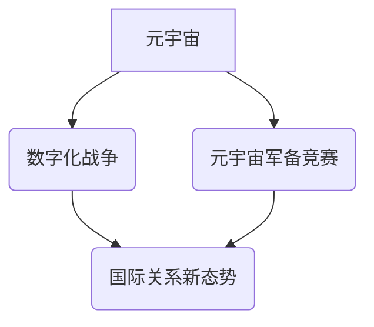

> 元宇宙、军备竞赛、数字化战争、国际关系、人工智能、虚拟现实、增强现实、网络安全

## 1. 背景介绍

21世纪初，互联网的普及和移动互联网的兴起，将人类社会推向了一个全新的信息时代。而如今，元宇宙的概念正在成为下一个技术浪潮，它将虚拟现实、增强现实、人工智能、区块链等前沿技术融合在一起，构建一个沉浸式、交互式的虚拟世界。

元宇宙的出现，不仅带来了巨大的商业机遇，也引发了人们对未来社会形态的深刻思考。其中，一个不容忽视的议题便是元宇宙军备竞赛。

随着元宇宙技术的不断发展，各国开始意识到其在军事领域的潜在价值。虚拟现实和增强现实技术可以为军队提供更逼真的训练环境，人工智能可以辅助作战决策，而区块链技术可以保障数据安全。这些技术都将深刻改变未来的战争形态，并引发一场新的军备竞赛。

## 2. 核心概念与联系

**2.1 元宇宙**

元宇宙是一个由虚拟现实、增强现实、人工智能、区块链等技术构建的沉浸式、交互式的虚拟世界。它是一个开放、共享、互联的虚拟空间，用户可以在其中创建、分享和体验虚拟内容。

**2.2 数字化战争**

数字化战争是指在信息化时代，利用信息技术进行的战争。它以网络空间、信息空间为主要战场，并利用人工智能、机器人等先进技术进行作战。

**2.3 元宇宙军备竞赛**

元宇宙军备竞赛是指各国为了在元宇宙领域获得优势，而进行的军事技术竞赛。它包括开发和部署元宇宙相关的军事技术，例如虚拟现实训练系统、人工智能作战平台、虚拟战场模拟器等。

**2.4 国际关系新态势**

元宇宙军备竞赛将深刻影响国际关系的格局。它将加剧国家之间的竞争，也可能引发新的安全风险。

**2.5 核心概念关系图**



## 3. 核心算法原理 & 具体操作步骤

**3.1 算法原理概述**

元宇宙军备竞赛的核心算法原理主要包括：

* **虚拟现实训练算法:** 用于模拟真实战场环境，为士兵提供沉浸式训练体验。
* **人工智能作战算法:** 用于辅助作战决策，提高作战效率。
* **虚拟战场模拟算法:** 用于模拟虚拟战场环境，进行战术演练和战争演习。
* **网络安全算法:** 用于保障元宇宙平台和数据安全。

**3.2 算法步骤详解**

**3.2.1 虚拟现实训练算法**

1. 建立虚拟战场环境模型。
2. 利用虚拟现实技术，为士兵提供沉浸式训练体验。
3. 通过传感器数据，收集士兵的训练表现。
4. 利用人工智能算法，分析士兵的训练表现，并提供个性化训练建议。

**3.2.2 人工智能作战算法**

1. 收集战场信息，包括敌我双方位置、装备、战术等。
2. 利用机器学习算法，分析战场信息，预测敌我双方行动。
3. 根据预测结果，制定作战方案。
4. 控制无人机、机器人等作战平台，执行作战方案。

**3.2.3 虚拟战场模拟算法**

1. 建立虚拟战场环境模型。
2. 模拟敌我双方行动，进行战术演练和战争演习。
3. 收集演习数据，分析演习结果。
4. 根据演习结果，改进战术方案。

**3.2.4 网络安全算法**

1. 建立元宇宙平台的安全防护体系。
2. 利用人工智能算法，检测网络攻击。
3. 利用加密技术，保护元宇宙平台和数据安全。

**3.3 算法优缺点**

**3.3.1 虚拟现实训练算法**

* **优点:** 提供沉浸式训练体验，提高训练效果。
* **缺点:** 硬件成本高，技术难度大。

**3.3.2 人工智能作战算法**

* **优点:** 提高作战效率，降低人员伤亡。
* **缺点:** 算法复杂度高，需要大量数据训练。

**3.3.3 虚拟战场模拟算法**

* **优点:** 可以进行多场景、多兵种的演练，提高战术水平。
* **缺点:** 模拟环境的真实性有限。

**3.3.4 网络安全算法**

* **优点:** 可以有效防御网络攻击，保障数据安全。
* **缺点:** 攻击者也一直在不断改进攻击手段，需要不断更新算法。

**3.4 算法应用领域**

* 军事训练
* 作战决策
* 战争演习
* 网络安全

## 4. 数学模型和公式 & 详细讲解 & 举例说明

**4.1 数学模型构建**

元宇宙军备竞赛可以抽象为一个博弈模型，其中参与者是各国，目标是获得在元宇宙领域的优势。

**4.2 公式推导过程**

我们可以使用纳什均衡理论来分析元宇宙军备竞赛的稳定状态。纳什均衡是指在博弈中，每个参与者都选择对自己最有利的策略，并且没有参与者愿意改变策略。

**4.3 案例分析与讲解**

假设有两个国家A和B，它们都在元宇宙领域进行军备竞赛。

* 国家A投入X元资金进行元宇宙军备发展，国家B投入Y元资金进行元宇宙军备发展。
* 国家A的收益函数为：f(X,Y)
* 国家B的收益函数为：g(X,Y)

纳什均衡点是指X和Y的组合，使得：

* ∂f(X,Y)/∂X = 0
* ∂g(X,Y)/∂Y = 0

**4.4 数学模型应用**

这个数学模型可以用来分析元宇宙军备竞赛的稳定状态，以及各国在元宇宙领域军备投入的最佳策略。

## 5. 项目实践：代码实例和详细解释说明

**5.1 开发环境搭建**

* 操作系统: Ubuntu 20.04
* 编程语言: Python 3.8
* 开发工具: PyCharm

**5.2 源代码详细实现**

```python
# 虚拟战场模拟器

import random

class Battlefield:
    def __init__(self):
        self.map = [['.' for _ in range(10)] for _ in range(10)]
        self.player_position = (0, 0)
        self.enemy_position = (9, 9)

    def display_map(self):
        for row in self.map:
            print(''.join(row))

    def move_player(self, direction):
        if direction == 'up':
            self.player_position = (self.player_position[0] - 1, self.player_position[1])
        elif direction == 'down':
            self.player_position = (self.player_position[0] + 1, self.player_position[1])
        elif direction == 'left':
            self.player_position = (self.player_position[0], self.player_position[1] - 1)
        elif direction == 'right':
            self.player_position = (self.player_position[0], self.player_position[1] + 1)

        # 边界检查
        if self.player_position[0] < 0:
            self.player_position = (0, self.player_position[1])
        elif self.player_position[0] >= 10:
            self.player_position = (9, self.player_position[1])
        if self.player_position[1] < 0:
            self.player_position = (self.player_position[0], 0)
        elif self.player_position[1] >= 10:
            self.player_position = (self.player_position[0], 9)

    def move_enemy(self):
        # 敌方移动逻辑
        pass

    def check_collision(self):
        # 检查玩家与敌方是否碰撞
        pass

# 示例代码
battlefield = Battlefield()
battlefield.display_map()

while True:
    direction = input("请输入方向 (up, down, left, right): ")
    battlefield.move_player(direction)
    battlefield.display_map()
```

**5.3 代码解读与分析**

这段代码实现了一个简单的虚拟战场模拟器。

* `Battlefield` 类定义了战场地图、玩家位置和敌方位置。
* `display_map()` 方法用于显示战场地图。
* `move_player()` 方法用于控制玩家移动。
* `move_enemy()` 方法用于控制敌方移动，这里只是一个占位符，需要根据实际需求实现。
* `check_collision()` 方法用于检查玩家与敌方是否碰撞，这里也是一个占位符，需要根据实际需求实现。

**5.4 运行结果展示**

运行这段代码后，用户可以在控制台看到一个简单的战场地图，并可以通过输入方向键控制玩家移动。

## 6. 实际应用场景

**6.1 军事训练**

元宇宙技术可以为军队提供更逼真的训练环境，例如模拟实战场景、进行战术演练等。

**6.2 作战决策**

人工智能算法可以辅助作战决策，例如预测敌我双方行动、制定作战方案等。

**6.3 战争演习**

虚拟战场模拟器可以用于进行多场景、多兵种的战争演习，提高战术水平。

**6.4 未来应用展望**

元宇宙军备竞赛将不断发展，未来可能出现以下应用场景：

* **虚拟化作战平台:** 将多个作战平台虚拟化，进行联合演练和作战指挥。
* **增强现实作战:** 利用增强现实技术，为士兵提供实时战场信息和战术指引。
* **无人化作战:** 利用无人机、机器人等作战平台，进行远程作战和无人化战斗。

## 7. 工具和资源推荐

**7.1 学习资源推荐**

* **书籍:**
    * 《元宇宙：下一代互联网》
    * 《人工智能：一种现代方法》
* **在线课程:**
    * Coursera: 人工智能
    * edX: 元宇宙

**7.2 开发工具推荐**

* **Unity:** 游戏引擎，可以用于开发虚拟现实和增强现实应用。
* **Unreal Engine:** 游戏引擎，可以用于开发高品质的虚拟现实和增强现实应用。
* **Blender:** 3D建模软件，可以用于创建虚拟战场环境。

**7.3 相关论文推荐**

* **The Metaverse: A New Paradigm for Human Interaction and Collaboration**
* **Artificial Intelligence in Warfare: Challenges and Opportunities**

## 8. 总结：未来发展趋势与挑战

**8.1 研究成果总结**

元宇宙军备竞赛是一个新兴的领域，研究成果还比较有限。但已经有一些初步的进展，例如虚拟现实训练算法、人工智能作战算法等。

**8.2 未来发展趋势**

元宇宙军备竞赛将朝着以下方向发展：

* **更加逼真的虚拟环境:** 未来虚拟战场环境将更加逼真，能够模拟各种复杂的作战场景。
* **更智能的作战系统:** 人工智能算法将更加智能，能够自主决策、自主行动。
* **更广泛的应用场景:** 元宇宙技术将应用于更多的军事领域，例如侦察、情报、指挥控制等。

**8.3 面临的挑战**

元宇宙军备竞赛也面临着一些挑战：

* **技术难度高:** 元宇宙技术本身就比较复杂，开发和部署元宇宙军备系统需要克服很多技术难题。
* **伦理道德问题:** 元宇宙军备竞赛可能会引发一些伦理道德问题，例如人工智能的自主性、虚拟战争的真实性等。
* **国际安全风险:** 元宇宙军备竞赛可能会加剧国际紧张局势，