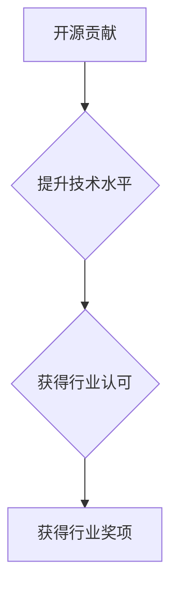

> 开源贡献,行业奖项,认可,技术社区,软件开发,代码质量,创新,影响力

## 1. 背景介绍

在当今科技日新月异的时代，开源软件扮演着越来越重要的角色。它不仅推动了软件开发的协作和创新，也为个人开发者提供了展示实力和获得认可的平台。许多优秀的开源项目，正是由众多开发者共同努力的结果。而积极参与开源贡献，不仅可以提升自身的技术水平，更能获得行业认可和奖励。

## 2. 核心概念与联系

**开源贡献**是指开发者将自己的代码、文档、测试用例等资源免费共享给公众，并允许他人修改、使用和再发布。

**行业奖项**是指由行业组织、媒体或权威机构颁发的，对优秀软件、技术人员或项目进行表彰的荣誉。

**认可**是指社会、行业或个人对某人或某事的能力、价值或贡献的肯定和赞赏。

开源贡献与行业奖项之间存在着密切的联系。优秀的开源贡献往往会获得行业认可，并最终获得行业奖项。

**Mermaid 流程图**



## 3. 核心算法原理 & 具体操作步骤

### 3.1  算法原理概述

开源贡献的本质是一种协作开发模式，它基于以下核心算法原理：

* **版本控制:** 使用版本控制系统（如Git）来管理代码的修改历史，确保代码的稳定性和可追溯性。
* **代码审查:** 鼓励开发者对彼此的代码进行审查，以确保代码质量和一致性。
* **协作开发:** 使用协作开发工具（如GitHub）来管理项目进度、沟通和协作。
* **社区建设:** 构建一个活跃的开源社区，鼓励开发者参与讨论、提出问题和分享经验。

### 3.2  算法步骤详解

参与开源贡献的具体步骤如下：

1. **选择项目:** 找到一个符合自身兴趣和技能的开源项目。
2. **学习项目:** 仔细阅读项目的文档、代码和贡献指南，了解项目的架构、功能和开发规范。
3. **提出问题:** 如果遇到问题或需要帮助，可以向项目维护者或社区成员提问。
4. **提交代码:** 编写代码并提交到项目仓库，并附上详细的描述和测试用例。
5. **代码审查:** 项目维护者或社区成员会对提交的代码进行审查，并提出修改建议。
6. **代码合并:** 如果代码审查通过，则会被合并到项目主分支。

### 3.3  算法优缺点

**优点:**

* 提升技术水平: 通过参与开源贡献，可以学习到其他开发者的优秀代码和开发经验。
* 获得行业认可: 优秀的开源贡献可以获得行业认可和奖励，提升个人声誉。
* 扩展人脉: 可以与来自世界各地的开发者建立联系，拓展人脉。
* 积累经验: 可以积累丰富的项目经验，为未来的职业发展打下基础。

**缺点:**

* 需要投入时间和精力: 参与开源贡献需要投入一定的时间和精力。
* 可能遇到技术难题: 遇到技术难题时，需要自行解决或寻求帮助。
* 代码审查可能比较严格: 代码审查可能会比较严格，需要不断修改和完善代码。

### 3.4  算法应用领域

开源贡献的应用领域非常广泛，包括：

* 软件开发: 开发开源软件、库和工具。
* 数据科学: 开发开源数据分析工具和算法。
* 机器学习: 开发开源机器学习模型和框架。
* 网络安全: 开发开源安全工具和技术。

## 4. 数学模型和公式 & 详细讲解 & 举例说明

### 4.1  数学模型构建

开源贡献可以被视为一个网络效应模型，其核心是参与者数量和贡献质量之间的相互作用。

**参与者数量:**  N(t) 表示在时间t时刻参与开源贡献的开发者数量。

**贡献质量:** Q(t) 表示在时间t时刻开源项目所获得的贡献质量，可以根据代码质量、功能完善度、文档质量等指标进行量化。

**网络效应:**  开源项目的价值随着参与者数量的增加而增加，同时，更高的贡献质量也会吸引更多开发者参与。

**数学模型:**

```latex
N(t+1) = N(t) * (1 + α * Q(t))
Q(t+1) = Q(t) * (1 + β * N(t))
```

其中，α和β是网络效应系数，表示参与者数量和贡献质量对项目价值的影响程度。

### 4.2  公式推导过程

该模型的推导过程基于以下假设：

* 开发者参与开源贡献的动机是获得价值，例如提升技术水平、获得认可和扩展人脉。
* 贡献质量越高，项目价值越高，吸引力越强。
* 项目价值越高，吸引更多开发者参与。

根据这些假设，我们可以推导出上述数学模型。

### 4.3  案例分析与讲解

例如，一个开源项目在初期只有少量开发者参与，贡献质量相对较低。随着项目价值的提升，吸引了更多开发者参与，贡献质量也得到了提高。

这种正反馈机制使得开源项目能够不断发展壮大，最终形成一个庞大的开源社区。

## 5. 项目实践：代码实例和详细解释说明

### 5.1  开发环境搭建

参与开源贡献需要搭建一个合适的开发环境。

* 安装操作系统: 选择一个适合开发的 Linux 发行版，例如 Ubuntu 或 Debian。
* 安装软件工具: 安装 Git、编译器、IDE 等开发工具。
* 配置环境变量: 设置环境变量，方便使用开发工具。

### 5.2  源代码详细实现

开源项目通常使用 Git 作为版本控制系统。

* 克隆项目仓库: 使用 Git 命令克隆项目仓库到本地。
* 编写代码: 根据项目需求编写代码，并提交到本地仓库。
* 推送代码: 使用 Git 命令将本地代码推送至远程仓库。

### 5.3  代码解读与分析

开源项目代码通常会附带详细的文档和注释，可以帮助开发者理解代码逻辑和功能。

* 阅读文档: 仔细阅读项目文档，了解项目的架构、功能和开发规范。
* 分析代码: 分析代码结构和逻辑，理解代码的功能和实现方式。
* 查找问题: 如果遇到问题，可以参考项目文档或向社区成员提问。

### 5.4  运行结果展示

开源项目通常会提供测试用例，可以用来验证代码的正确性。

* 运行测试用例: 使用项目提供的工具运行测试用例，验证代码的正确性。
* 分析测试结果: 分析测试结果，找出代码中的问题并进行修复。

## 6. 实际应用场景

开源贡献在各个领域都有广泛的应用场景。

### 6.1  软件开发

开源贡献可以帮助开发者学习新技术、积累经验、提升技能，并为开源社区做出贡献。

### 6.2  数据科学

开源贡献可以帮助数据科学家开发和共享数据分析工具、算法和模型，促进数据科学的进步。

### 6.3  机器学习

开源贡献可以帮助机器学习研究者开发和共享机器学习模型、框架和数据集，推动机器学习技术的创新。

### 6.4  未来应用展望

随着开源软件的普及和发展，开源贡献将发挥越来越重要的作用。

* 更加协作的开发模式: 开发者将更加注重协作开发，共同构建更强大的开源软件。
* 更广泛的应用场景: 开源软件将应用于更多领域，解决更多实际问题。
* 更强大的社区支持: 开源社区将更加活跃，为开发者提供更全面的支持和帮助。

## 7. 工具和资源推荐

### 7.1  学习资源推荐

* **GitHub:** https://github.com/
* **GitLab:** https://gitlab.com/
* **Bitbucket:** https://bitbucket.org/
* **Stack Overflow:** https://stackoverflow.com/

### 7.2  开发工具推荐

* **Git:** https://git-scm.com/
* **Visual Studio Code:** https://code.visualstudio.com/
* **IntelliJ IDEA:** https://www.jetbrains.com/idea/

### 7.3  相关论文推荐

* **The Cathedral and the Bazaar** by Eric S. Raymond
* **Open Source Software Development** by Karl Fogel

## 8. 总结：未来发展趋势与挑战

### 8.1  研究成果总结

开源贡献已经成为软件开发的重要模式，推动了软件开发的协作和创新。

### 8.2  未来发展趋势

开源贡献将继续发展壮大，并朝着更加协作、更加开放、更加智能的方向发展。

### 8.3  面临的挑战

开源贡献也面临着一些挑战，例如代码质量控制、社区治理、商业模式等。

### 8.4  研究展望

未来需要进一步研究开源贡献的机制、模式和影响，并探索如何更好地利用开源贡献推动软件开发的创新和发展。

## 9. 附录：常见问题与解答

### 9.1  如何参与开源贡献？

* 选择一个符合自身兴趣和技能的开源项目。
* 学习项目文档和代码。
* 提出问题并寻求帮助。
* 编写代码并提交到项目仓库。

### 9.2  开源贡献有什么好处？

* 提升技术水平。
* 获得行业认可。
* 扩展人脉。
* 积累经验。

### 9.3  开源贡献有什么风险？

* 需要投入时间和精力。
* 可能遇到技术难题。
* 代码审查可能比较严格。

作者：禅与计算机程序设计艺术 / Zen and the Art of Computer Programming


<end_of_turn>