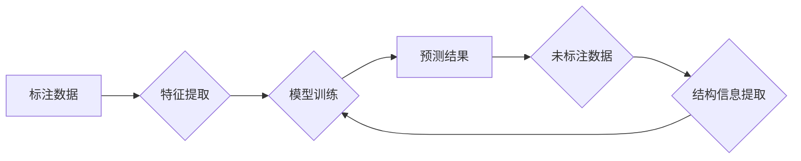

> 半监督学习，半监督分类，数据标注，迁移学习，深度学习，图像识别，自然语言处理

## 1. 背景介绍

在机器学习领域，训练模型通常需要大量的标注数据。然而，获取高质量标注数据往往成本高昂且耗时费力。半监督学习 (Semi-Supervised Learning) 应运而生，它利用少量标注数据和大量未标注数据来训练模型，从而降低对标注数据的依赖。

半监督学习在许多领域展现出巨大的潜力，例如图像识别、自然语言处理、语音识别等。它能够有效地利用现有的未标注数据，提高模型的泛化能力和准确性。

## 2. 核心概念与联系

半监督学习的核心思想是利用未标注数据的结构信息来辅助标注数据的学习。

**核心概念：**

* **标注数据:** 已知其类别或标签的数据。
* **未标注数据:** 未知其类别或标签的数据。
* **结构信息:** 未标注数据之间的相似性、相关性等信息。

**半监督学习流程:**



## 3. 核心算法原理 & 具体操作步骤

### 3.1  算法原理概述

常见的半监督学习算法包括：

* **基于图的算法:** 将数据点表示为图中的节点，节点之间的连接表示数据点之间的相似性。利用图的结构信息来进行分类。
* **基于自训练的算法:** 利用初始的标注数据训练一个初步的分类器，然后使用该分类器对未标注数据进行预测，并将预测结果作为新的标注数据，再次训练分类器。
* **基于混合模型的算法:** 将标注数据和未标注数据分别训练不同的模型，然后将两个模型的输出进行融合，得到最终的预测结果。

### 3.2  算法步骤详解

以基于自训练的算法为例，其具体步骤如下：

1. **初始化:** 使用少量标注数据训练一个初步的分类器。
2. **预测:** 使用训练好的分类器对未标注数据进行预测，并选择预测置信度较高的样本作为新的标注数据。
3. **迭代:** 将新的标注数据与原始标注数据一起训练一个新的分类器，重复步骤2和3，直到模型性能达到预期效果。

### 3.3  算法优缺点

**优点:**

* 可以有效利用未标注数据，降低对标注数据的依赖。
* 能够提高模型的泛化能力和准确性。

**缺点:**

* 算法的性能依赖于未标注数据的质量和分布。
* 训练过程可能比较复杂，需要多次迭代。

### 3.4  算法应用领域

半监督学习在以下领域具有广泛的应用：

* **图像识别:** 利用大量未标注的图像数据来训练图像分类器。
* **自然语言处理:** 利用未标注的文本数据来训练文本分类器、情感分析模型等。
* **语音识别:** 利用未标注的语音数据来训练语音识别模型。

## 4. 数学模型和公式 & 详细讲解 & 举例说明

### 4.1  数学模型构建

半监督学习的数学模型通常基于概率论和统计学。

**假设:**

* 数据点服从某种概率分布。
* 标注数据和未标注数据都服从相同的分布。

**目标:**

* 学习一个模型，能够对数据点进行准确的分类。

**模型:**

* 可以使用概率模型，例如贝叶斯网络、隐马尔可夫模型等。
* 也可以使用深度学习模型，例如卷积神经网络、循环神经网络等。

### 4.2  公式推导过程

半监督学习的具体公式推导过程取决于所使用的算法和模型。

**举例:**

基于图的算法中，可以使用拉普拉斯矩阵来表示数据的结构信息。拉普拉斯矩阵的特征值和特征向量可以用来进行分类。

### 4.3  案例分析与讲解

**案例:**

假设我们有一个图像分类任务，需要将图像分为猫和狗两类。我们有少量标注的图像数据，以及大量未标注的图像数据。

**分析:**

我们可以使用基于图的算法来进行半监督学习。首先，我们将图像数据表示为图中的节点，节点之间的连接表示图像之间的相似性。然后，我们可以使用拉普拉斯矩阵来计算节点的特征值和特征向量。最后，我们可以使用特征向量来进行分类。

## 5. 项目实践：代码实例和详细解释说明

### 5.1  开发环境搭建

* Python 3.x
* TensorFlow 或 PyTorch
* 其他必要的库，例如 NumPy、Scikit-learn 等

### 5.2  源代码详细实现

```python
# 使用 TensorFlow 实现基于自训练的半监督学习算法

import tensorflow as tf

# 定义模型
model = tf.keras.models.Sequential([
    tf.keras.layers.Conv2D(32, (3, 3), activation='relu', input_shape=(28, 28, 1)),
    tf.keras.layers.MaxPooling2D((2, 2)),
    tf.keras.layers.Flatten(),
    tf.keras.layers.Dense(10, activation='softmax')
])

# 定义损失函数和优化器
loss_fn = tf.keras.losses.SparseCategoricalCrossentropy()
optimizer = tf.keras.optimizers.Adam()

# 训练模型
# 使用标注数据训练模型
model.fit(X_train_labeled, y_train_labeled, epochs=10)

# 使用未标注数据进行预测
y_pred_unlabeled = model.predict(X_train_unlabeled)

# 选择置信度较高的预测结果作为新的标注数据
threshold = 0.9
y_new_labeled = tf.argmax(y_pred_unlabeled, axis=1)
mask = tf.greater(y_pred_unlabeled[:, 0], threshold)
X_new_labeled = X_train_unlabeled[mask]
y_new_labeled = y_new_labeled[mask]

# 将新的标注数据与原始标注数据一起训练模型
model.fit(tf.concat([X_train_labeled, X_new_labeled], axis=0),
          tf.concat([y_train_labeled, y_new_labeled], axis=0),
          epochs=10)
```

### 5.3  代码解读与分析

* 代码首先定义了一个简单的卷积神经网络模型。
* 然后，使用标注数据训练模型。
* 使用未标注数据进行预测，并选择置信度较高的预测结果作为新的标注数据。
* 将新的标注数据与原始标注数据一起训练模型，重复上述步骤，直到模型性能达到预期效果。

### 5.4  运行结果展示

运行结果展示可以包括模型的准确率、召回率、F1-score 等指标。

## 6. 实际应用场景

### 6.1  图像识别

* **医学图像分析:** 利用未标注的医学图像数据来训练疾病诊断模型。
* **自动驾驶:** 利用未标注的道路场景图像数据来训练自动驾驶模型。

### 6.2  自然语言处理

* **文本分类:** 利用未标注的文本数据来训练情感分析、主题分类等模型。
* **机器翻译:** 利用未标注的文本数据来训练机器翻译模型。

### 6.3  语音识别

* **语音助手:** 利用未标注的语音数据来训练语音助手模型。
* **语音搜索:** 利用未标注的语音数据来训练语音搜索模型。

### 6.4  未来应用展望

随着未标注数据的获取和处理技术的进步，半监督学习将在更多领域得到应用，例如：

* **个性化推荐:** 利用用户行为数据进行个性化推荐。
* **欺诈检测:** 利用金融交易数据进行欺诈检测。
* **药物研发:** 利用生物数据进行药物研发。

## 7. 工具和资源推荐

### 7.1  学习资源推荐

* **书籍:**
    * 半监督学习 (Semi-Supervised Learning) - Christopher M. Bishop
    * Pattern Recognition and Machine Learning - Christopher M. Bishop
* **在线课程:**
    * Coursera: Machine Learning
    * Udacity: Deep Learning Nanodegree

### 7.2  开发工具推荐

* **TensorFlow:** 开源深度学习框架。
* **PyTorch:** 开源深度学习框架。
* **Scikit-learn:** 机器学习库。

### 7.3  相关论文推荐

* **Semi-Supervised Learning** - Christopher M. Bishop
* **A Survey on Semi-Supervised Learning** -  Z. Huang, Y. Wang, and X. Liu
* **Graph-Based Semi-Supervised Learning** -  J. Zhu

## 8. 总结：未来发展趋势与挑战

### 8.1  研究成果总结

半监督学习在过去几十年取得了显著的进展，并取得了令人瞩目的成果。

### 8.2  未来发展趋势

* **迁移学习:** 利用预训练模型和少量标注数据进行半监督学习。
* **联邦学习:** 在不共享原始数据的情况下进行半监督学习。
* **强化学习:** 将强化学习与半监督学习相结合，训练更智能的模型。

### 8.3  面临的挑战

* **未标注数据质量:** 未标注数据的质量直接影响半监督学习的性能。
* **算法复杂度:** 一些半监督学习算法的复杂度较高，难以训练和部署。
* **理论解释:** 半监督学习的理论基础尚不完善，需要进一步研究。

### 8.4  研究展望

未来，半监督学习的研究将继续朝着更有效、更鲁棒、更可解释的方向发展。

## 9. 附录：常见问题与解答

**常见问题:**

* 半监督学习与监督学习的区别是什么？
* 半监督学习的优缺点是什么？
* 如何选择合适的半监督学习算法？

**解答:**

* 半监督学习利用少量标注数据和大量未标注数据进行训练，而监督学习则需要大量的标注数据。
* 半监督学习的优点是能够利用未标注数据，降低对标注数据的依赖，缺点是算法的性能依赖于未标注数据的质量和分布。
* 选择合适的半监督学习算法取决于具体的应用场景和数据特点。

作者：禅与计算机程序设计艺术 / Zen and the Art of Computer Programming


<end_of_turn>