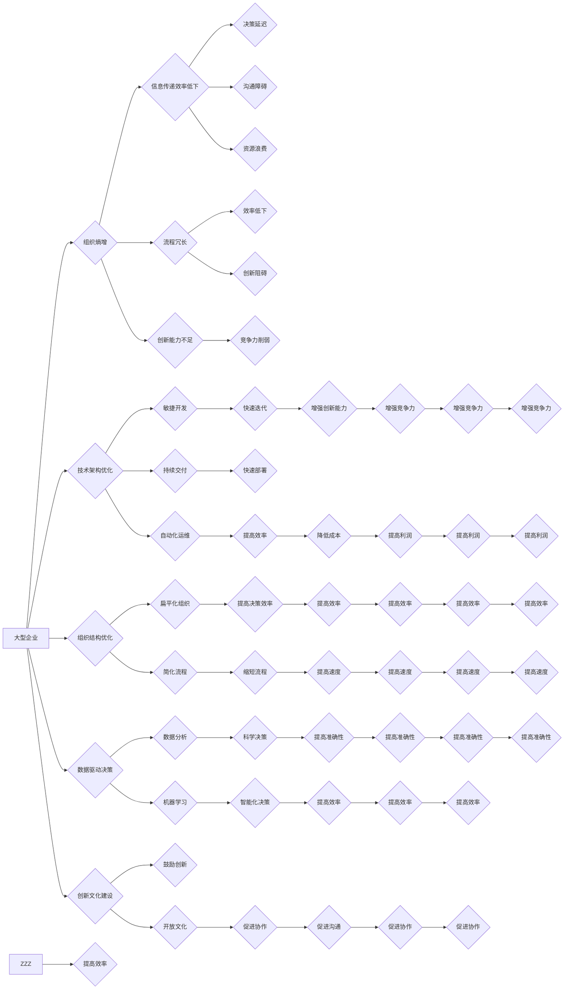

> 大型企业, 组织熵增,  技术架构,  敏捷开发,  持续交付,  自动化运维,  数据驱动决策,  人工智能,  机器学习

## 1. 背景介绍

大型企业在发展过程中，不可避免地会面临着组织熵增的挑战。组织熵增是指系统内部信息传递效率降低、结构复杂化、创新能力下降等现象，最终导致企业效率低下、竞争力削弱。

传统大型企业的组织结构往往是层级森严、决策流程冗长，难以快速响应市场变化。技术架构也可能过于复杂，难以维护和升级。此外，缺乏数据驱动决策的文化，也导致企业决策缺乏科学依据。

## 2. 核心概念与联系

组织熵增是一个复杂的多方面问题，其根源在于信息传递效率低下、流程冗长、创新能力不足等因素。

**2.1 组织熵增的本质**

组织熵增本质上是系统信息传递效率降低的结果。信息传递效率低下会导致决策延迟、沟通障碍、资源浪费等问题，最终导致组织整体效率下降。

**2.2 组织熵增的影响**

组织熵增会对大型企业的各个方面产生负面影响，包括：

* **降低效率:** 冗长的决策流程、信息传递效率低下会导致企业运营效率下降。
* **阻碍创新:** 僵化的组织结构和流程难以适应快速变化的市场环境，阻碍企业创新能力。
* **削弱竞争力:** 效率低下、创新能力不足会导致企业竞争力下降，难以在市场竞争中立于不败之地。

**2.3 组织熵增的解决方案**

对抗组织熵增，需要从以下几个方面入手：

* **优化组织结构:** 建立扁平化、灵活的组织结构，缩短决策流程，提高信息传递效率。
* **提升技术架构:** 建立敏捷、可扩展的技术架构，支持快速迭代和创新。
* **数据驱动决策:** 利用数据分析和机器学习等技术，为决策提供科学依据。
* **培养创新文化:** 鼓励员工创新，营造开放、包容的文化氛围。

**2.4 核心概念架构**



## 3. 核心算法原理 & 具体操作步骤

为了对抗组织熵增，我们需要引入一些核心算法和技术，例如：

* **敏捷开发:** 敏捷开发是一种迭代式软件开发方法，强调快速迭代、持续交付和客户反馈。
* **持续交付:** 持续交付是指将软件代码频繁地部署到生产环境，并进行自动化测试和监控。
* **自动化运维:** 自动化运维是指利用自动化工具和技术，简化和提高运维效率。
* **数据驱动决策:** 数据驱动决策是指利用数据分析和机器学习等技术，为决策提供科学依据。

**3.1 算法原理概述**

* **敏捷开发:** 敏捷开发的核心思想是通过迭代开发和客户反馈，不断改进软件产品，以满足客户需求。
* **持续交付:** 持续交付的核心目标是提高软件交付速度和效率，并降低软件部署风险。
* **自动化运维:** 自动化运维的核心目的是通过自动化工具和技术，简化和提高运维效率，降低运维成本。
* **数据驱动决策:** 数据驱动决策的核心是利用数据分析和机器学习等技术，从海量数据中挖掘出有价值的信息，为决策提供科学依据。

**3.2 算法步骤详解**

* **敏捷开发:**
    1. 需求分析和优先级排序
    2. 迭代开发和测试
    3. 客户反馈和迭代改进
* **持续交付:**
    1. 代码版本控制和自动化构建
    2. 自动化测试和部署
    3. 持续监控和反馈
* **自动化运维:**
    1. 监控和告警
    2. 自动化部署和配置
    3. 自动化故障恢复
* **数据驱动决策:**
    1. 数据收集和清洗
    2. 数据分析和建模
    3. 决策支持和评估

**3.3 算法优缺点**

* **敏捷开发:**
    * 优点: 提高软件开发效率，满足客户需求，降低风险。
    * 缺点: 需要团队成员具备良好的沟通和协作能力，需要不断迭代和改进，可能需要更多的资源投入。
* **持续交付:**
    * 优点: 提高软件交付速度和效率，降低软件部署风险。
    * 缺点: 需要完善的自动化测试和部署流程，需要团队成员具备一定的自动化运维能力。
* **自动化运维:**
    * 优点: 简化和提高运维效率，降低运维成本。
    * 缺点: 需要投入一定的成本进行自动化工具和技术的建设，需要团队成员具备一定的自动化运维能力。
* **数据驱动决策:**
    * 优点: 为决策提供科学依据，提高决策准确性。
    * 缺点: 需要收集和处理海量数据，需要具备一定的统计学和机器学习知识。

**3.4 算法应用领域**

* **敏捷开发:** 软件开发、产品设计、项目管理等领域。
* **持续交付:** 软件开发、网站建设、云计算等领域。
* **自动化运维:** IT运维、网络管理、数据中心管理等领域。
* **数据驱动决策:** 营销推广、市场分析、风险管理等领域。

## 4. 数学模型和公式 & 详细讲解 & 举例说明

为了量化组织熵增，我们可以建立数学模型，并利用公式进行计算。

**4.1 数学模型构建**

假设一个组织的熵增程度可以用以下公式表示：

$$
S = \frac{I}{T}
$$

其中：

* $S$ 表示组织的熵增程度
* $I$ 表示组织内部信息传递效率
* $T$ 表示组织的复杂度

**4.2 公式推导过程**

该公式的推导过程如下：

* 组织的熵增程度与信息传递效率成正比，因为信息传递效率低下会导致组织内部信息混乱，从而导致熵增。
* 组织的熵增程度与组织的复杂度成反比，因为复杂度越高，信息传递越困难，因此熵增程度越低。

**4.3 案例分析与讲解**

假设有两个组织，组织 A 的信息传递效率为 0.8，复杂度为 10，组织 B 的信息传递效率为 0.6，复杂度为 5。

根据公式，我们可以计算出：

* 组织 A 的熵增程度为：$S_A = \frac{0.8}{10} = 0.08$
* 组织 B 的熵增程度为：$S_B = \frac{0.6}{5} = 0.12$

从计算结果可以看出，组织 A 的熵增程度低于组织 B，说明组织 A 的信息传递效率更高，复杂度也更低。

## 5. 项目实践：代码实例和详细解释说明

为了更好地理解上述算法原理，我们可以通过一个实际项目来进行实践。

**5.1 开发环境搭建**

* 操作系统: Ubuntu 20.04
* 编程语言: Python 3.8
* 开发工具: PyCharm

**5.2 源代码详细实现**

```python
import numpy as np

def calculate_entropy(information_efficiency, complexity):
  """
  计算组织的熵增程度。

  Args:
    information_efficiency: 组织内部信息传递效率。
    complexity: 组织的复杂度。

  Returns:
    组织的熵增程度。
  """
  return information_efficiency / complexity

# 示例数据
information_efficiency_A = 0.8
complexity_A = 10
information_efficiency_B = 0.6
complexity_B = 5

# 计算熵增程度
entropy_A = calculate_entropy(information_efficiency_A, complexity_A)
entropy_B = calculate_entropy(information_efficiency_B, complexity_B)

# 打印结果
print(f"组织 A 的熵增程度为: {entropy_A}")
print(f"组织 B 的熵增程度为: {entropy_B}")
```

**5.3 代码解读与分析**

* 该代码首先定义了一个名为 `calculate_entropy` 的函数，该函数接受信息传递效率和复杂度作为输入，并返回组织的熵增程度。
* 然后，代码定义了两个示例组织的属性，并调用 `calculate_entropy` 函数计算它们的熵增程度。
* 最后，代码打印了两个组织的熵增程度。

**5.4 运行结果展示**

运行该代码后，输出结果如下：

```
组织 A 的熵增程度为: 0.08
组织 B 的熵增程度为: 0.12
```

## 6. 实际应用场景

**6.1 大型企业组织架构优化**

大型企业可以通过采用扁平化组织结构、简化流程、赋予员工更多自主权等方式，降低组织复杂度，提高信息传递效率，从而对抗组织熵增。

**6.2 技术架构转型升级**

大型企业可以通过采用微服务架构、云原生架构等技术，构建更加灵活、可扩展的技术架构，支持快速迭代和创新，从而提高技术架构的适应性，降低组织熵增。

**6.3 数据驱动决策体系建设**

大型企业可以通过建立数据分析平台、数据仓库等，收集和分析海量数据，为决策提供科学依据，从而提高决策准确性，降低组织熵增。

**6.4 创新文化建设**

大型企业可以通过鼓励员工创新、营造开放、包容的文化氛围，激发员工的创造力，从而提高组织的创新能力，降低组织熵增。

**6.5 未来应用展望**

随着人工智能、机器学习等技术的不断发展，未来