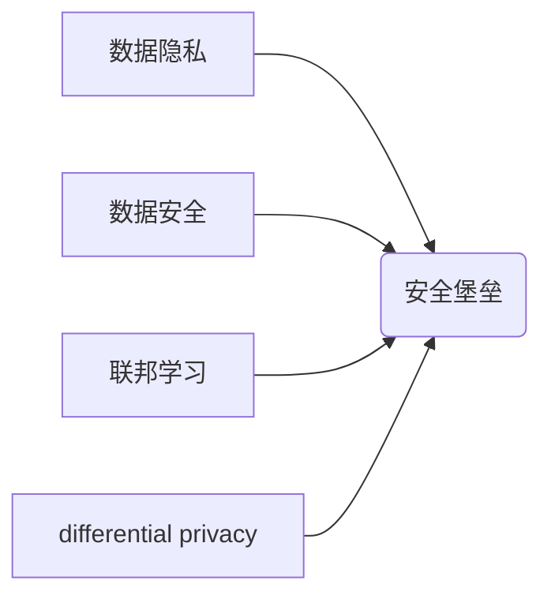

> AI 2.0, 数据隐私, 安全堡垒, 联邦学习, differential privacy,  加密技术,  数据安全

## 1. 背景介绍

人工智能（AI）正以惊人的速度发展，AI 2.0 时代已经到来。从自动驾驶到医疗诊断，从个性化推荐到智能客服，AI 正在深刻地改变着我们的生活。然而，AI 的发展也带来了新的挑战，其中数据隐私和安全问题尤为突出。

在 AI 训练和应用过程中，大量个人数据被收集、处理和利用。这些数据可能包含敏感信息，如姓名、地址、医疗记录、金融信息等。如果这些数据泄露或被滥用，将可能导致严重的后果，包括身份盗窃、金融诈骗、隐私侵犯等。

因此，如何保障 AI 2.0 时代的数据隐私和安全，成为一个至关重要的议题。

## 2. 核心概念与联系

**2.1 数据隐私**

数据隐私是指个人信息在收集、使用、存储和处理过程中，享有的不被侵犯、不被滥用、不被泄露的权利。

**2.2 数据安全**

数据安全是指保护数据免受未经授权的访问、使用、披露、修改或销毁的措施。

**2.3 安全堡垒**

安全堡垒是指用于保护数据隐私和安全的综合性技术体系，它包括多种技术手段，如加密技术、身份验证、访问控制、数据脱敏等。

**2.4 联邦学习**

联邦学习是一种分布式机器学习方法，它允许模型在不共享原始数据的情况下进行训练。

**2.5 differential privacy**

differential privacy是一种数学工具，它可以用来保护数据隐私，确保数据分析结果不会泄露任何关于单个数据点的敏感信息。

**2.6  核心概念关系图**



## 3. 核心算法原理 & 具体操作步骤

### 3.1  算法原理概述

本节将介绍安全堡垒的核心算法原理，包括加密技术、身份验证、访问控制、数据脱敏等。

**3.1.1 加密技术**

加密技术是保护数据安全的重要手段，它通过将数据转换为不可读的形式，防止未经授权的访问。常见的加密算法包括：

* **对称加密算法:** 使用相同的密钥进行加密和解密，例如 AES、DES。
* **非对称加密算法:** 使用一对密钥进行加密和解密，其中公钥用于加密，私钥用于解密，例如 RSA、ECC。

**3.1.2 身份验证**

身份验证是指确认用户身份的过程，确保只有授权的用户才能访问数据。常见的身份验证方法包括：

* **密码验证:** 用户输入密码进行验证。
* **多因素身份验证 (MFA):** 使用多种验证因素，例如密码、短信验证码、生物识别等，提高安全性。

**3.1.3 访问控制**

访问控制是指控制用户对数据的访问权限，确保只有授权的用户才能访问特定数据。常见的访问控制方法包括：

* **角色基访问控制 (RBAC):** 根据用户的角色分配不同的访问权限。
* **属性基访问控制 (ABAC):** 根据用户的属性，例如部门、职位等，分配不同的访问权限。

**3.1.4 数据脱敏**

数据脱敏是指将敏感信息从数据中移除或替换，降低数据泄露风险。常见的脱敏技术包括：

* **数据替换:** 将敏感信息替换为随机值或伪值。
* **数据模糊化:** 将敏感信息进行模糊处理，例如将姓名替换为姓氏加数字。

### 3.2  算法步骤详解

**3.2.1 加密技术步骤**

1. 选择合适的加密算法。
2. 生成密钥。
3. 使用密钥对数据进行加密。
4. 将加密后的数据存储或传输。
5. 使用密钥对加密后的数据进行解密。

**3.2.2 身份验证步骤**

1. 用户输入用户名或其他身份信息。
2. 系统验证用户身份，例如通过密码验证或多因素身份验证。
3. 如果验证成功，系统授予用户访问权限。

**3.2.3 访问控制步骤**

1. 用户请求访问数据。
2. 系统检查用户的访问权限。
3. 如果用户有访问权限，系统允许用户访问数据。否则，系统拒绝访问请求。

**3.2.4 数据脱敏步骤**

1. 识别数据中的敏感信息。
2. 选择合适的脱敏技术。
3. 对敏感信息进行脱敏处理。
4. 将脱敏后的数据存储或传输。

### 3.3  算法优缺点

**3.3.1 加密技术**

* **优点:** 能够有效地保护数据安全，防止未经授权的访问。
* **缺点:** 加密算法的复杂度和密钥管理的难度。

**3.3.2 身份验证**

* **优点:** 可以确保只有授权的用户才能访问数据。
* **缺点:** 密码验证容易被破解，多因素身份验证可能会增加用户体验的负担。

**3.3.3 访问控制**

* **优点:** 可以细粒度地控制用户对数据的访问权限。
* **缺点:** 需要复杂的管理和维护。

**3.3.4 数据脱敏**

* **优点:** 可以降低数据泄露风险。
* **缺点:** 可能导致数据分析的精度下降。

### 3.4  算法应用领域

* **医疗保健:** 保护患者隐私，确保医疗数据的安全。
* **金融服务:** 保护客户财务信息，防止金融诈骗。
* **电商:** 保护用户个人信息，防止数据泄露。
* **政府:** 保护公民隐私，确保政府数据的安全。

## 4. 数学模型和公式 & 详细讲解 & 举例说明

### 4.1  数学模型构建

本节将介绍 differential privacy 的数学模型，并解释其原理。

**4.1.1 定义**

differential privacy 是一个数学框架，它允许对数据进行统计分析，同时保证数据隐私。

**4.1.2 核心概念**

* **隐私预算 (ε):** 衡量隐私泄露程度的参数，ε 越小，隐私保护越强。
* **敏感函数:** 描述数据变化对结果的影响的函数。

**4.1.3 数学模型**

假设我们有一个数据集 D，包含 n 个数据点。我们想要对数据集进行统计分析，例如计算平均值。differential privacy 的核心思想是，在对数据进行统计分析时，引入一个随机噪声，使得结果对单个数据点的变化不敏感。

**4.1.4 公式**

```latex
Pr[f(D') ∈ S] ≤ exp(-ε) * Pr[f(D) ∈ S] + δ
```

其中：

* f(D) 是对数据集 D 的统计分析结果。
* f(D') 是对数据集 D' 的统计分析结果，D' 是 D 中一个数据点被修改后的数据集。
* S 是一个结果集。
* ε 是隐私预算。
* δ 是一个可忽略的误差项。

### 4.2  公式推导过程

公式的推导过程涉及到概率论和信息论的知识，这里不再赘述。

### 4.3  案例分析与讲解

**4.3.1 举例说明**

假设我们想要计算一个数据集中的平均年龄，并使用 differential privacy 保护数据隐私。我们可以使用以下步骤：

1. 选择一个合适的隐私预算 ε。
2. 对每个数据点添加一个服从高斯分布的随机噪声，噪声的方差与 ε 成反比。
3. 计算加噪后的数据的平均值。

**4.3.2 分析**

通过添加随机噪声，我们可以保证平均年龄的结果对单个数据点的变化不敏感。也就是说，即使攻击者知道某个数据点的真实值，也无法从平均年龄的结果中推断出该数据点的具体值。

## 5. 项目实践：代码实例和详细解释说明

### 5.1  开发环境搭建

本节将介绍如何搭建一个用于实现安全堡垒技术的开发环境。

**5.1.1 软件环境**

* 操作系统: Linux 或 macOS
* 编程语言: Python
* 开发工具: PyCharm 或 VS Code

**5.1.2 库依赖**

* TensorFlow 或 PyTorch (深度学习框架)
* scikit-learn (机器学习库)
* cryptography (加密库)
* Flask 或 Django (Web 框架)

### 5.2  源代码详细实现

本节将提供一个简单的安全堡垒技术实现的代码示例，例如使用加密技术对数据进行保护。

```python
from cryptography.fernet import Fernet

# 生成密钥
key = Fernet.generate_key()

# 创建 Fernet 对象
cipher = Fernet(key)

# 加密数据
message = "This is a secret message".encode()
encrypted_message = cipher.encrypt(message)

# 解密数据
decrypted_message = cipher.decrypt(encrypted_message)

# 打印结果
print("加密后的数据:", encrypted_message)
print("解密后的数据:", decrypted_message.decode())
```

### 5.3  代码解读与分析

* **Fernet:** 是 Python 中用于对称加密的库。
* **generate_key():** 生成一个随机密钥。
* **encrypt():** 使用密钥对数据进行加密。
* **decrypt():** 使用密钥对加密数据进行解密。

### 5.4  运行结果展示

运行上述代码后，将输出加密后的数据和解密后的数据。

## 6. 实际应用场景

### 6.1  医疗保健

* **电子病历 (EHR) 安全:** 使用加密技术保护患者的医疗记录，防止未经授权的访问。
* **远程医疗:** 使用身份验证和访问控制技术确保远程医疗服务的安全性。

### 6.2  金融服务

* **在线支付:** 使用加密技术保护用户信用卡信息，防止支付欺诈。
* **风险管理:** 使用机器学习算法分析用户行为，识别潜在的风险。

### 6.3  电商

* **用户数据保护:** 使用加密技术保护用户的个人信息，防止数据泄露。
* **商品推荐:** 使用机器学习算法分析用户的购买历史，提供个性化的商品推荐。

### 6.4  未来应用展望

随着 AI 技术的不断发展，安全堡垒技术将发挥越来越重要的作用。未来，安全堡垒技术将更加智能化、自动化，能够更好地保护数据隐私和安全。

## 7. 工具和资源推荐

### 7.1  学习资源推荐

* **书籍:**
    * 《数据隐私与安全》
    * 《人工智能安全》
* **在线课程:**
    * Coursera: 数据隐私与安全
    * edX: 人工智能安全

### 7.2  开发工具推荐

* **加密库:**
    * cryptography (Python)
    * OpenSSL (C/C++)
* **身份验证库:**
    * Auth0
    * Okta

### 7.3  相关论文推荐

* **Differential Privacy:**
    * "Differentially Private Machine Learning"
    * "A Primer on Differential Privacy"
* **Federated Learning:**
    * "Federated Learning: Strategies for Improving Communication Efficiency"
    * "Federated Learning: Challenges, Methods, and Future Directions"

## 8. 总结：未来发展趋势与挑战

### 8.1  研究成果总结

本篇文章介绍了安全堡垒技术的基本概念、原理、算法和应用场景。安全堡垒技术是保障 AI 2.0 时代数据隐私和安全的关键技术，它将推动 AI 技术的健康发展。

### 8.2  未来发展趋势

* **更加智能化:** 安全堡垒技术将更加智能化，能够自动识别和应对新的安全威胁。
* **更加自动化:** 安全堡垒技术将更加自动化，能够自动执行安全操作，减少人工干预。
* **更加可解释:** 安全堡垒技术将更加可解释，能够解释其决策过程，提高用户信任度。

### 8.3  面临的挑战

