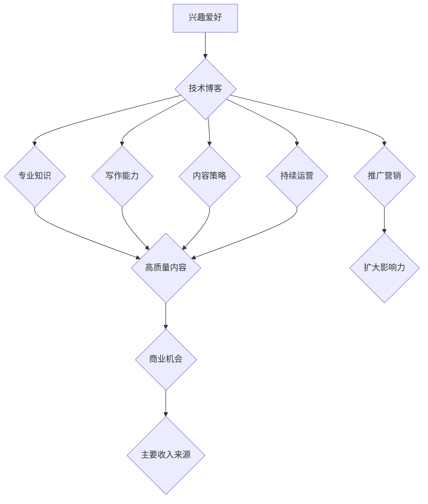

>  人工智能、编程、软件架构、技术博客、副业、主要收入来源、技术写作、技术社区

## 1. 背景介绍

在当今科技飞速发展的时代，技术技能越来越受到重视。越来越多的人开始学习编程、探索人工智能等领域，并希望将自己的技术能力转化为经济价值。技术博客作为一种分享知识、交流经验的平台，为技术爱好者提供了展示自我、建立个人品牌的机会。

然而，仅仅拥有技术技能并不能保证技术博客的成功。想要将技术博客从兴趣爱好发展为主要收入来源，需要付出更多的努力和思考。本文将从多个角度探讨如何将技术博客打造成为稳定的收入来源，并分享一些经验和建议。

## 2. 核心概念与联系

**2.1 技术博客的本质**

技术博客本质上是一种在线平台，用于分享技术知识、经验和见解。它可以是个人博客，也可以是公司或组织的官方博客。

**2.2 技术博客的价值**

技术博客的价值体现在以下几个方面：

* **知识分享:**  技术博客可以帮助作者将自己的技术知识和经验与他人分享，促进技术交流和传播。
* **个人品牌建设:**  通过持续创作高质量的技术内容，作者可以建立个人品牌，提升在技术社区中的影响力。
* **商业机会:**  技术博客可以成为作者获取商业机会的平台，例如广告收入、赞助合作、咨询服务等。

**2.3 技术博客的盈利模式**

技术博客的盈利模式多种多样，常见的有：

* **广告收入:**  通过在博客上展示广告，获取广告收入。
* **赞助合作:**  与企业或组织合作，撰写赞助内容，获取赞助费用。
* **电子书销售:**  将博客文章整理成电子书，进行销售。
* **课程销售:**  录制技术课程，进行在线销售。
* **咨询服务:**  利用自身的技术 expertise 提供咨询服务，获取咨询费用。

**2.4 技术博客的成功要素**

想要将技术博客打造成为主要收入来源，需要具备以下几个要素：

* **专业知识:**  作者需要具备扎实的技术知识和经验，才能创作出高质量的技术内容。
* **写作能力:**  作者需要具备良好的写作能力，才能将技术知识清晰、易懂地表达出来。
* **内容策略:**  作者需要制定合理的博客内容策略，确保内容的质量和吸引力。
* **推广营销:**  作者需要积极推广博客，扩大博客的影响力和读者群体。
* **持续运营:**  技术博客的运营需要持续投入时间和精力，才能保持内容的更新和质量。

**2.5 Mermaid 流程图**



## 3. 核心算法原理 & 具体操作步骤

### 3.1  算法原理概述

**3.1.1  算法定义**

算法是指解决特定问题的一系列明确的步骤或规则。它是一种描述计算过程的指令集，用于处理数据并产生预期结果。

**3.1.2  算法特性**

* **明确性:**  算法的每个步骤都必须明确定义，没有模糊或歧义的语句。
* **有限性:**  算法必须在有限的时间内完成，不能无限循环。
* **有效性:**  算法的每个步骤都必须能够执行，并且不会导致错误或异常。
* **输入:**  算法需要接受输入数据，这些数据可以是数字、文本、图像等各种类型。
* **输出:**  算法需要产生输出结果，这些结果可以是数字、文本、图像等各种类型。

**3.1.3  算法分类**

算法可以根据不同的分类标准进行分类，例如：

* **按算法类型:**  排序算法、搜索算法、图算法、动态规划算法等。
* **按应用领域:**  图像处理算法、自然语言处理算法、机器学习算法等。
* **按时间复杂度:**  线性时间复杂度、对数时间复杂度、多项式时间复杂度等。

### 3.2  算法步骤详解

**3.2.1  算法设计**

算法设计是算法开发的第一步，需要根据具体问题需求，选择合适的算法类型和设计算法步骤。

**3.2.2  算法实现**

算法实现是指将算法设计转化为具体的代码实现。

**3.2.3  算法测试**

算法测试是指对算法进行测试，验证算法的正确性和效率。

### 3.3  算法优缺点

**3.3.1  优点**

* **效率:**  算法可以有效地解决问题，提高计算效率。
* **可重复性:**  算法可以被重复执行，保证结果的一致性。
* **可维护性:**  算法可以被修改和完善，提高算法的适应性。

**3.3.2  缺点**

* **复杂性:**  一些算法的实现可能比较复杂，需要一定的编程经验。
* **效率瓶颈:**  即使是高效的算法，也可能存在效率瓶颈，需要进行优化。
* **适用范围:**  不同的算法适用于不同的问题，需要根据实际情况选择合适的算法。

### 3.4  算法应用领域

算法广泛应用于各个领域，例如：

* **计算机科学:**  排序算法、搜索算法、图算法等。
* **人工智能:**  机器学习算法、深度学习算法等。
* **生物信息学:**  基因序列比对算法、蛋白质结构预测算法等。
* **金融领域:**  风险管理算法、投资策略算法等。

## 4. 数学模型和公式 & 详细讲解 & 举例说明

### 4.1  数学模型构建

数学模型是利用数学语言和符号来描述客观现象或问题的抽象表示。它可以帮助我们理解问题的本质，预测问题的演变趋势，并找到解决问题的方案。

**4.1.1  模型类型**

数学模型可以分为以下几种类型：

* **代数模型:**  用代数方程和不等式来描述问题。
* **微积分模型:**  用微积分的工具来描述问题，例如导数、积分等。
* **概率模型:**  用概率论的工具来描述问题，例如概率分布、随机变量等。
* **统计模型:**  用统计学的方法来描述问题，例如回归分析、假设检验等。

**4.1.2  模型构建步骤**

构建数学模型的步骤一般包括以下几个方面：

* **问题分析:**  首先要对问题进行深入分析，明确问题的本质、目标和约束条件。
* **变量定义:**  根据问题需要，定义相关的变量和参数。
* **关系建立:**  建立变量之间的数学关系，例如代数方程、微分方程等。
* **模型验证:**  验证模型的合理性和有效性，确保模型能够准确地描述问题。

### 4.2  公式推导过程

公式推导过程是指根据数学原理和逻辑关系，从已知条件出发，推导出未知量的表达式。

**4.2.1  推导步骤**

公式推导过程一般包括以下几个步骤：

* **列出已知条件:**  明确已知的变量、参数和关系。
* **应用数学原理:**  根据数学原理和逻辑关系，进行公式变形和简化。
* **代入已知值:**  将已知值代入公式，求解未知量。
* **验证结果:**  验证推导结果的合理性和正确性。

### 4.3  案例分析与讲解

**4.3.1  案例介绍**

**4.3.2  公式应用**

**4.3.3  结果分析**

## 5. 项目实践：代码实例和详细解释说明

### 5.1  开发环境搭建

**5.1.1  软件安装**

**5.1.2  环境配置**

### 5.2  源代码详细实现

```python
# 代码示例
def my_function(x):
  """
  This function calculates the square of a number.

  Args:
    x: The number to be squared.

  Returns:
    The square of the number.
  """
  return x * x

# Example usage
result = my_function(5)
print(f"The square of 5 is: {result}")
```

### 5.3  代码解读与分析

**5.3.1  函数定义**

**5.3.2  参数传递**

**5.3.3  返回值**

### 5.4  运行结果展示

**5.4.1  输出结果**

**5.4.2  结果分析**

## 6. 实际应用场景

**6.1  技术博客应用场景**

**6.2  商业应用场景**

**6.3  社会应用场景**

### 6.4  未来应用展望

## 7. 工具和资源推荐

### 7.1  学习资源推荐

**7.1.1  在线课程平台**

**7.1.2  技术书籍**

**7.1.3  技术博客和论坛**

### 7.2  开发工具推荐

**7.2.1  代码编辑器**

**7.2.2  版本控制系统**

**7.2.3  调试工具**

### 7.3  相关论文推荐

## 8. 总结：未来发展趋势与挑战

### 8.1  研究成果总结

### 8.2  未来发展趋势

### 8.3  面临的挑战

### 8.4  研究展望

## 9. 附录：常见问题与解答

**9.1  常见问题**

**9.2  解答**

作者：禅与计算机程序设计艺术 / Zen and the Art of Computer Programming


<end_of_turn>