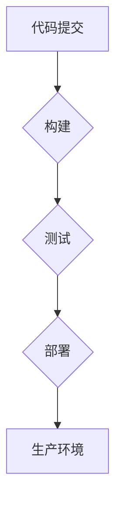

> 软件2.0, 持续集成, 持续部署, DevOps, 自动化, 云原生, 敏捷开发, 容器化, 微服务

## 1. 背景介绍

软件行业正经历着前所未有的变革，传统的软件开发模式已无法满足快速迭代、快速响应市场需求的时代要求。软件2.0 应运而生，它强调敏捷开发、自动化运维、云原生架构等理念，旨在构建更加灵活、高效、可扩展的软件系统。持续集成 (CI) 和持续部署 (CD) 作为软件2.0的核心实践，在推动软件开发流程自动化、加速软件交付方面发挥着至关重要的作用。

传统的软件开发流程通常是瀑布式开发，各个阶段的开发工作相对独立，导致开发周期长、反馈机制慢，难以快速响应市场变化。而软件2.0 倡导敏捷开发，将开发工作划分为多个迭代周期，每个周期都包含需求分析、设计、开发、测试和部署等环节，并通过持续反馈机制不断优化软件产品。

持续集成和持续部署是敏捷开发的重要组成部分，它们通过自动化构建、测试和部署流程，实现软件开发的快速迭代和持续交付。

## 2. 核心概念与联系

**2.1 持续集成 (CI)**

持续集成是指将开发人员提交的代码频繁地集成到主代码库中，并通过自动化构建和测试流程，确保代码质量和系统稳定性。

**2.2 持续部署 (CD)**

持续部署是指将经过测试和验证的代码自动部署到生产环境中，实现软件的快速交付和持续更新。

**2.3 CI/CD 联系**

持续集成和持续部署是相互关联的，它们共同构成了 CI/CD 持续交付管道。CI/CD 管道是一个自动化流程，它将代码从开发阶段一直到生产环境，每个阶段都有相应的自动化测试和部署操作。

**2.4 CI/CD 架构**



## 3. 核心算法原理 & 具体操作步骤

### 3.1  算法原理概述

CI/CD 的核心算法原理是自动化和流程化。通过自动化构建、测试和部署流程，可以减少人为操作，提高效率，降低错误率。

### 3.2  算法步骤详解

1. **代码提交:** 开发人员将代码提交到主代码库。
2. **构建:** CI 服务器接收到代码提交通知，自动构建软件项目。
3. **测试:** 构建完成后，CI 服务器自动执行单元测试、集成测试等测试用例。
4. **部署:** 如果测试通过，CI 服务器会自动将软件部署到测试环境或生产环境。
5. **反馈:** 部署完成后，CI 服务器会收集反馈信息，并反馈给开发人员。

### 3.3  算法优缺点

**优点:**

* **提高开发效率:** 自动化流程可以减少人为操作，提高开发效率。
* **降低错误率:** 自动化测试可以帮助发现和修复代码中的错误。
* **加速软件交付:** 自动化部署可以快速将软件交付到用户手中。
* **提高软件质量:** 持续集成和持续部署可以帮助提高软件质量。

**缺点:**

* **需要投入时间和精力:** 设置和维护 CI/CD 管道需要投入时间和精力。
* **需要一定的技术基础:** 构建和维护 CI/CD 管道需要一定的技术基础。
* **可能存在一些风险:** 自动化部署可能会带来一些风险，例如部署失败或数据丢失。

### 3.4  算法应用领域

CI/CD 广泛应用于各种软件开发领域，例如：

* Web 应用开发
* 移动应用开发
* 云原生应用开发
* 数据平台开发

## 4. 数学模型和公式 & 详细讲解 & 举例说明

### 4.1  数学模型构建

CI/CD 的核心是自动化流程，我们可以用数学模型来描述自动化流程的效率和可靠性。

**4.1.1 流程效率模型:**

```
效率 = (完成任务时间) / (总任务时间)
```

其中，完成任务时间是指自动化流程完成任务所花费的时间，总任务时间是指手动完成任务所花费的时间。

**4.1.2 流程可靠性模型:**

```
可靠性 = (成功执行次数) / (总执行次数)
```

其中，成功执行次数是指自动化流程成功执行的次数，总执行次数是指自动化流程执行的总次数。

### 4.2  公式推导过程

**4.2.1 效率模型推导:**

假设手动完成任务需要 10 小时，自动化流程完成任务需要 5 小时，则效率为：

```
效率 = 5 / 10 = 0.5
```

**4.2.2 可靠性模型推导:**

假设自动化流程执行 100 次，成功执行 95 次，则可靠性为：

```
可靠性 = 95 / 100 = 0.95
```

### 4.3  案例分析与讲解

**4.3.1 案例:**

假设一家公司使用 CI/CD 管道进行软件开发，自动化构建和测试流程可以节省 50% 的开发时间，自动化部署流程可以减少部署错误率 90%。

**4.3.2 分析:**

通过使用 CI/CD 管道，这家公司可以显著提高开发效率，降低软件开发成本，提高软件质量。

## 5. 项目实践：代码实例和详细解释说明

### 5.1  开发环境搭建

**5.1.1 软件工具:**

* Git: 版本控制系统
* Jenkins: CI/CD 服务器
* Docker: 容器化工具
* Kubernetes: 集群管理工具

**5.1.2 环境配置:**

* 安装 Git、Jenkins、Docker 和 Kubernetes。
* 配置 Jenkins 服务器，并连接 Git 仓库。
* 创建 Docker 镜像，并部署到 Kubernetes 集群中。

### 5.2  源代码详细实现

**5.2.1 代码示例:**

```python
# 这是一个简单的 Python 代码示例
def hello_world():
    print("Hello, world!")

if __name__ == "__main__":
    hello_world()
```

**5.2.2 代码解释:**

* `hello_world()` 函数打印 "Hello, world!" 到控制台。
* `if __name__ == "__main__":` 语句确保只有在直接运行脚本时才会执行 `hello_world()` 函数。

### 5.3  代码解读与分析

* 代码简洁易懂，功能明确。
* 使用了 Python 语言，易于学习和使用。
* 代码结构合理，易于维护和扩展。

### 5.4  运行结果展示

运行代码后，控制台将输出 "Hello, world!"。

## 6. 实际应用场景

### 6.1  电商平台

电商平台需要快速响应市场变化，及时更新商品信息和促销活动。CI/CD 可以帮助电商平台快速迭代和部署新功能，提高用户体验。

### 6.2  金融系统

金融系统对安全性、稳定性和可靠性要求极高。CI/CD 可以帮助金融机构自动化构建、测试和部署代码，降低部署风险，提高系统稳定性。

### 6.3  游戏开发

游戏开发需要快速迭代和测试新功能。CI/CD 可以帮助游戏开发团队快速构建和测试游戏版本，缩短开发周期，提高游戏质量。

### 6.4  未来应用展望

随着云计算、容器化和微服务等技术的不断发展，CI/CD 将在软件开发领域发挥更加重要的作用。未来，CI/CD 将更加智能化、自动化和平台化，能够更好地支持软件开发的快速迭代和持续交付。

## 7. 工具和资源推荐

### 7.1  学习资源推荐

* **书籍:**
    * "Continuous Delivery: Reliable Software Releases through Build, Test, and Deployment Automation" by Jez Humble and David Farley
    * "The Phoenix Project: A Novel About IT, DevOps, and Helping Your Business Win" by Gene Kim, Kevin Behr, and George Spafford
* **网站:**
    * https://www.atlassian.com/continuous-delivery
    * https://www.devops.com/

### 7.2  开发工具推荐

* **CI/CD 服务器:**
    * Jenkins
    * GitLab CI/CD
    * CircleCI
* **容器化工具:**
    * Docker
    * Podman
* **云平台:**
    * AWS
    * Azure
    * Google Cloud Platform

### 7.3  相关论文推荐

* "Continuous Integration and Continuous Delivery: A Practical Guide" by Jez Humble and David Farley
* "DevOps Handbook: How to Create World-Class Agility, Reliability, and Security in Technology Organizations" by Gene Kim, Jez Humble, Patrick Debois, and John Willis

## 8. 总结：未来发展趋势与挑战

### 8.1  研究成果总结

CI/CD 已经成为软件开发行业的重要实践，它可以显著提高开发效率、降低软件开发成本，提高软件质量。

### 8.2  未来发展趋势

* **更加智能化:** CI/CD 系统将更加智能化，能够自动识别和解决问题，减少人工干预。
* **更加自动化:** CI/CD 流程将更加自动化，能够自动完成构建、测试、部署等所有步骤。
* **更加平台化:** CI/CD 平台将更加平台化，能够支持多种开发语言、框架和工具。

### 8.3  面临的挑战

* **技术复杂性:** CI/CD 系统的搭建和维护需要一定的技术基础。
* **文化转变:** CI/CD 需要改变传统的软件开发模式，需要组织内部进行文化转变。
* **安全风险:** 自动化部署可能会带来一些安全风险，需要加强安全防护措施。

### 8.4  研究展望

未来，CI/CD 研究将更加关注智能化、自动化和平台化，以及如何更好地解决安全风险和文化转变等挑战。

## 9. 附录：常见问题与解答

**9.1  问题:** 如何选择合适的 CI/CD 工具？

**9.2  答案:** 选择 CI/CD 工具需要根据项目的具体需求和环境进行选择。

**9.3  问题:** 如何进行 CI/CD 的文化转变？

**9.4  答案:** CI/CD 的文化转变需要从组织领导层开始，并通过培训、沟通和激励等方式，逐步改变团队的思维方式和工作习惯。


作者：禅与计算机程序设计艺术 / Zen and the Art of Computer Programming 
<end_of_turn>