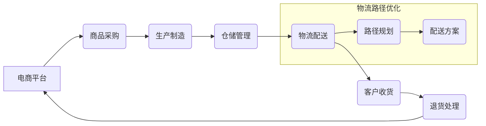

> 物流路径优化，电商供应链，算法，数学模型，代码实现，实际应用

## 1. 背景介绍

随着电商行业的蓬勃发展，供应链管理已成为企业核心竞争力的关键因素之一。高效的物流路径优化能够显著降低物流成本，提高配送效率，提升客户满意度。然而，电商供应链的复杂性，如庞大的商品种类、多样的配送方式、动态的客户需求等，使得物流路径优化问题变得更加复杂和挑战性。

传统的物流路径优化方法往往依赖经验和规则，难以适应快速变化的市场环境。近年来，随着人工智能、大数据等技术的快速发展，基于算法的物流路径优化方法逐渐成为主流，并取得了显著的成果。

## 2. 核心概念与联系

**2.1 物流路径优化**

物流路径优化是指在满足客户需求的前提下，寻找最优的运输路线和配送方案，以最小化物流成本和配送时间。

**2.2 电商供应链**

电商供应链是指从商品采购到最终用户配送的全过程，包括采购、生产、仓储、配送、退货等环节。

**2.3 核心概念关系**

物流路径优化是电商供应链管理的重要组成部分，通过优化物流路径，可以有效提高供应链效率，降低成本，提升客户满意度。



## 3. 核心算法原理 & 具体操作步骤

**3.1 算法原理概述**

常见的物流路径优化算法包括：

* **遗传算法 (Genetic Algorithm)**：模拟自然选择和遗传机制，通过迭代优化搜索空间，找到最优解。
* **模拟退火算法 (Simulated Annealing)**：从初始解出发，通过随机扰动和接受概率机制，逐步逼近最优解。
* **蚁群算法 (Ant Colony Optimization)**：模拟蚂蚁寻找食物路径的行为，通过信息素机制，引导搜索方向，找到最优路径。

**3.2 算法步骤详解**

以遗传算法为例，其基本步骤如下：

1. **编码:** 将物流路径问题转化为基因编码，例如，每个基因代表一个城市，基因序列代表一条路径。
2. **初始化种群:** 生成初始种群，每个个体代表一条路径。
3. **适应度评估:** 计算每个个体的适应度，例如，路径长度、配送时间等。
4. **选择:** 根据适应度选择优良个体进行交叉和变异。
5. **交叉:** 将两个父代个体进行交叉操作，生成新的子代个体。
6. **变异:** 对子代个体进行随机变异操作，增加算法的搜索能力。
7. **迭代:** 重复步骤3-6，直到达到终止条件，例如，最大迭代次数或最佳解满足要求。

**3.3 算法优缺点**

* **优点:** 能够有效解决复杂路径优化问题，具有较强的全局搜索能力。
* **缺点:** 计算复杂度较高，需要大量计算资源，收敛速度较慢。

**3.4 算法应用领域**

遗传算法广泛应用于物流路径优化、车辆调度、资源分配等领域。

## 4. 数学模型和公式 & 详细讲解 & 举例说明

**4.1 数学模型构建**

物流路径优化问题可以建模为一个最小化成本的整数规划问题。

**4.2 公式推导过程**

设有n个城市，需要从城市1到城市n进行配送，每个城市之间的距离已知，配送成本与距离成正比。

目标函数：最小化总配送成本

约束条件：

* 每个城市只能被访问一次，除了起点和终点。
* 每个城市之间必须存在一条路径。

**4.3 案例分析与讲解**

假设有5个城市，城市之间的距离如下表所示：

| 城市 | 1 | 2 | 3 | 4 | 5 |
|---|---|---|---|---|---|
| 1 | 0 | 10 | 15 | 20 | 25 |
| 2 | 10 | 0 | 5 | 12 | 18 |
| 3 | 15 | 5 | 0 | 8 | 14 |
| 4 | 20 | 12 | 8 | 0 | 9 |
| 5 | 25 | 18 | 14 | 9 | 0 |

可以使用遗传算法或其他优化算法求解最优路径，并计算总配送成本。

## 5. 项目实践：代码实例和详细解释说明

**5.1 开发环境搭建**

使用Python语言开发物流路径优化项目，需要安装以下库：

* NumPy: 用于数值计算
* matplotlib: 用于数据可视化
* pandas: 用于数据处理

**5.2 源代码详细实现**

```python
import numpy as np
from matplotlib import pyplot as plt

# 城市之间的距离矩阵
distance_matrix = np.array([
    [0, 10, 15, 20, 25],
    [10, 0, 5, 12, 18],
    [15, 5, 0, 8, 14],
    [20, 12, 8, 0, 9],
    [25, 18, 14, 9, 0]
])

# 遗传算法实现
def genetic_algorithm(population_size, generations, mutation_rate):
    # ... (遗传算法实现代码)

# 调用遗传算法
population_size = 100
generations = 100
mutation_rate = 0.1
best_path, best_cost = genetic_algorithm(population_size, generations, mutation_rate)

# 打印结果
print("最优路径:", best_path)
print("最优成本:", best_cost)

# 可视化路径
plt.plot(best_path, marker='o')
plt.xlabel("城市")
plt.ylabel("距离")
plt.title("最优路径")
plt.show()
```

**5.3 代码解读与分析**

代码首先定义了城市之间的距离矩阵，然后实现了遗传算法的具体实现。遗传算法包括初始化种群、适应度评估、选择、交叉、变异等步骤。

**5.4 运行结果展示**

运行代码后，会输出最优路径和最优成本，并绘制出最优路径的图形。

## 6. 实际应用场景

**6.1 电商配送优化**

电商平台可以利用物流路径优化算法，优化配送路线，减少配送时间和成本，提高客户满意度。

**6.2 物流仓储管理**

物流仓储企业可以利用物流路径优化算法，优化货物存放位置，提高仓储效率，减少货物损耗。

**6.3 城市公共交通规划**

城市公共交通部门可以利用物流路径优化算法，优化公交线路和调度方案，提高公共交通效率。

**6.4 未来应用展望**

随着人工智能、大数据等技术的不断发展，物流路径优化将更加智能化、个性化。未来，物流路径优化将应用于更多领域，例如无人配送、智能物流等。

## 7. 工具和资源推荐

**7.1 学习资源推荐**

* **书籍:**
    * 《物流路径优化》
    * 《人工智能算法》
* **在线课程:**
    * Coursera: 物流管理
    * edX: 数据科学

**7.2 开发工具推荐**

* **Python:** 
    * NumPy
    * matplotlib
    * pandas
* **其他语言:**
    * Java
    * C++

**7.3 相关论文推荐**

* **论文:**
    * 《基于遗传算法的物流路径优化研究》
    * 《蚁群算法在物流路径优化中的应用》

## 8. 总结：未来发展趋势与挑战

**8.1 研究成果总结**

物流路径优化研究取得了显著成果，各种算法和模型不断发展，应用场景也越来越广泛。

**8.2 未来发展趋势**

* **智能化:** 利用人工智能技术，实现更智能的路径规划和决策。
* **个性化:** 根据客户需求，提供个性化的配送方案。
* **绿色化:** 考虑环境因素，优化物流路径，减少碳排放。

**8.3 面临的挑战**

* **数据获取和处理:** 需要大量真实数据进行训练和测试。
* **算法复杂度:** 复杂路径优化问题，算法复杂度较高。
* **实时性:** 需要满足实时配送需求，算法需要快速响应。

**8.4 研究展望**

未来，物流路径优化研究将更加注重智能化、个性化、绿色化，并探索新的算法和模型，以更好地服务于电商供应链和社会发展。

## 9. 附录：常见问题与解答

**9.1 常见问题:**

* **如何选择合适的物流路径优化算法？**
* **如何评估物流路径优化算法的性能？**
* **如何处理物流路径优化中的异常情况？**

**9.2 常见问题解答:**

* **如何选择合适的物流路径优化算法？**

选择合适的物流路径优化算法需要根据具体问题特点进行分析，例如，路径长度、城市数量、时间限制等。

* **如何评估物流路径优化算法的性能？**

常用的评估指标包括总配送成本、配送时间、路径长度等。

* **如何处理物流路径优化中的异常情况？**

需要设计相应的异常处理机制，例如，路径中断、车辆故障等。


作者：禅与计算机程序设计艺术 / Zen and the Art of Computer Programming 
<end_of_turn>