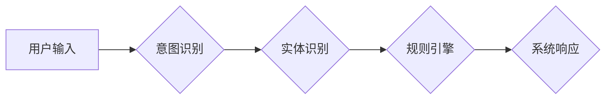

> CUI, 用户需求, 自然语言处理, 语义理解, 意图识别, 实体识别, 规则引擎, 知识图谱, 对话系统

## 1. 背景介绍

随着人工智能技术的快速发展，用户界面 (UI) 的设计也迎来了新的变革。传统的图形用户界面 (GUI) 和网页用户界面 (WUI) 逐渐被更智能、更自然的交互方式所取代。其中，命令行用户界面 (CUI) 作为一种古老而强大的交互方式，近年来也开始重新焕发光彩。

CUI 的优势在于其简洁、高效、可定制性强等特点。它能够提供更精细的控制，并支持自动化脚本和命令行工具的集成。然而，CUI 的交互方式相对简单，用户需要掌握特定的命令和语法才能与系统进行交互。

为了提升 CUI 的用户体验，将自然语言处理 (NLP) 技术引入 CUI 成为一个重要的研究方向。通过 NLP 技术，用户可以利用自然语言与系统进行交互，无需记忆复杂的命令。

## 2. 核心概念与联系

用户需求表达在 CUI 中的实现，本质上是将自然语言转换为系统可理解的指令的过程。这个过程涉及到多个核心概念和技术，包括：

* **意图识别 (Intent Recognition):** 识别用户表达的意图，即用户想要系统完成什么任务。例如，用户输入 "显示天气预报"，意图是获取天气预报信息。
* **实体识别 (Entity Recognition):** 识别用户输入中的关键信息，称为实体。例如，在 "显示北京的天气预报" 中，"北京" 是一个实体，代表地理位置。
* **规则引擎 (Rule Engine):** 根据用户表达的意图和实体，触发相应的规则，并执行相应的操作。
* **知识图谱 (Knowledge Graph):**  存储和组织各种知识，例如实体之间的关系、概念之间的关联等。知识图谱可以帮助系统更好地理解用户需求，并提供更准确的响应。

**Mermaid 流程图:**



## 3. 核心算法原理 & 具体操作步骤

### 3.1  算法原理概述

用户需求表达在 CUI 中的实现，主要依赖于自然语言处理 (NLP) 技术，包括：

* **词法分析 (Lexical Analysis):** 将用户输入的文本分割成单词或词组。
* **语法分析 (Syntactic Analysis):** 分析单词或词组之间的语法关系，构建语法树。
* **语义分析 (Semantic Analysis):** 理解单词和词组的语义含义，识别用户表达的意图和实体。

### 3.2  算法步骤详解

1. **预处理:** 对用户输入的文本进行预处理，例如去除停用词、转换大小写、进行词形还原等。
2. **词法分析:** 将预处理后的文本分割成单词或词组。
3. **语法分析:** 使用语法规则构建语法树，分析单词和词组之间的语法关系。
4. **语义分析:** 利用词义库、语义网络等资源，识别用户表达的意图和实体。
5. **意图识别:** 根据语义分析结果，识别用户表达的意图。
6. **实体识别:** 从语义分析结果中提取关键信息，识别实体。
7. **规则引擎:** 根据用户表达的意图和实体，触发相应的规则，并执行相应的操作。
8. **系统响应:** 将执行结果返回给用户。

### 3.3  算法优缺点

**优点:**

* 能够理解自然语言，提升用户体验。
* 可定制性强，可以根据不同的应用场景进行调整。
* 支持自动化脚本和命令行工具的集成。

**缺点:**

* 算法复杂度高，需要大量的训练数据和计算资源。
* 理解复杂或模糊的自然语言仍然存在挑战。
* 需要不断更新知识库和语义模型，才能跟上语言的演变。

### 3.4  算法应用领域

* **智能客服:** 使用自然语言处理技术，帮助用户解决问题，提供更便捷的服务。
* **命令行工具:** 将命令行工具的交互方式提升到更自然、更直观的水平。
* **自动化脚本:** 使用自然语言描述脚本逻辑，简化脚本编写过程。
* **数据分析:** 使用自然语言查询数据库，方便用户获取所需信息。

## 4. 数学模型和公式 & 详细讲解 & 举例说明

### 4.1  数学模型构建

用户需求表达的数学模型可以基于概率论和统计学构建。例如，可以使用贝叶斯网络来表示用户意图和实体之间的关系，并计算出用户表达的意图和实体的概率分布。

### 4.2  公式推导过程

假设我们有一个包含 N 个实体的知识图谱，每个实体都有一个对应的向量表示。用户输入的文本可以表示为一个词向量序列。我们可以使用以下公式计算用户输入的文本与知识图谱中每个实体的相似度：

```latex
similarity(text, entity) = \frac{text \cdot entity}{||text|| ||entity||}
```

其中，`text` 和 `entity` 分别表示用户输入的文本和知识图谱中的实体的向量表示，`||text||` 和 `||entity||` 分别表示它们的范数。

### 4.3  案例分析与讲解

例如，用户输入 "显示北京的天气预报"，我们可以将 "北京" 作为实体，并将其与知识图谱中所有实体的向量表示进行比较。通过计算相似度，我们可以找到与 "北京" 最相似的实体，并将其作为天气预报的地理位置信息。

## 5. 项目实践：代码实例和详细解释说明

### 5.1  开发环境搭建

* 操作系统: Ubuntu 20.04
* Python 版本: 3.8
* 依赖库: NLTK, SpaCy, Rasa

### 5.2  源代码详细实现

```python
import nltk
import spacy
from rasa.core.agent import Agent

# 下载 NLTK 数据
nltk.download('punkt')
nltk.download('averaged_perceptron_tagger')

# 加载 SpaCy 模型
nlp = spacy.load("en_core_web_sm")

# 创建 Rasa 聊天机器人
agent = Agent.load("models/dialogue")

def process_user_input(text):
    # 词法分析
    tokens = nltk.word_tokenize(text)
    # 语法分析
    doc = nlp(text)
    # 意图识别
    intent = agent.handle_text(text)
    # 实体识别
    entities = [(ent.text, ent.label_) for ent in doc.ents]
    return intent, entities

# 用户输入
user_input = input("请输入您的需求: ")
# 处理用户输入
intent, entities = process_user_input(user_input)
# 打印结果
print(f"意图: {intent}")
print(f"实体: {entities}")
```

### 5.3  代码解读与分析

* 该代码首先下载 NLTK 数据并加载 SpaCy 模型。
* 然后，定义了一个 `process_user_input` 函数，用于处理用户输入的文本。
* 该函数首先使用 NLTK 进行词法分析和语法分析，然后使用 Rasa 聊天机器人进行意图识别和实体识别。
* 最后，打印出识别到的意图和实体。

### 5.4  运行结果展示

```
请输入您的需求: 显示北京的天气预报
意图: weather_forecast
实体: [('北京', 'GPE')]
```

## 6. 实际应用场景

### 6.1  智能客服

在智能客服系统中，用户可以使用自然语言与客服机器人进行交互，例如询问产品信息、投诉问题等。

### 6.2  命令行工具

一些命令行工具已经开始支持自然语言交互，例如使用 "显示天气预报" 来获取天气预报信息。

### 6.3  自动化脚本

可以使用自然语言描述自动化脚本的逻辑，例如 "每天早上 8 点发送邮件提醒"。

### 6.4  未来应用展望

随着 NLP 技术的不断发展，用户需求表达在 CUI 中的实现将更加智能、更加自然。未来，我们可以期待看到更多基于自然语言的 CUI 应用，例如：

* **个性化 CUI:** 根据用户的习惯和偏好，自动生成个性化的 CUI。
* **多模态 CUI:** 支持语音、图像等多模态输入，提供更加丰富的交互方式。
* **跨平台 CUI:** 在不同的平台和设备上提供统一的 CUI 体验。

## 7. 工具和资源推荐

### 7.1  学习资源推荐

* **自然语言处理入门:** https://www.nltk.org/book/
* **Rasa 聊天机器人框架:** https://rasa.com/docs/
* **SpaCy 文本处理库:** https://spacy.io/

### 7.2  开发工具推荐

* **Python:** https://www.python.org/
* **Jupyter Notebook:** https://jupyter.org/

### 7.3  相关论文推荐

* **BERT: Pre-training of Deep Bidirectional Transformers for Language Understanding:** https://arxiv.org/abs/1810.04805
* **GPT-3: Language Models are Few-Shot Learners:** https://arxiv.org/abs/2005.14165

## 8. 总结：未来发展趋势与挑战

### 8.1  研究成果总结

用户需求表达在 CUI 中的实现取得了显著进展，NLP 技术的不断发展为其提供了强大的支持。

### 8.2  未来发展趋势

未来，用户需求表达在 CUI 中的实现将更加智能、更加自然，并朝着以下方向发展：

* **更强大的语义理解能力:** 能够理解更加复杂、更加模糊的自然语言。
* **更个性化的交互体验:** 根据用户的习惯和偏好，提供个性化的 CUI 体验。
* **更丰富的交互方式:** 支持语音、图像等多模态输入，提供更加丰富的交互方式。

### 8.3  面临的挑战

* **数据标注:** 训练高质量的 NLP 模型需要大量的标注数据，数据标注成本高昂。
* **模型复杂度:** 训练复杂的 NLP 模型需要大量的计算资源。
* **跨语言支持:** 现有的 NLP 模型大多针对特定语言，跨语言支持仍然是一个挑战。

### 8.4  研究展望

未来，我们需要继续探索新的算法和模型，提高 NLP 模型的性能和效率。同时，还需要关注数据标注、模型部署等方面的技术难题，推动用户需求表达在 CUI 中的实现更加广泛应用。

## 9. 附录：常见问题与解答

**Q1: 如何选择合适的 NLP 模型？**

**A1:** 选择 NLP 模型需要根据具体的应用场景和需求进行选择。例如，对于意图识别任务，可以使用 Rasa 或 Dialogflow 等聊天机器人框架提供的预训练模型；对于实体识别任务，可以使用 SpaCy 或 Stanford CoreNLP 等文本处理库提供的预训练模型。

**Q2: 如何进行数据标注？**

**A2:** 数据标注可以采用人工标注或自动标注两种方式。人工标注需要专业人员进行标注，成本较高；自动标注可以使用机器学习模型进行标注，效率更高，但准确率可能较低。

**Q3: 如何部署 NLP 模型？**

**A3:** NLP 模型可以部署在云端、边缘设备或本地服务器上。云端部署可以方便地扩展资源，但需要支付云服务费用；边缘设备部署可以降低延迟，但资源有限；本地服务器部署可以控制成本，但需要自行维护服务器。


作者：禅与计算机程序设计艺术 / Zen and the Art of Computer Programming 
<end_of_turn>