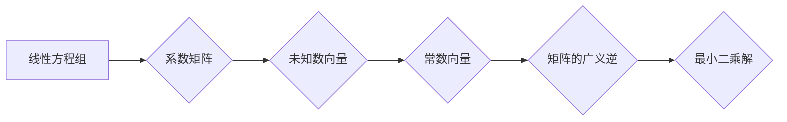

> 矩阵，广义逆，线性方程组，解的存在性，应用场景，算法原理，代码实现

## 1. 背景介绍

矩阵是线性代数中重要的概念，广泛应用于各种领域，例如科学计算、工程学、经济学、数据分析等。在许多实际问题中，我们经常会遇到线性方程组，而矩阵可以用来简洁地表示和求解这些方程组。然而，并非所有线性方程组都有唯一解，甚至有些方程组可能没有解。在这种情况下，我们便需要引入矩阵的广义逆的概念。

矩阵的广义逆，也称为伪逆，是一种特殊的矩阵，它可以用来求解线性方程组的最小二乘解，即使方程组没有唯一解。广义逆的概念在解决实际问题时具有重要的意义，因为它可以帮助我们找到最优的解，即使方程组本身不满足某些条件。

## 2. 核心概念与联系

**2.1 矩阵的定义和性质**

矩阵是一个按照行和列排列的 rectangular array，由数字、符号或表达式组成。矩阵的元素可以是实数、复数、甚至更复杂的数学对象。

* **行和列:** 矩阵的行数和列数分别称为矩阵的行数和列数。
* **元素:** 矩阵中每个元素都由一个特定的行号和列号来标识。
* **转置:** 矩阵的转置是指将矩阵的行和列互换得到的新的矩阵。

**2.2 线性方程组**

线性方程组是由多个线性方程组成的系统。每个方程都包含一个或多个未知数，这些未知数的系数都是常数。

* **系数矩阵:** 线性方程组的系数矩阵是由方程系数组成的矩阵。
* **未知数向量:** 线性方程组的未知数向量是由未知数组成的向量。
* **常数向量:** 线性方程组的常数向量是由方程右边的常数组成的向量。

**2.3 矩阵的广义逆**

矩阵的广义逆是一个特殊的矩阵，它满足以下条件：

* **A*A<sup>+</sup>*A = A**
* **A<sup>+</sup>*A*A<sup>+</sup> = A<sup>+</sup>**

其中，A是原始矩阵，A<sup>+</sup>是其广义逆。

**2.4 广义逆与最小二乘解**

当线性方程组无解或有无穷多解时，我们可以使用广义逆来求解最小二乘解。最小二乘解是指使误差平方和最小的解。

**Mermaid 流程图**



## 3. 核心算法原理 & 具体操作步骤

### 3.1 算法原理概述

求解矩阵的广义逆通常使用以下几种算法：

* **Moore-Penrose 逆:** 这是最常用的广义逆算法，它基于矩阵的秩和正交补空间的概念。
* **奇异值分解 (SVD):** SVD是一种将矩阵分解成三个矩阵的方法，其中之一是奇异值矩阵。通过SVD，我们可以计算出矩阵的广义逆。
* **QR 分解:** QR分解将矩阵分解成正交矩阵和上三角矩阵。通过QR分解，我们可以计算出矩阵的广义逆。

### 3.2 算法步骤详解

**3.2.1 Moore-Penrose 逆算法步骤**

1. 计算矩阵A的秩。
2. 计算矩阵A的正交补空间。
3. 将矩阵A投影到其正交补空间。
4. 计算投影矩阵的逆。
5. 将投影矩阵的逆与原始矩阵A相乘，得到矩阵A的广义逆。

**3.2.2 SVD 算法步骤**

1. 对矩阵A进行奇异值分解，得到三个矩阵U、Σ、V。
2. 计算奇异值矩阵Σ的伪逆。
3. 将三个矩阵U、Σ<sup>+</sup>、V<sup>T</sup>相乘，得到矩阵A的广义逆。

**3.2.3 QR 分解算法步骤**

1. 对矩阵A进行QR分解，得到正交矩阵Q和上三角矩阵R。
2. 计算上三角矩阵R的逆。
3. 将正交矩阵Q与R的逆相乘，得到矩阵A的广义逆。

### 3.3 算法优缺点

| 算法 | 优点 | 缺点 |
|---|---|---|
| Moore-Penrose 逆 | 理论基础清晰，易于理解 | 计算复杂度较高 |
| SVD | 计算精度高，适用于大型矩阵 | 计算复杂度较高 |
| QR 分解 | 计算效率高，适用于小型矩阵 | 对于病态矩阵可能不稳定 |

### 3.4 算法应用领域

矩阵的广义逆在许多领域都有广泛的应用，例如：

* **信号处理:** 用于信号去噪、滤波和压缩。
* **图像处理:** 用于图像恢复、增强和压缩。
* **机器学习:** 用于线性回归、支持向量机和主成分分析等算法。
* **控制理论:** 用于系统稳定性分析和控制器设计。

## 4. 数学模型和公式 & 详细讲解 & 举例说明

### 4.1 数学模型构建

假设A是一个m×n的矩阵，其广义逆为A<sup>+</sup>。则A<sup>+</sup>满足以下条件：

* **A*A<sup>+</sup>*A = A**
* **A<sup>+</sup>*A*A<sup>+</sup> = A<sup>+</sup>**

### 4.2 公式推导过程

**4.2.1 Moore-Penrose 逆的推导**

Moore-Penrose 逆的推导基于矩阵的秩和正交补空间的概念。

* **秩:** 矩阵A的秩是指其线性无关的行或列的个数。
* **正交补空间:** 矩阵A的正交补空间是指所有与A的列向量正交的向量组成的空间。

**4.2.2 SVD 的推导**

SVD 的推导基于矩阵分解的概念。

* **奇异值分解:** SVD 将矩阵A分解成三个矩阵U、Σ、V，其中U和V是正交矩阵，Σ是一个对角矩阵，其对角线元素是矩阵A的奇异值。

### 4.3 案例分析与讲解

**4.3.1 例子:**

假设A是一个2×3的矩阵：

```
A = [[1, 2, 3],
     [4, 5, 6]]
```

我们可以使用SVD算法计算A的广义逆。

**4.3.2 解释:**

通过SVD算法，我们可以得到U、Σ、V三个矩阵。然后，我们可以计算Σ的伪逆，并将其与U和V<sup>T</sup>相乘，得到A的广义逆。

## 5. 项目实践：代码实例和详细解释说明

### 5.1 开发环境搭建

* **编程语言:** Python
* **库:** NumPy, SciPy

### 5.2 源代码详细实现

```python
import numpy as np

def calculate_general_inverse(A):
  """
  计算矩阵A的广义逆。

  Args:
    A: 一个NumPy矩阵。

  Returns:
    A的广义逆。
  """
  U, S, Vh = np.linalg.svd(A)
  S_inv = np.zeros_like(S)
  S_inv[S != 0] = 1 / S[S != 0]
  return Vh @ S_inv @ U.T

# 示例用法
A = np.array([[1, 2, 3],
              [4, 5, 6]])
A_inv = calculate_general_inverse(A)
print(A_inv)
```

### 5.3 代码解读与分析

* **svd() 函数:** 使用 NumPy 的 `linalg.svd()` 函数计算矩阵A的奇异值分解。
* **S_inv:** 计算奇异值矩阵的伪逆。
* **@ 运算符:** 表示矩阵乘法。

### 5.4 运行结果展示

运行上述代码，将输出A的广义逆矩阵。

## 6. 实际应用场景

### 6.1 线性回归

在线性回归中，我们试图找到一个线性模型来拟合数据。如果数据存在噪声或误差，则线性方程组可能无解或有无穷多解。在这种情况下，我们可以使用矩阵的广义逆来求解最小二乘解，从而得到一个最优的线性模型。

### 6.2 图像恢复

图像恢复是指从损坏或模糊的图像中恢复出清晰的图像。我们可以使用矩阵的广义逆来解决图像恢复问题，例如去除图像中的噪声或恢复失真的图像。

### 6.3 数据分析

在数据分析中，我们经常需要对数据进行降维或特征提取。可以使用矩阵的广义逆来实现这些操作，例如主成分分析 (PCA) 算法。

### 6.4 未来应用展望

随着人工智能和机器学习的发展，矩阵的广义逆将在更多领域得到应用，例如：

* **深度学习:** 用于训练深度神经网络。
* **自然语言处理:** 用于文本分类、机器翻译和情感分析等任务。
* **计算机视觉:** 用于图像识别、目标检测和视频分析等任务。

## 7. 工具和资源推荐

### 7.1 学习资源推荐

* **书籍:**
    * "Linear Algebra and Its Applications" by Gilbert Strang
    * "Matrix Analysis" by Roger A. Horn and Charles R. Johnson
* **在线课程:**
    * Coursera: Linear Algebra
    * edX: Matrix Algebra

### 7.2 开发工具推荐

* **Python:** NumPy, SciPy
* **MATLAB:**

### 7.3 相关论文推荐

* "The Moore-Penrose Inverse" by Roger Penrose
* "Singular Value Decomposition" by Gene Golub and Charles Van Loan

## 8. 总结：未来发展趋势与挑战

### 8.1 研究成果总结

矩阵的广义逆是一个重要的数学概念，它在许多领域都有广泛的应用。近年来，随着人工智能和机器学习的发展，矩阵的广义逆的研究取得了新的进展，例如：

* **高效的广义逆算法:** 研究人员开发了新的算法，可以更有效地计算矩阵的广义逆。
* **广义逆在深度学习中的应用:** 广义逆被应用于深度神经网络的训练和优化。

### 8.2 未来发展趋势

未来，矩阵的广义逆的研究将继续朝着以下方向发展：

* **更有效的算法:** 研究更快速、更精确的广义逆算法。
* **新的应用领域:** 探索广义逆在更多领域中的应用，例如量子计算和生物信息学。
* **理论研究:** 深入研究广义逆的理论性质和应用范围。

### 8.3 面临的挑战

* **计算复杂度:** 对于大型矩阵，计算广义逆仍然是一个计算密集的任务。
* **数值稳定性:** 对于病态矩阵，计算广义逆可能导致数值不稳定。
* **理论理解:** 对于一些广义逆的性质，我们仍然缺乏深入的理论理解。

### 8.4 研究展望

尽管面临着一些挑战，但矩阵的广义逆仍然是一个非常重要的研究方向。随着人工智能和机器学习的发展，广义逆将在更多领域发挥重要作用，并推动相关领域的进步。

## 9. 附录：常见问题与解答

**9.1 什么是病态矩阵？**

病态矩阵是指条件数很大的矩阵，这意味着它对输入数据的微小变化非常敏感。计算病态矩阵的广义逆可能导致数值不稳定。

**9.2 如何判断矩阵是否病态？**

可以使用矩阵的条件数来判断矩阵是否病态。条件数越大，矩阵越病态。

**9.3 如何处理病态矩阵？**

对于病态矩阵，可以使用以下方法进行处理：

* **正则化