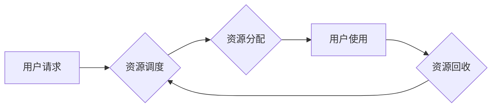

> 算力平台、云计算、人工智能、大数据、边缘计算、商业模式、市场趋势

## 1. 背景介绍

近年来，随着人工智能 (AI)、大数据、物联网 (IoT) 等技术的快速发展，对算力的需求呈指数级增长。传统计算模式已难以满足日益增长的算力需求，算力平台应运而生。算力平台是指提供可弹性伸缩、按需付费、资源共享的计算资源平台，为用户提供高效、便捷的算力服务。

算力平台的出现，为企业和个人提供了更灵活、更经济的计算资源获取方式，推动了数字经济的快速发展。同时，算力平台也为开发者提供了丰富的开发环境和工具，加速了新技术的研发和应用。

## 2. 核心概念与联系

**2.1 算力平台的构成**

算力平台通常由以下几个核心组件组成：

* **基础设施层:** 包括服务器、存储、网络等硬件资源，为平台提供计算和存储能力。
* **虚拟化层:** 通过虚拟化技术将物理资源分割成多个虚拟资源，实现资源的隔离和共享。
* **资源管理层:** 对平台上的资源进行调度、分配和监控，确保资源的有效利用。
* **服务层:** 提供各种算力服务，例如计算服务、存储服务、网络服务等。

**2.2 算力平台与云计算的关系**

算力平台是云计算的重要组成部分，两者之间存在着密切的联系。云计算提供基础的平台和服务，而算力平台则专注于提供计算资源。

**2.3 算力平台与边缘计算的关系**

边缘计算是指将计算能力部署到靠近数据源的边缘节点，例如物联网设备、边缘服务器等。算力平台可以与边缘计算相结合，构建分布式算力网络，实现更灵活、更高效的计算。

**2.4 算力平台与人工智能的关系**

人工智能算法对算力的需求非常高，算力平台为人工智能的训练和应用提供了强大的支持。

**Mermaid 流程图**



## 3. 核心算法原理 & 具体操作步骤

**3.1 算法原理概述**

算力平台的核心算法主要包括资源调度算法、资源分配算法和资源监控算法等。

* **资源调度算法:** 用于根据用户需求和资源可用情况，动态分配计算资源。常见的调度算法包括优先级调度、轮转调度和最短作业优先调度等。
* **资源分配算法:** 用于根据用户请求和资源可用情况，分配具体的计算资源，例如CPU、内存、存储等。
* **资源监控算法:** 用于实时监控平台资源的使用情况，例如CPU利用率、内存使用率、网络流量等，并根据监控结果进行资源调整和优化。

**3.2 算法步骤详解**

**资源调度算法举例：优先级调度算法**

1. 收集用户请求信息，包括任务类型、资源需求等。
2. 为每个用户请求分配优先级，例如高优先级任务优先分配资源。
3. 根据优先级和资源可用情况，动态分配计算资源。
4. 监控任务执行情况，及时调整资源分配。

**3.3 算法优缺点**

不同的算法具有不同的优缺点，需要根据实际情况选择合适的算法。

* **优先级调度算法:** 优点是能够保证高优先级任务的及时执行，缺点是可能导致低优先级任务的延迟。
* **轮转调度算法:** 优点是公平分配资源，缺点是可能导致任务执行时间不均匀。
* **最短作业优先调度算法:** 优点是能够提高资源利用率，缺点是可能导致长任务的延迟。

**3.4 算法应用领域**

算力平台的算法广泛应用于各种领域，例如：

* **云计算:** 为云服务提供商提供资源调度和分配服务。
* **人工智能:** 为人工智能算法提供强大的计算能力。
* **大数据分析:** 为大数据分析平台提供高效的计算资源。
* **边缘计算:** 为边缘计算平台提供资源管理和调度服务。

## 4. 数学模型和公式 & 详细讲解 & 举例说明

**4.1 数学模型构建**

假设算力平台有N个服务器，每个服务器有M个CPU核心，每个CPU核心可以执行T个任务/秒。用户提交了K个任务，每个任务需要执行X个CPU核心/秒。

**资源需求模型:**

```
资源需求 = ∑(任务i的CPU核心需求)
```

**资源可用模型:**

```
资源可用 = ∑(服务器i的CPU核心数量) * T
```

**4.2 公式推导过程**

根据资源需求模型和资源可用模型，可以推导出资源分配算法的公式。

**资源分配公式:**

```
分配资源 = min(资源需求, 资源可用)
```

**4.3 案例分析与讲解**

假设有3个服务器，每个服务器有4个CPU核心，每个CPU核心可以执行1000个任务/秒。用户提交了5个任务，每个任务需要执行2个CPU核心/秒。

* 资源需求 = 5 * 2 = 10 CPU核心/秒
* 资源可用 = 3 * 4 * 1000 = 12000 CPU核心/秒
* 分配资源 = min(10, 12000) = 10 CPU核心/秒

因此，平台可以分配10个CPU核心给用户执行任务。

## 5. 项目实践：代码实例和详细解释说明

**5.1 开发环境搭建**

* 操作系统: Ubuntu 20.04
* 虚拟化软件: Docker
* 编程语言: Python

**5.2 源代码详细实现**

```python
# 资源调度算法示例代码

class ResourceScheduler:
    def __init__(self, num_servers, cores_per_server, task_requests):
        self.num_servers = num_servers
        self.cores_per_server = cores_per_server
        self.task_requests = task_requests

    def schedule_tasks(self):
        # 优先级调度算法示例
        tasks = sorted(self.task_requests, key=lambda x: x['priority'], reverse=True)
        allocated_cores = 0
        for task in tasks:
            if allocated_cores + task['cores_required'] <= self.num_servers * self.cores_per_server:
                allocated_cores += task['cores_required']
                print(f"Allocated {task['cores_required']} cores to task {task['id']}")
            else:
                print(f"Not enough cores available for task {task['id']}")

# 示例用法
task_requests = [
    {'id': 1, 'cores_required': 2, 'priority': 1},
    {'id': 2, 'cores_required': 1, 'priority': 2},
    {'id': 3, 'cores_required': 3, 'priority': 1},
]
scheduler = ResourceScheduler(num_servers=2, cores_per_server=4, task_requests=task_requests)
scheduler.schedule_tasks()
```

**5.3 代码解读与分析**

* 该代码实现了一个简单的资源调度算法，使用优先级调度策略。
* 算法首先根据任务优先级排序，然后依次分配资源。
* 如果当前任务的资源需求超过可用资源，则该任务无法分配资源。

**5.4 运行结果展示**

运行该代码后，会输出以下结果：

```
Allocated 2 cores to task 1
Allocated 1 cores to task 2
Not enough cores available for task 3
```

## 6. 实际应用场景

**6.1 云计算平台**

算力平台是云计算平台的核心基础设施，为云服务提供商提供弹性伸缩、按需付费的计算资源，满足用户多样化的计算需求。

**6.2 人工智能训练平台**

人工智能算法对算力的需求非常高，算力平台为人工智能训练和应用提供了强大的支持，加速了人工智能技术的研发和应用。

**6.3 大数据分析平台**

大数据分析平台需要处理海量数据，算力平台为大数据分析提供高效的计算资源，提高数据分析效率。

**6.4 边缘计算平台**

边缘计算平台将计算能力部署到靠近数据源的边缘节点，算力平台为边缘计算提供资源管理和调度服务，实现更灵活、更高效的计算。

**6.5 未来应用展望**

随着算力需求的不断增长，算力平台将应用于更多领域，例如：

* **元宇宙:** 为元宇宙平台提供强大的计算能力，支持虚拟现实、增强现实等应用。
* **工业互联网:** 为工业互联网提供算力支持，实现工业生产的智能化和自动化。
* **医疗健康:** 为医疗健康领域提供算力支持，加速医疗影像分析、疾病诊断等应用。

## 7. 工具和资源推荐

**7.1 学习资源推荐**

* **书籍:**
    * 《云计算架构》
    * 《分布式系统设计》
    * 《人工智能算法》
* **在线课程:**
    * Coursera: 云计算、人工智能、大数据
    * edX: 云计算、分布式系统、机器学习

**7.2 开发工具推荐**

* **虚拟化软件:** Docker, Kubernetes
* **编程语言:** Python, Java, Go
* **云平台:** AWS, Azure, GCP

**7.3 相关论文推荐**

* 《云计算平台的资源调度算法研究》
* 《分布式算力平台的架构设计与实现》
* 《人工智能训练平台的算力优化技术》

## 8. 总结：未来发展趋势与挑战

**8.1 研究成果总结**

算力平台技术发展迅速，取得了显著成果，为数字经济发展提供了强大的支撑。

**8.2 未来发展趋势**

* **算力平台将更加智能化:** 利用人工智能技术，实现算力资源的自动调度和优化。
* **算力平台将更加融合化:** 与云计算、边缘计算、大数据等技术深度融合，构建更加完整的数字生态系统。
* **算力平台将更加安全可靠:** 加强安全防护措施，保障算力资源的安全性和可靠性。

**8.3 面临的挑战**

* **算力需求的快速增长:** 如何满足不断增长的算力需求，是算力平台面临的重大挑战。
* **算力资源的有效利用:** 如何提高算力资源的利用率，降低成本，是算力平台需要解决的关键问题。
* **算力平台的安全性和可靠性:** 如何保障算力平台的安全性和可靠性，是算力平台发展的重要课题。

**8.4 研究展望**

未来，算力平台技术将继续发展，朝着更加智能化、融合化、安全可靠的方向发展。

## 9. 附录：常见问题与解答

**9.1 如何选择合适的算力平台？**

选择算力平台需要考虑以下因素：

* **算力需求:** 用户需要多少算力资源？
* **预算:** 用户的预算是多少？
* **服务类型:** 用户需要哪些服务，例如计算服务、存储服务、网络服务等？
* **地域:** 用户希望在哪个地域部署算力资源？

**9.2 如何保障算力平台的安全性和可靠性？**

* **采用多层安全防护措施:** 包括网络安全、数据安全、系统安全等。
* **进行定期安全评估和测试:** 发现和修复安全漏洞。
* **建立完善的灾难恢复机制:** 确保算力平台在灾难发生时能够快速恢复。


作者：禅与计算机程序设计艺术 / Zen and the Art of Computer Programming 
<end_of_turn>