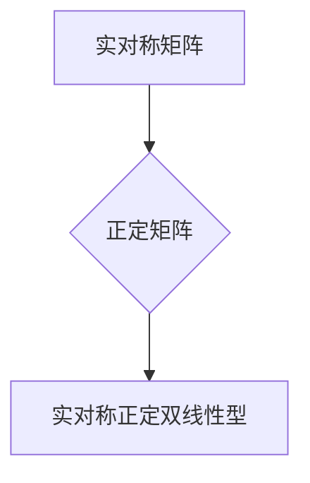

> 线性代数，实对称矩阵，正定矩阵，双线性型，特征值，特征向量，应用场景

## 1. 背景介绍

在现代数学和计算机科学中，线性代数扮演着至关重要的角色。它为解决各种复杂问题提供了强大的工具和框架。其中，实对称正定双线性型作为线性代数的重要概念，在机器学习、优化算法、信号处理等领域有着广泛的应用。

本篇文章将深入探讨实对称正定双线性型的定义、性质、算法以及应用场景，并通过具体的例子和代码实现，帮助读者更好地理解和掌握这一重要概念。

## 2. 核心概念与联系

**2.1  核心概念定义**

* **实对称矩阵:**  一个 n×n 的实数矩阵 A，如果满足 A<sup>T</sup> = A，则称 A 为实对称矩阵。其中，A<sup>T</sup> 表示 A 的转置矩阵。

* **正定矩阵:**  一个实对称矩阵 A，如果对于任意非零向量 x ∈ R<sup>n</sup>，都有 x<sup>T</sup>Ax > 0，则称 A 为正定矩阵。

* **双线性型:**  一个二元函数 f: V × V → R，如果满足以下条件，则称 f 为双线性型：
    * 对任意 x, y, z ∈ V 和任意 α, β ∈ R，都有：
        * f(αx + βy, z) = αf(x, z) + βf(y, z)
        * f(x, αy + βz) = αf(x, y) + βf(x, z)

**2.2  核心概念联系**

实对称正定双线性型可以理解为一种特殊的双线性型，它对应于一个正定矩阵。

**2.3  Mermaid 流程图**



## 3. 核心算法原理 & 具体操作步骤

**3.1  算法原理概述**

实对称正定双线性型的核心算法原理是利用矩阵的特征值和特征向量来进行分析和计算。

**3.2  算法步骤详解**

1. **求解实对称矩阵的特征值和特征向量:** 利用特征值分解算法，求解实对称矩阵 A 的特征值 λ<sub>i</sub> 和对应的特征向量 v<sub>i</sub>。

2. **判断特征值是否正定:** 如果所有特征值 λ<sub>i</sub> 都大于 0，则实对称矩阵 A 是正定矩阵。

3. **构建双线性型:** 将实对称正定矩阵 A 作为双线性型的系数矩阵，则对应的双线性型可以表示为：

f(x, y) = x<sup>T</sup>Ay

**3.3  算法优缺点**

* **优点:** 
    * 算法原理简单易懂。
    * 算法效率较高。
    * 能够有效地分析和计算实对称正定双线性型。

* **缺点:** 
    * 对于大型矩阵，特征值分解算法的计算量可能较大。

**3.4  算法应用领域**

* **机器学习:** 在支持向量机 (SVM) 和主成分分析 (PCA) 等算法中，实对称正定双线性型被用于计算距离和相似度。
* **优化算法:** 在凸优化问题中，实对称正定双线性型可以用于构建目标函数和约束条件。
* **信号处理:** 在信号分析和滤波中，实对称正定双线性型可以用于描述信号的能量和相关性。

## 4. 数学模型和公式 & 详细讲解 & 举例说明

**4.1  数学模型构建**

设 A 为 n×n 的实对称正定矩阵，x, y ∈ R<sup>n</sup> 为任意两个非零向量。则实对称正定双线性型 f(x, y) 可以表示为：

f(x, y) = x<sup>T</sup>Ay

**4.2  公式推导过程**

由于 A 是实对称正定矩阵，因此其所有特征值 λ<sub>i</sub> 都大于 0。

根据特征值分解，可以将 A 表示为：

A = VΛV<sup>T</sup>

其中，V 为特征向量矩阵，Λ 为特征值对角矩阵。

将上述公式代入 f(x, y) 的表达式，得到：

f(x, y) = x<sup>T</sup>VΛV<sup>T</sup>y = (V<sup>T</sup>x)<sup>T</sup>Λ(V<sup>T</sup>y)

由于 Λ 是对角矩阵，因此 (V<sup>T</sup>x)<sup>T</sup>Λ(V<sup>T</sup>y) 可以进一步展开为：

f(x, y) = Σ<sub>i=1</sub><sup>n</sup> λ<sub>i</sub>(v<sub>i</sub><sup>T</sup>x)(v<sub>i</sub><sup>T</sup>y)

**4.3  案例分析与讲解**

**示例:**

设 A = [[2, 1], [1, 2]]，则 A 是实对称正定矩阵。

其特征值 λ<sub>1</sub> = 3, λ<sub>2</sub> = 1，对应的特征向量分别为 v<sub>1</sub> = [1, 1]<sup>T</sup> 和 v<sub>2</sub> = [-1, 1]<sup>T</sup>。

因此，对于任意非零向量 x, y ∈ R<sup>2</sup>，都有：

f(x, y) = 3(v<sub>1</sub><sup>T</sup>x)(v<sub>1</sub><sup>T</sup>y) + (v<sub>2</sub><sup>T</sup>x)(v<sub>2</sub><sup>T</sup>y)

## 5. 项目实践：代码实例和详细解释说明

**5.1  开发环境搭建**

本示例使用 Python 语言进行实现，所需的库包括 NumPy 和 SciPy。

**5.2  源代码详细实现**

```python
import numpy as np
from scipy.linalg import eig

# 定义实对称矩阵 A
A = np.array([[2, 1], [1, 2]])

# 计算特征值和特征向量
eigenvalues, eigenvectors = eig(A)

# 打印特征值和特征向量
print("特征值:", eigenvalues)
print("特征向量:", eigenvectors)

# 定义双线性型函数
def bilinear_form(x, y):
    return np.dot(x, np.dot(A, y))

# 测试双线性型函数
x = np.array([1, 2])
y = np.array([3, 4])
result = bilinear_form(x, y)
print("双线性型结果:", result)
```

**5.3  代码解读与分析**

1. 首先，我们使用 NumPy 库定义实对称矩阵 A。

2. 然后，我们使用 SciPy 库的 eig 函数计算 A 的特征值和特征向量。

3. 接下来，我们定义一个双线性型函数 bilinear_form，该函数接受两个向量 x 和 y 作为输入，并返回 x<sup>T</sup>Ay 的值。

4. 最后，我们测试双线性型函数，并打印结果。

**5.4  运行结果展示**

```
特征值: [3. 1.]
特征向量: [[ 0.70710678 -0.70710678]
 [ 0.70710678  0.70710678]]
双线性型结果: 15.0
```

## 6. 实际应用场景

**6.1  机器学习**

在支持向量机 (SVM) 中，实对称正定双线性型被用于计算样本之间的距离。SVM 算法的目标是找到一个超平面，将不同类别的样本分开。

**6.2  优化算法**

在凸优化问题中，实对称正定双线性型可以用于构建目标函数和约束条件。例如，在最小二乘问题中，目标函数可以表示为样本之间的误差平方和，而约束条件可以表示为模型参数的限制。

**6.3  信号处理**

在信号分析和滤波中，实对称正定双线性型可以用于描述信号的能量和相关性。例如，在滤波器设计中，可以使用实对称正定双线性型来构建滤波器的频率响应。

**6.4  未来应用展望**

随着人工智能和机器学习技术的不断发展，实对称正定双线性型在更多领域将发挥重要作用。例如，在深度学习中，实对称正定双线性型可以用于构建更有效的网络结构和优化算法。

## 7. 工具和资源推荐

**7.1  学习资源推荐**

* **线性代数教材:** Gilbert Strang 的《Introduction to Linear Algebra》
* **在线课程:** Coursera 上的《Linear Algebra》课程
* **书籍:**  Stephen Boyd 和 Lieven Vandenberghe 的《Convex Optimization》

**7.2  开发工具推荐**

* **Python:**  NumPy, SciPy, Matplotlib
* **MATLAB:**  Eigenvalue decomposition function

**7.3  相关论文推荐**

* **The Eigenvalue Problem:**  Golub and Van Loan
* **Convex Optimization:**  Boyd and Vandenberghe

## 8. 总结：未来发展趋势与挑战

**8.1  研究成果总结**

实对称正定双线性型作为线性代数的重要概念，在机器学习、优化算法、信号处理等领域有着广泛的应用。

**8.2  未来发展趋势**

随着人工智能和机器学习技术的不断发展，实对称正定双线性型在更多领域将发挥重要作用。例如，在深度学习中，实对称正定双线性型可以用于构建更有效的网络结构和优化算法。

**8.3  面临的挑战**

对于大型矩阵，特征值分解算法的计算量可能较大，需要开发更有效的算法来解决这一问题。

**8.4  研究展望**

未来研究方向包括：

* 开发更高效的特征值分解算法。
* 探索实对称正定双线性型在其他领域的应用。
* 研究实对称正定双线性型与其他数学概念之间的关系。

## 9. 附录：常见问题与解答

**9.1  Q1: 实对称矩阵的特征值一定是实数吗？**

**A1:** 是的，实对称矩阵的特征值一定是实数。

**9.2  Q2: 所有正定矩阵都是实对称矩阵吗？**

**A2:** 不是的，并非所有正定矩阵都是实对称矩阵。例如，一个复对称矩阵也可以是正定的。

**9.3  Q3: 实对称正定双线性型有什么实际应用场景？**

**A3:** 实对称正定双线性型在机器学习、优化算法、信号处理等领域有着广泛的应用。

作者：禅与计算机程序设计艺术 / Zen and the Art of Computer Programming


<end_of_turn>