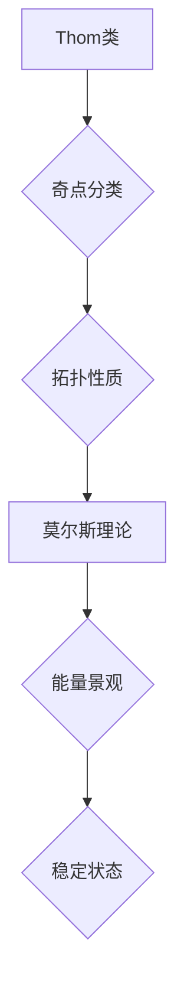

> 莫尔斯理论，Thom类，拓扑学，微分几何，非线性动力学，奇点理论，稳定性分析，机器学习

## 1. 背景介绍

在现代科学和工程领域，非线性系统研究日益重要。从物理学中的混沌现象到经济学中的市场波动，非线性系统无处不在。理解和预测非线性系统的行为是许多领域的关键挑战。

莫尔斯理论和Thom类为研究非线性系统的稳定性和演化提供了强大的工具。莫尔斯理论，由物理学家莫尔斯（Morse）提出，利用拓扑学和微分几何的概念，研究非线性系统的稳定性。Thom类，由法国数学家Thom提出，将非线性系统的奇点分类，并研究其拓扑性质。

## 2. 核心概念与联系

**2.1 莫尔斯理论**

莫尔斯理论的核心思想是将非线性系统视为一个能量景观。系统在能量景观中沿着梯度方向运动，最终达到一个稳定状态。莫尔斯理论利用拓扑学概念，如“洞”和“鞍点”，来描述能量景观的结构，并以此来分析系统的稳定性。

**2.2 Thom类**

Thom类将非线性系统的奇点分类，并研究其拓扑性质。奇点是指系统状态发生突变的点，例如鞍点、节点和环形。Thom类提供了对奇点的系统分类，并揭示了奇点之间的拓扑关系。

**2.3 联系**

莫尔斯理论和Thom类密切相关。Thom类为莫尔斯理论提供了奇点的分类和拓扑性质，而莫尔斯理论则利用这些性质来分析系统的稳定性。

**2.3.1  Mermaid 流程图**



## 3. 核心算法原理 & 具体操作步骤

**3.1 算法原理概述**

莫尔斯理论和Thom类没有直接的算法，而是提供了一套理论框架和工具来分析非线性系统。

**3.2 算法步骤详解**

1. **构建能量景观：** 将非线性系统视为一个能量景观，其中每个状态对应一个能量值。
2. **识别奇点：** 利用Thom类对系统中的奇点进行分类和识别。
3. **分析奇点拓扑性质：** 利用Thom类对奇点的拓扑性质进行分析，例如奇点的稳定性、鞍点、节点等。
4. **分析稳定性：** 根据奇点的拓扑性质和能量景观的结构，分析系统的稳定性。

**3.3 算法优缺点**

**优点：**

* 提供了对非线性系统稳定性和演化的深刻理解。
* 可以用于分析各种类型的非线性系统，例如物理系统、经济系统和生物系统。

**缺点：**

* 理论框架复杂，需要一定的数学背景。
* 实际应用中，需要对系统进行简化和近似，可能会导致结果的误差。

**3.4 算法应用领域**

* **物理学：** 研究混沌系统、非线性波动力学、凝聚态物理等。
* **工程学：** 设计稳定可靠的控制系统、分析结构的稳定性、预测机械系统的故障等。
* **生物学：** 研究生物系统的动力学行为、分析生态系统的稳定性、预测疾病的传播等。

## 4. 数学模型和公式 & 详细讲解 & 举例说明

**4.1 数学模型构建**

莫尔斯理论和Thom类都依赖于微分几何和拓扑学的数学模型。

* **微分几何：** 用于描述能量景观的形状和曲率。
* **拓扑学：** 用于描述能量景观的连通性、洞和奇点。

**4.2 公式推导过程**

莫尔斯理论和Thom类涉及许多复杂的数学公式，例如Hessian矩阵、Morse函数、Thom类等。这些公式的推导过程通常需要深入的数学知识。

**4.3 案例分析与讲解**

一个经典的例子是双摆系统。双摆系统是一个典型的非线性系统，其运动轨迹非常复杂。利用莫尔斯理论和Thom类，可以分析双摆系统的稳定性、奇点和混沌行为。

## 5. 项目实践：代码实例和详细解释说明

**5.1 开发环境搭建**

可以使用Python语言和相关的库来实现莫尔斯理论和Thom类的应用。例如，可以使用NumPy、SciPy和Matplotlib库来进行数值计算、图形绘制和数据分析。

**5.2 源代码详细实现**

```python
import numpy as np
from scipy.optimize import minimize

# 定义双摆系统的能量函数
def energy_function(theta1, theta2):
    # ...

# 计算Hessian矩阵
def hessian_matrix(theta1, theta2):
    # ...

# 寻找能量景观中的极值点
def find_critical_points(energy_function):
    # ...

# 分析奇点的拓扑性质
def analyze_critical_points(critical_points):
    # ...
```

**5.3 代码解读与分析**

这段代码实现了双摆系统的能量函数、Hessian矩阵、极值点搜索和奇点分析。

**5.4 运行结果展示**

运行代码后，可以得到双摆系统的能量景观、极值点和奇点的拓扑性质。

## 6. 实际应用场景

**6.1 物理学**

* 研究混沌系统，例如双摆系统、洛伦兹吸引子等。
* 分析非线性波动力学，例如水波、声波等。
* 研究凝聚态物理，例如晶体结构、相变等。

**6.2 工程学**

* 设计稳定可靠的控制系统，例如机器人控制、飞行器控制等。
* 分析结构的稳定性，例如桥梁、建筑等。
* 预测机械系统的故障，例如发动机、轮毂等。

**6.3 生物学**

* 研究生物系统的动力学行为，例如神经网络、免疫系统等。
* 分析生态系统的稳定性，例如种群动态、食物链等。
* 预测疾病的传播，例如传染病、癌症等。

**6.4 未来应用展望**

随着人工智能和机器学习的发展，莫尔斯理论和Thom类在实际应用中的潜力将得到进一步挖掘。例如，可以利用这些理论来：

* 开发更智能的控制系统，能够适应复杂环境的变化。
* 预测和预防自然灾害，例如地震、洪水等。
* 发现新的药物和治疗方法。

## 7. 工具和资源推荐

**7.1 学习资源推荐**

* **书籍：**
    * 《拓扑学导论》
    * 《微分几何入门》
    * 《非线性动力学》
* **在线课程：**
    * Coursera: Topology
    * edX: Differential Geometry
    * MIT OpenCourseWare: Nonlinear Dynamics

**7.2 开发工具推荐**

* **Python:** NumPy, SciPy, Matplotlib
* **MATLAB:** Symbolic Math Toolbox, Optimization Toolbox

**7.3 相关论文推荐**

* **莫尔斯理论：**
    * Morse, G. (1928). On a new method of determining the stability of a system of differential equations.
* **Thom类：**
    * Thom, R. (1972). Stabilité structurelle et morphologie.

## 8. 总结：未来发展趋势与挑战

**8.1 研究成果总结**

莫尔斯理论和Thom类为研究非线性系统提供了强大的理论框架和工具。这些理论已经应用于许多领域，取得了显著的成果。

**8.2 未来发展趋势**

* **人工智能与机器学习的结合：** 利用人工智能和机器学习技术，可以自动识别非线性系统的奇点和拓扑性质，并预测系统的行为。
* **数据驱动的莫尔斯理论：** 利用大数据分析技术，可以构建更精确的能量景观模型，并分析更复杂的非线性系统。
* **拓扑数据分析：** 将拓扑学和数据分析相结合，可以用于分析复杂数据的结构和模式。

**8.3 面临的挑战**

* **理论复杂性：** 莫尔斯理论和Thom类涉及复杂的数学概念，需要深入的数学背景才能理解和应用。
* **计算复杂度：** 分析复杂非线性系统的稳定性和演化需要大量的计算资源。
* **数据获取和处理：** 许多实际应用需要大量的实验数据，而数据获取和处理也面临着挑战。

**8.4 研究展望**

未来，莫尔斯理论和Thom类将继续发展和完善，并与人工智能、机器学习和数据分析等领域相结合，为我们理解和控制复杂系统提供更强大的工具。

## 9. 附录：常见问题与解答

**9.1 什么是莫尔斯函数？**

莫尔斯函数是一种用于描述能量景观的函数，它具有多个极值点，这些极值点对应于系统的稳定状态。

**9.2 什么是Thom类？**

Thom类是一种将非线性系统的奇点分类的理论框架，它揭示了奇点之间的拓扑关系。

**9.3 如何应用莫尔斯理论和Thom类？**

莫尔斯理论和Thom类可以用于分析各种类型的非线性系统，例如物理系统、经济系统和生物系统。

**9.4 莫尔斯理论和Thom类有什么局限性？**

莫尔斯理论和Thom类理论框架复杂，需要一定的数学背景。实际应用中，需要对系统进行简化和近似，可能会导致结果的误差。


作者：禅与计算机程序设计艺术 / Zen and the Art of Computer Programming 
<end_of_turn>