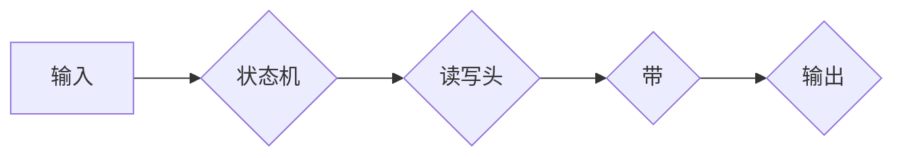

> 图灵机，可计算数，计算理论，算法，逻辑，数学模型，图灵完备性

## 1. 背景介绍

20世纪30年代，计算机科学正处于萌芽阶段。人们对计算的本质和可能性充满了好奇和探索。在这个背景下，英国数学家艾伦·图灵（Alan Turing）提出了一个革命性的概念——图灵机。图灵机是一种抽象的计算模型，它以简洁的规则描述了计算过程，为我们理解计算的本质提供了全新的视角。

图灵机的诞生标志着计算理论的诞生，它为计算机科学的发展奠定了坚实的基础。图灵机的概念不仅深刻地影响了计算机科学的发展，也对哲学、数学和人工智能等领域产生了深远的影响。

## 2. 核心概念与联系

图灵机是一个抽象的计算模型，它由以下几个核心部件组成：

* **无限长的带**:  存储数据的介质，可以看作是计算机的内存。
* **读写头**:  负责读取和写入带上的数据。
* **状态机**:  控制读写头的动作，并根据当前状态和读取到的数据决定下一步的操作。

图灵机的运作方式是通过一系列的规则来实现的。状态机根据当前状态和读取到的数据，决定下一步读写头的动作（移动到下一个位置，写入数据，读取数据等），并改变自身的状态。

图灵机的核心概念是“可计算数”。可计算数是指可以通过图灵机在有限时间内计算出的所有数字。图灵机能够模拟任何算法，因此，任何可以通过算法计算出的数字都是可计算数。

**Mermaid 流程图**



## 3. 核心算法原理 & 具体操作步骤

### 3.1  算法原理概述

图灵机的算法原理基于状态机和规则的组合。状态机负责控制计算过程，而规则则规定了在不同状态下，根据不同的输入数据，读写头应该执行哪些操作。

图灵机的算法本质上是一种符号转换过程。它通过一系列的规则，将输入数据逐步转换，最终得到输出结果。

### 3.2  算法步骤详解

1. **初始化**: 将输入数据加载到带上，并将状态机置于初始状态。
2. **循环**: 
    * 状态机读取带上的数据。
    * 根据当前状态和读取到的数据，状态机查找相应的规则。
    * 根据规则，状态机决定读写头的动作（移动、写入、读取）和下一个状态。
    * 执行读写头的动作，并更新带上的数据。
    * 重复上述步骤，直到状态机进入终止状态。
3. **输出**: 从带子上读取输出数据。

### 3.3  算法优缺点

**优点**:

* **通用性**: 图灵机能够模拟任何算法，因此具有很强的通用性。
* **简洁性**: 图灵机的规则非常简洁，易于理解和实现。
* **完备性**: 图灵机能够计算所有可计算数，这意味着它能够解决所有能够通过算法解决的问题。

**缺点**:

* **效率**: 图灵机的计算效率通常不如实际计算机。
* **复杂性**: 对于复杂的算法，图灵机的规则可能非常复杂。

### 3.4  算法应用领域

图灵机的概念对计算机科学的发展产生了深远的影响，它为以下领域提供了理论基础：

* **计算机体系结构**: 图灵机的概念帮助人们理解计算机的本质，并设计出更有效的计算机体系结构。
* **编程语言**: 图灵机的概念为编程语言的设计提供了理论基础，例如，图灵完备性是衡量编程语言能力的重要标准。
* **人工智能**: 图灵机的概念为人工智能的研究提供了理论基础，例如，图灵测试被用来评估人工智能系统的智能程度。

## 4. 数学模型和公式 & 详细讲解 & 举例说明

### 4.1  数学模型构建

图灵机的数学模型可以描述为一个五元组：

* **Q**: 状态集合
* **Σ**: 输入符号集合
* **Γ**: 带符号集合
* **δ**: 转移函数
* **q0**: 初始状态

其中，转移函数 δ(q, a) 定义了在状态 q 下，读取符号 a 时，状态机应该执行的操作，包括：

* 新状态
* 写入符号
* 移动方向

### 4.2  公式推导过程

图灵机的计算过程可以看作是一个状态转移的过程。我们可以用数学公式来描述状态转移：

```
q_t+1 = δ(q_t, a_t)
```

其中：

* q_t 表示当前状态
* a_t 表示当前读取的符号
* q_t+1 表示下一个状态

### 4.3  案例分析与讲解

例如，假设我们有一个简单的图灵机，它用来识别偶数。

* 状态集合 Q = {q0, q1}
* 输入符号集合 Σ = {0, 1}
* 带符号集合 Γ = {0, 1, B} (B 表示空白符号)
* 转移函数 δ 定义如下：

```
δ(q0, 0) = (q0, 0, R)
δ(q0, 1) = (q1, 1, R)
δ(q1, 0) = (q1, 0, R)
δ(q1, 1) = (q1, 1, R)
δ(q0, B) = (q2, B, R)
```

其中，R 表示向右移动。

当输入为偶数时，图灵机会一直向右移动，直到遇到空白符号，然后进入终止状态 q2。

## 5. 项目实践：代码实例和详细解释说明

### 5.1  开发环境搭建

为了实现图灵机的模拟，我们可以使用 Python 语言进行编程。

需要安装 Python 语言环境和必要的库，例如：

* Python 3.x
* NumPy

### 5.2  源代码详细实现

```python
class TuringMachine:
    def __init__(self, states, alphabet, tape, transition_function, initial_state):
        self.states = states
        self.alphabet = alphabet
        self.tape = tape
        self.transition_function = transition_function
        self.current_state = initial_state
        self.head_position = 0

    def step(self):
        current_symbol = self.tape[self.head_position]
        next_state, next_symbol, direction = self.transition_function(self.current_state, current_symbol)
        self.tape[self.head_position] = next_symbol
        self.current_state = next_state
        if direction == 'R':
            self.head_position += 1
        elif direction == 'L':
            self.head_position -= 1

    def run(self):
        while self.current_state != 'halt':
            self.step()

# 示例代码
states = ['q0', 'q1', 'halt']
alphabet = ['0', '1']
tape = ['0'] * 100
transition_function = {
    ('q0', '0'): ('q0', '0', 'R'),
    ('q0', '1'): ('q1', '1', 'R'),
    ('q1', '0'): ('q1', '0', 'R'),
    ('q1', '1'): ('q1', '1', 'R'),
    ('q0', 'B'): ('halt', 'B', 'R'),
}
initial_state = 'q0'
tm = TuringMachine(states, alphabet, tape, transition_function, initial_state)
tm.run()
print(tm.tape)
```

### 5.3  代码解读与分析

这段代码实现了图灵机的基本功能。

* `TuringMachine` 类定义了图灵机的状态、符号、带、转移函数和当前状态等属性。
* `step()` 方法模拟了图灵机的单步计算过程。
* `run()` 方法模拟了图灵机的运行过程，直到进入终止状态。

### 5.4  运行结果展示

运行这段代码后，会输出一个包含偶数的带。

## 6. 实际应用场景

图灵机的概念在实际应用中也具有重要的意义。

* **计算机科学教育**: 图灵机是计算机科学教育中一个重要的概念，它帮助学生理解计算的本质和算法的原理。
* **软件测试**: 图灵机可以用来模拟软件的运行过程，帮助测试人员发现软件中的错误。
* **人工智能研究**: 图灵机的概念为人工智能研究提供了理论基础，例如，图灵测试被用来评估人工智能系统的智能程度。

### 6.4  未来应用展望

随着计算机科学的发展，图灵机的概念将继续发挥重要作用。

* **量子计算**: 图灵机的概念可以推广到量子计算领域，帮助人们理解量子计算的原理和潜力。
* **神经网络**: 图灵机的概念可以用来分析和理解神经网络的运作机制。
* **可解释人工智能**: 图灵机的概念可以用来提高人工智能的可解释性，帮助人们理解人工智能的决策过程。

## 7. 工具和资源推荐

### 7.1  学习资源推荐

* **《计算理论导论》**:  
* **《图灵完备性》**:  
* **《人工智能：现代方法》**:  

### 7.2  开发工具推荐

* **Python**:  
* **Jupyter Notebook**:  

### 7.3  相关论文推荐

* **Alan Turing, On Computable Numbers, with an Application to the Entscheidungsproblem (1936)**
* **John von Neumann, First Draft of a Report on the EDVAC (1945)**
* **Church-Turing thesis**:  

## 8. 总结：未来发展趋势与挑战

### 8.1  研究成果总结

图灵机的概念为计算机科学的发展奠定了坚实的基础，它不仅帮助人们理解计算的本质，也为人工智能、软件测试等领域提供了理论基础。

### 8.2  未来发展趋势

图灵机的概念将继续在未来发展趋势中发挥重要作用，例如：

* **量子计算**: 图灵机的概念可以推广到量子计算领域，帮助人们理解量子计算的原理和潜力。
* **神经网络**: 图灵机的概念可以用来分析和理解神经网络的运作机制。
* **可解释人工智能**: 图灵机的概念可以用来提高人工智能的可解释性，帮助人们理解人工智能的决策过程。

### 8.3  面临的挑战

图灵机的概念也面临着一些挑战，例如：

* **复杂性**: 对于复杂的算法，图灵机的规则可能非常复杂，难以理解和实现。
* **效率**: 图灵机的计算效率通常不如实际计算机。
* **可解释性**: 图灵机的计算过程是高度抽象的，难以解释其决策过程。

### 8.4  研究展望

未来，研究人员将继续探索图灵机的概念，试图克服其面临的挑战，并将其应用于更广泛的领域。

## 9. 附录：常见问题与解答

**常见问题**:

* 图灵机和计算机的区别是什么？
* 图灵机的计算能力有多强？
* 图灵机的应用场景有哪些？

**解答**:

* 图灵机是一种抽象的计算模型，而计算机是具体的硬件设备。图灵机能够模拟任何算法，而计算机的计算能力受限于其硬件配置。
* 图灵机的计算能力非常强大，它能够计算所有可计算数。
* 图灵机的应用场景非常广泛，例如计算机科学教育、软件测试、人工智能研究等。


作者：禅与计算机程序设计艺术 / Zen and the Art of Computer Programming 
<end_of_turn>