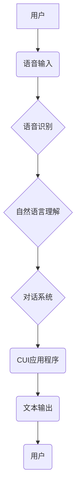

> 语音助手、CUI、自然语言理解、语音识别、对话系统、用户体验

## 1. 背景介绍

随着人工智能技术的飞速发展，语音助手技术已成为智能设备和应用的重要组成部分。从智能手机的语音助手Siri和Google Assistant到智能家居设备的语音控制，语音助手已深入人们的生活，为用户提供便捷、高效的交互方式。

传统的命令行界面（CLI）和图形用户界面（GUI）存在一定的局限性，例如操作复杂、学习成本高、用户体验差等。而语音助手技术则能够突破这些局限性，通过语音交互，实现更自然、更直观的用户体验。

CUI（命令行界面）作为一种文本交互方式，在某些场景下仍然具有其独特的优势，例如：

* **效率高：** CUI操作简洁，可以快速完成任务。
* **可定制性强：** 用户可以自定义命令和脚本，提高工作效率。
* **跨平台性好：** CUI应用程序通常可以在不同的操作系统上运行。

然而，CUI的学习曲线相对陡峭，操作方式也较为繁琐，这限制了其在一些场景下的应用。

语音助手技术可以与CUI相结合，为用户提供更便捷、更直观的交互方式。通过语音识别和自然语言理解技术，用户可以利用语音指令控制CUI应用程序，实现更轻松、更高效的交互体验。

## 2. 核心概念与联系

**2.1 语音助手技术**

语音助手技术是指利用语音识别、自然语言理解、对话系统等技术，实现人机语音交互的系统。其核心功能包括：

* **语音识别：** 将用户的语音信号转换为文本。
* **自然语言理解：** 理解用户的语音指令的含义和意图。
* **对话系统：** 与用户进行自然、流畅的对话，并根据用户的指令执行相应的操作。

**2.2 CUI**

CUI（命令行界面）是一种文本交互方式，用户通过输入命令来控制应用程序。CUI通常以文本形式显示信息，并接受用户输入的文本命令。

**2.3 语音助手技术在CUI中的应用**

将语音助手技术与CUI相结合，可以为用户提供更便捷、更直观的交互方式。用户可以通过语音指令控制CUI应用程序，例如：

* **执行命令：** 使用语音指令执行CUI应用程序中的命令，例如“ls”， “cd”， “mkdir”等。
* **查询信息：** 使用语音指令查询CUI应用程序中的信息，例如“显示当前目录”， “显示文件列表”等。
* **配置参数：** 使用语音指令配置CUI应用程序的参数，例如“设置字体大小”， “设置显示颜色”等。

**2.4 架构图**



## 3. 核心算法原理 & 具体操作步骤

### 3.1  算法原理概述

语音助手技术在CUI中的应用主要依赖于以下核心算法：

* **语音识别算法：** 将语音信号转换为文本。常用的语音识别算法包括隐马尔可夫模型（HMM）、条件随机场（CRF）和深度学习等。
* **自然语言理解算法：** 理解用户的语音指令的含义和意图。常用的自然语言理解算法包括词性标注、依存句法分析、语义角色标注等。
* **对话系统算法：** 与用户进行自然、流畅的对话，并根据用户的指令执行相应的操作。常用的对话系统算法包括状态机、基于规则的对话系统和基于机器学习的对话系统等。

### 3.2  算法步骤详解

**语音识别步骤：**

1. **语音采集：** 使用麦克风采集用户的语音信号。
2. **语音预处理：** 对采集到的语音信号进行预处理，例如降噪、增益控制、帧划分等。
3. **特征提取：** 从预处理后的语音信号中提取特征，例如梅尔频率倒谱系数（MFCC）。
4. **模型解码：** 将提取的特征输入到语音识别模型中，进行解码，得到文本输出。

**自然语言理解步骤：**

1. **分词：** 将文本输入分割成一个个独立的词语。
2. **词性标注：** 为每个词语标注其词性，例如名词、动词、形容词等。
3. **依存句法分析：** 分析句子结构，确定每个词语与其他词语之间的依存关系。
4. **语义角色标注：** 识别文本中的语义角色，例如主语、谓语、宾语等。

**对话系统步骤：**

1. **意图识别：** 识别用户的语音指令的意图，例如查询信息、执行命令、配置参数等。
2. **实体识别：** 从用户的语音指令中识别出关键信息，例如文件名称、目录路径、参数值等。
3. **对话管理：** 根据用户的意图和实体信息，进行对话管理，例如选择合适的回复、引导用户输入必要信息等。
4. **文本生成：** 生成自然、流畅的文本回复，并发送给用户。

### 3.3  算法优缺点

**语音识别算法：**

* **优点：** 识别准确率不断提高，能够识别多种语言和口音。
* **缺点：** 噪声环境下识别效果较差，对用户发音方式要求较高。

**自然语言理解算法：**

* **优点：** 能够理解复杂的句子结构和语义关系。
* **缺点：** 对语义歧义处理能力有限，理解能力仍有提升空间。

**对话系统算法：**

* **优点：** 可以进行自然、流畅的对话，并根据用户的需求提供个性化服务。
* **缺点：** 对对话场景的理解能力有限，难以应对复杂、开放式的对话场景。

### 3.4  算法应用领域

语音助手技术在CUI中的应用领域广泛，例如：

* **系统管理：** 使用语音指令管理系统文件、程序、用户等。
* **数据分析：** 使用语音指令查询、分析数据，生成报表等。
* **编程开发：** 使用语音指令编写、调试代码，提高开发效率。
* **教育培训：** 使用语音指令学习知识、完成练习，提高学习效率。

## 4. 数学模型和公式 & 详细讲解 & 举例说明

### 4.1  数学模型构建

语音识别、自然语言理解和对话系统等算法都依赖于复杂的数学模型。例如，语音识别算法通常使用隐马尔可夫模型（HMM）进行建模，HMM是一个概率模型，用于描述时间序列数据。

**HMM模型的数学表示：**

* **状态集：** S = {s1, s2, ..., sn}，表示模型可能的状态。
* **观测集：** O = {o1, o2, ..., om}，表示模型可能观测到的输出。
* **状态转移概率矩阵：** A = [a<sub>ij</sub>]，表示从状态i转移到状态j的概率。
* **观测概率矩阵：** B = [b<sub>j</sub>(o<sub>k</sub>)]，表示在状态j下观测到输出o<sub>k</sub>的概率。
* **初始状态概率向量：** π = [π<sub>i</sub>]，表示初始状态为i的概率。

### 4.2  公式推导过程

HMM模型的训练过程通常使用期望最大化（EM）算法进行。EM算法是一种迭代算法，用于估计模型参数，使其最大化似然函数。

**EM算法的步骤：**

1. **E步：** 计算每个观测序列在所有可能的隐藏状态序列下的概率。
2. **M步：** 根据E步计算出的概率，更新模型参数，例如状态转移概率、观测概率等。
3. **重复步骤1和2，直到模型参数收敛。**

### 4.3  案例分析与讲解

例如，在语音识别任务中，我们可以使用HMM模型来识别用户的语音指令。HMM模型可以将语音信号分解成一系列的音素，并根据音素序列的概率分布，识别出用户的语音指令。

## 5. 项目实践：代码实例和详细解释说明

### 5.1  开发环境搭建

* **操作系统：** Linux/macOS/Windows
* **编程语言：** Python
* **库依赖：**
    * SpeechRecognition：语音识别库
    * NLTK：自然语言处理库
    * Rasa：对话系统框架

### 5.2  源代码详细实现

```python
import speech_recognition as sr
import nltk
from rasa.core.agent import Agent

# 初始化语音识别器
r = sr.Recognizer()

# 加载对话系统模型
agent = Agent.load("models/dialogue")

def recognize_speech():
    with sr.Microphone() as source:
        print("请说话：")
        audio = r.listen(source)
    try:
        text = r.recognize_google(audio, language="zh-CN")
        print("您说的是：", text)
        return text
    except sr.UnknownValueError:
        print("语音识别失败")
        return None

def process_text(text):
    # 使用NLTK进行自然语言处理
    tokens = nltk.word_tokenize(text)
    # ...

    # 使用Rasa对话系统进行对话处理
    response = agent.handle_text(text)
    print("系统回复：", response)

if __name__ == "__main__":
    while True:
        text = recognize_speech()
        if text:
            process_text(text)
```

### 5.3  代码解读与分析

* **语音识别：** 使用SpeechRecognition库进行语音识别，并使用Google语音识别服务进行识别。
* **自然语言处理：** 使用NLTK库进行自然语言处理，例如分词、词性标注等。
* **对话系统：** 使用Rasa框架进行对话系统处理，根据用户的输入进行意图识别和实体识别，并生成相应的回复。

### 5.4  运行结果展示

当用户说出语音指令时，程序会识别语音，进行自然语言处理，并使用Rasa对话系统进行处理，最终生成相应的文本回复。

## 6. 实际应用场景

### 6.1  智能家居控制

用户可以通过语音指令控制智能家居设备，例如：

* “打开客厅灯”
* “调节卧室温度”
* “播放音乐”

### 6.2  系统管理

用户可以通过语音指令管理系统文件、程序、用户等，例如：

* “创建新文件夹”
* “打开文件”
* “添加用户”

### 6.3  数据分析

用户可以通过语音指令查询、分析数据，生成报表等，例如：

* “显示今天销售额”
* “查询客户信息”
* “生成销售报表”

### 6.4  未来应用展望

随着语音识别和自然语言理解技术的不断发展，语音助手技术在CUI中的应用将更加广泛，例如：

* **更智能的对话系统：** 能够理解更复杂的对话场景，并提供更个性化的服务。
* **更丰富的交互方式：** 支持语音、文本、图像等多种交互方式。
* **更广泛的应用场景：** 应用于更多领域，例如教育、医疗、金融等。

## 7. 工具和资源推荐

### 7.1  学习资源推荐

* **语音识别：**
    * CMU Sphinx：开源语音识别引擎
    * Kaldi：语音识别工具包
* **自然语言理解：**
    * NLTK：自然语言处理工具包
    * SpaCy：工业级自然语言处理库
* **对话系统：**
    * Rasa：开源对话系统框架
    * Dialogflow：Google提供的对话系统平台

### 7.2  开发工具推荐

* **Python：** 广泛用于语音识别、自然语言处理和对话系统开发。
* **TensorFlow/PyTorch：** 深度学习框架，用于训练语音识别和自然语言理解模型。
* **Docker：** 用于容器化