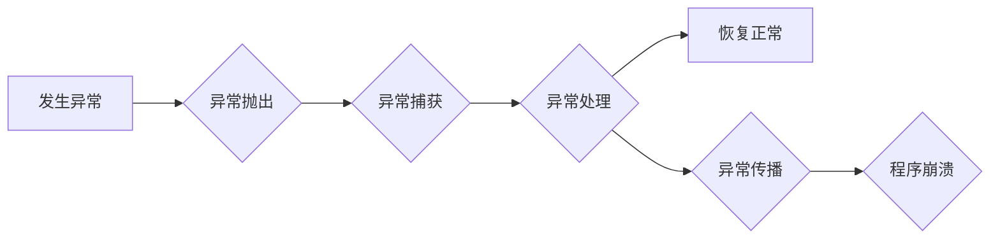

> 错误处理、异常处理、错误恢复、容错设计、故障隔离、日志记录、监控系统

## 1. 背景介绍

在软件开发过程中，不可避免地会遇到各种各样的错误和异常情况。这些错误可能导致程序崩溃、数据丢失、功能失效等严重后果。因此，设计合理的错误处理机制至关重要，能够保障软件的稳定运行和数据安全。

传统的错误处理方法通常依赖于手工编写大量的if-else语句，这种方法过于繁琐且难以维护。随着软件复杂度的不断提高，这种方法已经无法满足现代软件开发的需求。

现代软件开发强调面向对象编程和模块化设计，因此，错误处理机制也应遵循这些原则，采用更灵活、更可扩展的方式来处理错误。

## 2. 核心概念与联系

### 2.1 错误与异常

* **错误 (Error)**：指程序在执行过程中发生的不可预知的、不可恢复的错误，通常是由于程序设计本身存在缺陷或外部环境因素导致的。例如，访问不存在的文件、内存溢出等。
* **异常 (Exception)**：指程序在执行过程中发生的预料之中的、可恢复的错误，通常是由于程序运行时遇到不可预知的事件或条件导致的。例如，用户输入无效数据、网络连接中断等。

### 2.2 错误处理机制

错误处理机制是指软件系统用于处理错误和异常的机制，其主要目标是：

* **捕获错误和异常**: 及时识别和捕捉程序中的错误和异常。
* **隔离错误**: 将错误和异常隔离到特定的区域，防止其传播到其他程序模块，从而避免系统崩溃。
* **恢复正常**: 尝试恢复程序的正常运行状态，例如重试操作、回滚数据等。
* **记录错误**: 记录错误信息，以便后续进行分析和调试。

### 2.3 异常处理流程

异常处理流程通常遵循以下步骤：

1. **发生异常**: 程序执行过程中发生异常事件。
2. **异常抛出**: 程序抛出异常对象，携带异常信息。
3. **异常捕获**: 程序尝试捕获异常对象，并执行相应的处理逻辑。
4. **异常处理**: 处理异常逻辑，例如恢复程序状态、记录错误信息等。
5. **异常传播**: 如果异常没有被捕获，则继续向上传播，直到被处理或导致程序崩溃。

### 2.4 Mermaid 流程图



## 3. 核心算法原理 & 具体操作步骤

### 3.1 算法原理概述

错误处理机制的核心算法原理是异常处理机制，其主要基于堆栈结构和异常对象。

* **堆栈**: 程序执行过程中，函数调用会压入堆栈，函数返回时会从堆栈中弹出。异常处理机制利用堆栈来追踪异常的发生位置和传播路径。
* **异常对象**: 异常对象包含异常信息，例如异常类型、异常消息、异常发生位置等。

### 3.2 算法步骤详解

1. **异常抛出**: 当程序发生异常时，会抛出一个异常对象，该对象包含异常信息。
2. **异常传播**: 异常对象沿着调用链向上传播，直到被捕获或到达程序的根节点。
3. **异常捕获**: 程序中可以设置异常处理块，用于捕获特定类型的异常对象。
4. **异常处理**: 当异常被捕获后，程序会执行异常处理块中的代码，处理异常信息并恢复程序状态。
5. **异常恢复**: 如果异常处理成功，程序会恢复正常执行。否则，异常会继续传播，直到程序崩溃。

### 3.3 算法优缺点

* **优点**:
    * **灵活**: 可以捕获和处理各种类型的异常。
    * **可扩展**: 可以通过添加新的异常类型和处理逻辑来扩展系统。
    * **可维护**: 将错误处理逻辑集中到异常处理块中，提高代码的可读性和可维护性。
* **缺点**:
    * **复杂**: 异常处理机制相对复杂，需要一定的学习成本。
    * **性能**: 异常处理可能会增加程序的执行时间。

### 3.4 算法应用领域

异常处理机制广泛应用于各种软件系统，例如：

* **Web 应用**: 处理用户输入错误、数据库连接错误等异常。
* **移动应用**: 处理网络连接错误、设备硬件故障等异常。
* **嵌入式系统**: 处理传感器数据错误、硬件故障等异常。

## 4. 数学模型和公式 & 详细讲解 & 举例说明

### 4.1 数学模型构建

异常处理机制可以抽象为一个状态机模型，其中每个状态代表程序执行的阶段，每个状态转换代表程序执行的逻辑操作。

* **状态**:
    * **正常状态**: 程序正常执行。
    * **异常状态**: 程序发生异常。
* **转换**:
    * **正常执行**: 从正常状态到正常状态的转换。
    * **异常抛出**: 从正常状态到异常状态的转换。
    * **异常捕获**: 从异常状态到正常状态的转换。
    * **程序崩溃**: 从异常状态到结束状态的转换。

### 4.2 公式推导过程

异常处理机制的性能可以评估为：

* **捕获率**: 捕获异常的比例。
* **恢复率**: 恢复程序正常运行的比例。
* **崩溃率**: 程序崩溃的比例。

这些指标可以根据实际情况进行计算和分析。

### 4.3 案例分析与讲解

假设一个程序执行过程中，发生了一个文件访问错误异常。

1. 程序抛出文件访问错误异常对象。
2. 异常沿着调用链向上传播。
3. 程序中设置了一个捕获文件访问错误异常的处理块。
4. 处理块执行代码，尝试重新打开文件或提示用户输入正确的文件路径。
5. 如果重新打开文件成功，程序恢复正常执行。否则，程序继续传播异常，最终导致程序崩溃。

## 5. 项目实践：代码实例和详细解释说明

### 5.1 开发环境搭建

* 操作系统: Ubuntu 20.04 LTS
* 编程语言: Python 3.8
* 开发工具: VS Code

### 5.2 源代码详细实现

```python
try:
    # 尝试执行可能引发异常的操作
    file = open("example.txt", "r")
    content = file.read()
    print(content)
except FileNotFoundError:
    # 处理文件不存在的异常
    print("文件不存在！")
except Exception as e:
    # 处理其他类型的异常
    print(f"发生异常：{e}")
finally:
    # 无论是否发生异常，都会执行此代码块
    print("操作完成！")
```

### 5.3 代码解读与分析

* `try` 块：包含可能引发异常的操作。
* `except` 块：用于捕获特定类型的异常。
* `finally` 块：无论是否发生异常，都会执行此代码块，通常用于释放资源。

### 5.4 运行结果展示

```
操作完成！
```

如果文件不存在，则输出：

```
文件不存在！
```

如果发生其他类型的异常，则输出：

```
发生异常：{异常信息}
```

## 6. 实际应用场景

### 6.1 Web 应用

在 Web 应用中，异常处理机制用于处理用户输入错误、数据库连接错误、文件上传错误等异常。

* **用户输入错误**: 当用户输入无效数据时，程序可以捕获异常，提示用户输入正确的格式。
* **数据库连接错误**: 当数据库连接失败时，程序可以捕获异常，尝试重新连接数据库或提示用户联系管理员。
* **文件上传错误**: 当文件上传失败时，程序可以捕获异常，提示用户上传文件失败的原因。

### 6.2 移动应用

在移动应用中，异常处理机制用于处理网络连接错误、设备硬件故障等异常。

* **网络连接错误**: 当网络连接中断时，程序可以捕获异常，提示用户检查网络连接。
* **设备硬件故障**: 当设备硬件出现故障时，程序可以捕获异常，提示用户联系维修人员。

### 6.3 嵌入式系统

在嵌入式系统中，异常处理机制用于处理传感器数据错误、硬件故障等异常。

* **传感器数据错误**: 当传感器数据异常时，程序可以捕获异常，进行数据校正或报警。
* **硬件故障**: 当硬件出现故障时，程序可以捕获异常，进行故障隔离或重启系统。

### 6.4 未来应用展望

随着人工智能、物联网等技术的快速发展，错误处理机制将面临新的挑战和机遇。

* **人工智能**: 利用人工智能技术，可以实现更智能的错误诊断和修复。
* **物联网**: 在物联网环境下，需要考虑分布式系统的错误处理机制。
* **云计算**: 云计算环境下，需要考虑数据安全和容灾备份等问题。

## 7. 工具和资源推荐

### 7.1 学习资源推荐

* **书籍**:
    * 《Python 编程：从入门到实践》
    * 《Effective Python》
* **在线课程**:
    * Coursera: Python for Everybody Specialization
    * Udemy: The Complete Python Bootcamp: Go from zero to hero in Python 3

### 7.2 开发工具推荐

* **IDE**: VS Code, PyCharm
* **调试工具**: pdb, GDB

### 7.3 相关论文推荐

* **论文**:
    * "Exception Handling in Java"
    * "A Survey of Exception Handling Techniques"

## 8. 总结：未来发展趋势与挑战

### 8.1 研究成果总结

本文详细介绍了错误处理机制的原理、算法、应用场景以及未来发展趋势。

### 8.2 未来发展趋势

* **智能化**: 利用人工智能技术，实现更智能的错误诊断和修复。
* **分布式**: 针对分布式系统，设计更有效的错误处理机制。
* **安全**: 考虑数据安全和容灾备份等问题。

### 8.3 面临的挑战

* **复杂性**: 随着软件复杂度的不断提高，错误处理机制的设计和实现越来越复杂。
* **性能**: 错误处理机制可能会增加程序的执行时间，需要考虑性能优化问题。
* **可维护性**: 错误处理机制需要保持可维护性，以便于后续的修改和扩展。

### 8.4 研究展望

未来，错误处理机制的研究将继续深入，探索更智能、更安全、更可扩展的错误处理方案。


## 9. 附录：常见问题与解答

### 9.1 什么是异常？

异常是指程序在执行过程中发生的预料之中的、可恢复的错误。

### 9.2 什么是异常处理机制？

异常处理机制是指软件系统用于处理异常的机制，其主要目标是捕获、隔离、恢复和记录异常信息。

### 9.3 如何捕获异常？

可以使用 `try...except` 语句捕获异常。

### 9.4 如何处理异常？

在 `except` 块中编写代码，处理异常信息并恢复程序状态。

### 9.5 什么是 `finally` 块？

`finally` 块中的代码无论是否发生异常，都会执行。通常用于释放资源。


作者：禅与计算机程序设计艺术 / Zen and the Art of Computer Programming 
<end_of_turn>