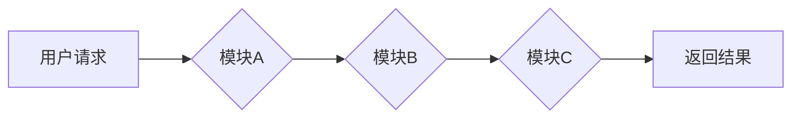

> 软件架构、模块化设计、可扩展性、复用性、代码质量、软件工程

## 1. 背景介绍

在软件工程领域，我们经常会遇到类似于阿克莱特纺织品与福特汽车的场景。阿克莱特纺织品以其精细的工艺和高质量的材料而闻名，而福特汽车则以其流水线生产和规模化制造而闻名。这两个看似截然不同的领域，却都遵循着类似的原则：模块化设计、标准化流程和可扩展性。

软件工程中，模块化设计是指将大型软件系统分解成多个相对独立的模块，每个模块负责特定的功能。这种设计模式类似于福特汽车的流水线生产，每个工位负责特定的任务，最终将零部件组装成完整的汽车。

标准化流程是指在软件开发过程中，遵循统一的规范和标准，例如代码风格、命名约定和测试用例。这种做法类似于阿克莱特纺织品的精细工艺，确保了软件的质量和一致性。

可扩展性是指软件系统能够随着需求的变化而灵活地扩展和修改。这种特性类似于福特汽车的车型多样化，能够满足不同用户的需求。

## 2. 核心概念与联系

### 2.1 模块化设计

模块化设计是软件工程中的一种重要设计原则，它将大型软件系统分解成多个相对独立的模块，每个模块负责特定的功能。

**优点：**

* **提高代码可读性和维护性：** 模块化设计使得代码更加结构化和易于理解，方便维护和修改。
* **提高代码复用性：** 模块可以被多个不同的软件系统复用，减少重复开发的工作量。
* **提高开发效率：** 不同的开发人员可以同时开发不同的模块，提高开发效率。

**缺点：**

* **模块间接口设计复杂：** 模块间需要通过接口进行通信，接口设计需要谨慎考虑，避免出现依赖关系过于紧密的情况。
* **模块耦合度过高：** 如果模块之间耦合度过高，则会影响模块的独立性和可维护性。

**Mermaid 流程图：**

### 2.2 标准化流程

标准化流程是指在软件开发过程中，遵循统一的规范和标准，例如代码风格、命名约定和测试用例。

**优点：**

* **提高代码质量：** 标准化流程可以确保代码的质量和一致性，减少代码错误的发生。
* **提高开发效率：** 统一的规范和标准可以减少开发人员之间的沟通成本，提高开发效率。
* **提高团队协作能力：** 标准化流程可以促进团队成员之间的协作，提高团队的整体效率。

**缺点：**

* **过于僵化：** 如果标准过于严格，可能会限制开发人员的创造力和灵活性。
* **维护成本高：** 随着软件的不断发展，标准化流程也需要不断更新和维护，这可能会增加维护成本。

### 2.3 可扩展性

可扩展性是指软件系统能够随着需求的变化而灵活地扩展和修改。

**优点：**

* **适应不断变化的需求：** 可扩展性可以帮助软件系统适应不断变化的需求，延长软件的生命周期。
* **降低维护成本：** 通过模块化设计和标准化流程，可以降低软件的维护成本。
* **提高软件的竞争力：** 可扩展性可以帮助软件系统更快地适应市场变化，提高软件的竞争力。

**缺点：**

* **设计复杂度高：** 实现可扩展性需要进行更复杂的系统设计，增加设计难度。
* **测试成本高：** 可扩展性带来的复杂性也会增加软件测试的难度和成本。

## 3. 核心算法原理 & 具体操作步骤

### 3.1 算法原理概述

在软件工程中，算法是解决特定问题的步骤或规则。选择合适的算法可以提高软件的效率和性能。

### 3.2 算法步骤详解

具体算法步骤需要根据实际情况进行设计，例如：

* **排序算法：** 用于对数据进行排序，常见的排序算法包括冒泡排序、插入排序、快速排序等。
* **搜索算法：** 用于在数据集中查找特定元素，常见的搜索算法包括线性搜索、二分搜索等。
* **图算法：** 用于处理图结构的数据，常见的图算法包括深度优先搜索、广度优先搜索等。

### 3.3 算法优缺点

不同的算法具有不同的优缺点，需要根据实际情况选择合适的算法。例如：

* **冒泡排序：** 算法简单易懂，但效率较低。
* **快速排序：** 效率较高，但时间复杂度不稳定。
* **二分搜索：** 效率较高，但需要数据有序。

### 3.4 算法应用领域

算法广泛应用于各个领域，例如：

* **人工智能：** 算法用于机器学习、深度学习等领域。
* **数据科学：** 算法用于数据分析、数据挖掘等领域。
* **网络安全：** 算法用于加密、解密、病毒检测等领域。

## 4. 数学模型和公式 & 详细讲解 & 举例说明

### 4.1 数学模型构建

数学模型可以用来描述软件系统的行为和性能。例如，可以使用数学模型来描述算法的时间复杂度和空间复杂度。

### 4.2 公式推导过程

公式推导过程需要根据数学模型和算法的具体实现进行推导。例如，可以推导快速排序算法的时间复杂度公式。

### 4.3 案例分析与讲解

可以通过具体的案例分析来讲解数学模型和公式的应用。例如，可以分析快速排序算法在不同数据规模下的性能表现。

## 5. 项目实践：代码实例和详细解释说明

### 5.1 开发环境搭建

具体开发环境搭建需要根据实际情况进行配置，例如：

* **操作系统：** Linux、Windows、macOS 等。
* **编程语言：** Java、Python、C++ 等。
* **开发工具：** IDE、文本编辑器等。

### 5.2 源代码详细实现

具体源代码实现需要根据实际情况进行编写，例如：

* **模块化设计：** 将软件系统分解成多个模块，每个模块负责特定的功能。
* **标准化流程：** 遵循统一的代码风格、命名约定和测试用例。
* **可扩展性：** 设计可扩展的架构，方便软件的未来扩展和修改。

### 5.3 代码解读与分析

需要对源代码进行详细解读和分析，例如：

* **算法实现：** 分析算法的实现细节，例如时间复杂度和空间复杂度。
* **模块间交互：** 分析模块间的数据交互和控制流。
* **代码质量：** 分析代码的可读性、可维护性和安全性。

### 5.4 运行结果展示

需要展示软件的运行结果，例如：

* **功能测试：** 验证软件的功能是否满足需求。
* **性能测试：** 测试软件的性能指标，例如响应时间和吞吐量。
* **安全性测试：** 测试软件的安全性，例如是否存在漏洞。

## 6. 实际应用场景

### 6.1 应用场景介绍

软件工程的应用场景非常广泛，例如：

* **企业信息系统：** 用于管理企业内部的业务流程和数据。
* **电子商务平台：** 用于在线购物、支付和物流管理。
* **社交网络：** 用于用户之间的交流和互动。
* **游戏开发：** 用于开发各种类型的游戏。

### 6.2 案例分析

可以介绍一些具体的软件工程案例，例如：

* **阿里巴巴的电商平台：** 采用模块化设计、标准化流程和可扩展性架构，支撑了阿里巴巴庞大的业务规模。
* **微信的社交网络：** 采用分布式架构和实时通信技术，提供流畅的用户体验。
* **王者荣耀的游戏：** 采用3D图形引擎和物理引擎，打造了逼真的游戏场景和体验。

### 6.4 未来应用展望

软件工程的未来发展趋势包括：

* **人工智能：** 人工智能技术将被广泛应用于软件开发领域，例如自动代码生成、代码测试和代码优化。
* **云计算：** 云计算技术将推动软件的规模化部署和管理，降低软件开发成本。
* **物联网：** 物联网技术将带来新的软件开发需求，例如物联网设备的连接和管理。

## 7. 工具和资源推荐

### 7.1 学习资源推荐

* **书籍：** 《软件工程导论》、《软件架构》、《设计模式》等。
* **在线课程：** Coursera、edX、Udemy 等平台提供丰富的软件工程课程。
* **博客和论坛：** CSDN、Stack Overflow 等平台提供软件工程相关的博客和论坛。

### 7.2 开发工具推荐

* **IDE：** Eclipse、IntelliJ IDEA、Visual Studio Code 等。
* **版本控制系统：** Git、SVN 等。
* **测试工具：** JUnit、pytest 等。

### 7.3 相关论文推荐

* **ACM Digital Library：** https://dl.acm.org/
* **IEEE Xplore：** https://ieeexplore.ieee.org/

## 8. 总结：未来发展趋势与挑战

### 8.1 研究成果总结

软件工程已经取得了长足的进步，模块化设计、标准化流程和可扩展性等原则已经成为软件开发的基石。人工智能、云计算和物联网等新技术将推动软件工程的进一步发展。

### 8.2 未来发展趋势

* **人工智能驱动的软件开发：** 人工智能技术将被广泛应用于软件开发领域，例如自动代码生成、代码测试和代码优化。
* **云原生软件开发：** 云计算技术将推动软件的规模化部署和管理，降低软件开发成本。
* **面向微服务的架构：** 微服务架构将成为软件系统架构的趋势，提高软件的灵活性和可扩展性。

### 8.3 面临的挑战

* **软件复杂性不断增加：** 软件系统越来越复杂，开发和维护难度不断增加。
* **人才短缺：** 软件工程人才需求量大，但供给不足。
* **安全威胁不断升级：** 软件系统面临着越来越多的安全威胁，需要不断加强安全防护。

### 8.4 研究展望

未来软件工程研究需要关注以下几个方面：

* **人工智能驱动的软件开发工具和方法：** 开发更智能、更便捷的软件开发工具和方法。
* **云原生软件开发的最佳实践：** 研究云原生软件开发的最佳实践，提高软件的可靠性和可扩展性。
* **软件安全和可靠性：** 研究提高软件安全和可靠性的方法，降低软件系统风险。

## 9. 附录：常见问题与解答

### 9.1 常见问题

* **什么是模块化设计？**
* **什么是标准化流程？**
* **什么是可扩展性？**
* **如何选择合适的算法？**
* **如何进行软件测试？**

### 9.2 问题解答

...

作者：禅与计算机程序设计艺术 / Zen and the Art of Computer Programming

<end_of_turn>