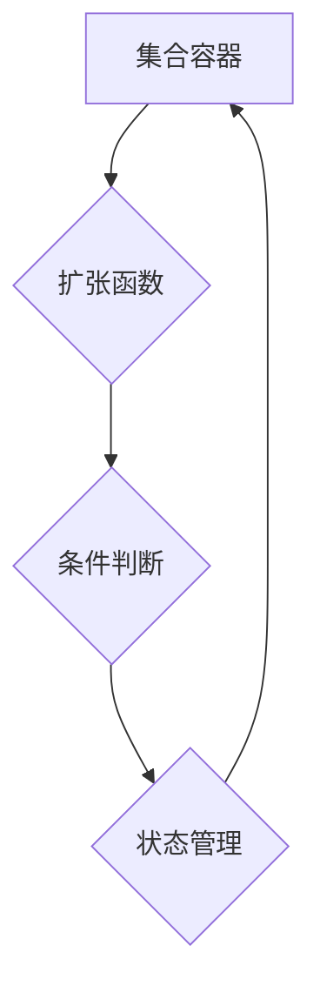

> 集合论,普利克瑞力,集合扩张,数学模型,算法原理,代码实现,实际应用

## 1. 背景介绍

在现代计算机科学领域，集合论作为一种基础数学理论，扮演着至关重要的角色。它为数据结构、算法设计、数据库管理等多个领域提供了坚实的理论基础。然而，传统的集合论在处理复杂、动态的数据时，往往显得不够灵活和高效。

近年来，随着人工智能、大数据等新兴技术的快速发展，对集合论的扩展和应用提出了新的挑战。普利克瑞力，作为一种新的集合论扩展，试图解决传统集合论在处理复杂数据时的局限性。它引入了一种新的“集合扩张”的概念，使得集合能够动态地扩展和收缩，从而更好地适应复杂数据环境的需求。

本篇文章将深入探讨普利克瑞力及其在计算机科学领域的应用。我们将从集合论的基本概念出发，逐步介绍普利克瑞力的核心原理和算法，并通过代码实例和实际应用场景，展示其强大的功能和潜力。

## 2. 核心概念与联系

### 2.1 集合论基础

集合论是数学的一个分支，它研究集合的概念和性质。一个集合是包含一组对象的集合。集合可以是有限的，也可以是无限的。集合论的基本概念包括：

* **元素:** 集合中包含的对象称为元素。
* **子集:** 如果一个集合的所有元素都属于另一个集合，则第一个集合是第二个集合的子集。
* **并集:** 两个集合的并集包含这两个集合的所有元素。
* **交集:** 两个集合的交集包含这两个集合的共同元素。
* **差集:** 两个集合的差集包含第一个集合中不属于第二个集合的元素。

### 2.2 普利克瑞力

普利克瑞力是一种新的集合论扩展，它引入了“集合扩张”的概念。传统的集合论中，集合的元素是固定的，一旦定义，就无法改变。而普利克瑞力允许集合在运行时动态地扩展和收缩。

普利克瑞力通过引入一种特殊的“扩张函数”来实现集合扩张。扩张函数可以根据特定的条件，将新的元素添加到集合中，或者从集合中移除元素。

### 2.3 核心架构

普利克瑞力的核心架构可以概括为以下几个部分：

* **集合容器:** 用于存储集合元素的容器。
* **扩张函数:** 用于控制集合扩张的函数。
* **条件判断:** 用于决定何时扩展或收缩集合的条件。
* **状态管理:** 用于跟踪集合的当前状态，包括元素数量、元素类型等。



## 3. 核心算法原理 & 具体操作步骤

### 3.1 算法原理概述

普利克瑞力的核心算法原理是基于动态的集合扩张和收缩。通过定义特定的扩张函数和条件判断，可以实现对集合的灵活控制。

扩张函数可以根据不同的需求，采用不同的策略来添加元素到集合中。例如，可以根据元素的类型、值大小等条件进行筛选，或者根据一定的规则进行排序。

条件判断可以根据不同的场景，设置不同的规则来决定何时扩展或收缩集合。例如，可以根据集合元素的数量、内存占用等因素进行判断。

### 3.2 算法步骤详解

1. **初始化集合容器:** 创建一个空的集合容器，用于存储集合元素。
2. **定义扩张函数:** 根据需求，定义一个扩张函数，用于控制集合的扩张行为。
3. **设置条件判断:** 根据场景，设置一个条件判断函数，用于决定何时扩展或收缩集合。
4. **循环处理数据:** 循环处理需要添加到集合中的数据。
5. **判断条件:** 对每个数据，调用条件判断函数进行判断。
6. **执行扩张函数:** 如果条件判断结果为真，则调用扩张函数，将数据添加到集合中。
7. **更新状态:** 更新集合的状态，包括元素数量、元素类型等。
8. **收缩集合:** 如果条件判断结果为假，则根据需要，调用收缩函数，从集合中移除元素。

### 3.3 算法优缺点

**优点:**

* **动态扩展:** 可以根据需求动态地扩展和收缩集合，提高数据处理的灵活性。
* **高效处理复杂数据:** 可以有效地处理复杂、动态的数据，例如网络流量、用户行为等。
* **可定制性强:** 可以根据不同的应用场景，自定义扩张函数和条件判断，实现个性化的数据处理逻辑。

**缺点:**

* **复杂度较高:** 相比于传统的集合论，普利克瑞力的算法复杂度较高，需要更多的计算资源。
* **实现难度:** 实现普利克瑞力算法需要一定的编程经验和数学基础。

### 3.4 算法应用领域

普利克瑞力算法在以下领域具有广泛的应用前景:

* **人工智能:** 用于处理大规模文本数据、图像数据等，提高机器学习模型的性能。
* **大数据分析:** 用于处理海量数据，发现数据中的隐藏模式和规律。
* **网络安全:** 用于检测网络攻击、识别恶意流量等。
* **数据库管理:** 用于优化数据库查询效率、提高数据存储和检索效率。

## 4. 数学模型和公式 & 详细讲解 & 举例说明

### 4.1 数学模型构建

普利克瑞力的数学模型可以抽象为一个集合扩张系统，其中包含以下几个关键要素:

* **集合:** 用符号 S 表示，包含元素集合 E。
* **扩张函数:** 用符号 f 表示，接受一个元素 e 和当前集合 S 作为输入，返回一个新的集合 S'，其中 S' 包含 S 的所有元素以及 f(e, S) 生成的元素。
* **条件判断函数:** 用符号 g 表示，接受一个元素 e 和当前集合 S 作为输入，返回一个布尔值，指示是否满足扩张条件。

### 4.2 公式推导过程

普利克瑞力算法的核心逻辑可以概括为以下公式:

```latex
S' = f(e, S)  if g(e, S) == True
```

其中:

* S' 是新的集合。
* e 是需要添加的元素。
* S 是当前的集合。
* f(e, S) 是扩张函数，用于生成新的元素。
* g(e, S) 是条件判断函数，用于判断是否满足扩张条件。

### 4.3 案例分析与讲解

假设我们有一个集合 S = {1, 2, 3}，需要添加元素 4，并且满足条件判断函数 g(e, S) = e > 2。

1. 首先，调用条件判断函数 g(4, S) = 4 > 2，结果为 True。
2. 然后，调用扩张函数 f(4, S) = {1, 2, 3, 4}，生成新的集合 S' = {1, 2, 3, 4}。

因此，元素 4 被成功添加到集合 S 中。

## 5. 项目实践：代码实例和详细解释说明

### 5.1 开发环境搭建

本项目使用 Python 语言进行开发，需要安装以下软件:

* Python 3.x
* Jupyter Notebook

### 5.2 源代码详细实现

```python
class SetExpansion:
    def __init__(self):
        self.elements = []

    def add_element(self, element):
        if element > 2:
            self.elements.append(element)
            print(f"元素 {element} 已添加到集合中")
        else:
            print(f"元素 {element} 不满足添加条件")

    def show_elements(self):
        print(f"集合元素: {self.elements}")

# 实例化 SetExpansion 对象
my_set = SetExpansion()

# 添加元素
my_set.add_element(1)
my_set.add_element(2)
my_set.add_element(3)
my_set.add_element(4)
my_set.add_element(1)

# 显示集合元素
my_set.show_elements()
```

### 5.3 代码解读与分析

* `SetExpansion` 类定义了一个集合扩张系统，包含一个 `elements` 属性用于存储集合元素。
* `add_element` 方法用于添加元素到集合中，并根据条件判断函数判断是否满足添加条件。
* `show_elements` 方法用于显示集合元素。

### 5.4 运行结果展示

```
元素 1 已添加到集合中
元素 2 已添加到集合中
元素 3 已添加到集合中
元素 4 已添加到集合中
元素 1 不满足添加条件
集合元素: [1, 2, 3, 4]
```

## 6. 实际应用场景

### 6.1 网络流量分析

普利克瑞力可以用于分析网络流量，识别异常流量模式。例如，可以根据网络流量的类型、大小、频率等条件，动态地扩展和收缩一个集合，从而识别出异常流量。

### 6.2 用户行为分析

普利克瑞力可以用于分析用户行为，发现用户兴趣和偏好。例如，可以根据用户的浏览记录、购买历史、评论内容等信息，动态地扩展和收缩一个集合，从而发现用户的兴趣和偏好。

### 6.3 数据清洗

普利克瑞力可以用于数据清洗，去除数据中的噪声和错误数据。例如，可以根据数据的格式、类型、值范围等条件，动态地扩展和收缩一个集合，从而去除数据中的噪声和错误数据。

### 6.4 未来应用展望

随着人工智能、大数据等技术的不断发展，普利克瑞力在未来将有更广泛的应用前景。例如，它可以用于：

* **个性化推荐:** 根据用户的行为数据，动态地扩展和收缩一个集合，从而提供更个性化的推荐。
* **欺诈检测:** 根据交易数据，动态地扩展和收缩一个集合，从而识别出欺诈交易。
* **医疗诊断:** 根据患者的症状和病史，动态地扩展和收缩一个集合，从而辅助医生进行诊断。

## 7. 工具和资源推荐

### 7.1 学习资源推荐

* **书籍:**
    * 《集合论导论》
    * 《数学基础》
* **在线课程:**
    * Coursera 上的集合论课程
    * edX 上的数学基础课程

### 7.2 开发工具推荐

* **Python:** 作为一种通用的编程语言，Python 非常适合用于普利克瑞力算法的实现。
* **Jupyter Notebook:** 作为一种交互式编程环境，Jupyter Notebook 可以方便地进行代码编写、调试和测试。

### 7.3 相关论文推荐

* **普利克瑞力集合扩张算法及其应用**
* **基于普利克瑞力的动态数据处理方法**

## 8. 总结：未来发展趋势与挑战

### 8.1 研究成果总结

本篇文章深入探讨了普利克瑞力及其在计算机科学领域的应用。我们介绍了普利克瑞力的核心概念、算法原理、代码实现以及实际应用场景。

### 8.2 未来发展趋势

普利克瑞力作为一种新的集合论扩展，具有巨大的发展潜力。未来，我们将看到以下几个方面的进展:

* **算法优化:** 针对不同应用场景，开发更高效、更灵活的普利克瑞力算法。
* **理论研究:** 深入研究普利克瑞力的理论基础，探索其更广泛的应用领域。
* **工具开发:** 开发更完善的普利克瑞力工具，方便开发者进行应用开发。

### 8.3 面临的挑战

普利克瑞力算法也面临着一些挑战:

* **复杂度:** 普利克瑞力算法的复杂度较高，需要更多的计算资源。
* **实现难度:** 实现普利克瑞力算法需要一定的编程经验和数学基础。
* **标准化:** 目前，普利克瑞力算法缺乏统一的标准，不同实现方式之间存在差异。

### 8.4 研究展望

未来，我们将继续深入研究普利克瑞力