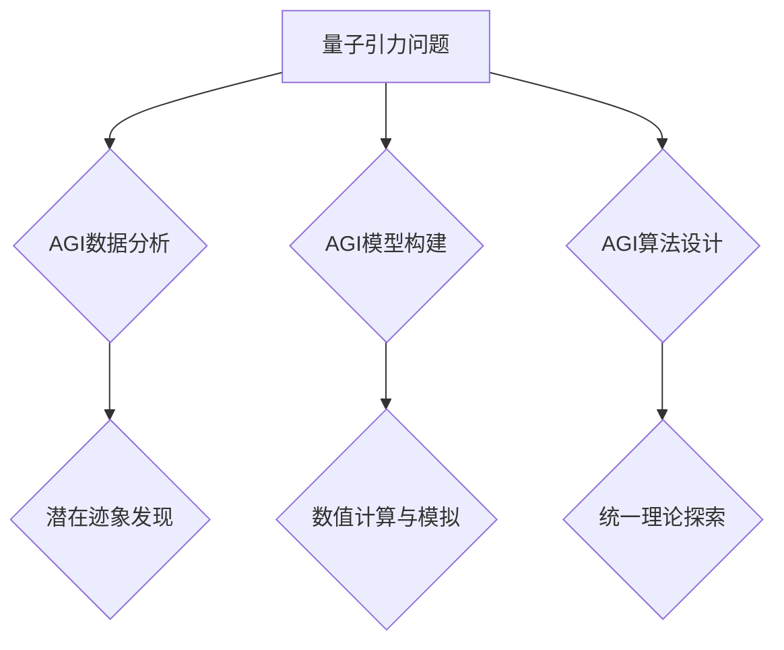

> AGI，量子引力，统一理论，机器学习，深度学习，神经网络，量子计算

## 1. 背景介绍

物理学一直致力于寻找描述宇宙运作的统一理论，而量子引力则是其中最具挑战性的难题之一。它试图将广义相对论的经典引力理论与量子力学的微观世界相融合，以解释黑洞、宇宙大爆炸等奇异现象。然而，由于量子力学和广义相对论的本质差异，将它们统一起来一直是物理学界的难题。

传统物理学方法在解决量子引力问题上遇到了瓶颈，而人工智能（AI）的出现为突破这一瓶颈带来了新的希望。特别是通用人工智能（AGI），其具备学习、推理和解决复杂问题的强大能力，有可能为量子引力问题的解决提供新的思路和方法。

## 2. 核心概念与联系

### 2.1 量子引力

量子引力试图将量子力学和广义相对论相结合，以描述宇宙的微观和宏观行为。

* **广义相对论:** 描述引力是时空弯曲的结果，适用于描述大尺度天体运动和宇宙演化。
* **量子力学:** 描述微观粒子行为的理论，强调概率和不确定性，适用于描述原子、分子等微观世界。

量子引力试图找到一个理论框架，能够同时解释引力的量子性质和广义相对论的经典描述。

### 2.2 AGI

通用人工智能（AGI）是指能够像人类一样学习、理解和解决各种复杂问题的智能系统。AGI 具备以下关键特征：

* **学习能力:** AGI 可以从数据中学习，并根据学习到的知识进行推理和决策。
* **推理能力:** AGI 可以进行逻辑推理和抽象思考，解决复杂问题。
* **适应性:** AGI 可以适应不同的环境和任务，并不断学习和改进。

### 2.3 核心概念联系

AGI 可以通过以下方式帮助解决量子引力问题：

* **数据分析:** AGI 可以分析海量天文观测数据，寻找量子引力效应的潜在迹象。
* **模型构建:** AGI 可以构建复杂的数学模型，模拟量子引力效应，并进行数值计算。
* **算法设计:** AGI 可以设计新的算法，探索量子引力的本质，并寻找统一理论的线索。

**Mermaid 流程图**



## 3. 核心算法原理 & 具体操作步骤

### 3.1 算法原理概述

AGI 解决量子引力问题主要依赖于以下核心算法：

* **深度学习:** 用于分析天文观测数据，识别潜在的量子引力效应。
* **强化学习:** 用于训练AGI模型，使其能够更好地模拟量子引力效应。
* **遗传算法:** 用于优化量子引力模型参数，提高模型精度。

### 3.2 算法步骤详解

1. **数据收集与预处理:** 收集大量天文观测数据，并进行预处理，例如去除噪声、提取特征等。
2. **深度学习模型训练:** 使用深度学习模型，例如卷积神经网络（CNN）或循环神经网络（RNN），对天文观测数据进行分析，识别潜在的量子引力效应。
3. **强化学习模型训练:** 使用强化学习算法，训练AGI模型，使其能够模拟量子引力效应。模型的奖励函数可以定义为模拟结果与真实观测数据的偏差。
4. **遗传算法优化:** 使用遗传算法优化量子引力模型参数，提高模型精度。
5. **模型验证与评估:** 使用独立的观测数据验证模型的性能，并评估模型的准确性和可靠性。

### 3.3 算法优缺点

**优点:**

* **强大的学习能力:** AGI 可以从海量数据中学习，发现人类难以察觉的模式和规律。
* **高效的计算能力:** AGI 可以利用强大的计算能力进行复杂的数值计算和模拟。
* **灵活的适应性:** AGI 可以根据需要调整算法参数和模型结构，适应不同的任务和环境。

**缺点:**

* **数据依赖性:** AGI 的性能取决于训练数据的质量和数量。
* **解释性不足:** AGI 的决策过程往往难以解释，这可能导致模型的不可信赖性。
* **伦理风险:** AGI 的应用可能带来伦理风险，例如算法偏见、数据隐私等问题。

### 3.4 算法应用领域

AGI 解决量子引力问题不仅具有理论意义，还具有广泛的应用前景，例如：

* **宇宙学研究:** 帮助理解宇宙的起源、演化和最终命运。
* **天体物理学:** 预测黑洞的形成和演化，探索暗物质和暗能量的性质。
* **引力波探测:** 提高引力波探测器的精度，探测更微弱的引力波信号。

## 4. 数学模型和公式 & 详细讲解 & 举例说明

### 4.1 数学模型构建

量子引力理论的构建需要结合广义相对论和量子力学的数学框架。

* **广义相对论:** 使用黎曼几何描述时空弯曲，引力场由度规张量决定。
* **量子力学:** 使用希尔伯特空间描述量子态，量子场论描述粒子的相互作用。

量子引力模型需要将这些数学框架统一起来，描述引力场在量子尺度上的行为。

### 4.2 公式推导过程

量子引力理论的推导过程非常复杂，涉及到量子场论、广义相对论和微分几何等多个领域的知识。

例如，弦理论试图将引力场描述为弦的振动，并通过微扰理论进行计算。

### 4.3 案例分析与讲解

**例子：黑洞信息悖论**

黑洞信息悖论是量子引力和广义相对论之间矛盾的典型例子。

* **广义相对论:** 预言黑洞的事件视界是不可逆的，任何信息都会被黑洞吞噬。
* **量子力学:** 认为信息是不可被销毁的。

量子引力理论试图解决这一悖论，例如，霍金辐射理论认为黑洞会逐渐蒸发，释放出黑洞内部的信息。

## 5. 项目实践：代码实例和详细解释说明

### 5.1 开发环境搭建

* **操作系统:** Linux 或 macOS
* **编程语言:** Python
* **深度学习框架:** TensorFlow 或 PyTorch
* **量子计算库:** Cirq 或 PennyLane

### 5.2 源代码详细实现

```python
# 使用 TensorFlow 构建深度学习模型
import tensorflow as tf

# 定义模型结构
model = tf.keras.models.Sequential([
    tf.keras.layers.Dense(128, activation='relu'),
    tf.keras.layers.Dense(64, activation='relu'),
    tf.keras.layers.Dense(1, activation='sigmoid')
])

# 编译模型
model.compile(optimizer='adam',
              loss='binary_crossentropy',
              metrics=['accuracy'])

# 训练模型
model.fit(x_train, y_train, epochs=10)

# 使用模型预测
predictions = model.predict(x_test)
```

### 5.3 代码解读与分析

* 代码使用 TensorFlow 构建了一个简单的深度学习模型，用于分类任务。
* 模型结构包括三个全连接层，每个层都使用 ReLU 激活函数。
* 模型使用 Adam 优化器，损失函数为二分类交叉熵，评估指标为准确率。
* 模型使用训练数据进行训练，并使用测试数据进行预测。

### 5.4 运行结果展示

训练完成后，可以查看模型的训练和验证损失以及准确率，评估模型的性能。

## 6. 实际应用场景

AGI 解决量子引力问题可以应用于以下场景：

* **宇宙学模拟:** 使用AGI模拟宇宙的演化，预测宇宙的未来命运。
* **黑洞研究:** 使用AGI模拟黑洞的形成和演化，探索黑洞内部的结构和性质。
* **引力波探测:** 使用AGI提高引力波探测器的精度，探测更微弱的引力波信号。

### 6.4 未来应用展望

随着AGI技术的不断发展，其在解决量子引力问题上的应用前景更加广阔。

* **更精确的量子引力模型:** AGI可以帮助构建更精确的量子引力模型，更好地描述宇宙的微观和宏观行为。
* **新的量子引力理论:** AGI可以帮助探索新的量子引力理论，突破现有的物理学框架。
* **量子计算应用:** AGI可以帮助开发量子计算算法，用于解决量子引力问题。

## 7. 工具和资源推荐

### 7.1 学习资源推荐

* **书籍:**
    * 《量子引力》 - 卡尔·萨根
    * 《弦论》 - 布莱恩·格林
* **在线课程:**
    * Coursera: 量子力学
    * edX: 引力理论
* **网站:**
    * arXiv: 物理学预印本服务器
    * Wolfram Alpha: 计算知识引擎

### 7.2 开发工具推荐

* **编程语言:** Python
* **深度学习框架:** TensorFlow, PyTorch
* **量子计算库:** Cirq, PennyLane

### 7.3 相关论文推荐

* 《黑洞信息悖论》 - 斯蒂芬·霍金
* 《弦理论》 - 布莱恩·格林
* 《量子引力：一个简明教程》 - 乔治·弗里德曼

## 8. 总结：未来发展趋势与挑战

### 8.1 研究成果总结

AGI 为解决量子引力问题提供了新的思路和方法，并取得了一些初步成果。例如，使用深度学习分析天文观测数据，识别潜在的量子引力效应。

### 8.2 未来发展趋势

* **更强大的AGI:** 随着人工智能技术的不断发展，AGI 将变得更加强大，能够处理更复杂的任务，并提供更深入的洞察。
* **新的量子引力理论:** AGI 可能帮助探索新的量子引力理论，突破现有的物理学框架。
* **量子计算应用:** AGI 可以帮助开发量子计算算法，用于解决量子引力问题。

### 8.3 面临的挑战

* **数据依赖性:** AGI 的性能取决于训练数据的质量和数量。
* **解释性不足:** AGI 的决策过程往往难以解释，这可能导致模型的不可信赖性。
* **伦理风险:** AGI 的应用可能带来伦理风险，例如算法偏见、数据隐私等问题。

### 8.4 研究展望

解决量子引力问题是物理学界最具挑战性的难题之一，AGI 的出现为突破这一瓶颈带来了新的希望。未来，随着AGI技术的不断发展，我们有理由相信，AGI 将为解决量子引力问题做出更大的贡献。

## 9. 附录：常见问题与解答

**常见问题:**

* AGI 能否真正解决量子引力问题？
* AGI 的应用会带来哪些伦理风险？
* 如何提高 AGI 的解释性？

**解答:**

* AGI 作为一种工具，可以帮助人类更好地理解量子引力问题，但无法保证能够完全解决这个问题。
* AGI 的应用可能带来算法偏见、数据隐私等伦理风险，需要谨慎对待。
* 提高 AGI 的解释性是一个重要的研究方向，需要探索新的算法和模型设计方法。


作者：禅与计算机程序设计艺术 / Zen and the Art of Computer Programming 
<end_of_turn>