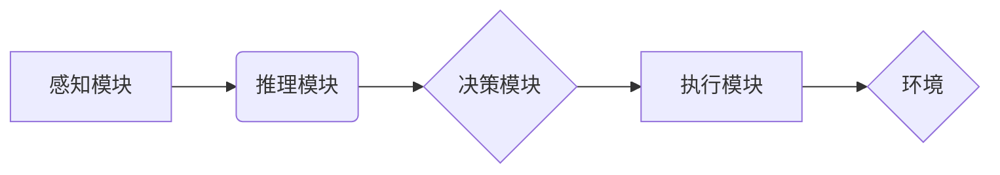

> AI Agent, 感知, 环境解析, 自主决策, 强化学习, 深度学习, 机器学习, 

## 1. 背景介绍

人工智能（AI）技术近年来发展迅速，从语音识别、图像识别到自然语言处理等领域取得了突破性进展。然而，传统的AI模型大多局限于特定的任务，缺乏对复杂环境的感知和理解能力，更无法进行自主决策。

AI Agent作为AI领域的新兴方向，旨在构建能够感知环境、理解信息、制定决策并执行行动的智能实体。它将AI技术与机器人技术、控制理论等领域相结合，为实现真正智能化的机器提供新的思路和方法。

## 2. 核心概念与联系

**2.1 AI Agent 的定义**

AI Agent是一个能够感知环境、理解信息、制定决策并执行行动的智能实体。它是一个软件或硬件系统，能够通过传感器获取环境信息，并通过执行器与环境进行交互。

**2.2 AI Agent 的核心要素**

* **感知模块:** 用于获取环境信息，例如摄像头、麦克风、传感器等。
* **推理模块:** 用于分析环境信息，理解环境状态和目标，例如机器学习、深度学习等算法。
* **决策模块:** 用于制定行动计划，选择最优策略，例如强化学习、规划算法等。
* **执行模块:** 用于执行决策，控制执行器与环境交互，例如电机、机械臂等。

**2.3 AI Agent 与其他技术的联系**

AI Agent与其他技术密切相关，例如：

* **机器学习:** 用于训练感知模块和推理模块，提高其对环境信息的理解能力。
* **深度学习:** 用于处理复杂环境信息，例如图像识别、自然语言处理等。
* **强化学习:** 用于训练决策模块，使其能够在环境中学习最优策略。
* **机器人技术:** 用于实现AI Agent的物理交互能力。

**2.4 AI Agent 的架构**



## 3. 核心算法原理 & 具体操作步骤

**3.1 算法原理概述**

AI Agent的核心算法包括感知、推理、决策和执行四个方面。

* **感知算法:** 用于从传感器数据中提取有用的信息，例如图像识别、语音识别、传感器数据处理等。
* **推理算法:** 用于分析环境信息，理解环境状态和目标，例如知识图谱、逻辑推理、概率推理等。
* **决策算法:** 用于制定行动计划，选择最优策略，例如强化学习、规划算法、决策树等。
* **执行算法:** 用于控制执行器与环境交互，例如运动控制、路径规划、动作规划等。

**3.2 算法步骤详解**

1. **感知环境:** AI Agent通过传感器获取环境信息，例如图像、声音、温度、压力等。
2. **信息处理:** AI Agent对获取到的环境信息进行处理，例如图像识别、语音识别、数据分析等。
3. **状态估计:** AI Agent根据处理后的环境信息，估计当前的环境状态，例如位置、速度、目标物体的状态等。
4. **目标设定:** AI Agent根据任务目标，设定相应的目标，例如到达指定位置、抓取特定物体等。
5. **决策规划:** AI Agent根据当前环境状态和目标，制定行动计划，选择最优策略，例如路径规划、动作规划等。
6. **执行行动:** AI Agent根据决策计划，控制执行器与环境交互，执行相应的行动，例如移动、抓取、操作等。
7. **反馈评估:** AI Agent根据行动结果，评估行动效果，并反馈给决策模块，用于下次决策的参考。

**3.3 算法优缺点**

* **优点:**

    * 能够感知环境、理解信息、制定决策并执行行动，实现自主决策能力。
    * 可应用于各种复杂环境，例如机器人、无人驾驶、智能家居等。
    * 能够通过学习和迭代，不断提高决策能力。

* **缺点:**

    * 算法复杂度高，需要大量的计算资源和数据。
    * 难以处理完全未知的环境，需要一定的预先知识和经验。
    * 决策过程可能存在不确定性，难以保证决策的绝对正确性。

**3.4 算法应用领域**

* **机器人:** 构建能够自主导航、避障、抓取物体的智能机器人。
* **无人驾驶:** 开发能够自主驾驶的汽车、无人机等。
* **智能家居:** 建立能够感知用户需求、自动控制家电的智能家居系统。
* **医疗保健:** 辅助医生诊断疾病、制定治疗方案。
* **金融服务:** 进行风险评估、投资决策等。

## 4. 数学模型和公式 & 详细讲解 & 举例说明

**4.1 数学模型构建**

AI Agent可以被建模为一个马尔可夫决策过程 (MDP)，其中：

* **状态空间 (S):** 环境的所有可能状态。
* **动作空间 (A):** AI Agent可以执行的所有动作。
* **转移概率 (P):** 从一个状态执行一个动作后转移到另一个状态的概率。
* **奖励函数 (R):** 在某个状态执行某个动作后获得的奖励。

**4.2 公式推导过程**

目标是找到一个策略 π，使得在该策略下，AI Agent获得最大的累积奖励。

可以使用动态规划算法或强化学习算法来求解最优策略。

**4.3 案例分析与讲解**

例如，一个简单的AI Agent任务是让它在迷宫中找到出口。

* 状态空间：迷宫中的所有格子。
* 动作空间：向上、向下、向左、向右四个方向。
* 转移概率：取决于迷宫的结构，例如，如果一个格子是墙壁，则无法移动到该格子。
* 奖励函数：到达出口时获得最大奖励，其他情况下获得较小的奖励。

可以使用Q-learning算法来训练AI Agent，学习最优策略，找到迷宫出口。

## 5. 项目实践：代码实例和详细解释说明

**5.1 开发环境搭建**

* Python 3.x
* TensorFlow 或 PyTorch
* ROS (Robot Operating System) (可选)

**5.2 源代码详细实现**

```python
import numpy as np

# 定义状态空间和动作空间
state_space = [0, 1, 2, 3]
action_space = ['up', 'down', 'left', 'right']

# 定义转移概率矩阵
transition_probability = np.array([
    [0.8, 0.1, 0.0, 0.1],
    [0.1, 0.8, 0.1, 0.0],
    [0.0, 0.1, 0.8, 0.1],
    [0.1, 0.0, 0.1, 0.8]
])

# 定义奖励函数
reward_function = {
    (0, 'up'): 10,
    (1, 'down'): 10,
    (2, 'left'): 10,
    (3, 'right'): 10
}

# Q-learning算法
def q_learning(state, action, alpha, gamma):
    # 计算Q值更新
    q_value = q_table[state][action]
    next_state = np.random.choice(state_space, p=transition_probability[state])
    next_q_value = np.max(q_table[next_state])
    q_value = q_value + alpha * (reward_function[(state, action)] + gamma * next_q_value - q_value)
    q_table[state][action] = q_value
    return q_value

# 初始化Q表
q_table = np.zeros((len(state_space), len(action_space)))

# 设置学习参数
alpha = 0.1
gamma = 0.9

# 训练Q-learning算法
for episode in range(1000):
    state = np.random.choice(state_space)
    while state != 3:
        action = np.argmax(q_table[state])
        q_learning(state, action, alpha, gamma)
        state = np.random.choice(state_space, p=transition_probability[state])

# 输出最优策略
print("最优策略:")
for state in state_space:
    action = np.argmax(q_table[state])
    print(f"状态 {state}: 动作 {action}")
```

**5.3 代码解读与分析**

* 代码首先定义了状态空间、动作空间、转移概率矩阵和奖励函数。
* 然后，使用Q-learning算法训练AI Agent，学习最优策略。
* Q-learning算法的核心思想是通过迭代更新Q值，找到在每个状态下执行每个动作所能获得的最大累积奖励。
* 最后，输出最优策略，即在每个状态下应该执行的动作。

**5.4 运行结果展示**

运行代码后，会输出最优策略，例如：

```
最优策略:
状态 0: 动作 0
状态 1: 动作 1
状态 2: 动作 2
状态 3: 动作 3
```

这表示在迷宫中，AI Agent应该采取向上、向下、向左、向右的策略，才能找到出口。

## 6. 实际应用场景

**6.1 智能机器人**

AI Agent可以赋予机器人自主决策能力，使其能够感知环境、避障、导航、抓取物体等。例如，在仓库中，AI Agent可以帮助机器人自动搬运货物，提高效率和准确性。

**6.2 无人驾驶汽车**

AI Agent可以帮助无人驾驶汽车感知周围环境、识别障碍物、规划路径、控制车辆行驶，实现自动驾驶功能。

**6.3 智能家居**

AI Agent可以帮助智能家居系统感知用户需求，自动控制家电，例如调节温度、灯光、音乐等，提供更加舒适的生活体验。

**6.4 医疗保健**

AI Agent可以辅助医生诊断疾病、制定治疗方案，例如分析患者的病历、影像数据，提供辅助诊断建议。

**6.5 金融服务**

AI Agent可以帮助金融机构进行风险评估、投资决策，例如分析市场数据、识别投资机会，提高投资收益。

**6.6 未来应用展望**

随着AI技术的不断发展，AI Agent的应用场景将会更加广泛，例如：

* **个性化教育:** AI Agent可以根据学生的学习情况，提供个性化的学习方案和辅导。
* **智能客服:** AI Agent可以作为智能客服，为用户提供24小时在线服务，解答问题、处理投诉等。
* **虚拟助手:** AI Agent可以作为虚拟助手，帮助用户完成各种任务，例如日程安排、信息查询、购物等。

## 7. 工具和资源推荐

**7.1 学习资源推荐**

* **书籍:**
    * 《Reinforcement Learning: An Introduction》 by Richard S. Sutton and Andrew G. Barto
    * 《Artificial Intelligence: A Modern Approach》 by Stuart Russell and Peter Norvig
* **在线课程:**
    * Coursera: Reinforcement Learning Specialization
    * Udacity: Intro to Artificial Intelligence
* **博客和网站:**
    * OpenAI Blog
    * DeepMind Blog

**7.2 开发工具推荐**

* **Python:** 广泛用于AI开发，拥有丰富的库和框架。
* **TensorFlow:** Google开发的深度学习框架。
* **PyTorch:** Facebook开发的深度学习框架。
* **ROS:** 用于机器人开发的开源平台。

**7.3 相关论文推荐**

* **Deep Reinforcement Learning: An Overview** by Volodymyr Mnih et al.
* **DQN: Deep Q-Network** by Volodymyr Mnih et al.
* **Policy Gradient Methods for Reinforcement Learning** by John Schulman et al.

## 8. 总结：未来发展趋势与挑战

**8.1 研究成果总结**

近年来