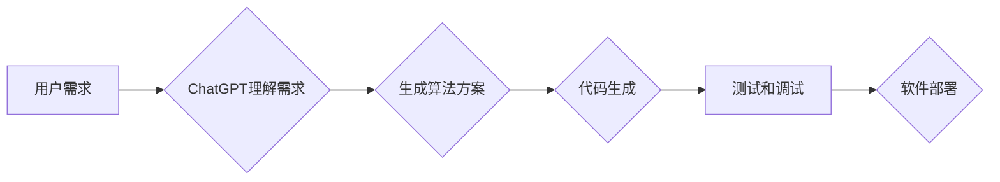

> AIGC, ChatGPT, 程序员, 代码生成, 算法设计, 效率提升, 自然语言处理, 机器学习

## 1. 背景介绍

近年来，人工智能（AI）技术飞速发展，特别是生成式人工智能（AIGC）的兴起，为软件开发领域带来了革命性的变革。其中，ChatGPT作为一款强大的开源语言模型，凭借其出色的文本生成能力和理解能力，在程序员工作中展现出巨大的潜力。

传统的软件开发流程通常需要程序员进行大量的代码编写、算法设计和调试工作，这不仅耗费时间和精力，也容易出现错误和漏洞。而ChatGPT能够利用其强大的语言理解和生成能力，帮助程序员自动生成代码、优化算法和解决编程问题，从而大幅提升程序员的开发效率和工作质量。

## 2. 核心概念与联系

### 2.1  AIGC

AIGC是指利用人工智能技术生成各种创意内容，包括文本、图像、音频、视频等。它不同于传统的基于规则的生成方法，而是通过学习海量数据，掌握创作规律，并根据用户需求生成新的内容。

### 2.2  ChatGPT

ChatGPT是一款由OpenAI开发的开源语言模型，基于Transformer架构，拥有强大的文本生成和理解能力。它可以理解自然语言，并生成流畅、自然的文本，能够完成各种任务，例如：

* **文本生成:** 写作故事、诗歌、文章等
* **对话系统:** 与用户进行自然对话
* **代码生成:** 根据自然语言描述生成代码
* **翻译:** 将文本翻译成其他语言
* **总结:** 对文本进行总结和提炼

### 2.3  程序员工作流程

程序员的工作流程通常包括以下几个步骤：

* **需求分析:** 理解用户需求，明确软件功能
* **算法设计:** 设计解决问题的算法和数据结构
* **代码编写:** 根据算法设计编写代码
* **测试和调试:** 测试代码，修复错误和漏洞
* **部署和维护:** 将软件部署到服务器，并进行维护更新

### 2.4  ChatGPT在程序员工作中的应用

ChatGPT可以帮助程序员在各个工作阶段提高效率，例如：

* **需求分析:** 可以帮助程序员理解用户需求，并生成初步的软件设计文档。
* **算法设计:** 可以根据用户需求，生成多种算法方案供程序员选择。
* **代码编写:** 可以根据自然语言描述，自动生成代码片段或完整代码文件。
* **测试和调试:** 可以帮助程序员生成测试用例，并自动检测代码中的错误。

**Mermaid 流程图**



## 3. 核心算法原理 & 具体操作步骤

### 3.1  算法原理概述

ChatGPT的核心算法是基于Transformer架构的深度学习模型。Transformer模型能够有效地捕捉文本中的长距离依赖关系，从而实现更准确的文本生成和理解。

ChatGPT的训练过程是通过大量的文本数据进行监督学习。模型学习了文本的语法规则、语义关系和写作风格，从而能够生成流畅、自然的文本。

### 3.2  算法步骤详解

1. **数据预处理:** 将训练数据进行清洗、分词、词向量化等预处理操作。
2. **模型训练:** 使用深度学习框架（如TensorFlow或PyTorch）训练Transformer模型。
3. **模型评估:** 使用测试数据评估模型的性能，并根据评估结果进行模型调优。
4. **模型部署:** 将训练好的模型部署到服务器，并提供API接口供用户调用。

### 3.3  算法优缺点

**优点:**

* **强大的文本生成能力:** 可以生成流畅、自然的文本，并适应不同的写作风格。
* **理解能力强:** 可以理解复杂的自然语言，并进行准确的文本分析。
* **可扩展性强:** 可以根据需要扩展模型规模和训练数据，提升模型性能。

**缺点:**

* **训练成本高:** 需要大量的计算资源和训练数据。
* **数据依赖性强:** 模型性能受训练数据质量的影响较大。
* **缺乏常识推理能力:** 在处理一些需要逻辑推理的场景时，可能存在不足。

### 3.4  算法应用领域

ChatGPT的应用领域非常广泛，包括：

* **自然语言处理:** 文本生成、机器翻译、问答系统、情感分析等。
* **软件开发:** 代码生成、代码注释、代码修复、软件测试等。
* **教育:** 自动生成学习材料、个性化辅导、智能答疑等。
* **娱乐:** 写作故事、诗歌、剧本、游戏对话等。

## 4. 数学模型和公式 & 详细讲解 & 举例说明

### 4.1  数学模型构建

ChatGPT的数学模型是基于Transformer架构的，其核心是**自注意力机制**和**多头注意力机制**。

**自注意力机制**允许模型在处理文本时，关注不同词语之间的关系，从而更好地理解文本的语义。

**多头注意力机制**则通过使用多个自注意力头，可以捕捉到不同层次的语义信息，提升模型的理解能力。

### 4.2  公式推导过程

由于篇幅限制，这里不再详细推导Transformer模型的数学公式。

### 4.3  案例分析与讲解

假设我们想要训练一个ChatGPT模型来生成英文诗歌。

我们可以使用大量的英文诗歌作为训练数据，并使用Transformer模型进行训练。

经过训练，ChatGPT模型能够学习到诗歌的写作风格、韵律和结构，并能够根据用户提供的主题或关键词，生成新的英文诗歌。

## 5. 项目实践：代码实例和详细解释说明

### 5.1  开发环境搭建

为了使用ChatGPT进行代码生成，我们需要搭建一个开发环境。

可以使用Python语言和相应的库进行开发，例如：

* **OpenAI API:** 用于调用ChatGPT模型的API接口。
* **transformers库:** 用于加载和使用预训练的Transformer模型。

### 5.2  源代码详细实现

```python
import openai

# 设置OpenAI API密钥
openai.api_key = "YOUR_API_KEY"

# 定义代码生成函数
def generate_code(prompt):
    response = openai.Completion.create(
        engine="text-davinci-003",
        prompt=prompt,
        max_tokens=100,
        temperature=0.7,
    )
    return response.choices[0].text

# 示例代码
prompt = "编写一个Python函数，计算两个整数的和。"
code = generate_code(prompt)
print(code)
```

### 5.3  代码解读与分析

这段代码首先设置了OpenAI API密钥，然后定义了一个`generate_code`函数，该函数接受一个自然语言描述作为输入，并使用ChatGPT模型生成相应的代码。

代码使用`openai.Completion.create`方法调用ChatGPT模型的API接口，并设置了模型引擎、最大生成长度、温度等参数。

最后，代码打印生成的代码。

### 5.4  运行结果展示

运行这段代码后，ChatGPT模型会生成以下Python代码：

```python
def sum_two_integers(a, b):
  return a + b
```

## 6. 实际应用场景

### 6.1  代码生成

ChatGPT可以帮助程序员快速生成代码片段或完整代码文件，例如：

* 生成常见的代码模板，如数据库连接代码、文件读写代码等。
* 根据自然语言描述生成特定功能的代码，例如生成一个搜索功能的代码。
* 自动完成代码补全，提高代码编写效率。

### 6.2  算法设计

ChatGPT可以帮助程序员探索不同的算法方案，并选择最优的算法。

例如，程序员可以向ChatGPT描述一个问题，并询问有哪些算法可以解决这个问题，ChatGPT可以提供多种算法方案供程序员选择。

### 6.3  代码优化

ChatGPT可以分析代码，并提供代码优化建议，例如：

* 优化代码结构，提高代码可读性和可维护性。
* 优化算法效率，减少代码执行时间。
* 识别代码中的潜在错误和漏洞。

### 6.4  未来应用展望

随着ChatGPT技术的不断发展，其在程序员工作中的应用场景将会更加广泛，例如：

* 自动生成软件文档和测试用例。
* 自动修复代码中的错误和漏洞。
* 提供个性化的代码建议和指导。

## 7. 工具和资源推荐

### 7.1  学习资源推荐

* **OpenAI官方文档:** https://platform.openai.com/docs/
* **HuggingFace Transformers库文档:** https://huggingface.co/docs/transformers/index

### 7.2  开发工具推荐

* **Python:** https://www.python.org/
* **Jupyter Notebook:** https://jupyter.org/

### 7.3  相关论文推荐

* **Attention Is All You Need:** https://arxiv.org/abs/1706.03762

## 8. 总结：未来发展趋势与挑战

### 8.1  研究成果总结

ChatGPT在程序员工作中的应用取得了显著的成果，能够有效提升程序员的开发效率和工作质量。

### 8.2  未来发展趋势

未来，ChatGPT技术将会更加成熟，其应用场景将会更加广泛，例如：

* 更强大的代码生成能力，能够生成更复杂的代码。
* 更强的算法设计能力，能够帮助程序员设计更优的算法。
* 更智能的代码优化能力，能够自动识别和修复代码中的错误和漏洞。

### 8.3  面临的挑战

ChatGPT技术也面临着一些挑战，例如：

* 数据安全和隐私问题。
* 模型的可解释性和可控性问题。
* 模型的偏见和歧视问题。

### 8.4  研究展望

未来，需要进一步研究如何解决ChatGPT技术面临的挑战，并将其应用于更广泛的领域。

## 9. 附录：常见问题与解答

### 9.1  ChatGPT可以生成任意类型的代码吗？

ChatGPT可以生成多种类型的代码，但其生成的代码质量和准确性取决于训练数据和用户提供的描述。

### 9.2  如何使用ChatGPT进行代码优化？

可以使用ChatGPT分析代码，并提供代码优化建议。

### 9.3  ChatGPT是否会取代程序员？

ChatGPT可以帮助程序员提高效率，但它并不会完全取代程序员。程序员仍然需要负责软件的设计、架构和测试等工作。

作者：禅与计算机程序设计艺术 / Zen and the Art of Computer Programming


<end_of_turn>