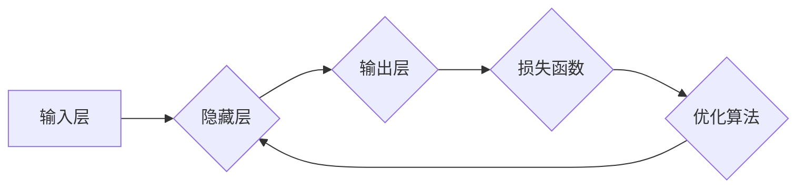

> 深度学习、模式识别、神经网络、卷积神经网络、循环神经网络、图像识别、自然语言处理

## 1. 背景介绍

人工智能（AI）正以惊人的速度发展，深度学习作为其重要组成部分，在模式识别领域取得了突破性的进展。模式识别是人工智能的核心任务之一，旨在从数据中学习并识别模式，从而实现对未知数据的分类、预测和理解。深度学习算法凭借其强大的学习能力和泛化能力，在图像识别、语音识别、自然语言处理等领域展现出巨大的潜力。

近年来，深度学习算法在模式识别领域的应用日益广泛，取得了令人瞩目的成果。例如，在图像识别领域，深度学习算法能够识别出各种物体、场景和人脸，并实现自动驾驶、医疗诊断等应用。在语音识别领域，深度学习算法能够准确识别语音指令，实现智能家居、语音助手等应用。在自然语言处理领域，深度学习算法能够理解和生成自然语言，实现机器翻译、文本摘要、聊天机器人等应用。

## 2. 核心概念与联系

深度学习的核心概念是人工神经网络（ANN）。人工神经网络模仿了人脑的神经元结构和功能，由多个层级的神经元组成。每个神经元接收来自其他神经元的输入信号，并通过激活函数进行处理，输出到下一层神经元。通过训练，神经网络能够学习到数据中的模式和关系，从而实现模式识别的目标。

深度学习算法通常包含以下几个关键组件：

* **输入层:**接收原始数据，例如图像像素、语音信号或文本单词。
* **隐藏层:**多个隐藏层之间进行特征提取和抽象，学习数据中的复杂模式。
* **输出层:**输出最终的识别结果，例如类别标签、预测值或文本序列。
* **激活函数:**控制神经元的输出，引入非线性，使神经网络能够学习更复杂的模式。
* **损失函数:**衡量模型预测结果与真实值的差异，用于指导模型训练。
* **优化算法:**更新神经网络参数，最小化损失函数值。

**Mermaid 流程图**



## 3. 核心算法原理 & 具体操作步骤

### 3.1  算法原理概述

深度学习算法主要包括卷积神经网络（CNN）和循环神经网络（RNN）。

* **卷积神经网络（CNN）:** CNN 擅长处理图像和视频数据，通过卷积操作提取图像特征，并利用池化操作降低数据维度，提高模型鲁棒性。

* **循环神经网络（RNN）:** RNN 擅长处理序列数据，例如文本和语音，通过循环结构记忆过去的输入信息，从而理解序列中的上下文关系。

### 3.2  算法步骤详解

**CNN 算法步骤:**

1. **输入图像数据:** 将图像数据输入到 CNN 的输入层。
2. **卷积操作:** 使用卷积核对图像进行卷积操作，提取图像特征。
3. **池化操作:** 对卷积结果进行池化操作，降低数据维度，提高模型鲁棒性。
4. **全连接层:** 将池化结果输入到全连接层，进行分类或预测。

**RNN 算法步骤:**

1. **输入序列数据:** 将序列数据输入到 RNN 的输入层。
2. **循环操作:** RNN 的循环结构将过去的输入信息传递到当前时刻，从而理解序列中的上下文关系。
3. **输出结果:** RNN 的输出层根据序列信息生成最终的输出结果。

### 3.3  算法优缺点

**CNN 优点:**

* 擅长处理图像数据，提取图像特征。
* 具有较高的准确率和鲁棒性。

**CNN 缺点:**

* 难以处理长序列数据。
* 训练时间较长。

**RNN 优点:**

* 擅长处理序列数据，理解上下文关系。
* 能够处理长序列数据。

**RNN 缺点:**

* 训练难度较大，容易出现梯度消失问题。
* 准确率相对 CNN 较低。

### 3.4  算法应用领域

**CNN 应用领域:**

* 图像识别
* 物体检测
* 图像分类
* 视频分析

**RNN 应用领域:**

* 自然语言处理
* 机器翻译
* 文本摘要
* 语音识别

## 4. 数学模型和公式 & 详细讲解 & 举例说明

### 4.1  数学模型构建

深度学习算法的数学模型主要基于神经网络的结构和激活函数。

**神经网络结构:**

神经网络由多个层级的神经元组成，每个神经元接收来自其他神经元的输入信号，并通过激活函数进行处理，输出到下一层神经元。

**激活函数:**

激活函数引入非线性，使神经网络能够学习更复杂的模式。常见的激活函数包括 sigmoid 函数、ReLU 函数和 tanh 函数。

### 4.2  公式推导过程

**损失函数:**

损失函数衡量模型预测结果与真实值的差异，用于指导模型训练。常见的损失函数包括均方误差（MSE）和交叉熵损失（CE）。

**优化算法:**

优化算法更新神经网络参数，最小化损失函数值。常见的优化算法包括梯度下降（GD）、随机梯度下降（SGD）和 Adam 算法。

### 4.3  案例分析与讲解

**图像分类案例:**

假设我们有一个图像分类任务，目标是将图像分类为猫、狗或鸟。我们可以使用 CNN 算法进行训练。

1. **数据准备:** 收集大量猫、狗和鸟的图像数据，并进行预处理，例如裁剪、缩放和归一化。
2. **模型构建:** 使用 CNN 算法构建一个图像分类模型，包含多个卷积层、池化层和全连接层。
3. **模型训练:** 使用训练数据训练模型，最小化损失函数值。
4. **模型评估:** 使用测试数据评估模型的准确率、召回率和 F1 分数。

## 5. 项目实践：代码实例和详细解释说明

### 5.1  开发环境搭建

* Python 3.x
* TensorFlow 或 PyTorch 深度学习框架
* Jupyter Notebook 或 VS Code 代码编辑器

### 5.2  源代码详细实现

```python
# 使用 TensorFlow 构建一个简单的 CNN 模型

import tensorflow as tf

# 定义模型结构
model = tf.keras.models.Sequential([
    tf.keras.layers.Conv2D(32, (3, 3), activation='relu', input_shape=(28, 28, 1)),
    tf.keras.layers.MaxPooling2D((2, 2)),
    tf.keras.layers.Conv2D(64, (3, 3), activation='relu'),
    tf.keras.layers.MaxPooling2D((2, 2)),
    tf.keras.layers.Flatten(),
    tf.keras.layers.Dense(10, activation='softmax')
])

# 编译模型
model.compile(optimizer='adam',
              loss='sparse_categorical_crossentropy',
              metrics=['accuracy'])

# 训练模型
model.fit(x_train, y_train, epochs=5)

# 评估模型
loss, accuracy = model.evaluate(x_test, y_test)
print('Test loss:', loss)
print('Test accuracy:', accuracy)
```

### 5.3  代码解读与分析

* **模型结构:** 模型包含两个卷积层、两个池化层、一个 Flatten 层和一个全连接层。
* **激活函数:** 使用 ReLU 函数作为激活函数，提高模型的学习能力。
* **损失函数:** 使用交叉熵损失函数，适合多分类任务。
* **优化算法:** 使用 Adam 算法优化模型参数。

### 5.4  运行结果展示

训练完成后，可以评估模型的准确率，并使用模型对新的图像数据进行分类。

## 6. 实际应用场景

### 6.1  图像识别

* **自动驾驶:** 识别道路、行人、车辆等物体，辅助车辆自动驾驶。
* **医疗诊断:** 识别病灶、肿瘤等异常区域，辅助医生诊断疾病。
* **安防监控:** 识别嫌疑人、违规行为等，提高安防监控效率。

### 6.2  语音识别

* **语音助手:** 理解用户语音指令，执行相应的操作。
* **语音翻译:** 将语音转换为文本，并进行翻译。
* **听力辅助:** 将语音转换为文本，帮助听障人士理解语音信息。

### 6.3  自然语言处理

* **机器翻译:** 将文本从一种语言翻译成另一种语言。
* **文本摘要:** 从长文本中提取关键信息，生成简短的摘要。
* **聊天机器人:** 与用户进行自然语言对话，提供信息和服务。

### 6.4  未来应用展望

深度学习算法在模式识别领域的应用前景广阔，未来将有更多新的应用场景出现，例如：

* **个性化推荐:** 根据用户的行为和偏好，推荐个性化的商品、服务和内容。
* **智能客服:** 使用深度学习算法构建智能客服系统，自动回答用户问题，提高客户服务效率。
* **欺诈检测:** 使用深度学习算法识别欺诈行为，保护用户权益。

## 7. 工具和资源推荐

### 7.1  学习资源推荐

* **书籍:**
    * 深度学习
    * 深度学习实战
    * 深度学习与自然语言处理
* **在线课程:**
    * Coursera 深度学习课程
    * Udacity 深度学习课程
    * fast.ai 深度学习课程

### 7.2  开发工具推荐

* **TensorFlow:** 开源深度学习框架，支持多种硬件平台。
* **PyTorch:** 开源深度学习框架，以其灵活性和易用性而闻名。
* **Keras:** 高级深度学习 API，可以运行在 TensorFlow、Theano 或 CNTK 后端。

### 7.3  相关论文推荐

* **AlexNet:** ImageNet Classification with Deep Convolutional Neural Networks
* **VGGNet:** Very Deep Convolutional Networks for Large-Scale Image Recognition
* **ResNet:** Deep Residual Learning for Image Recognition

## 8. 总结：未来发展趋势与挑战

### 8.1  研究成果总结

深度学习算法在模式识别领域取得了显著的成果，在图像识别、语音识别、自然语言处理等领域取得了突破性的进展。

### 8.2  未来发展趋势

* **模型更深更广:** 研究更深层次和更广阔的网络结构，提高模型的表达能力和泛化能力。
* **数据更丰富更有效:** 探索新的数据来源和数据增强技术，提高模型的训练效率和准确率。
* **算法更智能更高效:** 研究更智能、更有效的深度学习算法，例如自监督学习、强化学习和迁移学习。

### 8.3  面临的挑战

* **数据标注问题:** 深度学习算法需要大量的标注数据，数据标注成本高昂且耗时。
* **模型解释性问题:** 深度学习模型的决策过程难以解释，缺乏透明度和可信度。
* **计算资源问题:** 训练大型深度学习模型需要大量的计算资源，成本高昂。

### 8.4  研究展望

未来，深度学习算法将继续在模式识别领域发挥重要作用，并应用于更多新的领域。研究人员将继续探索更深、更广、更智能的深度学习算法，以解决当前面临的挑战，推动人工智能技术的发展。

## 9. 附录：常见问题与解答

**常见问题:**

* **深度学习算法的训练过程如何进行？**

**解答:** 深度学习算法的训练过程包括以下步骤：

1. **数据准备:** 收集和预处理训练数据。
2. **模型构建:** 使用深度学习框架构建模型结构。
3. **模型编译:** 选择优化算法、损失函数和评价指标。
4. **模型训练:** 使用训练数据训练模型，最小化损失函数值。
5. **模型评估:** 使用测试数据评估模型的性能