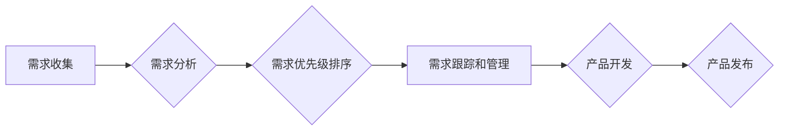

> AI创业公司,产品需求管理,需求收集,需求分析,需求优先级,敏捷开发,产品路线图,用户故事,优先级矩阵

## 1. 背景介绍

在当今科技飞速发展的时代，人工智能（AI）技术正在各个领域掀起一场革命。AI创业公司应运而生，涌现出许多具有颠覆性创新的产品和服务。然而，成功的AI产品开发离不开科学有效的需求管理。

传统的软件开发需求管理方法在AI领域并不完全适用。AI产品通常具有更高的复杂度、更大的不确定性以及更强的迭代性。因此，AI创业公司需要建立一套专门针对AI产品的需求管理体系，以确保产品能够满足用户需求，并实现商业目标。

## 2. 核心概念与联系

**2.1 产品需求管理**

产品需求管理是指在整个产品生命周期中，从收集用户需求到最终产品发布，对产品需求进行规划、分析、优先级排序、跟踪和管理的过程。

**2.2 AI产品需求特点**

AI产品需求具有以下特点：

* **复杂性:** AI产品通常涉及多个学科领域，例如机器学习、自然语言处理、计算机视觉等，需求本身也更加复杂。
* **不确定性:** AI技术的快速发展和应用场景的多样性，导致AI产品需求的不确定性较高。
* **迭代性:** AI产品开发通常采用迭代开发模式，需求会随着产品迭代不断变化和完善。
* **用户体验:** AI产品的核心价值在于为用户提供更好的体验，因此用户需求和体验至关重要。

**2.3 需求管理流程**

AI创业公司的产品需求管理流程通常包括以下几个阶段：

* **需求收集:** 通过用户调研、市场分析、专家访谈等方式收集用户需求和市场趋势。
* **需求分析:** 对收集到的需求进行分析、整理和提炼，形成明确的产品需求文档。
* **需求优先级排序:** 根据需求的价值、风险、可行性等因素，对需求进行优先级排序。
* **需求跟踪和管理:** 对需求进行跟踪和管理，确保需求得到及时满足。

**2.4 需求管理工具**

AI创业公司可以使用各种需求管理工具来辅助需求管理工作，例如：

* **Jira:** 是一款流行的项目管理工具，可以用于需求管理、任务分配、进度跟踪等。
* **Trello:** 是一款基于卡片的项目管理工具，可以用于需求管理、协作和可视化流程。
* **Productboard:** 是一款专门针对产品管理的工具，可以用于需求收集、分析、优先级排序和产品路线图规划。

**2.5 Mermaid 流程图**



## 3. 核心算法原理 & 具体操作步骤

**3.1 算法原理概述**

需求优先级排序算法是AI创业公司产品需求管理中至关重要的环节。它可以帮助团队快速识别和聚焦最重要的需求，从而提高开发效率和产品质量。常见的需求优先级排序算法包括：

* **MoSCoW法:** 将需求分为四个优先级等级：必须（Must have）、应该（Should have）、可以（Could have）、不会（Won't have）。
* **RICE法:** 根据需求的Reach（影响范围）、Impact（影响程度）、Confidence（置信度）和Effort（实施难度）四个维度对需求进行评分，并根据总分进行排序。
* **Value vs. Effort矩阵:** 将需求按照价值和实施难度进行分类，并根据分类结果进行排序。

**3.2 算法步骤详解**

以RICE法为例，详细说明其步骤：

1. **定义指标:** 确定每个指标的评分标准和范围。例如，Reach的评分范围为1-5，Impact的评分范围为1-10，Confidence的评分范围为1-5，Effort的评分范围为1-5。
2. **评估需求:** 针对每个需求，根据定义的指标进行评估，并给出相应的评分。
3. **计算RICE得分:** 将每个需求的Reach、Impact、Confidence和Effort评分相乘，得到其RICE得分。
4. **排序需求:** 根据RICE得分从高到低排序需求，优先开发得分最高的需求。

**3.3 算法优缺点**

* **优点:** RICE法是一种简单易懂、易于实施的算法，可以帮助团队快速识别和优先级排序重要的需求。
* **缺点:** RICE法过于依赖主观评分，可能会受到个人偏见的影响。

**3.4 算法应用领域**

需求优先级排序算法广泛应用于软件开发、产品管理、项目管理等领域。

## 4. 数学模型和公式 & 详细讲解 & 举例说明

**4.1 数学模型构建**

RICE法的数学模型可以表示为：

```latex
RICE = Reach * Impact * Confidence / Effort
```

其中：

* Reach: 需求影响范围
* Impact: 需求影响程度
* Confidence: 对需求影响程度的置信度
* Effort: 实现需求的难度

**4.2 公式推导过程**

RICE公式的推导过程基于以下假设：

* 需求的价值取决于其影响范围和影响程度。
* 需求的价值也取决于对影响程度的置信度。
* 需求的价值与实现难度成反比。

**4.3 案例分析与讲解**

假设我们有两个需求：

* **需求A:** 开发一个新的用户注册功能，预计可以增加10%的用户注册量，影响程度为8分，置信度为4分，实现难度为2分。
* **需求B:** 开发一个新的用户反馈机制，预计可以提高用户满意度，影响程度为5分，置信度为3分，实现难度为5分。

根据RICE公式，我们可以计算出这两个需求的RICE得分：

* **需求A:** RICE = 1.1 * 8 * 4 / 2 = 17.6
* **需求B:** RICE = 1 * 5 * 3 / 5 = 3

因此，需求A的RICE得分高于需求B，优先级更高。

## 5. 项目实践：代码实例和详细解释说明

**5.1 开发环境搭建**

* Python 3.x
* Jupyter Notebook

**5.2 源代码详细实现**

```python
def calculate_rice_score(reach, impact, confidence, effort):
  """
  计算需求的RICE得分。

  Args:
    reach: 需求影响范围。
    impact: 需求影响程度。
    confidence: 对需求影响程度的置信度。
    effort: 实现需求的难度。

  Returns:
    需求的RICE得分。
  """
  return reach * impact * confidence / effort

# 示例需求
demand_a = {
  "reach": 1.1,
  "impact": 8,
  "confidence": 4,
  "effort": 2
}

demand_b = {
  "reach": 1,
  "impact": 5,
  "confidence": 3,
  "effort": 5
}

# 计算需求的RICE得分
rice_score_a = calculate_rice_score(**demand_a)
rice_score_b = calculate_rice_score(**demand_b)

# 打印结果
print(f"需求A的RICE得分: {rice_score_a}")
print(f"需求B的RICE得分: {rice_score_b}")
```

**5.3 代码解读与分析**

* `calculate_rice_score()`函数计算需求的RICE得分，根据公式进行计算。
* `demand_a`和`demand_b`分别代表两个示例需求，包含了reach、impact、confidence和effort四个指标。
* 代码调用`calculate_rice_score()`函数计算两个需求的RICE得分，并打印结果。

**5.4 运行结果展示**

运行代码后，会输出两个需求的RICE得分，例如：

```
需求A的RICE得分: 17.6
需求B的RICE得分: 3
```

## 6. 实际应用场景

**6.1 AI聊天机器人开发**

在开发AI聊天机器人时，需要优先级排序用户需求，例如：

* 必须：支持基本的对话交互，例如问答、简单的指令执行。
* 应该：支持更复杂的对话场景，例如多轮对话、情感识别。
* 可以：支持个性化定制、多语言支持。

**6.2 AI图像识别系统开发**

在开发AI图像识别系统时，需要优先级排序需求，例如：

* 必须：能够识别常见的物体类别，例如人、车、树。
* 应该：能够识别更细粒度的物体类别，例如不同种类的汽车、树木。
* 可以：能够进行图像分割、物体跟踪等高级功能。

**6.4 未来应用展望**

随着AI技术的不断发展，需求管理在AI创业公司中将变得更加重要。未来，需求管理工具和方法将会更加智能化、自动化，能够更好地帮助团队管理和优先级排序AI产品需求。

## 7. 工具和资源推荐

**7.1 学习资源推荐**

* **书籍:**
    * 《The Lean Startup》 by Eric Ries
    * 《Inspired》 by Marty Cagan
* **在线课程:**
    * Udemy: Product Management Fundamentals
    * Coursera: Product Management Specialization

**7.2 开发工具推荐**

* **Jira:** https://www.atlassian.com/software/jira
* **Trello:** https://trello.com/
* **Productboard:** https://productboard.com/

**7.3 相关论文推荐**

* **RICE Scoring: A Simple Method for Prioritizing Product Features** by Intercom
* **MoSCoW Method: A Simple Prioritization Technique** by Alistair Cockburn

## 8. 总结：未来发展趋势与挑战

**8.1 研究成果总结**

本文介绍了AI创业公司产品需求管理的必要性，并详细阐述了需求收集、需求分析、需求优先级排序等关键环节。

**8.2 未来发展趋势**

* **AI驱动的需求管理:** 利用AI技术自动收集、分析和优先级排序需求。
* **敏捷开发与需求管理的融合:** 将敏捷开发理念应用于需求管理，提高需求管理的灵活性。
* **用户体验驱动的需求管理:** 将用户体验作为需求管理的核心目标，开发更符合用户需求的产品。

**8.3 面临的挑战**

* **AI技术的快速发展:** 需要不断学习和掌握新的AI技术，才能有效地应用于需求管理。
* **数据质量问题:** AI驱动的需求管理依赖于高质量的数据，需要确保数据准确性和完整性。
* **伦理问题:** AI技术在需求管理中的应用需要考虑伦理问题，例如数据隐私和算法偏见。

**8.4 研究展望**

未来，我们将继续研究AI驱动的需求管理方法，探索如何更好地利用AI技术帮助AI创业公司开发出更优秀的产品。

## 9. 附录：常见问题与解答

**9.1 如何确定需求的Reach、Impact、Confidence和Effort？**

* **Reach:** 可以参考目标用户群体的大小、需求的覆盖范围等因素。
* **Impact:** 可以参考需求实现后对用户体验、业务目标等的影响程度。
* **Confidence:** 可以参考对需求影响程度的把握程度，以及相关数据和分析结果的支持程度。
* **Effort:** 可以参考实现需求所需的开发时间、人力成本等因素。

**9.2 RICE法是否适用于所有类型的需求？**

RICE法是一种通用的需求优先级排序算法，但它可能不适用于所有类型的需求。例如，对于一些紧急的修复需求，RICE法可能无法准确反映其优先级。

**9.3 如何平衡用户需求和商业目标？**

在AI创业公司中，需要平衡用户需求和商业目标。可以采用以下方法：

* **用户调研:** 通过用户调研了解用户需求和痛点。
* **市场分析:** 分析市场趋势和竞争对手的产品。
* **价值分析:** 对不同需求的价值进行评估，选择能够最大