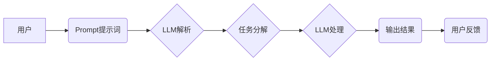

> AI大模型，Prompt提示词，任务分解，最佳实践，复杂任务，小问题，自然语言处理，机器学习

## 1. 背景介绍

近年来，大规模语言模型（LLM）的快速发展，如GPT-3、LaMDA、BERT等，为人工智能领域带来了革命性的变革。这些模型展现出惊人的文本生成、翻译、问答和代码生成能力，为我们提供了强大的工具，帮助我们解决各种复杂问题。然而，LLM的强大能力也带来了一个关键挑战：如何有效地与模型进行交互，并引导其完成我们期望的任务。

Prompt提示词作为与LLM交互的关键环节，直接影响着模型的输出质量和任务完成效果。一个精心设计的Prompt可以引导模型准确理解任务需求，并生成高质量的输出；而一个模糊不清、不够明确的Prompt则可能导致模型产生错误、不相关的输出，甚至陷入“无用循环”。

因此，如何设计有效的Prompt提示词，成为LLM应用的关键问题之一。本文将深入探讨AI大模型Prompt提示词的最佳实践，重点介绍如何将复杂任务分解成一系列小问题，并通过精心设计的Prompt引导模型逐步完成任务。

## 2. 核心概念与联系

**2.1  Prompt提示词**

Prompt提示词是指用户向LLM输入的一系列文本，用于引导模型理解任务需求并生成相应的输出。Prompt可以包含任务描述、输入数据、示例输出等信息。

**2.2  任务分解**

任务分解是指将一个复杂的任务拆解成多个相对独立、易于处理的小任务。通过将复杂任务分解成小任务，可以降低模型的认知负担，提高模型完成任务的效率和准确性。

**2.3  LLM交互流程**

LLM交互流程通常包括以下步骤：

1. 用户输入Prompt提示词。
2. LLM解析Prompt，理解任务需求。
3. LLM根据任务需求，从其训练数据中检索相关信息。
4. LLM生成相应的输出文本。
5. 用户查看输出结果，并根据需要进行反馈。

**2.4  核心概念关系图**



## 3. 核心算法原理 & 具体操作步骤

**3.1  算法原理概述**

将复杂任务分解成小问题的核心算法原理是基于人类认知的分解策略。人类在面对复杂问题时，通常会将其分解成多个更小的、更容易理解和解决的子问题。

LLM的Prompt提示词设计也遵循类似的原则。通过将复杂任务分解成一系列小问题，我们可以引导LLM逐步理解任务需求，并生成更准确、更符合预期结果的输出。

**3.2  算法步骤详解**

1. **识别任务目标:** 首先，需要明确用户想要完成的任务目标是什么。

2. **分解任务:** 将任务目标分解成多个相对独立、易于处理的小任务。

3. **设计Prompt:** 为每个小任务设计一个明确、简洁的Prompt提示词，引导LLM完成相应的子任务。

4. **串联Prompt:** 将所有小任务的Prompt串联起来，形成一个完整的Prompt序列，引导LLM逐步完成整个任务。

5. **评估结果:** 评估LLM生成的输出结果，并根据需要进行反馈和调整Prompt。

**3.3  算法优缺点**

**优点:**

* 降低模型认知负担，提高任务完成效率。
* 提高模型输出的准确性和一致性。
* 增强用户与模型的交互体验。

**缺点:**

* 需要花费更多时间和精力进行任务分解和Prompt设计。
* 对于复杂的任务，可能需要设计大量的Prompt，增加模型的计算成本。

**3.4  算法应用领域**

* 自然语言处理：文本摘要、机器翻译、问答系统等。
* 代码生成：自动生成代码、代码修复等。
* 创意写作：诗歌创作、故事生成等。
* 数据分析：数据挖掘、报表生成等。

## 4. 数学模型和公式 & 详细讲解 & 举例说明

**4.1  数学模型构建**

将复杂任务分解成小问题的数学模型可以抽象为一个图结构，其中每个节点代表一个子任务，边代表子任务之间的依赖关系。

**4.2  公式推导过程**

可以使用图论中的算法，例如拓扑排序，来确定子任务的执行顺序，并构建一个完整的任务执行流程。

**4.3  案例分析与讲解**

例如，将“写一篇关于人工智能的文章”这个复杂任务分解成以下小任务：

1. 确定文章主题和方向。
2. 收集相关资料和数据。
3. 撰写文章框架和结构。
4. 写入文章正文。
5. 修改和完善文章。

我们可以将这些小任务构建成一个图结构，并使用拓扑排序算法确定执行顺序，最终得到一个完整的任务执行流程。

## 5. 项目实践：代码实例和详细解释说明

**5.1  开发环境搭建**

可以使用Python语言和相应的库，例如transformers、torch等，搭建LLM开发环境。

**5.2  源代码详细实现**

```python
import transformers

# 加载预训练模型
model = transformers.AutoModelForSeq2SeqLM.from_pretrained("gpt2")

# 定义任务分解函数
def decompose_task(task):
  # 根据任务类型，分解成多个子任务
  # ...

# 定义Prompt设计函数
def design_prompt(sub_task):
  # 根据子任务，设计相应的Prompt提示词
  # ...

# 主程序
task = "写一篇关于人工智能的文章"
sub_tasks = decompose_task(task)
prompts = [design_prompt(sub_task) for sub_task in sub_tasks]

# 使用LLM生成输出
for prompt in prompts:
  output = model.generate(prompt)
  print(output.decode())
```

**5.3  代码解读与分析**

这段代码首先加载一个预训练的LLM模型，然后定义了两个函数：`decompose_task`和`design_prompt`。

`decompose_task`函数根据任务类型，将任务分解成多个子任务。

`design_prompt`函数根据子任务，设计相应的Prompt提示词。

主程序首先定义一个复杂任务，然后调用`decompose_task`函数将其分解成多个子任务，再调用`design_prompt`函数设计相应的Prompt，最后使用LLM模型生成输出。

**5.4  运行结果展示**

运行这段代码后，LLM模型将根据设计好的Prompt，逐步完成任务，并生成一篇关于人工智能的文章。

## 6. 实际应用场景

**6.1  教育领域**

* 个性化学习：根据学生的学习进度和能力，生成个性化的学习内容和练习题。
* 智能辅导：为学生提供实时反馈和解答，帮助学生理解学习内容。

**6.2  医疗领域**

* 疾病诊断：根据患者的症状和病史，辅助医生进行疾病诊断。
* 药物研发：加速药物研发过程，帮助科学家发现新的药物靶点。

**6.3  商业领域**

* 客户服务：提供智能客服，帮助企业提高客户服务效率。
* 市场营销：根据客户数据，生成个性化的营销内容。

**6.4  未来应用展望**

随着LLM技术的不断发展，Prompt提示词的设计将变得更加重要。未来，我们可能会看到更加智能、更加高效的Prompt设计方法，例如：

* 基于机器学习的Prompt生成模型。
* 基于用户行为分析的个性化Prompt设计。
* 基于多模态信息的Prompt设计。

## 7. 工具和资源推荐

**7.1  学习资源推荐**

* **OpenAI API文档:** https://platform.openai.com/docs/api-reference
* **HuggingFace Transformers库文档:** https://huggingface.co/docs/transformers/index

**7.2  开发工具推荐**

* **Jupyter Notebook:** https://jupyter.org/
* **Google Colab:** https://colab.research.google.com/

**7.3  相关论文推荐**

* **Attention Is All You Need:** https://arxiv.org/abs/1706.03762
* **BERT: Pre-training of Deep Bidirectional Transformers for Language Understanding:** https://arxiv.org/abs/1810.04805

## 8. 总结：未来发展趋势与挑战

**8.1  研究成果总结**

本文探讨了AI大模型Prompt提示词的最佳实践，重点介绍了如何将复杂任务分解成小问题，并通过精心设计的Prompt引导模型完成任务。

**8.2  未来发展趋势**

未来，LLM技术将继续发展，Prompt提示词的设计也将变得更加智能、更加高效。

**8.3  面临的挑战**

* 如何设计更加通用、更加鲁棒的Prompt提示词。
* 如何解决Prompt提示词的安全性问题。
* 如何提高Prompt提示词的效率和可解释性。

**8.4  研究展望**

未来，我们将继续研究Prompt提示词的设计方法，并探索其在更多领域的应用。


## 9. 附录：常见问题与解答

**9.1  问题：如何设计一个好的Prompt提示词？**

**答案：**

* 明确任务目标：首先要明确用户想要完成的任务目标是什么。
* 提供充足信息：给模型提供足够的上下文信息，帮助其理解任务需求。
* 使用简洁明了的语言：避免使用过于复杂的语言或专业术语。
* 提供示例输出：如果可能，提供一些示例输出，帮助模型理解期望的输出格式。

**9.2  问题：如何评估Prompt提示词的效果？**

**答案：**

* 评估模型输出的准确性、相关性和一致性。
* 评估用户对模型输出的满意度。
* 比较不同Prompt提示词的效果，选择效果最好的Prompt。


作者：禅与计算机程序设计艺术 / Zen and the Art of Computer Programming 
<end_of_turn>