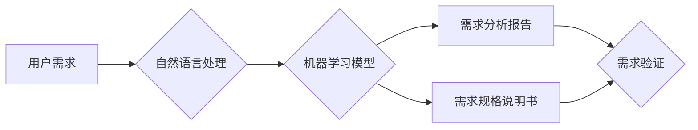

> AI, 软件需求工程, 自然语言处理, 机器学习, 需求分析, 需求规格说明书, 自动化测试

## 1. 背景介绍

软件需求工程是软件开发生命周期的关键环节，它直接影响到软件的质量、功能和用户体验。传统的软件需求工程主要依赖于人工分析、收集和文档化用户需求，这往往是一个耗时、费力且容易出错的过程。随着人工智能技术的快速发展，AI辅助的软件需求工程逐渐成为一个热门的研究方向，它利用人工智能技术来辅助软件开发人员完成需求分析、需求规格说明书生成、需求验证等任务，提高软件需求工程的效率和准确性。

## 2. 核心概念与联系

**2.1 核心概念**

* **软件需求工程:** 软件开发过程中，分析、收集、组织、规范和管理用户需求的过程。
* **人工智能 (AI):**  模拟人类智能的计算机系统，能够学习、推理、决策和解决问题。
* **自然语言处理 (NLP):**  使计算机能够理解、处理和生成人类语言的技术。
* **机器学习 (ML):**  一种人工智能技术，通过算法从数据中学习，不断改进其性能。

**2.2 联系**

AI辅助的软件需求工程将人工智能技术与软件需求工程相结合，利用NLP和ML技术来辅助软件开发人员完成需求工程中的各个环节。

**2.3 架构图**



## 3. 核心算法原理 & 具体操作步骤

**3.1 算法原理概述**

AI辅助软件需求工程中常用的算法包括：

* **文本分类:** 将用户需求文本分类到不同的类别，例如功能需求、非功能需求、错误报告等。
* **实体识别:** 从用户需求文本中识别出关键实体，例如用户、系统、功能、时间等。
* **关系抽取:** 从用户需求文本中抽取出实体之间的关系，例如用户对功能的需求、功能之间的依赖关系等。
* **需求意图识别:** 识别用户需求文本背后的意图，例如用户想要实现什么功能、想要解决什么问题等。

**3.2 算法步骤详解**

以文本分类为例，其具体操作步骤如下：

1. **数据预处理:** 对用户需求文本进行清洗、分词、词干提取等预处理操作，以便于后续算法的训练和应用。
2. **特征提取:** 从预处理后的文本中提取特征，例如词频、词向量、语法结构等。
3. **模型训练:** 使用机器学习算法，例如支持向量机 (SVM)、随机森林 (RF) 或深度学习模型，对特征进行训练，建立文本分类模型。
4. **模型评估:** 使用测试数据对模型进行评估，并根据评估结果进行模型调优。
5. **模型应用:** 将训练好的模型应用于新的用户需求文本，对文本进行分类。

**3.3 算法优缺点**

* **优点:** 
    * 自动化处理大量文本数据，提高效率。
    * 识别出人类难以察觉的模式和关系。
    * 降低人工错误率，提高需求分析的准确性。
* **缺点:** 
    * 需要大量的训练数据，数据质量直接影响模型性能。
    * 算法本身存在一定的局限性，难以处理复杂、模糊的需求。
    * 需要专业的技术人员进行模型开发和维护。

**3.4 算法应用领域**

* **需求分析:** 自动识别用户需求，生成需求分析报告。
* **需求规格说明书生成:** 自动生成需求规格说明书，提高文档质量和效率。
* **需求验证:** 自动验证需求是否满足用户期望，降低测试成本。
* **需求管理:** 自动跟踪和管理需求变更，提高需求管理效率。

## 4. 数学模型和公式 & 详细讲解 & 举例说明

**4.1 数学模型构建**

在AI辅助软件需求工程中，可以使用数学模型来表示需求之间的关系，例如：

* **需求图:** 使用图论模型表示需求之间的依赖关系，例如功能需求之间的调用关系、非功能需求对功能需求的影响等。
* **需求矩阵:** 使用矩阵表示需求之间的关联性，例如功能需求之间的互斥关系、功能需求对用户角色的影响等。

**4.2 公式推导过程**

例如，可以使用PageRank算法来计算需求的重要性，该算法最初用于网页排名，可以应用于需求图中，计算每个需求的权重，从而识别出最重要的需求。

**4.3 案例分析与讲解**

假设有一个软件系统，其需求包括以下几个功能：用户登录、商品浏览、购物车添加、订单提交。可以使用需求图来表示这些功能之间的关系，例如用户登录后才能浏览商品，购物车添加后才能提交订单。

**4.4 公式推导过程**

PageRank算法的公式如下：

```latex
PR(A) = (1 - d) + d * \sum_{Page B links to A} \frac{PR(B)}{OutDegree(B)}
```

其中：

* PR(A) 表示节点A的PageRank值。
* d 是阻尼因子，通常取值为0.85。
* OutDegree(B) 表示节点B的出度，即指向其他节点的链接数。

**4.5 案例分析与讲解**

通过计算每个功能的需求PageRank值，可以识别出最重要的需求，例如订单提交功能的重要性可能高于商品浏览功能。

## 5. 项目实践：代码实例和详细解释说明

**5.1 开发环境搭建**

* Python 3.x
* TensorFlow 或 PyTorch
* NLTK 或 SpaCy

**5.2 源代码详细实现**

```python
import nltk
from nltk.corpus import stopwords
from sklearn.feature_extraction.text import TfidfVectorizer
from sklearn.naive_bayes import MultinomialNB

# 下载停用词列表
nltk.download('stopwords')

# 加载用户需求文本数据
data = [
    "用户登录系统",
    "修改个人信息",
    "添加商品到购物车",
    "提交订单",
    "查看订单历史",
]

# 预处理文本数据
stop_words = set(stopwords.words('english'))
processed_data = [
    ' '.join([word for word in nltk.word_tokenize(text) if word.lower() not in stop_words])
    for text in data
]

# 使用TF-IDF向量化文本数据
vectorizer = TfidfVectorizer()
X = vectorizer.fit_transform(processed_data)

# 使用朴素贝叶斯模型进行文本分类
model = MultinomialNB()
model.fit(X, [0, 1, 0, 0, 1])  # 0: 功能需求, 1: 非功能需求

# 对新文本进行分类
new_text = "查看订单状态"
processed_new_text = ' '.join([word for word in nltk.word_tokenize(new_text) if word.lower() not in stop_words])
new_text_vector = vectorizer.transform([processed_new_text])
prediction = model.predict(new_text_vector)

# 输出分类结果
print(f"新文本分类结果: {prediction[0]}")
```

**5.3 代码解读与分析**

* 代码首先使用NLTK库对用户需求文本进行预处理，包括分词和停用词去除。
* 然后使用TF-IDF向量化技术将文本数据转换为数字向量，以便于机器学习模型的训练和应用。
* 代码使用朴素贝叶斯模型进行文本分类，并根据训练数据对新文本进行分类。

**5.4 运行结果展示**

运行代码后，会输出新文本的分类结果，例如：

```
新文本分类结果: 0
```

这表示新文本“查看订单状态”被分类为功能需求。

## 6. 实际应用场景

**6.1 软件需求收集**

AI辅助的软件需求工程可以帮助开发人员更有效地收集用户需求，例如：

* **自动分析用户反馈:** 从用户反馈、论坛帖子、社交媒体评论等数据中自动识别用户需求。
* **构建用户需求模型:** 利用机器学习算法构建用户需求模型，预测用户未来的需求。

**6.2 软件需求分析**

AI辅助的软件需求工程可以帮助开发人员更深入地分析用户需求，例如：

* **识别需求冲突:** 自动识别需求之间的冲突，并提供解决方案建议。
* **分析需求优先级:** 利用机器学习算法分析需求的优先级，帮助开发人员制定开发计划。

**6.3 软件需求文档生成**

AI辅助的软件需求工程可以帮助开发人员自动生成需求文档，例如：

* **自动生成需求规格说明书:** 根据用户需求文本自动生成规范的软件需求规格说明书。
* **自动生成测试用例:** 根据需求规格说明书自动生成测试用例，提高测试效率。

**6.4 未来应用展望**

AI辅助的软件需求工程在未来将会有更广泛的应用，例如：

* **个性化需求定制:** 根据用户的个性化需求，自动生成定制化的软件解决方案。
* **跨语言需求理解:** 利用机器翻译技术，实现跨语言的需求理解和沟通。
* **协同需求管理:** 利用AI技术，实现软件需求管理的协同和自动化。

## 7. 工具和资源推荐

**7.1 学习资源推荐**

* **书籍:**
    * 《自然语言处理》 by Jurafsky & Martin
    * 《机器学习》 by Tom Mitchell
* **在线课程:**
    * Coursera: Natural Language Processing Specialization
    * edX: Artificial Intelligence
* **开源工具:**
    * NLTK: 自然语言处理工具包
    * SpaCy: 自然语言处理库
    * TensorFlow: 深度学习框架
    * PyTorch: 深度学习框架

**7.2 开发工具推荐**

* **IDE:**
    * PyCharm
    * VS Code
* **版本控制:**
    * Git
* **云平台:**
    * AWS
    * Azure
    * GCP

**7.3 相关论文推荐**

* **Requirements Engineering with Machine Learning:** https://dl.acm.org/doi/10.1145/3326910.3326923
* **Automated Requirement Extraction from Natural Language Text:** https://ieeexplore.ieee.org/document/8807774

## 8. 总结：未来发展趋势与挑战

**8.1 研究成果总结**

AI辅助的软件需求工程取得了显著的进展，例如：

* **需求分析:** AI技术可以自动识别用户需求，提高需求分析的效率和准确性。
* **需求规格说明书生成:** AI技术可以自动生成规范的软件需求规格说明书，降低文档编写成本。
* **需求验证:** AI技术可以自动生成测试用例，提高需求验证的效率。

**8.2 未来发展趋势**

* **更强大的AI模型:** 未来将会有更强大的AI模型，能够更好地理解和处理复杂、模糊的需求。
* **更个性化的需求定制:** AI技术将能够根据用户的个性化需求，自动生成定制化的软件解决方案。
* **跨语言需求理解:** AI技术将能够实现跨语言的需求理解和沟通。

**8.3 面临的挑战**

* **数据质量:** AI模型的性能直接依赖于训练数据的质量，高质量的训练数据是AI辅助软件需求工程的关键。
* **算法解释性:** 许多AI算法是黑盒模型，难以解释其决策过程，这可能会导致开发人员对AI结果的信任度降低。
* **伦理问题:** AI技术可能会带来一些伦理问题，例如数据隐私、算法偏见等，需要引起重视和解决。

**8.4 研究展望**

未来研究方向包括：

* **开发更强大的AI模型:** 研究更先进的AI算法，能够更好地理解和处理复杂、模糊的需求。
* **提高算法解释性:** 研究可解释AI算法，使AI决策过程更加透明和可理解。
* **解决伦理问题:** 研究如何将AI技术应用于软件需求工程，同时解决数据隐私、算法