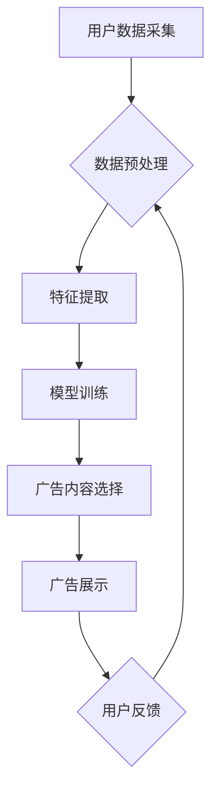

> AI,智能广告牌,个性化广告,机器学习,深度学习,计算机视觉,自然语言处理,数据分析

## 1. 背景介绍

户外广告一直是品牌营销的重要组成部分，但传统的广告牌往往缺乏针对性和互动性，难以精准触达目标受众。随着人工智能技术的快速发展，智能广告牌应运而生，利用AI技术实现个性化广告投放，提升广告效果和用户体验。

智能广告牌通过摄像头、传感器等设备收集用户数据，结合机器学习、深度学习等算法，分析用户画像、行为特征等信息，精准识别目标受众，并根据用户喜好、需求等因素，动态调整广告内容和展示方式，实现个性化广告投放。

## 2. 核心概念与联系

**2.1 智能广告牌架构**

智能广告牌的架构通常包含以下几个关键模块：

* **硬件层:** 包括显示屏、摄像头、传感器、计算单元等硬件设备。
* **感知层:** 利用摄像头、传感器等设备采集用户数据，例如用户年龄、性别、表情、行为轨迹等。
* **处理层:** 利用机器学习、深度学习等算法对用户数据进行分析和处理，构建用户画像，识别目标受众。
* **决策层:** 根据用户画像和广告目标，选择合适的广告内容和展示方式。
* **展示层:** 将广告内容以动态、交互的方式展示给用户。

**2.2  核心概念原理与架构**



**2.3  核心技术**

* **计算机视觉:** 用于识别用户画像、行为特征等信息。
* **自然语言处理:** 用于理解用户需求、情绪等信息。
* **机器学习:** 用于构建用户画像、预测用户行为等。
* **深度学习:** 用于更精准地识别用户特征、分析用户行为等。

## 3. 核心算法原理 & 具体操作步骤

**3.1  算法原理概述**

智能广告牌的核心算法通常基于机器学习和深度学习技术，主要包括以下几个步骤：

* **数据采集:** 收集用户数据，例如年龄、性别、兴趣爱好、行为轨迹等。
* **数据预处理:** 对收集到的数据进行清洗、转换、特征工程等处理，使其适合模型训练。
* **模型训练:** 利用机器学习或深度学习算法，训练模型，使其能够识别用户画像、预测用户行为等。
* **广告内容选择:** 根据用户画像和广告目标，选择合适的广告内容和展示方式。
* **广告展示:** 将广告内容以动态、交互的方式展示给用户。
* **用户反馈:** 收集用户反馈，例如点击率、停留时间等，用于模型优化和改进。

**3.2  算法步骤详解**

1. **数据采集:** 智能广告牌通过摄像头、传感器等设备采集用户数据，例如年龄、性别、表情、行为轨迹等。
2. **数据预处理:** 对采集到的数据进行清洗、转换、特征工程等处理，例如去除噪声数据、将数据转换为数字格式、提取用户特征等。
3. **模型训练:** 利用机器学习或深度学习算法，训练模型，使其能够识别用户画像、预测用户行为等。例如，可以使用卷积神经网络（CNN）识别用户画像，使用循环神经网络（RNN）预测用户行为等。
4. **广告内容选择:** 根据用户画像和广告目标，选择合适的广告内容和展示方式。例如，如果用户是年轻女性，并且对时尚感兴趣，则可以选择展示时尚品牌的广告。
5. **广告展示:** 将广告内容以动态、交互的方式展示给用户。例如，可以使用动画、视频、声音等方式，吸引用户的注意力。
6. **用户反馈:** 收集用户反馈，例如点击率、停留时间等，用于模型优化和改进。

**3.3  算法优缺点**

* **优点:**
    * 个性化广告投放，提升广告效果。
    * 提升用户体验，减少广告打扰。
    * 数据驱动决策，优化广告策略。
* **缺点:**
    * 数据隐私安全问题。
    * 模型训练成本高。
    * 需要强大的计算能力。

**3.4  算法应用领域**

* 户外广告
* 商场广告
* 交通广告
* 公共场所广告

## 4. 数学模型和公式 & 详细讲解 & 举例说明

**4.1  数学模型构建**

智能广告牌的个性化广告投放可以建模为一个优化问题，目标是最大化广告效果，同时考虑用户体验和数据隐私等因素。

**4.2  公式推导过程**

假设广告效果可以用点击率（CTR）来衡量，用户体验可以用停留时间（dwell time）来衡量，数据隐私可以用隐私损失函数（privacy loss function）来衡量。

则可以构建以下优化目标函数：

```latex
maximize: CTR * dwell time - privacy loss function
```

其中，CTR、dwell time 和 privacy loss function 分别代表点击率、停留时间和隐私损失函数。

**4.3  案例分析与讲解**

例如，假设一个智能广告牌想要展示服装品牌的广告，可以根据用户的年龄、性别、兴趣爱好等信息，选择合适的服装款式和广告内容。

如果用户的年龄偏年轻，并且对时尚感兴趣，则可以选择展示年轻时尚的服装广告；如果用户的年龄偏大，并且对舒适性感兴趣，则可以选择展示舒适休闲的服装广告。

## 5. 项目实践：代码实例和详细解释说明

**5.1  开发环境搭建**

* 操作系统：Ubuntu 20.04
* Python 版本：3.8
* 必要的库：TensorFlow、Keras、OpenCV、NumPy等

**5.2  源代码详细实现**

```python
# 导入必要的库
import tensorflow as tf
from tensorflow.keras.models import Sequential
from tensorflow.keras.layers import Conv2D, MaxPooling2D, Flatten, Dense

# 定义模型结构
model = Sequential()
model.add(Conv2D(32, (3, 3), activation='relu', input_shape=(224, 224, 3)))
model.add(MaxPooling2D((2, 2)))
model.add(Conv2D(64, (3, 3), activation='relu'))
model.add(MaxPooling2D((2, 2)))
model.add(Flatten())
model.add(Dense(10, activation='softmax'))

# 编译模型
model.compile(optimizer='adam',
              loss='categorical_crossentropy',
              metrics=['accuracy'])

# 训练模型
model.fit(x_train, y_train, epochs=10)

# 评估模型
loss, accuracy = model.evaluate(x_test, y_test)
print('Loss:', loss)
print('Accuracy:', accuracy)
```

**5.3  代码解读与分析**

这段代码定义了一个简单的卷积神经网络模型，用于识别用户画像。

* `Conv2D` 层用于提取图像特征。
* `MaxPooling2D` 层用于降维，减少计算量。
* `Flatten` 层将多维特征转换为一维向量。
* `Dense` 层用于分类，输出用户画像的类别。

**5.4  运行结果展示**

训练完成后，可以将模型应用于实际场景，识别用户的画像，并根据用户的画像选择合适的广告内容。

## 6. 实际应用场景

**6.1  户外广告**

智能广告牌可以根据路过的车辆、行人等信息，选择合适的广告内容和展示方式，提高广告效果。

**6.2  商场广告**

智能广告牌可以根据顾客的年龄、性别、兴趣爱好等信息，选择合适的商品广告，引导顾客购买。

**6.3  交通广告**

智能广告牌可以根据乘客的目的地、出行时间等信息，选择合适的广告内容，提高广告的针对性。

**6.4  未来应用展望**

随着人工智能技术的不断发展，智能广告牌的应用场景将会更加广泛，例如：

* **个性化推荐:** 根据用户的兴趣爱好、购买历史等信息，推荐个性化的商品和服务。
* **互动广告:** 与用户进行互动，例如问答、游戏等，提高用户参与度。
* **增强现实广告:** 利用增强现实技术，将虚拟广告叠加到现实世界中，提升广告的沉浸感。

## 7. 工具和资源推荐

**7.1  学习资源推荐**

* **书籍:**
    * 深度学习
    * 人工智能
* **在线课程:**
    * Coursera
    * edX
    * Udacity

**7.2  开发工具推荐**

* **TensorFlow:** 深度学习框架
* **Keras:** 高级API，用于构建和训练深度学习模型
* **OpenCV:** 图像处理库

**7.3  相关论文推荐**

* **Attention Is All You Need**
* **BERT: Pre-training of Deep Bidirectional Transformers for Language Understanding**
* **Generative Adversarial Networks**

## 8. 总结：未来发展趋势与挑战

**8.1  研究成果总结**

智能广告牌的研发取得了显著成果，例如：

* 个性化广告投放效果显著提升。
* 用户体验得到改善，广告打扰减少。
* 数据驱动决策，广告策略优化。

**8.2  未来发展趋势**

* **更精准的个性化广告投放:** 利用更先进的机器学习和深度学习算法，更精准地识别用户画像，提供更个性化的广告内容。
* **更丰富的交互方式:** 利用增强现实、虚拟现实等技术，打造更丰富的广告交互体验。
* **更智能的广告决策:** 利用人工智能技术，实现广告决策的自动化和智能化。

**8.3  面临的挑战**

* **数据隐私安全问题:** 智能广告牌需要收集大量用户数据，如何保障用户数据隐私安全是一个重要的挑战。
* **模型训练成本高:** 训练高精度的人工智能模型需要大量的计算资源和时间，成本较高。
* **算法解释性问题:** 许多人工智能算法的决策过程难以解释，这可能会导致用户对广告投放结果的信任度降低。

**8.4  研究展望**

未来，智能广告牌的研究将继续朝着更精准、更智能、更安全的方向发展，为品牌营销和用户体验带来更多价值。

## 9. 附录：常见问题与解答

**9.1  智能广告牌会收集哪些用户数据？**

智能广告牌通常会收集以下用户数据：

* 年龄、性别、种族等人口统计信息
* 行为轨迹、停留时间等行为数据
* 表情、情绪等生理数据
* 兴趣爱好、购买历史等用户画像信息

**9.2  智能广告牌如何保障用户数据隐私安全？**

智能广告牌的开发和运营需要遵循相关数据隐私法规，例如 GDPR 和 CCPA。

* 数据匿名化和加密：将用户数据进行匿名化和加密处理，防止数据泄露。
* 数据最小化原则：只收集必要的用户数据，避免过度收集。
* 用户隐私权控制：提供用户隐私权控制选项，例如用户可以选择是否允许收集某些数据。

**9.3  智能广告牌的广告内容是否会过于个性化？**

智能广告牌的广告内容会根据用户的兴趣爱好和行为特征进行个性化推荐，但不会过于个性化，例如不会展示用户的个人信息或敏感信息。

**9.4  智能广告牌会取代传统的广告形式吗？**

智能广告牌是一种新的广告形式，它与传统的广告形式互补，并不会完全取代传统的广告形式。


作者：禅与计算机程序设计艺术 / Zen and the Art of Computer Programming 
<end_of_turn>