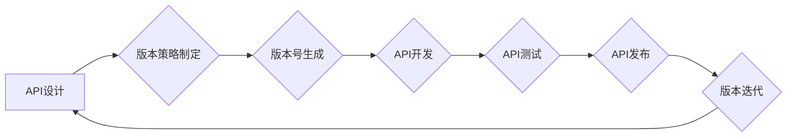

> API版本控制，版本管理，API文档，版本迭代，API生命周期，API策略

## 1. 背景介绍

在当今软件开发领域，API（应用程序接口）扮演着越来越重要的角色。它们连接着不同的应用程序和系统，促进数据和功能的共享。随着API的日益普及，API版本控制也变得至关重要。

API版本控制是指对API进行版本管理，确保不同版本的API之间保持兼容性，并能够顺利进行版本迭代和更新。良好的API版本控制策略可以帮助开发人员更好地管理API生命周期，降低维护成本，提高软件的稳定性和可靠性。

## 2. 核心概念与联系

### 2.1 API版本控制的核心概念

* **版本号:**  API版本号是一个唯一的标识符，用于区分不同的API版本。版本号通常采用语义化版本号（Semantic Versioning）规范，例如：1.2.3。其中，主版本号（Major）表示API的重大变更，次版本号（Minor）表示新功能的添加，修订版本号（Patch）表示 bug 修复。
* **版本迭代:** API版本迭代是指对API进行更新和改进的过程。每次迭代都会发布一个新的API版本，并提供相应的文档和测试用例。
* **兼容性:**  API版本控制的目标之一是确保不同版本的API之间保持兼容性。这意味着新版本的API应该能够与旧版本的API兼容，避免应用程序因版本更新而出现问题。
* **版本策略:** API版本策略是指对API版本管理的规则和规范。它定义了版本号的格式、版本迭代的流程、兼容性规则等。

### 2.2 API版本控制与相关技术的联系

API版本控制与以下技术密切相关：

* **版本控制系统 (Version Control System):**  例如Git，用于管理代码的版本历史和迭代。
* **API文档生成工具:**  例如Swagger，用于自动生成API文档。
* **API测试工具:**  例如Postman，用于测试API的各个版本。
* **配置管理工具:**  例如Ansible，用于自动化API部署和配置。

**Mermaid 流程图**



## 3. 核心算法原理 & 具体操作步骤

### 3.1 算法原理概述

API版本控制的核心算法原理是基于版本号的语义化版本号规范和版本迭代策略。

* **语义化版本号规范:**  语义化版本号规范定义了版本号的格式和含义，确保版本号能够清晰地表达API的变更情况。
* **版本迭代策略:**  版本迭代策略定义了API版本更新的流程和规则，例如：新功能的添加、bug修复、API兼容性维护等。

### 3.2 算法步骤详解

1. **版本策略制定:**  首先需要制定API版本策略，包括版本号的格式、版本迭代的流程、兼容性规则等。
2. **版本号生成:**  根据API的变更情况，生成相应的版本号。
3. **API开发:**  开发人员根据API版本号和文档进行API开发。
4. **API测试:**  对开发的API进行测试，确保其功能正确、性能稳定、兼容性良好。
5. **API发布:**  将经过测试的API发布到线上环境。
6. **版本迭代:**  根据用户反馈和业务需求，对API进行迭代更新，发布新的版本。

### 3.3 算法优缺点

**优点:**

* **提高API的稳定性和可靠性:**  通过版本控制，可以确保不同版本的API之间保持兼容性，降低API更新带来的风险。
* **简化API维护:**  版本控制可以帮助开发人员更好地管理API的生命周期，简化API的维护工作。
* **促进API的协作开发:**  版本控制可以帮助多个开发人员协同开发API，提高开发效率。

**缺点:**

* **增加开发成本:**  API版本控制需要额外的开发和维护成本。
* **增加API的复杂度:**  API版本控制需要制定相应的策略和流程，增加API的复杂度。

### 3.4 算法应用领域

API版本控制广泛应用于以下领域：

* **Web服务:**  API版本控制可以帮助管理Web服务的版本迭代和兼容性。
* **移动应用:**  API版本控制可以帮助管理移动应用的API接口版本。
* **云计算:**  API版本控制可以帮助管理云计算平台的API接口版本。
* **物联网:**  API版本控制可以帮助管理物联网设备的API接口版本。

## 4. 数学模型和公式 & 详细讲解 & 举例说明

### 4.1 数学模型构建

API版本控制的数学模型可以基于图论和关系数据库的概念构建。

* **图论:**  API版本可以看作图中的节点，API之间的依赖关系可以看作图中的边。
* **关系数据库:**  API版本信息可以存储在关系数据库中，例如：版本号、发布日期、变更内容等。

### 4.2 公式推导过程

由于API版本控制涉及到多个因素，例如版本号的格式、兼容性规则、迭代策略等，因此没有一个统一的数学公式可以完全描述API版本控制的过程。

### 4.3 案例分析与讲解

假设有一个API接口，用于获取用户的信息。

* **版本1.0:**  接口返回用户的基本信息，例如：用户名、邮箱地址等。
* **版本1.1:**  接口添加了用户头像的返回字段。
* **版本2.0:**  接口修改了用户名返回的格式，从字符串改为数字ID。

在这个例子中，我们可以看到API版本的变化会导致API的兼容性问题。如果应用程序依赖于旧版本的API接口，那么在升级到新版本后可能会出现错误。

## 5. 项目实践：代码实例和详细解释说明

### 5.1 开发环境搭建

* **操作系统:**  Linux/macOS/Windows
* **编程语言:**  Python
* **版本控制系统:**  Git
* **API文档生成工具:**  Swagger

### 5.2 源代码详细实现

```python
# api_version.py

class APIVersion:
    def __init__(self, version, description):
        self.version = version
        self.description = description

    def __str__(self):
        return f"Version: {self.version}
Description: {self.description}"

# 创建API版本实例
version1 = APIVersion("1.0", "Initial version")
version2 = APIVersion("1.1", "Added user avatar field")
version3 = APIVersion("2.0", "Changed username format to ID")

# 打印API版本信息
print(version1)
print(version2)
print(version3)
```

### 5.3 代码解读与分析

* **API Version 类:**  定义了一个API版本类的实例，包含版本号和描述信息。
* **版本实例化:**  创建了三个API版本实例，分别代表不同的版本号和描述信息。
* **版本信息打印:**  打印了每个API版本的信息。

### 5.4 运行结果展示

```
Version: 1.0
Description: Initial version
Version: 1.1
Description: Added user avatar field
Version: 2.0
Description: Changed username format to ID
```

## 6. 实际应用场景

### 6.1 API版本控制的应用场景

API版本控制在以下场景中尤为重要：

* **大型软件系统:**  大型软件系统通常包含多个API接口，需要进行严格的版本控制，确保不同模块之间的兼容性。
* **第三方API集成:**  当应用程序需要集成第三方API时，需要考虑API的版本兼容性问题。
* **跨平台开发:**  当应用程序需要在不同的平台上运行时，需要考虑API的版本兼容性问题。

### 6.2 案例分析

例如，一个电商平台的API接口需要支持多个支付方式，每个支付方式都需要一个独立的API接口。为了确保不同支付方式的API接口之间保持兼容性，需要进行API版本控制。

### 6.4 未来应用展望

随着API的日益普及，API版本控制将变得更加重要。未来，API版本控制技术将朝着以下方向发展：

* **自动化:**  API版本控制将更加自动化，例如：自动生成API文档、自动测试API兼容性等。
* **智能化:**  API版本控制将更加智能化，例如：根据用户反馈自动进行版本迭代、预测API的未来需求等。
* **可扩展性:**  API版本控制将更加可扩展，例如：支持多种版本号规范、支持多种API类型等。

## 7. 工具和资源推荐

### 7.1 学习资源推荐

* **语义化版本号规范:**  https://semver.org/
* **API文档生成工具Swagger:**  https://swagger.io/
* **API测试工具Postman:**  https://www.postman.com/

### 7.2 开发工具推荐

* **版本控制系统Git:**  https://git-scm.com/
* **配置管理工具Ansible:**  https://www.ansible.com/

### 7.3 相关论文推荐

* **API Versioning: A Survey**
* **Semantic Versioning for APIs**

## 8. 总结：未来发展趋势与挑战

### 8.1 研究成果总结

API版本控制技术已经取得了显著的成果，为API的开发、维护和管理提供了有效的解决方案。

### 8.2 未来发展趋势

API版本控制技术将朝着自动化、智能化、可扩展性等方向发展。

### 8.3 面临的挑战

API版本控制技术还面临着一些挑战，例如：

* **版本兼容性问题:**  如何确保不同版本的API之间保持兼容性，避免应用程序因版本更新而出现问题。
* **版本迭代策略:**  如何制定合理的版本迭代策略，平衡新功能的添加和兼容性的维护。
* **API文档管理:**  如何有效地管理API文档，确保文档的准确性和及时性。

### 8.4 研究展望

未来，API版本控制技术的研究将继续深入，探索更有效的解决方案，以满足API开发和管理的不断变化的需求。

## 9. 附录：常见问题与解答

### 9.1 常见问题

* **如何制定API版本策略？**
* **如何确保不同版本的API兼容性？**
* **如何管理API文档？**

### 9.2 常见问题解答

* **如何制定API版本策略？**  API版本策略需要根据项目的具体情况制定，需要考虑以下因素：版本号的格式、版本迭代的流程、兼容性规则等。
* **如何确保不同版本的API兼容性？**  可以通过以下方式确保不同版本的API兼容性：
    * 使用语义化版本号规范。
    * 提供详细的API文档，说明每个版本的API接口的变化。
    * 进行API兼容性测试，确保新版本API能够与旧版本API兼容。
* **如何管理API文档？**  可以使用API文档生成工具自动生成API文档，并使用版本控制系统管理文档的版本历史。


作者：禅与计算机程序设计艺术 / Zen and the Art of Computer Programming 
<end_of_turn>