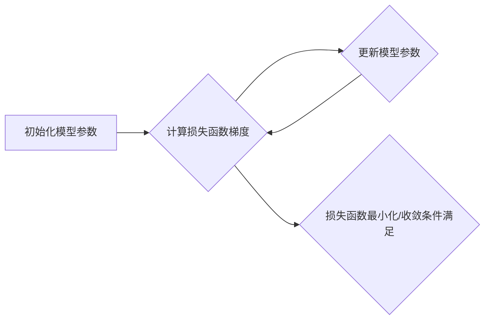

> Gradient Descent, 梯度下降, 优化算法, 机器学习, 深度学习, 线性回归, 损失函数, 学习率

## 1. 背景介绍

在机器学习和深度学习领域，模型训练的核心是找到最优的模型参数，使得模型在给定数据上表现最佳。而梯度下降算法作为一种经典的优化算法，在模型训练中扮演着至关重要的角色。

梯度下降算法的基本思想是通过不断迭代地更新模型参数，朝着损失函数的最小值方向前进。损失函数衡量模型预测结果与真实值的差距，目标是找到参数值，使得损失函数达到最小值。

## 2. 核心概念与联系

**2.1 核心概念**

* **损失函数 (Loss Function):** 用于衡量模型预测结果与真实值的差距。常见的损失函数包括均方误差 (MSE)、交叉熵 (Cross-Entropy) 等。
* **梯度 (Gradient):** 损失函数在当前参数值处的导数，表示损失函数变化的方向和幅度。梯度方向指向损失函数增加最快的方向。
* **学习率 (Learning Rate):** 决定每次更新参数的步长。学习率过大可能会导致模型震荡，无法收敛；学习率过小可能会导致训练过程过慢。

**2.2 核心联系**

梯度下降算法的核心是利用梯度信息来更新模型参数。算法的基本流程如下：

1. 初始化模型参数。
2. 计算损失函数在当前参数值处的梯度。
3. 根据梯度方向和学习率更新模型参数。
4. 重复步骤 2 和 3，直到损失函数达到最小值或满足其他收敛条件。

**2.3 Mermaid 流程图**



## 3. 核心算法原理 & 具体操作步骤

### 3.1 算法原理概述

梯度下降算法的基本原理是利用损失函数的梯度信息来迭代更新模型参数，最终找到使损失函数最小化的参数值。

### 3.2 算法步骤详解

1. **初始化模型参数:** 随机选择初始参数值，或者使用预先训练好的模型参数。
2. **计算损失函数梯度:** 使用反向传播算法计算损失函数对每个参数的梯度。
3. **更新模型参数:** 根据梯度方向和学习率更新模型参数。更新公式如下:

```
参数 = 参数 - 学习率 * 梯度
```

4. **重复步骤 2 和 3:** 迭代更新模型参数，直到损失函数达到最小值或满足其他收敛条件。

### 3.3 算法优缺点

**优点:**

* 算法简单易懂，易于实现。
* 能够找到全局最优解，在许多情况下表现良好。

**缺点:**

* 容易陷入局部最优解。
* 训练速度可能较慢，尤其是在高维数据上。
* 需要手动选择学习率，学习率的选择对算法性能有很大影响。

### 3.4 算法应用领域

梯度下降算法广泛应用于机器学习和深度学习领域，例如：

* 线性回归
* Logistic 回归
* 神经网络训练
* 自然语言处理
* 图像识别

## 4. 数学模型和公式 & 详细讲解 & 举例说明

### 4.1 数学模型构建

假设我们有一个模型 f(x; θ) ，其中 x 是输入数据， θ 是模型参数， f(x; θ) 是模型预测结果。我们的目标是找到最优参数 θ，使得模型预测结果与真实值之间的差距最小。

我们使用损失函数 L(θ) 来衡量模型预测结果与真实值之间的差距。损失函数的定义如下:

```
L(θ) = 1/n * Σ(i=1 to n) [L(θ, x(i), y(i))]
```

其中 n 是样本数量， x(i) 是第 i 个样本的输入数据， y(i) 是第 i 个样本的真实值， L(θ, x(i), y(i)) 是单个样本的损失函数。

### 4.2 公式推导过程

我们的目标是找到最优参数 θ，使得损失函数 L(θ) 最小化。我们可以使用梯度下降算法来实现这个目标。梯度下降算法的基本思想是迭代更新参数 θ，朝着损失函数的梯度方向前进。

损失函数 L(θ) 的梯度定义如下:

```
∇L(θ) = [∂L(θ)/∂θ1, ∂L(θ)/∂θ2, ..., ∂L(θ)/∂θm]
```

其中 ∂L(θ)/∂θi 是损失函数 L(θ) 对参数 θi 的偏导数。

梯度下降算法的更新公式如下:

```
θ = θ - 学习率 * ∇L(θ)
```

其中 学习率 是一个控制更新步长的超参数。

### 4.3 案例分析与讲解

假设我们有一个线性回归模型，目标是预测房价。模型的预测公式如下:

```
y = θ0 + θ1 * size + θ2 * location
```

其中 y 是房价， size 是房屋面积， location 是房屋位置， θ0, θ1, θ2 是模型参数。

我们使用均方误差 (MSE) 作为损失函数，MSE 的定义如下:

```
L(θ) = 1/n * Σ(i=1 to n) [ (y(i) - f(x(i); θ))^2 ]
```

其中 n 是样本数量， y(i) 是第 i 个样本的真实房价， f(x(i); θ) 是模型预测的房价。

我们可以使用梯度下降算法来更新模型参数 θ0, θ1, θ2，使得 MSE 最小化。

## 5. 项目实践：代码实例和详细解释说明

### 5.1 开发环境搭建

* Python 3.x
* NumPy
* Matplotlib

### 5.2 源代码详细实现

```python
import numpy as np
import matplotlib.pyplot as plt

# 生成随机数据
np.random.seed(0)
X = np.random.rand(100, 1) * 10
y = 2 * X + 1 + np.random.randn(100, 1)

# 定义损失函数
def mse_loss(y_true, y_pred):
    return np.mean((y_true - y_pred) ** 2)

# 定义梯度下降算法
def gradient_descent(X, y, learning_rate, epochs):
    m, n = X.shape
    theta = np.zeros((n, 1))
    for epoch in range(epochs):
        y_pred = X @ theta
        loss = mse_loss(y, y_pred)
        gradient = (1/m) * X.T @ (y_pred - y)
        theta -= learning_rate * gradient
    return theta

# 训练模型
learning_rate = 0.01
epochs = 1000
theta = gradient_descent(X, y, learning_rate, epochs)

# 预测结果
y_pred = X @ theta

# 可视化结果
plt.scatter(X, y, label='真实数据')
plt.plot(X, y_pred, color='red', label='预测结果')
plt.legend()
plt.show()
```

### 5.3 代码解读与分析

* **数据生成:** 代码首先生成随机数据，模拟房屋面积和房价的关系。
* **损失函数定义:** 代码定义了均方误差 (MSE) 作为损失函数，用于衡量模型预测结果与真实值之间的差距。
* **梯度下降算法实现:** 代码实现了梯度下降算法，包括计算梯度和更新参数的步骤。
* **模型训练:** 代码使用梯度下降算法训练模型，并设置学习率和训练轮数。
* **预测结果:** 代码使用训练好的模型预测房价。
* **可视化结果:** 代码使用 matplotlib 库可视化真实数据和预测结果。

### 5.4 运行结果展示

运行代码后，会生成一个散点图，其中真实数据点用蓝色散点表示，预测结果用红色曲线表示。

## 6. 实际应用场景

梯度下降算法在机器学习和深度学习领域有着广泛的应用场景，例如：

* **线性回归:** 预测连续值，例如房价、股票价格等。
* **Logistic 回归:** 预测分类结果，例如判断邮件是否为垃圾邮件。
* **神经网络训练:** 训练深度神经网络，用于图像识别、自然语言处理等任务。

### 6.4 未来应用展望

随着人工智能技术的不断发展，梯度下降算法的应用场景将会更加广泛。例如，可以应用于：

* **强化学习:** 训练智能体在复杂环境中学习和决策。
* **推荐系统:** 建立个性化的推荐系统，推荐用户感兴趣的内容。
* **自动驾驶:** 训练自动驾驶汽车，使其能够安全地行驶。

## 7. 工具和资源推荐

### 7.1 学习资源推荐

* **书籍:**
    * "Deep Learning" by Ian Goodfellow, Yoshua Bengio, and Aaron Courville
    * "Hands-On Machine Learning with Scikit-Learn, Keras & TensorFlow" by Aurélien Géron
* **在线课程:**
    * Coursera: Machine Learning by Andrew Ng
    * Udacity: Deep Learning Nanodegree

### 7.2 开发工具推荐

* **Python:** 广泛用于机器学习和深度学习开发。
* **NumPy:** 用于数值计算和数组操作。
* **Scikit-learn:** 用于机器学习算法的实现。
* **TensorFlow:** 用于深度学习模型的开发和训练。
* **Keras:** 用于深度学习模型的快速原型开发。

### 7.3 相关论文推荐

* "On the Convergence of Gradient Descent" by R. Bottou
* "Stochastic Gradient Descent Tricks" by J. Redmon

## 8. 总结：未来发展趋势与挑战

### 8.1 研究成果总结

梯度下降算法作为一种经典的优化算法，在机器学习和深度学习领域取得了巨大的成功。它为模型训练提供了有效的解决方案，推动了人工智能技术的快速发展。

### 8.2 未来发展趋势

未来，梯度下降算法的研究将继续朝着以下方向发展:

* **加速梯度下降算法:** 提高梯度下降算法的训练速度，使其能够处理更大规模的数据集。
* **改进梯度下降算法的鲁棒性:** 使梯度下降算法能够更好地应对噪声数据和非凸损失函数。
* **结合其他优化算法:** 将梯度下降算法与其他优化算法相结合，提高算法的性能。

### 8.3 面临的挑战

梯度下降算法也面临着一些挑战:

* **局部最优解:** 梯度下降算法容易陷入局部最优解，难以找到全局最优解。
* **学习率选择:** 学习率的选择对算法性能有很大影响，需要进行仔细的调优。
* **高维数据:** 在高维数据上，梯度下降算法的训练速度会变慢。

### 8.4 研究展望

未来，研究人员将继续探索新的梯度下降算法，以克服现有算法的局限性，提高算法的性能和效率。


## 9. 附录：常见问题与解答

**1. 什么是学习率？**

学习率是梯度下降算法中一个重要的超参数，控制着每次更新参数的步长。学习率过大可能会导致模型震荡，无法收敛；学习率过小可能会导致训练过程过慢。

**2. 如何选择学习率？**

学习率的选择是一个经验性的过程，通常需要通过实验来确定。可以使用学习率衰减策略，随着训练的进行，逐渐减小学习率。

**3. 梯度下降算法容易陷入局部最优解，如何解决这个问题？**

可以使用一些方法来解决梯