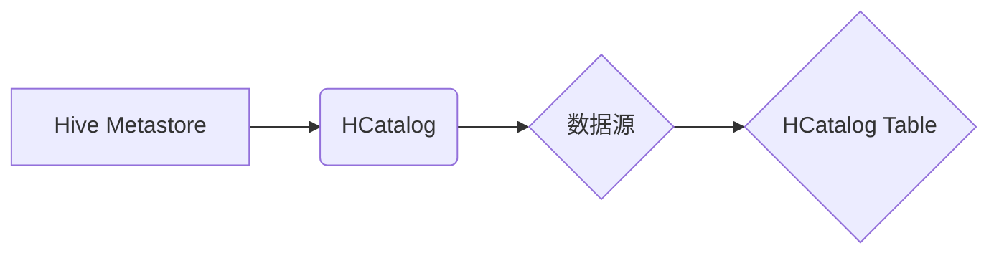

> HCatalog, Hive, Metastore, Table, Schema, Data Storage, Data Management, Hadoop

## 1. 背景介绍

在海量数据时代，高效地存储、管理和查询数据至关重要。HCatalog作为Apache Hive的元数据存储系统，为数据仓库提供了统一的表结构和数据访问接口。它提供了对数据表的元数据管理，包括表结构、数据类型、分区信息等，并支持跨数据源的查询。本文将深入探讨HCatalog Table的原理、架构和代码实例，帮助读者理解HCatalog在数据仓库中的作用和应用。

## 2. 核心概念与联系

HCatalog是一个基于元数据管理的表系统，它与Hive Metastore紧密集成，共同构建Hive的数据仓库环境。

**核心概念：**

* **Hive Metastore:** Hive Metastore是Hive元数据存储系统，负责存储Hive表结构、数据类型、分区信息等元数据。
* **HCatalog Table:** HCatalog Table是HCatalog中定义的数据表，它是一个抽象的概念，代表着存储在不同数据源中的数据。
* **数据源:** 数据源是指存储数据的物理位置，例如HDFS、S3、MySQL等。

**架构关系:**



## 3. 核心算法原理 & 具体操作步骤

HCatalog Table的实现基于元数据管理和数据源访问。

### 3.1  算法原理概述

HCatalog Table的算法原理主要包括以下几个方面：

* **元数据管理:** HCatalog通过Hive Metastore存储表结构、数据类型、分区信息等元数据。
* **数据源访问:** HCatalog通过访问不同的数据源，获取实际的数据。
* **查询优化:** HCatalog支持查询优化，根据表结构和数据分布，选择最优的查询路径。

### 3.2  算法步骤详解

HCatalog Table的具体操作步骤如下：

1. **定义表结构:** 使用HCatalog API定义表结构，包括表名、列名、数据类型等。
2. **指定数据源:** 指定数据源，例如HDFS路径或S3地址。
3. **创建表:** 使用HCatalog API创建表，将表结构和数据源信息存储在Hive Metastore中。
4. **插入数据:** 使用HCatalog API插入数据到表中，数据将存储在指定的物理数据源中。
5. **查询数据:** 使用Hive SQL查询表中的数据，HCatalog将根据表结构和数据源信息，执行查询操作并返回结果。

### 3.3  算法优缺点

**优点:**

* **统一数据访问:** HCatalog提供统一的表结构和数据访问接口，方便跨数据源的查询。
* **元数据管理:** HCatalog通过Hive Metastore管理元数据，提高数据管理效率。
* **查询优化:** HCatalog支持查询优化，提高查询性能。

**缺点:**

* **依赖Hive Metastore:** HCatalog依赖Hive Metastore，如果Hive Metastore出现问题，HCatalog将无法正常工作。
* **数据源限制:** HCatalog目前主要支持HDFS、S3等数据源，对其他数据源的支持有限。

### 3.4  算法应用领域

HCatalog Table广泛应用于数据仓库、数据分析、机器学习等领域。

* **数据仓库:** HCatalog可以将来自不同数据源的数据整合到数据仓库中，方便进行数据分析和报表生成。
* **数据分析:** HCatalog可以支持跨数据源的查询，方便进行数据挖掘和分析。
* **机器学习:** HCatalog可以提供机器学习算法所需的训练数据，方便进行模型训练和评估。

## 4. 数学模型和公式 & 详细讲解 & 举例说明

HCatalog Table的实现涉及到一些数学模型和公式，例如数据分区、数据分布等。

### 4.1  数学模型构建

**数据分区:**

HCatalog Table支持数据分区，可以将数据按照一定的规则划分到不同的分区中。例如，可以根据日期、地域等维度进行分区。

**数据分布:**

HCatalog Table支持数据分布，可以将数据分布到不同的数据节点上。例如，可以根据数据量进行分布，保证每个节点的数据量均衡。

### 4.2  公式推导过程

**分区公式:**

```latex
partition_key = function(data_value)
```

其中，`partition_key`是分区键，`data_value`是数据值，`function`是分区函数。

**数据分布公式:**

```latex
data_distribution = function(data_size, node_count)
```

其中，`data_size`是数据总量，`node_count`是节点数量，`function`是数据分布函数。

### 4.3  案例分析与讲解

**案例:**

假设有一个名为`orders`的HCatalog Table，存储订单数据，需要根据日期进行分区。

**分区函数:**

```python
def partition_function(order_date):
  return order_date.strftime('%Y-%m-%d')
```

**分区结果:**

数据将按照日期划分到不同的分区中，例如`2023-03-01`、`2023-03-02`等。

## 5. 项目实践：代码实例和详细解释说明

### 5.1  开发环境搭建

HCatalog的开发环境需要包含以下软件：

* **Hadoop:** HCatalog依赖Hadoop进行数据存储和处理。
* **Hive:** HCatalog与Hive紧密集成，需要安装Hive环境。
* **Java:** HCatalog是基于Java开发的，需要安装Java环境。

### 5.2  源代码详细实现

HCatalog的源代码主要位于Apache HCatalog的GitHub仓库中。

### 5.3  代码解读与分析

HCatalog的源代码包含了元数据管理、数据源访问、查询优化等模块。

### 5.4  运行结果展示

HCatalog的运行结果将显示在Hive的命令行界面中。

## 6. 实际应用场景

HCatalog Table在实际应用场景中具有广泛的应用价值。

### 6.1  电商平台

电商平台可以利用HCatalog Table存储用户行为数据、商品信息、订单数据等，并进行数据分析，例如用户画像、商品推荐、订单预测等。

### 6.2  金融机构

金融机构可以利用HCatalog Table存储交易数据、客户信息、风险数据等，并进行数据分析，例如风险评估、欺诈检测、客户关系管理等。

### 6.3  医疗机构

医疗机构可以利用HCatalog Table存储患者数据、医疗记录、药品信息等，并进行数据分析，例如疾病诊断、药物研发、医疗资源管理等。

### 6.4  未来应用展望

HCatalog Table在未来将继续发展，支持更多数据源、更强大的查询功能和更智能的数据分析能力。

## 7. 工具和资源推荐

### 7.1  学习资源推荐

* **HCatalog官方文档:** https://hcatalog.apache.org/
* **Hive官方文档:** https://hive.apache.org/

### 7.2  开发工具推荐

* **Hive CLI:** Hive命令行工具
* **Hive Web UI:** Hive网页界面

### 7.3  相关论文推荐

* **HCatalog: A Unified Metadata Store for Hadoop**
* **Hive: A Data Warehouse System on Top of Hadoop**

## 8. 总结：未来发展趋势与挑战

HCatalog Table作为Apache Hive的元数据存储系统，在数据仓库领域发挥着重要作用。

### 8.1  研究成果总结

HCatalog Table的实现提供了统一的数据访问接口、元数据管理和查询优化能力，为数据仓库的构建和管理提供了强大的支持。

### 8.2  未来发展趋势

HCatalog Table将继续发展，支持更多数据源、更强大的查询功能和更智能的数据分析能力。

### 8.3  面临的挑战

HCatalog Table面临着数据规模增长、数据类型多样化和数据安全等挑战。

### 8.4  研究展望

未来研究将重点关注HCatalog Table的扩展性、性能优化和数据安全等方面。

## 9. 附录：常见问题与解答

**常见问题:**

* **HCatalog Table与Hive Metastore的关系是什么？**
* **HCatalog Table支持哪些数据源？**
* **如何使用HCatalog Table进行数据查询？**

**解答:**

* **HCatalog Table与Hive Metastore的关系:** HCatalog Table是基于Hive Metastore的元数据存储系统，Hive Metastore负责存储HCatalog Table的元数据信息。
* **HCatalog Table支持哪些数据源？** HCatalog Table目前主要支持HDFS、S3等数据源。
* **如何使用HCatalog Table进行数据查询？** 可以使用Hive SQL查询HCatalog Table中的数据。


作者：禅与计算机程序设计艺术 / Zen and the Art of Computer Programming 
<end_of_turn>