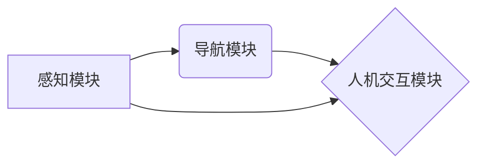

> 自动驾驶, 感知, 导航, 人机交互, 深度学习, 计算机视觉, SLAM, 路径规划, 自然语言处理

## 1. 背景介绍

自动驾驶技术作为人工智能领域的重要分支，近年来取得了显著进展，并逐渐走向商业化应用。 IROS 2024作为国际机器人与自动化领域的顶级学术会议，汇聚了全球顶尖的学者和研究人员，展示了自动驾驶技术最新的研究成果和发展趋势。 本文将对 IROS 2024 上发表的自动驾驶相关论文进行解读，重点关注感知、导航和人机交互三个关键方面，并对未来发展趋势进行展望。

## 2. 核心概念与联系

自动驾驶系统是一个复杂的智能系统，需要感知周围环境、规划行驶路径、控制车辆运动以及与人类进行交互。 

**感知模块**负责收集车辆周围的环境信息，包括道路、交通标志、行人、车辆等。常用的感知技术包括：

* **计算机视觉:** 利用摄像头获取图像信息，进行目标识别、跟踪和场景理解。
* **雷达:** 利用雷达波探测目标距离、速度和方向。
* **激光雷达:** 利用激光扫描获取三维环境信息，构建高精度地图。
* **超声波传感器:** 利用超声波探测近距离障碍物。

**导航模块**负责根据感知到的环境信息，规划车辆行驶路径，并控制车辆运动。常用的导航技术包括：

* **路径规划:** 根据目标位置和环境约束，规划车辆行驶路径。
* **运动控制:** 控制车辆的转向、加速和制动，使车辆沿着规划路径行驶。
* **地图构建:** 利用传感器数据构建车辆周围的环境地图。

**人机交互模块**负责与驾驶员进行交互，提供驾驶信息和辅助驾驶功能。常用的交互方式包括：

* **语音交互:** 通过语音指令控制车辆。
* **显示屏交互:** 通过显示屏显示驾驶信息和导航指示。
* **触控交互:** 通过触控屏控制车辆功能。

**核心概念关系图:**

## 3. 核心算法原理 & 具体操作步骤

### 3.1  算法原理概述

自动驾驶算法的开发需要结合多种机器学习算法，例如深度学习、强化学习等。

* **深度学习:** 用于图像识别、目标检测、场景理解等任务。
* **强化学习:** 用于路径规划、运动控制等任务。

### 3.2  算法步骤详解

**感知模块算法步骤:**

1. **数据采集:** 利用传感器收集车辆周围的环境数据。
2. **数据预处理:** 对采集到的数据进行清洗、格式化和增强。
3. **特征提取:** 利用深度学习模型提取图像特征或传感器数据特征。
4. **目标检测:** 利用目标检测算法识别周围的车辆、行人、交通标志等目标。
5. **场景理解:** 利用场景理解算法对感知到的环境进行理解，例如识别道路类型、交通规则等。

**导航模块算法步骤:**

1. **地图构建:** 利用传感器数据构建车辆周围的环境地图。
2. **路径规划:** 根据目标位置和环境约束，规划车辆行驶路径。
3. **运动控制:** 控制车辆的转向、加速和制动，使车辆沿着规划路径行驶。

**人机交互模块算法步骤:**

1. **自然语言理解:** 利用自然语言处理技术理解驾驶员的语音指令。
2. **对话管理:** 根据驾驶员的指令，进行对话管理，提供驾驶信息和辅助驾驶功能。
3. **语音合成:** 利用语音合成技术，将驾驶信息和指令以语音形式输出。

### 3.3  算法优缺点

**深度学习算法:**

* **优点:** 能够学习复杂的特征，具有较高的识别精度。
* **缺点:** 需要大量的训练数据，训练时间长，易受数据噪声影响。

**强化学习算法:**

* **优点:** 可以学习最优的策略，适应动态环境。
* **缺点:** 训练过程复杂，需要大量的试错，容易陷入局部最优。

### 3.4  算法应用领域

自动驾驶算法广泛应用于自动驾驶汽车、无人机、机器人等领域。

## 4. 数学模型和公式 & 详细讲解 & 举例说明

### 4.1  数学模型构建

自动驾驶算法的数学模型通常基于概率论、统计学和优化理论。

**目标检测模型:**

目标检测模型通常使用深度学习网络，例如YOLO、Faster R-CNN等。这些模型将图像输入到网络中，输出目标的类别、位置和置信度。

**路径规划模型:**

路径规划模型通常使用搜索算法或优化算法，例如A*算法、Dijkstra算法等。这些算法根据目标位置和环境约束，搜索最优的路径。

### 4.2  公式推导过程

**目标检测模型损失函数:**

目标检测模型的损失函数通常由分类损失和回归损失组成。

* **分类损失:** 计算预测类别与真实类别的差异。常用的分类损失函数包括交叉熵损失函数。
* **回归损失:** 计算预测目标位置与真实目标位置的差异。常用的回归损失函数包括均方误差损失函数。

**路径规划模型代价函数:**

路径规划模型的代价函数通常包含路径长度、路径平滑度、路径安全性等因素。

### 4.3  案例分析与讲解

**目标检测模型案例:**

YOLO算法是一种实时目标检测算法，其核心思想是将图像划分为网格，每个网格预测多个目标的类别、位置和置信度。

**路径规划模型案例:**

A*算法是一种路径规划算法，它利用启发函数估算目标位置的距离，选择最优路径。

## 5. 项目实践：代码实例和详细解释说明

### 5.1  开发环境搭建

自动驾驶项目开发通常需要搭建一个完整的开发环境，包括操作系统、编程语言、深度学习框架等。

* **操作系统:** Ubuntu、Windows等。
* **编程语言:** Python、C++等。
* **深度学习框架:** TensorFlow、PyTorch等。

### 5.2  源代码详细实现

自动驾驶项目的源代码实现非常复杂，涉及感知、导航、人机交互等多个模块。

### 5.3  代码解读与分析

自动驾驶项目的代码需要进行详细的解读和分析，才能理解其工作原理和实现细节。

### 5.4  运行结果展示

自动驾驶项目的运行结果需要进行展示和评估，例如车辆行驶轨迹、目标检测结果、路径规划结果等。

## 6. 实际应用场景

自动驾驶技术在多个领域都有实际应用场景，例如：

* **自动驾驶汽车:** 自动驾驶汽车能够自动驾驶，提高道路安全性和交通效率。
* **无人配送:** 无人配送车辆能够自动配送货物，降低物流成本。
* **无人农业:** 无人农业机器人能够自动进行耕种、播种、收获等操作，提高农业生产效率。

### 6.4  未来应用展望

未来，自动驾驶技术将应用于更多领域，例如：

* **自动驾驶飞机:** 自动驾驶飞机能够自动飞行，提高航空安全性和效率。
* **自动驾驶船舶:** 自动驾驶船舶能够自动航行，提高航运效率。
* **自动驾驶机器人:** 自动驾驶机器人能够自动完成各种任务，例如家务、医疗、工业等。

## 7. 工具和资源推荐

### 7.1  学习资源推荐

* **书籍:**
    * "Principles of Robot Motion: Theory, Algorithms, and Implementations"
    * "Probabilistic Robotics"
* **在线课程:**
    * Coursera: "Self-Driving Cars"
    * Udacity: "Self-Driving Car Engineer Nanodegree"

### 7.2  开发工具推荐

* **ROS (Robot Operating System):** 一个开源的机器人操作系统，提供了一套完整的软件框架和工具。
* **Gazebo:** 一个开源的机器人仿真平台，可以用于模拟自动驾驶场景。
* **Autoware:** 一个开源的自动驾驶软件平台，集成了感知、导航、控制等模块。

### 7.3  相关论文推荐

* "End to End Learning for Self-Driving Cars"
* "Deep Reinforcement Learning for Autonomous Driving"
* "A Survey of Deep Learning for Autonomous Driving"

## 8. 总结：未来发展趋势与挑战

### 8.1  研究成果总结

IROS 2024 上发表的自动驾驶相关论文展示了该领域取得的最新进展，包括感知、导航和人机交互方面的突破。

### 8.2  未来发展趋势

未来，自动驾驶技术将朝着以下方向发展：

* **更强的感知能力:** 利用更先进的传感器和算法，提高感知精度和可靠性。
* **更智能的导航能力:** 利用更强大的计算能力和更复杂的算法，实现更智能的路径规划和运动控制。
* **更自然的交互方式:** 利用自然语言处理和人工智能技术，实现更自然的驾驶员与车辆交互。

### 8.3  面临的挑战

自动驾驶技术还面临着一些挑战，例如：

* **安全问题:** 自动驾驶系统需要能够应对各种复杂和不可预测的场景，确保驾驶安全。
* **法律法规问题:** 自动驾驶技术的应用需要完善的法律法规，明确责任和义务。
* **伦理问题:** 自动驾驶系统在面临道德困境时，需要能够做出正确的判断。

### 8.4  研究展望

未来，需要继续加强自动驾驶技术的研发和应用，解决其面临的挑战，推动自动驾驶技术向更安全、更智能、更可靠的方向发展。

## 9. 附录：常见问题与解答

### 9.1  常见问题

* 自动驾驶汽车真的安全吗？
* 自动驾驶汽车会取代人类驾驶员吗？
* 自动驾驶汽车的成本如何？

### 9.2  解答

* 自动驾驶汽车的安全性正在不断提高，但仍存在一些风险。
* 自动驾驶汽车可能会改变驾驶行业，但人类驾驶员仍将发挥重要作用。
* 自动驾驶汽车的成本目前较高，但随着技术的进步和规模化生产，成本将会降低。

作者：禅与计算机程序设计艺术 / Zen and the Art of Computer Programming 
<end_of_turn>