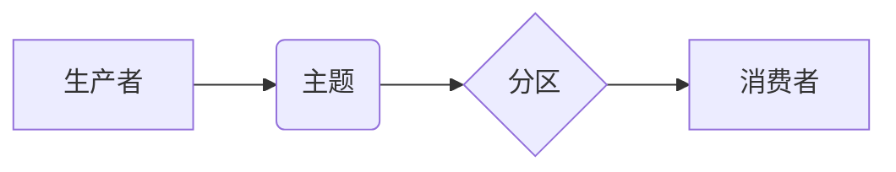

> Kafka, 生产者, 消费者, API, 消息队列, 分布式系统, 高性能, 容错

## 1. 背景介绍

在当今数据爆炸的时代，高效、可靠地处理海量数据至关重要。消息队列作为一种分布式架构模式，在处理异步消息、解耦系统、提高系统吞吐量等方面发挥着越来越重要的作用。Apache Kafka作为一款开源的消息队列系统，凭借其高吞吐量、低延迟、高可用性和强大的数据持久化能力，成为了众多企业级应用的首选。

本文将深入探讨Kafka的生产者消费者API原理，并通过代码实例讲解，帮助读者理解Kafka的核心机制，并掌握如何使用Kafka进行消息生产和消费。

## 2. 核心概念与联系

Kafka的核心概念包括主题（Topic）、分区（Partition）、消费者组（Consumer Group）等。

**主题（Topic）**：

Kafka中的主题类似于一个消息的分类容器，可以将消息按照不同的类别进行组织。例如，我们可以创建名为“订单”的主题，用于存储所有订单相关的消息。

**分区（Partition）**：

每个主题可以被划分为多个分区，每个分区就是一个独立的消息队列。分区可以提高消息的并行处理能力，并提供更高的吞吐量。

**消费者组（Consumer Group）**：

消费者组是一个用于管理消费者的集合。每个消费者组可以订阅一个或多个主题，并负责消费该主题的消息。消费者组可以实现消息的负载均衡和容错机制。

**Kafka架构图：**



## 3. 核心算法原理 & 具体操作步骤

### 3.1  算法原理概述

Kafka的生产者消费者模型基于发布订阅模式，生产者将消息发送到指定的主题分区，消费者订阅主题分区，并从分区中消费消息。

Kafka采用了一种基于日志的存储机制，将消息持久化到磁盘，并提供高可用性和容错能力。

### 3.2  算法步骤详解

**生产者操作步骤：**

1. 创建Kafka生产者对象。
2. 指定消息发送的目标主题和分区。
3. 将消息序列化为字节数组。
4. 发送消息到Kafka集群。

**消费者操作步骤：**

1. 创建Kafka消费者对象。
2. 指定消费者的订阅主题和分区。
3. 从Kafka集群拉取消息。
4. 反序列化消息，并处理消息内容。

### 3.3  算法优缺点

**优点：**

* 高吞吐量：Kafka可以处理海量消息，并提供高吞吐量。
* 低延迟：Kafka的消息传输延迟低，可以满足实时应用的需求。
* 高可用性：Kafka采用分布式架构，并提供数据冗余和故障转移机制，确保消息的可靠性。
* 数据持久化：Kafka将消息持久化到磁盘，即使系统发生故障，也能保证消息的安全性。

**缺点：**

* 学习曲线陡峭：Kafka的架构和功能比较复杂，需要一定的学习成本。
* 集群管理复杂：Kafka集群的部署和管理需要一定的技术经验。

### 3.4  算法应用领域

Kafka广泛应用于以下领域：

* 流式数据处理：实时分析日志、监控数据等。
* 消息队列：实现异步消息通信，解耦系统。
* 事件驱动架构：构建基于事件的应用程序。
* 数据集成：将数据从不同系统集成到一起。

## 4. 数学模型和公式 & 详细讲解 & 举例说明

### 4.1  数学模型构建

Kafka的吞吐量和延迟可以根据以下数学模型进行分析：

**吞吐量：**

```latex
吞吐量 = 消息发送速率 / 消息大小
```

**延迟：**

```latex
延迟 = 消息发送时间 - 消息接收时间
```

### 4.2  公式推导过程

吞吐量和延迟的计算公式可以根据实际情况进行调整，例如，可以考虑网络带宽、CPU性能、磁盘I/O速度等因素。

### 4.3  案例分析与讲解

假设一个Kafka集群的网络带宽为1Gbps，消息大小为1KB，则吞吐量为：

```
吞吐量 = 1000Mbps / 1KB = 1000000字节/秒 / 1024字节/KB = 976.56KB/秒
```

## 5. 项目实践：代码实例和详细解释说明

### 5.1  开发环境搭建

* Java Development Kit (JDK) 8 或更高版本
* Apache Kafka 
* Maven 或 Gradle

### 5.2  源代码详细实现

```java
// 生产者代码
import org.apache.kafka.clients.producer.KafkaProducer;
import org.apache.kafka.clients.producer.ProducerConfig;
import org.apache.kafka.clients.producer.ProducerRecord;
import org.apache.kafka.common.serialization.StringSerializer;

import java.util.Properties;

public class KafkaProducerExample {

    public static void main(String[] args) {
        // 配置生产者属性
        Properties props = new Properties();
        props.put(ProducerConfig.BOOTSTRAP_SERVERS_CONFIG, "localhost:9092");
        props.put(ProducerConfig.KEY_SERIALIZER_CLASS_CONFIG, StringSerializer.class.getName());
        props.put(ProducerConfig.VALUE_SERIALIZER_CLASS_CONFIG, StringSerializer.class.getName());

        // 创建生产者对象
        KafkaProducer<String, String> producer = new KafkaProducer<>(props);

        // 发送消息
        for (int i = 0; i < 10; i++) {
            String message = "Hello Kafka! " + i;
            ProducerRecord<String, String> record = new ProducerRecord<>("my-topic", message);
            producer.send(record);
        }

        // 关闭生产者
        producer.close();
    }
}

// 消费者代码
import org.apache.kafka.clients.consumer.ConsumerConfig;
import org.apache.kafka.clients.consumer.ConsumerRecord;
import org.apache.kafka.clients.consumer.ConsumerRecords;
import org.apache.kafka.clients.consumer.KafkaConsumer;
import org.apache.kafka.common.serialization.StringDeserializer;

import java.time.Duration;
import java.util.Collections;
import java.util.Properties;

public class KafkaConsumerExample {

    public static void main(String[] args) {
        // 配置消费者属性
        Properties props = new Properties();
        props.put(ConsumerConfig.BOOTSTRAP_SERVERS_CONFIG, "localhost:9092");
        props.put(ConsumerConfig.GROUP_ID_CONFIG, "my-group");
        props.put(ConsumerConfig.KEY_DESERIALIZER_CLASS_CONFIG, StringDeserializer.class.getName());
        props.put(ConsumerConfig.VALUE_DESERIALIZER_CLASS_CONFIG, StringDeserializer.class.getName());

        // 创建消费者对象
        KafkaConsumer<String, String> consumer = new KafkaConsumer<>(props);

        // 订阅主题
        consumer.subscribe(Collections.singletonList("my-topic"));

        // 拉取消息
        while (true) {
            ConsumerRecords<String, String> records = consumer.poll(Duration.ofMillis(100));
            for (ConsumerRecord<String, String> record : records) {
                System.out.println("Received message: " + record.value());
            }
        }
    }
}
```

### 5.3  代码解读与分析

* **生产者代码：**
    * 配置生产者属性，包括Kafka集群地址、key和value的序列化器。
    * 创建Kafka生产者对象。
    * 发送消息到指定的主题，每个消息包含一个key和一个value。
    * 关闭生产者对象。
* **消费者代码：**
    * 配置消费者属性，包括Kafka集群地址、消费者组ID、key和value的反序列化器。
    * 创建Kafka消费者对象。
    * 订阅指定的主题。
    * 使用poll方法拉取消息，并处理消息内容。

### 5.4  运行结果展示

运行以上代码，生产者会将10条消息发送到名为“my-topic”的主题，消费者会订阅该主题，并打印接收到的消息。

## 6. 实际应用场景

Kafka在各种实际应用场景中发挥着重要作用，例如：

* **实时数据分析：**

Kafka可以用于收集和处理来自各种数据源的实时数据，例如网站访问日志、传感器数据、社交媒体数据等，并进行实时分析，帮助企业洞察用户行为、监控系统状态等。

* **消息队列：**

Kafka可以作为消息队列，实现异步消息通信，解耦系统，例如，电商平台可以利用Kafka将订单信息发送给支付系统、物流系统等，提高系统的可靠性和性能。

* **事件驱动架构：**

Kafka可以构建基于事件的应用程序，例如，用户注册事件、商品购买事件等，可以被订阅并处理，触发相应的业务逻辑。

### 6.4  未来应用展望

随着数据量的不断增长和计算能力的提升，Kafka的应用场景将更加广泛，例如：

* **边缘计算：**

Kafka可以用于边缘计算场景，收集和处理边缘设备产生的数据，并进行实时分析和决策。

* **物联网：**

Kafka可以用于物联网场景，收集和处理来自物联网设备的数据，并进行实时监控和管理。

* **金融科技：**

Kafka可以用于金融科技场景，处理金融交易数据、风险控制数据等，提高金融服务的效率和安全性。

## 7. 工具和资源推荐

### 7.1  学习资源推荐

* **Apache Kafka官方文档：** https://kafka.apache.org/documentation/
* **Kafka学习指南：** https://www.confluent.io/blog/kafka-tutorial-part-1-getting-started-with-kafka/
* **Kafka实战：** https://www.packtpub.com/product/kafka-in-action/9781789957929

### 7.2  开发工具推荐

* **Kafka Manager：** https://kafka-manager.github.io/
* **Confluent Control Center：** https://www.confluent.io/products/control-center/

### 7.3  相关论文推荐

* **Kafka: A Distributed Streaming Platform:** https://static.confluent.io/downloads/whitepapers/Kafka-Whitepaper.pdf

## 8. 总结：未来发展趋势与挑战

### 8.1  研究成果总结

Kafka已经成为业界领先的消息队列系统，其高吞吐量、低延迟、高可用性和数据持久化能力使其在各种应用场景中得到广泛应用。

### 8.2  未来发展趋势

* **更强大的数据处理能力：**

Kafka将继续提升数据处理能力，支持更复杂的查询和分析功能。

* **更完善的生态系统：**

Kafka的生态系统将不断完善，提供更多工具和服务，方便用户使用和管理Kafka集群。

* **更广泛的应用场景：**

Kafka将应用于更多领域，例如边缘计算、物联网、金融科技等。

### 8.3  面临的挑战

* **复杂性：**

Kafka的架构和功能比较复杂，需要一定的学习成本。

* **安全性和隐私性：**

随着数据量的增长，Kafka的安全性和隐私性将面临更大的挑战。

* **成本：**

部署和维护Kafka集群需要一定的成本。

### 8.4  研究展望

未来，Kafka的研究方向将集中在以下几个方面：

* **提高数据处理效率：**

研究更有效的算法和架构，提高Kafka的数据处理效率。

* **增强安全性和隐私性：**

研究更安全的加密和访问控制机制，保护Kafka的数据安全和隐私。

* **降低部署和维护成本：**

研究更简便的部署和管理工具，降低Kafka的部署和维护成本。

## 9. 附录：常见问题与解答

* **Kafka的吞吐量是多少？**

Kafka的吞吐量