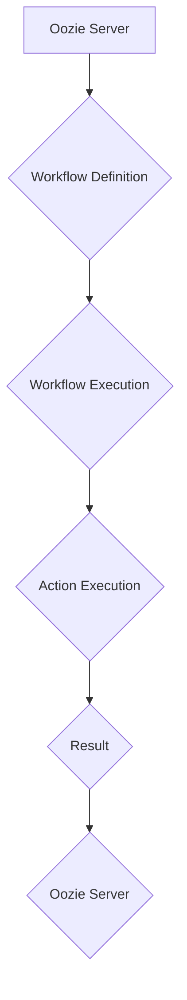
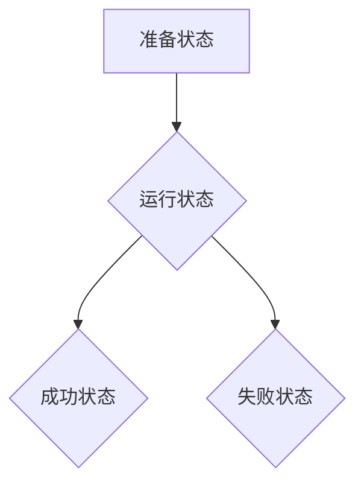

> Oozie,Workflow,Hadoop,YARN,调度,数据处理,代码实例

## 1. 背景介绍

在海量数据时代，高效、可靠地处理数据成为企业发展的关键。Hadoop作为分布式存储和处理框架，为大数据处理提供了强大的能力。然而，Hadoop本身缺乏对复杂数据处理流程的调度和管理能力。为了解决这一问题，Apache Oozie应运而生。

Oozie是一个开源的Workflow调度系统，专门为Hadoop生态系统设计。它提供了一种统一的平台，用于定义、调度、监控和管理Hadoop作业，简化了大数据处理流程的管理和维护。

## 2. 核心概念与联系

Oozie的核心概念包括Workflow、Action、Coordinator和Bundle。

* **Workflow:**  一个Workflow是一个由多个Action组成的逻辑流程，用于描述一个数据处理任务的执行步骤。
* **Action:**  一个Action代表一个独立的Hadoop作业，例如MapReduce、Pig、Hive等。
* **Coordinator:**  Coordinator用于调度重复性任务，例如每天定时执行数据备份。
* **Bundle:**  Bundle用于将多个Workflow组合在一起，形成一个更复杂的处理流程。

Oozie与Hadoop生态系统中的其他组件紧密集成，例如YARN资源管理系统和HDFS分布式文件系统。

**Oozie架构流程图:**



## 3. 核心算法原理 & 具体操作步骤

### 3.1  算法原理概述

Oozie的核心算法是基于状态机模型的Workflow调度算法。它将Workflow划分为不同的状态，例如准备状态、运行状态、成功状态和失败状态。Oozie根据Workflow的定义和当前状态，自动调度和管理Action的执行。

### 3.2  算法步骤详解

1. **Workflow定义:** 用户使用XML格式定义Workflow，包括Action的类型、参数、依赖关系等。
2. **Workflow提交:** 用户将定义好的Workflow提交到Oozie Server。
3. **Workflow调度:** Oozie Server根据Workflow的定义和当前状态，调度Action的执行。
4. **Action执行:** Oozie Server将Action提交到YARN资源管理系统，并监控Action的执行状态。
5. **结果处理:** Action执行完成后，Oozie Server收集结果并更新Workflow的状态。

### 3.3  算法优缺点

**优点:**

* **易于使用:** Oozie提供图形化界面和API，方便用户定义和管理Workflow。
* **可靠性高:** Oozie支持自动重试、失败恢复等机制，提高了Workflow的可靠性。
* **可扩展性强:** Oozie可以与其他Hadoop组件集成，支持大规模数据处理。

**缺点:**

* **灵活性有限:** Oozie的Workflow定义方式相对固定，难以满足一些复杂的业务需求。
* **性能瓶颈:** Oozie Server需要处理大量的Workflow和Action，可能会导致性能瓶颈。

### 3.4  算法应用领域

Oozie广泛应用于各种大数据处理场景，例如：

* **数据清洗和转换:** 将来自不同来源的数据清洗、转换和整合。
* **数据分析和挖掘:** 对大规模数据进行分析和挖掘，发现隐藏的模式和趋势。
* **机器学习:** 训练和部署机器学习模型，进行预测和决策。
* **实时数据处理:** 处理实时数据流，进行实时分析和告警。

## 4. 数学模型和公式 & 详细讲解 & 举例说明

Oozie的调度算法可以抽象为一个状态机模型，其中每个状态代表Workflow的执行阶段，每个状态转换代表Workflow的执行步骤。

**状态机模型:**



**状态转换条件:**

* 从准备状态到运行状态的转换条件是Workflow的所有Action都已准备好执行。
* 从运行状态到成功状态的转换条件是所有Action都已成功执行。
* 从运行状态到失败状态的转换条件是任何一个Action执行失败。

**举例说明:**

假设一个Workflow包含三个Action，A、B和C，其中A依赖于B，B依赖于C。

1. 当Workflow处于准备状态时，Oozie Server会检查Action之间的依赖关系。
2. 由于C没有依赖关系，Oozie Server会首先调度C的执行。
3. 当C执行成功后，Oozie Server会调度B的执行。
4. 当B执行成功后，Oozie Server会调度A的执行。
5. 当所有Action都执行成功后，Workflow会进入成功状态。

## 5. 项目实践：代码实例和详细解释说明

### 5.1  开发环境搭建

* **Hadoop环境:** 安装并配置Hadoop集群。
* **Oozie环境:** 下载并安装Oozie，配置Oozie Server和客户端。
* **开发工具:** 使用Eclipse或IntelliJ IDEA等IDE进行代码开发。

### 5.2  源代码详细实现

```xml
<?xml version="1.0" encoding="UTF-8"?>
<workflow-app xmlns="uri:oozie:workflow:0.4">
  <description>A simple Oozie workflow</description>
  <name>my-workflow</name>
  <start to="action1"/>
  <action name="action1">
    <java>
      <main-class>com.example.MyAction</main-class>
      <arg>-param1</arg>
      <arg>-param2</arg>
    </java>
  </action>
  <kill>
    <message>Workflow failed</message>
  </kill>
  <end/>
</workflow-app>
```

**代码解读:**

* **workflow-app:**  定义了Workflow的根节点。
* **description:**  Workflow的描述信息。
* **name:**  Workflow的名称。
* **start:**  Workflow的开始节点。
* **action:**  定义了一个Action，类型为Java。
* **java:**  指定了Action的Java类和参数。
* **kill:**  定义了Workflow的终止条件。
* **end:**  Workflow的结束节点。

### 5.3  代码解读与分析

* **Java Action:**  Oozie支持多种Action类型，例如Java、Shell、Pig等。
* **参数传递:**  Action可以接收参数，用于配置Action的行为。
* **依赖关系:**  Action之间可以定义依赖关系，确保Workflow的执行顺序。
* **错误处理:**  Oozie支持错误处理机制，例如重试、失败恢复等。

### 5.4  运行结果展示

Oozie Server会根据Workflow的定义，调度Action的执行，并记录执行结果。用户可以通过Oozie Web UI或API查看Workflow的执行状态和日志。

## 6. 实际应用场景

Oozie在实际应用场景中具有广泛的应用价值。

### 6.1  数据清洗和转换

Oozie可以用于将来自不同来源的数据清洗、转换和整合，例如将CSV文件转换为Parquet格式，或者将数据从关系型数据库迁移到HDFS。

### 6.2  数据分析和挖掘

Oozie可以用于调度和管理数据分析和挖掘任务，例如使用Hive进行SQL查询，或者使用Pig进行数据聚合和分析。

### 6.3  机器学习

Oozie可以用于调度和管理机器学习任务，例如使用Spark进行模型训练，或者使用Mahout进行推荐系统构建。

### 6.4  未来应用展望

随着大数据技术的不断发展，Oozie的应用场景将会更加广泛。例如，Oozie可以用于调度和管理实时数据处理任务，或者用于构建微服务架构中的数据流处理流程。

## 7. 工具和资源推荐

### 7.1  学习资源推荐

* **Oozie官方文档:** https://oozie.apache.org/docs/
* **Oozie教程:** https://www.tutorialspoint.com/oozie/index.htm
* **Hadoop官方文档:** https://hadoop.apache.org/docs/

### 7.2  开发工具推荐

* **Eclipse:** https://www.eclipse.org/
* **IntelliJ IDEA:** https://www.jetbrains.com/idea/

### 7.3  相关论文推荐

* **Oozie: A Workflow Scheduler for Hadoop:** https://www.usenix.org/system/files/conference/osdi10/osdi10-paper-zhou.pdf

## 8. 总结：未来发展趋势与挑战

### 8.1  研究成果总结

Oozie作为一款成熟的Workflow调度系统，在Hadoop生态系统中发挥着重要作用。它简化了大数据处理流程的管理和维护，提高了数据处理的效率和可靠性。

### 8.2  未来发展趋势

Oozie的未来发展趋势包括：

* **支持更复杂的Workflow定义:**  支持更灵活的Workflow定义方式，满足更复杂的业务需求。
* **提高调度效率:**  优化调度算法，提高调度效率和资源利用率。
* **增强安全性:**  加强Oozie的安全性，防止数据泄露和攻击。

### 8.3  面临的挑战

Oozie面临的挑战包括：

* **性能瓶颈:**  随着数据规模的增长，Oozie Server可能会面临性能瓶颈。
* **灵活性不足:**  Oozie的Workflow定义方式相对固定，难以满足一些复杂的业务需求。
* **安全问题:**  Oozie需要加强安全性，防止数据泄露和攻击。

### 8.4  研究展望

未来研究方向包括：

* **开发更高效的调度算法:**  研究更先进的调度算法，提高调度效率和资源利用率。
* **支持更灵活的Workflow定义:**  开发更灵活的Workflow定义方式，满足更复杂的业务需求。
* **增强Oozie的安全性:**  研究更有效的安全机制，加强Oozie的安全性。

## 9. 附录：常见问题与解答

### 9.1  Oozie Workflow执行失败怎么办？

如果Oozie Workflow执行失败，可以查看Oozie Web UI或API中的日志，了解失败原因。然后根据失败原因采取相应的措施，例如重新提交Workflow、修改Workflow定义等。

### 9.2  如何监控Oozie Workflow的执行状态？

Oozie Web UI提供了一个图形化的界面，可以监控Workflow的执行状态。用户可以查看Workflow的进度、日志、执行时间等信息。

### 9.3  如何配置Oozie Server？

Oozie Server的配置信息保存在配置文件中，例如`oozie-site.xml`。用户需要根据自己的环境配置相应的参数。

### 9.4  Oozie支持哪些Action类型？

Oozie支持多种Action类型，例如Java、Shell、Pig、Hive等。用户可以根据自己的需求选择合适的Action类型。


作者：禅与计算机程序设计艺术 / Zen and the Art of Computer Programming 
<end_of_turn>