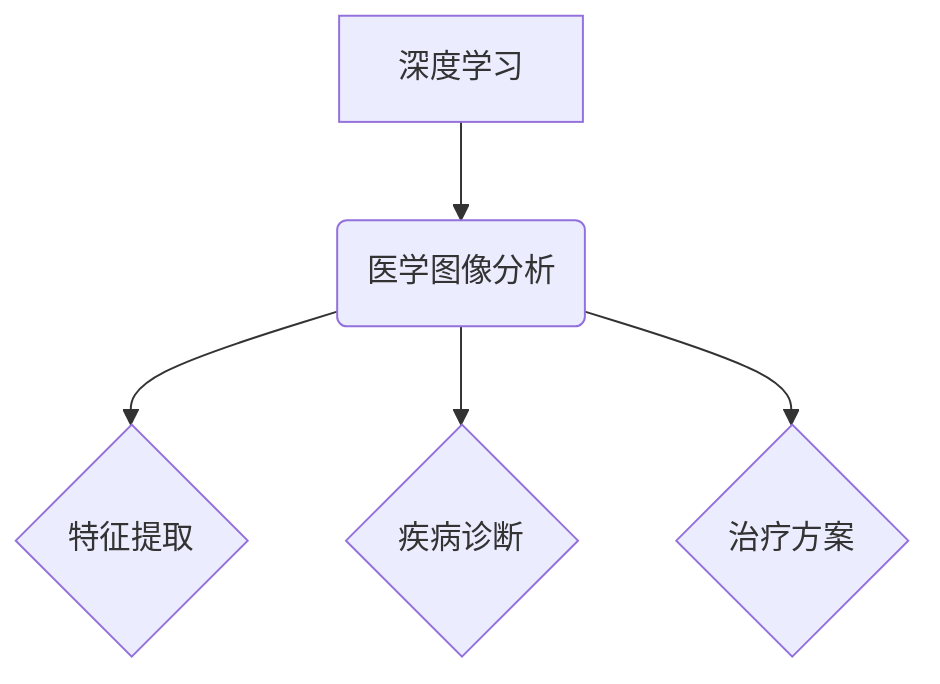

> 深度学习，医学图像分析，卷积神经网络，图像分割，病灶检测，Python，TensorFlow，PyTorch

## 1. 背景介绍

医学图像分析作为医疗诊断和治疗的重要环节，近年来取得了显著进展。深度学习技术的出现为医学图像分析带来了革命性的变革，其强大的特征提取能力和自学习特性使其在图像分割、病灶检测、疾病诊断等领域展现出巨大的潜力。

传统的医学图像分析方法主要依赖于手工提取特征，需要专业医师的经验和知识，且难以处理复杂图像数据。而深度学习算法能够自动学习图像特征，无需人工干预，能够更准确、高效地分析医学图像。

## 2. 核心概念与联系

**2.1 深度学习**

深度学习是一种机器学习的子领域，它利用多层神经网络来模拟人类大脑的学习过程。深度学习模型能够从海量数据中自动学习复杂的特征表示，从而实现对图像、文本、语音等多种数据类型的分析和理解。

**2.2 医学图像分析**

医学图像分析是指利用计算机技术对医学图像进行处理、分析和解读，以辅助医生进行诊断、治疗和研究。常见的医学图像类型包括X光片、CT扫描、MRI扫描等。

**2.3 核心概念联系**

深度学习技术为医学图像分析提供了强大的工具，能够有效解决传统方法难以克服的挑战。深度学习模型能够自动学习医学图像中的特征，从而实现更准确、高效的图像分析。



## 3. 核心算法原理 & 具体操作步骤

**3.1 算法原理概述**

卷积神经网络（Convolutional Neural Network，CNN）是深度学习领域最成功的算法之一，在医学图像分析中得到了广泛应用。CNN的结构灵感来源于生物视觉系统，它利用卷积层和池化层来提取图像特征，并通过全连接层进行分类或回归。

**3.2 算法步骤详解**

1. **数据预处理:** 将医学图像转换为数字格式，并进行尺寸调整、归一化等预处理操作。
2. **卷积层:** 使用卷积核对图像进行卷积运算，提取图像局部特征。
3. **池化层:** 对卷积层的输出进行池化操作，例如最大池化，减少特征图尺寸，提高模型鲁棒性。
4. **全连接层:** 将池化层的输出连接到全连接层，进行分类或回归。
5. **损失函数:** 使用损失函数衡量模型预测结果与真实标签之间的差异。
6. **优化算法:** 使用优化算法，例如梯度下降，更新模型参数，降低损失函数值。

**3.3 算法优缺点**

**优点:**

* 能够自动学习图像特征，无需人工干预。
* 对图像变形和噪声具有较强的鲁棒性。
* 在医学图像分析任务中取得了优异的性能。

**缺点:**

* 需要大量的训练数据。
* 计算复杂度较高，训练时间较长。
* 模型解释性较差，难以理解模型的决策过程。

**3.4 算法应用领域**

* **图像分割:** 将图像分割成不同的区域，例如分割肿瘤、器官等。
* **病灶检测:** 检测图像中是否存在病灶，例如检测肺结核、乳腺癌等。
* **疾病诊断:** 根据图像特征，辅助医生诊断疾病，例如诊断脑卒中、心血管疾病等。

## 4. 数学模型和公式 & 详细讲解 & 举例说明

**4.1 数学模型构建**

CNN模型的数学模型可以表示为一个多层神经网络，其中每一层都包含多个神经元。每个神经元接收来自上一层的输出作为输入，并通过激活函数进行处理，输出到下一层。

**4.2 公式推导过程**

CNN模型的训练过程基于反向传播算法，其核心思想是通过计算损失函数对模型参数的梯度，并利用梯度下降算法更新模型参数，从而降低损失函数值。

**4.3 案例分析与讲解**

假设我们有一个包含100张医学图像的训练数据集，每个图像的大小为224x224像素。我们使用CNN模型进行图像分割任务，目标是将图像分割成肿瘤区域和非肿瘤区域。

在训练过程中，我们首先将图像数据预处理，并将其输入到CNN模型中。模型会自动学习图像特征，并输出分割结果。然后，我们使用损失函数计算模型预测结果与真实标签之间的差异。最后，我们利用梯度下降算法更新模型参数，降低损失函数值。

## 5. 项目实践：代码实例和详细解释说明

**5.1 开发环境搭建**

* 操作系统：Windows/Linux/macOS
* Python版本：3.6+
* 深度学习框架：TensorFlow/PyTorch
* 其他依赖库：NumPy、Matplotlib、OpenCV等

**5.2 源代码详细实现**

```python
import tensorflow as tf

# 定义CNN模型
model = tf.keras.models.Sequential([
    tf.keras.layers.Conv2D(32, (3, 3), activation='relu', input_shape=(224, 224, 3)),
    tf.keras.layers.MaxPooling2D((2, 2)),
    tf.keras.layers.Conv2D(64, (3, 3), activation='relu'),
    tf.keras.layers.MaxPooling2D((2, 2)),
    tf.keras.layers.Flatten(),
    tf.keras.layers.Dense(10, activation='softmax')
])

# 编译模型
model.compile(optimizer='adam',
              loss='categorical_crossentropy',
              metrics=['accuracy'])

# 训练模型
model.fit(x_train, y_train, epochs=10)

# 评估模型
loss, accuracy = model.evaluate(x_test, y_test)
print('Loss:', loss)
print('Accuracy:', accuracy)
```

**5.3 代码解读与分析**

* 代码首先定义了一个CNN模型，包含卷积层、池化层和全连接层。
* 然后，模型被编译，指定了优化器、损失函数和评价指标。
* 接着，模型被训练，使用训练数据进行训练。
* 最后，模型被评估，使用测试数据计算模型的损失函数值和准确率。

**5.4 运行结果展示**

训练完成后，我们可以使用模型对新的医学图像进行预测。模型的预测结果可以是图像分割结果、病灶检测结果或疾病诊断结果。

## 6. 实际应用场景

**6.1 肿瘤分割**

CNN模型可以用于分割肿瘤区域，帮助医生更准确地评估肿瘤大小和位置。

**6.2 病灶检测**

CNN模型可以用于检测图像中是否存在病灶，例如检测肺结核、乳腺癌等。

**6.3 疾病诊断**

CNN模型可以根据图像特征，辅助医生诊断疾病，例如诊断脑卒中、心血管疾病等。

**6.4 未来应用展望**

* **个性化医疗:** 利用深度学习模型分析患者的医学图像数据，为患者提供个性化的诊断和治疗方案。
* **远程医疗:** 利用深度学习模型进行远程医疗诊断，为偏远地区患者提供医疗服务。
* **药物研发:** 利用深度学习模型分析药物的分子结构和生物活性，加速药物研发过程。

## 7. 工具和资源推荐

**7.1 学习资源推荐**

* **书籍:**
    * 深度学习
    * Python深度学习
* **在线课程:**
    * Coursera深度学习课程
    * Udacity深度学习课程

**7.2 开发工具推荐**

* **深度学习框架:** TensorFlow、PyTorch
* **图像处理库:** OpenCV
* **数据可视化库:** Matplotlib

**7.3 相关论文推荐**

* **医学图像分割:**
    * U-Net: Convolutional Networks for Biomedical Image Segmentation
* **病灶检测:**
    * Deep Learning for Medical Image Analysis
* **疾病诊断:**
    * Deep Learning in Healthcare: A Comprehensive Review

## 8. 总结：未来发展趋势与挑战

**8.1 研究成果总结**

深度学习技术在医学图像分析领域取得了显著进展，为疾病诊断、治疗和研究提供了新的工具和方法。

**8.2 未来发展趋势**

* **模型复杂度提升:** 开发更复杂、更强大的深度学习模型，能够处理更复杂、更丰富的医学图像数据。
* **数据规模扩大:** 收集和整合更多医学图像数据，为深度学习模型提供更丰富的训练数据。
* **解释性增强:** 研究深度学习模型的决策过程，提高模型的解释性，增强医生的信任度。

**8.3 面临的挑战**

* **数据隐私保护:** 医学图像数据包含敏感信息，需要采取有效措施保护患者隐私。
* **模型可解释性:** 深度学习模型的决策过程难以理解，需要研究提高模型可解释性的方法。
* **临床应用推广:** 将深度学习技术应用到临床实践中，需要克服技术和伦理方面的挑战。

**8.4 研究展望**

未来，深度学习技术将在医学图像分析领域发挥更重要的作用，为人类健康做出更大的贡献。


## 9. 附录：常见问题与解答

**9.1 如何选择合适的深度学习框架？**

TensorFlow和PyTorch是目前最流行的深度学习框架，它们各有优缺点。TensorFlow更适合于生产环境，PyTorch更适合于研究和开发。

**9.2 如何处理医学图像数据？**

医学图像数据需要进行预处理，例如尺寸调整、归一化、增强等操作，以提高模型的性能。

**9.3 如何评估深度学习模型的性能？**

可以使用准确率、召回率、F1-score等指标来评估深度学习模型的性能。

**9.4 如何解决深度学习模型的过拟合问题？**

可以使用正则化、数据增强、Dropout等技术来解决深度学习模型的过拟合问题。


作者：禅与计算机程序设计艺术 / Zen and the Art of Computer Programming 
<end_of_turn>