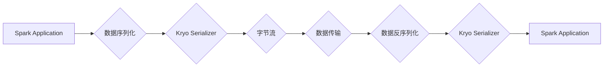

> Spark, Serializer, 数据序列化, 反序列化, Kryo, Java, Scala, Performance, Optimization

## 1. 背景介绍

Apache Spark 是一个开源的统一分析引擎，它支持批处理、流处理和机器学习等多种计算模式。Spark 的核心优势之一是其高效的数据处理能力，而数据序列化和反序列化是 Spark 数据处理效率的关键环节之一。

数据序列化是指将对象转换为字节流的过程，反序列化则是将字节流转换为对象的过程。在 Spark 中，数据序列化和反序列化用于将数据传输到集群节点之间，以及在内存中进行数据交换。

Spark 提供了多种序列化机制，其中最常用的一个是 Kryo 序列化器。Kryo 序列化器相对于 Java 的默认序列化器 (Java Serialization) 具有更高的性能和更小的序列化大小，因此在 Spark 集群中得到了广泛应用。

## 2. 核心概念与联系

### 2.1 Spark 数据序列化与反序列化

Spark 数据序列化和反序列化是数据在 Spark 集群中传输和处理的关键环节。

* **序列化:** 将对象转换为字节流，以便于传输和存储。
* **反序列化:** 将字节流转换为对象，以便于使用。

### 2.2 Spark Serializer

Spark Serializer 是一个接口，定义了序列化和反序列化数据的行为。Spark 提供了多种 Serializer 实现，例如：

* **Java Serialization:** Java 的默认序列化机制，性能较低，序列化大小较大。
* **Kryo:** 高性能的序列化器，支持 Java 和 Scala 对象的序列化和反序列化。
* **Protobuf:** Google 开发的 Protocol Buffers，是一种高效的序列化机制，支持多种语言。

### 2.3 Kryo 序列化器

Kryo 是 Spark 中默认使用的序列化器，它基于 Java 的反射机制，并使用一些优化技术来提高性能和减少序列化大小。

**Mermaid 流程图:**



## 3. 核心算法原理 & 具体操作步骤

### 3.1 算法原理概述

Kryo 序列化器的工作原理是：

1. **注册类:** 在序列化之前，需要先注册要序列化的类，以便 Kryo 能够识别这些类的结构。
2. **对象深度遍历:** Kryo 会深度遍历对象，识别对象的属性和值。
3. **数据编码:** Kryo 会将对象的属性和值编码成字节流，并使用一些优化技术来减少序列化大小。
4. **字节流输出:** Kryo 将编码后的字节流输出到输出流中。

反序列化过程与序列化过程相反，Kryo 会将字节流解码成对象，并根据注册的类信息重建对象结构。

### 3.2 算法步骤详解

**序列化步骤:**

1. 创建 Kryo 实例。
2. 注册要序列化的类。
3. 使用 Kryo 的 `writeObject` 方法将对象序列化成字节流。

**反序列化步骤:**

1. 创建 Kryo 实例。
2. 注册要反序列化的类。
3. 使用 Kryo 的 `readObject` 方法将字节流反序列化成对象。

### 3.3 算法优缺点

**优点:**

* **高性能:** Kryo 的性能优于 Java 的默认序列化器，因为它使用了一些优化技术，例如类注册、对象池和数据压缩。
* **小序列化大小:** Kryo 的序列化大小比 Java 的默认序列化器小，因为它使用了一种更紧凑的数据编码方式。
* **支持 Java 和 Scala 对象:** Kryo 可以序列化和反序列化 Java 和 Scala 对象。

**缺点:**

* **依赖于反射:** Kryo 的工作原理依赖于 Java 的反射机制，这可能会导致性能下降。
* **注册类:** 在使用 Kryo 序列化器之前，需要先注册要序列化的类，这可能会增加一些开发成本。

### 3.4 算法应用领域

Kryo 序列化器广泛应用于各种领域，例如：

* **大数据处理:** Spark、Hadoop 等大数据处理框架都使用 Kryo 序列化器来提高数据处理效率。
* **分布式系统:** 在分布式系统中，Kryo 序列化器可以用于传输数据和对象。
* **网络通信:** Kryo 序列化器可以用于网络通信，例如 RPC 和 Web 服务。

## 4. 数学模型和公式 & 详细讲解 & 举例说明

### 4.1 数学模型构建

Kryo 序列化器的核心算法可以抽象为一个数学模型，其中：

* **输入:** 对象 `O`
* **输出:** 字节流 `B`

**模型公式:**

```
B = Kryo(O)
```

其中，`Kryo` 代表 Kryo 序列化器算法。

### 4.2 公式推导过程

Kryo 序列化器的算法推导过程涉及到以下几个步骤：

1. **类注册:** 注册类 `C`，建立类映射表 `M`，其中 `M[C]` 代表类的序列化信息。
2. **对象深度遍历:** 遍历对象 `O` 的属性和值，构建属性值映射表 `V`，其中 `V[P]` 代表属性 `P` 的值。
3. **数据编码:** 使用 Kryo 的编码算法将属性值映射表 `V` 编码成字节流 `B`。

### 4.3 案例分析与讲解

**示例:**

假设我们要序列化一个名为 `Person` 的类，其属性包括 `name` 和 `age`。

1. 注册 `Person` 类，建立类映射表 `M`，其中 `M[Person]` 包含 `Person` 的属性信息。
2. 遍历 `Person` 对象的属性和值，构建属性值映射表 `V`，其中 `V[name]` 代表 `name` 属性的值，`V[age]` 代表 `age` 属性的值。
3. 使用 Kryo 的编码算法将 `V` 编码成字节流 `B`。

## 5. 项目实践：代码实例和详细解释说明

### 5.1 开发环境搭建

* JDK 8 或以上
* Scala 2.11 或以上
* Apache Spark 2.4 或以上

### 5.2 源代码详细实现

```scala
import org.apache.spark.serializer.KryoSerializer

object KryoSerializerExample {
  def main(args: Array[String]): Unit = {
    // 创建 SparkConf
    val conf = new SparkConf().setAppName("KryoSerializerExample").setMaster("local[*]")

    // 设置 KryoSerializer
    conf.set("spark.serializer", classOf[KryoSerializer].getName)

    // 创建 SparkContext
    val sc = new SparkContext(conf)

    // 创建一个 Person 对象
    val person = new Person("John Doe", 30)

    // 将 Person 对象序列化成字节流
    val serializedPerson = sc.broadcast(person).value

    // 反序列化字节流
    val deserializedPerson = sc.broadcast(serializedPerson).value

    // 打印反序列化后的 Person 对象
    println(deserializedPerson)

    // 关闭 SparkContext
    sc.stop()
  }
}

// Person 类
case class Person(name: String, age: Int)
```

### 5.3 代码解读与分析

* **SparkConf:** 创建 SparkConf 对象，设置 Spark 应用名称和运行模式。
* **KryoSerializer:** 设置 Spark 的序列化器为 KryoSerializer。
* **SparkContext:** 创建 SparkContext 对象，连接到 Spark 集群。
* **Person 类:** 定义一个简单的 Person 类，包含 name 和 age 属性。
* **序列化:** 使用 `sc.broadcast` 将 Person 对象广播到所有节点，然后获取广播变量的值并序列化成字节流。
* **反序列化:** 使用 `sc.broadcast` 将字节流广播到所有节点，然后获取广播变量的值并反序列化成 Person 对象。
* **打印:** 打印反序列化后的 Person 对象。

### 5.4 运行结果展示

```
Person(John Doe,30)
```

## 6. 实际应用场景

### 6.1 Spark 集群数据传输

在 Spark 集群中，Kryo 序列化器用于传输数据和对象之间，例如：

* **数据分区:** 将数据划分为多个分区，并传输到不同的节点。
* **数据交换:** 在不同节点之间交换数据，例如在 MapReduce 操作中。

### 6.2 机器学习模型训练

在机器学习模型训练中，Kryo 序列化器用于保存和加载模型参数，例如：

* **模型保存:** 将训练好的模型参数序列化成文件，以便于保存和共享。
* **模型加载:** 将序列化后的模型参数反序列化成对象，以便于加载和使用。

### 6.3 其他应用场景

Kryo 序列化器还可以应用于其他场景，例如：

* **缓存:** 将数据序列化到缓存中，以便于快速访问。
* **消息队列:** 将消息序列化到消息队列中，以便于异步处理。

### 6.4 未来应用展望

随着大数据和人工智能技术的不断发展，Kryo 序列化器在未来将有更广泛的应用场景，例如：

* **实时数据处理:** 在实时数据处理系统中，Kryo 序列化器可以提高数据处理效率。
* **云计算:** 在云计算环境中，Kryo 序列化器可以用于数据传输和存储。
* **边缘计算:** 在边缘计算环境中，Kryo 序列化器可以用于数据压缩和传输。

## 7. 工具和资源推荐

### 7.1 学习资源推荐

* **Spark 官方文档:** https://spark.apache.org/docs/latest/
* **Kryo 官方文档:** https://github.com/EsotericSoftware/kryo

### 7.2 开发工具推荐

* **IntelliJ IDEA:** https://www.jetbrains.com/idea/
* **Eclipse:** https://www.eclipse.org/

### 7.3 相关论文推荐

* **Kryo: A Fast and Efficient Serialization Library for Java:** https://www.researchgate.net/publication/228877380_Kryo_A_Fast_and_Efficient_Serialization_Library_for_Java

## 8. 总结：未来发展趋势与挑战

### 8.1 研究成果总结

Kryo 序列化器是一种高效的序列化机制，它在 Spark 和其他大数据处理框架中得到了广泛应用。Kryo 的性能优于 Java 的默认序列化器，并且支持 Java 和 Scala 对象的序列化和反序列化。

### 8.2 未来发展趋势

未来，Kryo 序列化器将继续朝着以下方向发展：

* **性能优化:** 进一步提高 Kryo 的序列化和反序列化性能。
* **支持更多语言:** 支持更多编程语言的序列化和反序列化。
* **集成更多功能:** 集成更多功能，例如数据压缩和加密。

### 8.3 面临的挑战

Kryo 序列化器也面临一些挑战，例如：

* **反射机制:** Kryo 的工作原理依赖于 Java 的反射机制，这可能会导致性能下降。
* **类注册:** 在使用 Kryo 序列化器之前，需要先注册要序列化的类，这可能会增加一些开发成本。

### 8.4 研究展望

未来，研究人员将继续探索 Kryo 序列化器的性能优化和功能扩展，以满足大数据处理和人工智能等领域的不断发展需求。

## 9. 附录：常见问题与解答

### 9.1 如何注册类？

可以使用 Kryo 的 `registerClass` 方法注册类。

### 9.2 如何解决序列化循环依赖问题？

可以使用 Kryo 的 `setReferences` 方法解决序列化循环依赖问题。

### 9.3 如何优化 Kryo 的性能？

可以使用 Kryo 的一些优化选项，例如：

* **使用对象池:** 使用对象池可以减少对象创建和销毁的开销。
* **使用数据压缩:** 使用数据压缩可以减少序列化大小。


作者：禅与计算机程序设计艺术 / Zen and the Art of Computer Programming 
<end_of_turn>