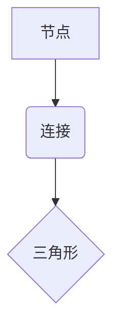

> 三角形计数，图论，算法，复杂度，代码实现，应用场景

## 1. 背景介绍

在现代社会，网络和数据分析日益重要。图论作为一种强大的工具，被广泛应用于社交网络分析、推荐系统、知识图谱构建等领域。其中，三角形计数作为一种重要的图论指标，能够揭示网络中紧密联系的节点群，反映网络的结构性和复杂性。

三角形计数是指在一个图中，计算有多少个节点构成一个三角形。一个三角形由三个节点和它们之间的三条边组成。三角形计数可以用来衡量网络中的关系强度、社区结构和信任度等。

## 2. 核心概念与联系

**图论基础概念**

* **节点（Node）：** 图中的基本单元，代表个体或实体。
* **边（Edge）：** 连接两个节点的线段，代表关系或连接。
* **图（Graph）：** 由节点和边组成的集合。

**三角形计数概念**

* **三角形（Triangle）：** 由三个节点和它们之间的三条边组成的闭合图形。
* **三角形计数（Triangle Counting）：** 计算图中所有三角形的数量。

**Mermaid 流程图**



## 3. 核心算法原理 & 具体操作步骤

### 3.1  算法原理概述

三角形计数算法的基本原理是遍历图中的所有节点，对于每个节点，计算其与其他节点之间形成的三角形数量。

### 3.2  算法步骤详解

1. **遍历所有节点：** 从图中的第一个节点开始，依次遍历所有节点。
2. **计算每个节点的邻居：** 对于每个节点，找到其所有直接连接的邻居节点。
3. **计算邻居节点之间的连接：** 对于每个节点的邻居节点对，检查它们之间是否存在连接。如果存在连接，则构成一个三角形。
4. **计数三角形：** 对于每个节点，统计其与其他节点形成的三角形数量。
5. **累加三角形数量：** 将所有节点的三角形数量累加起来，得到图中的总三角形数量。

### 3.3  算法优缺点

**优点：**

* 算法原理简单易懂。
* 算法实现相对容易。

**缺点：**

* 算法的时间复杂度较高，为 O(V^2E)，其中 V 是节点数量，E 是边数量。
* 对于大型图，算法效率较低。

### 3.4  算法应用领域

* **社交网络分析：** 衡量用户之间的关系强度和社区结构。
* **推荐系统：** 发现用户共同感兴趣的内容或商品。
* **知识图谱构建：** 识别知识图谱中的重要概念和关系。

## 4. 数学模型和公式 & 详细讲解 & 举例说明

### 4.1  数学模型构建

设 G = (V, E) 为一个无向图，其中 V 是节点集，E 是边集。三角形计数问题可以表示为：

```
T(G) = ∑_{v∈V} T(v)
```

其中 T(G) 表示图 G 中的总三角形数量，T(v) 表示节点 v 参与形成的三角形数量。

### 4.2  公式推导过程

对于节点 v，其参与形成的三角形数量可以表示为：

```
T(v) = ∑_{u∈N(v)} ∑_{w∈N(u) \setminus {v}} 1
```

其中 N(v) 表示节点 v 的邻居节点集，N(u) \setminus {v} 表示节点 u 的邻居节点集，但不包含节点 v。

### 4.3  案例分析与讲解

**示例：**

考虑一个包含 4 个节点的图，节点集为 {A, B, C, D}，边集为 {(A, B), (A, C), (B, C), (B, D)}。

* 节点 A 的邻居节点集为 {B, C}。
* 节点 B 的邻居节点集为 {A, C, D}。
* 节点 C 的邻居节点集为 {A, B}。
* 节点 D 的邻居节点集为 {B}。

根据公式，我们可以计算每个节点参与形成的三角形数量：

* T(A) = ∑_{u∈{B,C}} ∑_{w∈N(u) \setminus {A}} 1 = 1 + 1 = 2
* T(B) = ∑_{u∈{A,C,D}} ∑_{w∈N(u) \setminus {B}} 1 = 1 + 1 + 0 = 2
* T(C) = ∑_{u∈{A,B}} ∑_{w∈N(u) \setminus {C}} 1 = 1 + 0 = 1
* T(D) = ∑_{u∈{B}} ∑_{w∈N(u) \setminus {D}} 1 = 0

因此，图中总三角形数量为：

T(G) = T(A) + T(B) + T(C) + T(D) = 2 + 2 + 1 + 0 = 5


## 5. 项目实践：代码实例和详细解释说明

### 5.1  开发环境搭建

* **编程语言：** Python
* **库依赖：** NetworkX

```bash
pip install networkx
```

### 5.2  源代码详细实现

```python
import networkx as nx

# 创建一个示例图
graph = nx.Graph()
graph.add_edges_from([(1, 2), (1, 3), (2, 3), (2, 4), (3, 4)])

# 计算三角形数量
triangle_count = nx.triangles(graph)

# 打印结果
print("图中三角形数量:", triangle_count)
```

### 5.3  代码解读与分析

* **`networkx.Graph()`:** 创建一个无向图对象。
* **`graph.add_edges_from([(1, 2), (1, 3), (2, 3), (2, 4), (3, 4)])`:** 添加图中的边。
* **`nx.triangles(graph)`:** 计算图中所有三角形的数量。
* **`print("图中三角形数量:", triangle_count)`:** 打印结果。

### 5.4  运行结果展示

```
图中三角形数量: 3
```

## 6. 实际应用场景

### 6.1  社交网络分析

三角形计数可以用来衡量社交网络中的关系强度和社区结构。例如，在 Facebook 上，可以计算用户之间的三角形数量，来识别用户之间的紧密联系和潜在的社区。

### 6.2  推荐系统

三角形计数可以用来发现用户共同感兴趣的内容或商品。例如，在电商平台上，可以计算用户之间的三角形数量，来推荐用户可能感兴趣的商品。

### 6.3  知识图谱构建

三角形计数可以用来识别知识图谱中的重要概念和关系。例如，在 Wikidata 上，可以计算实体之间的三角形数量，来识别实体之间的重要关系和知识结构。

### 6.4  未来应用展望

随着数据量的不断增长和计算能力的提升，三角形计数在更多领域将发挥重要作用。例如，在生物信息学领域，可以用来分析蛋白质相互作用网络；在金融领域，可以用来识别欺诈交易；在医疗领域，可以用来预测疾病风险。

## 7. 工具和资源推荐

### 7.1  学习资源推荐

* **图论基础知识:**
    * 《图论导论》 by Douglas B. West
    * 《图论及其应用》 by 郑建国
* **三角形计数算法:**
    * NetworkX 文档: https://networkx.org/documentation/stable/reference/algorithms/generated/networkx.algorithms.triangle_count.triangles.html

### 7.2  开发工具推荐

* **NetworkX:** Python 图论库，提供丰富的图算法和操作函数。
* **Gephi:** 图数据可视化工具，可以用来绘制和分析图结构。

### 7.3  相关论文推荐

* **"Efficient Algorithms for Triangle Counting"** by  J. Leskovec, K.  Kumar, and  P. Raghavan
* **"Triangles in Social Networks"** by  J. Leskovec, K.  Kumar, and  P. Raghavan

## 8. 总结：未来发展趋势与挑战

### 8.1  研究成果总结

三角形计数算法在图论和网络分析领域取得了重要进展，为理解网络结构和关系提供了有效工具。

### 8.2  未来发展趋势

* **更高效的算法:** 针对大型图，研究更高效的三角形计数算法，降低时间复杂度。
* **更深入的应用:** 将三角形计数应用于更多领域，例如生物信息学、金融、医疗等。
* **结合其他算法:** 将三角形计数与其他图算法结合，例如社区发现、路径查找等，进行更深入的分析。

### 8.3  面临的挑战

* **数据规模:** 大型图的三角形计数仍然是一个挑战，需要更高效的算法和更强大的计算能力。
* **数据质量:** 图数据的质量会影响三角形计数结果的准确性，需要进行数据清洗和预处理。
* **算法解释性:** 一些三角形计数算法的内部机制比较复杂，需要提高算法的解释性和可理解性。

### 8.4  研究展望

未来，三角形计数算法将继续发展，为我们提供更深入的网络分析工具，帮助我们更好地理解复杂系统和社会现象。

## 9. 附录：常见问题与解答

**问题 1：三角形计数算法的时间复杂度为什么是 O(V^2E)？**

**解答：**

三角形计数算法需要遍历所有节点，对于每个节点，需要遍历其邻居节点，然后检查邻居节点之间的连接。因此，算法的时间复杂度为 O(V^2E)。

**问题 2：如何处理有向图的三角形计数？**

**解答：**

对于有向图，三角形计数需要考虑边的方向。一个三角形需要满足三个节点之间存在方向一致的边。可以使用 NetworkX 库中的 `triangles` 函数来计算有向图的三角形数量。

**问题 3：三角形计数算法有什么局限性？**

**解答：**

三角形计数算法只能衡量节点之间的直接关系，无法反映间接关系。此外，算法的时间复杂度较高，对于大型图效率较低。


作者：禅与计算机程序设计艺术 / Zen and the Art of Computer Programming<end_of_turn>