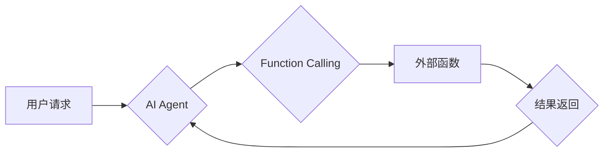

> Function Calling, 大模型, AI Agent, 函数调用, 编程接口, 模型交互, 

## 1. 背景介绍

随着大模型技术的蓬勃发展，AI Agent 作为一种能够自主学习、推理和执行任务的智能体，逐渐成为人工智能领域的研究热点。AI Agent 的核心能力之一是能够调用外部函数或服务，以扩展其功能和应对复杂场景。Function Calling，即函数调用，是实现 AI Agent 与外部世界交互的关键机制。

传统的软件开发中，函数调用是编程语言的基本语法，用于将代码块组织成可重用和可组合的单元。在 AI Agent 的语境下，Function Calling 则赋予了更深层的含义。它不仅是代码执行的机制，更是一种模型与外部环境交互的方式，使得 AI Agent 可以访问和利用各种外部资源和服务，从而实现更智能、更灵活的应用。

## 2. 核心概念与联系

Function Calling 在 AI Agent 中扮演着至关重要的角色，它连接了模型的内部逻辑与外部世界，使得 AI Agent 可以：

* **扩展功能：** AI Agent 可以调用外部函数来实现自己无法直接完成的任务，例如访问数据库、发送邮件、控制硬件设备等。
* **增强灵活性：** 通过调用不同的函数，AI Agent 可以根据不同的场景和需求灵活地调整其行为，实现更智能的决策和行动。
* **提高效率：** 将一些重复性或耗时的任务外包给外部函数，可以提高 AI Agent 的执行效率。

**Mermaid 流程图：**



## 3. 核心算法原理 & 具体操作步骤

### 3.1  算法原理概述

Function Calling 的核心算法原理是将 AI Agent 的请求转化为外部函数可以理解的格式，并通过特定的接口进行调用。

**主要步骤：**

1. **解析请求：** AI Agent 首先需要解析用户的请求，理解其意图和所需的功能。
2. **函数匹配：** 根据请求内容，AI Agent 会从其已知的函数库中匹配合适的函数。
3. **参数准备：** AI Agent 需要将请求中的信息转化为函数所需的输入参数。
4. **函数调用：** AI Agent 通过特定的接口调用匹配到的函数，并传递参数。
5. **结果处理：** 函数执行完成后，AI Agent 会接收返回的结果，并进行相应的处理和反馈。

### 3.2  算法步骤详解

1. **解析请求：**

   * 对于文本请求，AI Agent 可以使用自然语言处理技术进行理解。
   * 对于其他类型的请求，例如图像或音频，AI Agent 需要使用相应的处理技术进行转换。

2. **函数匹配：**

   * AI Agent 可以使用规则匹配、机器学习等方法进行函数匹配。
   * 规则匹配是指根据预先定义的规则，将请求与函数进行匹配。
   * 机器学习方法是指训练一个模型，能够根据请求内容预测合适的函数。

3. **参数准备：**

   * AI Agent 需要将请求中的信息转化为函数所需的格式。
   * 例如，如果请求是“查询用户姓名”，AI Agent 需要将“用户”和“姓名”这两个信息作为参数传递给查询函数。

4. **函数调用：**

   * AI Agent 可以使用API接口、RPC等方式调用外部函数。
   * API接口是指预定义的接口，用于访问特定的功能或服务。
   * RPC（远程过程调用）是指远程执行函数的机制。

5. **结果处理：**

   * AI Agent 会接收函数返回的结果，并进行相应的处理和反馈。
   * 例如，如果查询函数返回了用户姓名，AI Agent 会将姓名显示给用户。

### 3.3  算法优缺点

**优点：**

* **扩展性强：** 可以通过调用外部函数，扩展 AI Agent 的功能。
* **灵活性高：** 可以根据不同的场景和需求，灵活地调用不同的函数。
* **效率高：** 可以将一些重复性或耗时的任务外包给外部函数，提高 AI Agent 的执行效率。

**缺点：**

* **安全性问题：** 如果外部函数存在漏洞，可能会导致 AI Agent 被攻击。
* **可靠性问题：** 如果外部函数不可用，可能会导致 AI Agent 无法正常工作。
* **复杂性问题：** 函数调用机制的实现可能会比较复杂。

### 3.4  算法应用领域

Function Calling 在 AI Agent 的应用领域中具有广泛的应用前景，例如：

* **智能客服：** AI Agent 可以调用外部函数访问知识库，回答用户的疑问。
* **智能家居：** AI Agent 可以调用外部函数控制家电设备，实现智能家居的功能。
* **自动驾驶：** AI Agent 可以调用外部函数获取地图信息和交通规则，进行路径规划和决策。

## 4. 数学模型和公式 & 详细讲解 & 举例说明

### 4.1  数学模型构建

Function Calling 可以用一个简单的数学模型来表示：

```
f(x) = y
```

其中：

* f(x) 表示函数调用，
* x 表示函数的输入参数，
* y 表示函数的输出结果。

### 4.2  公式推导过程

这个模型的推导过程很简单，就是将函数调用过程抽象成一个数学表达式。

### 4.3  案例分析与讲解

例如，假设有一个函数 `calculate_sum(a, b)`，它接受两个整数作为输入参数，并返回它们的和。

如果我们调用这个函数，传入参数 `a = 5` 和 `b = 3`，那么我们可以用数学模型来表示这个过程：

```
calculate_sum(5, 3) = 8
```

在这个例子中，函数 `calculate_sum` 是 `f`，输入参数 `a = 5` 和 `b = 3` 是 `x`，输出结果 `8` 是 `y`。

## 5. 项目实践：代码实例和详细解释说明

### 5.1  开发环境搭建

为了演示 Function Calling 的实现，我们使用 Python 语言和 Flask 框架搭建一个简单的开发环境。

**步骤：**

1. 安装 Python 和 Flask 框架。
2. 创建一个新的 Python 项目文件夹。
3. 在项目文件夹中创建一个名为 `app.py` 的文件。

### 5.2  源代码详细实现

```python
from flask import Flask, request, jsonify

app = Flask(__name__)

@app.route('/calculate_sum', methods=['POST'])
def calculate_sum():
    data = request.get_json()
    a = data['a']
    b = data['b']
    result = a + b
    return jsonify({'result': result})

if __name__ == '__main__':
    app.run(debug=True)
```

**代码解释：**

* `from flask import Flask, request, jsonify`: 导入 Flask 框架所需的模块。
* `app = Flask(__name__)`: 创建一个 Flask 应用实例。
* `@app.route('/calculate_sum', methods=['POST'])`: 定义一个名为 `/calculate_sum` 的路由，接受 POST 请求。
* `def calculate_sum()`: 定义处理 POST 请求的函数。
* `data = request.get_json()`: 获取请求体中的 JSON 数据。
* `a = data['a']`, `b = data['b']`: 从 JSON 数据中提取 `a` 和 `b` 两个参数。
* `result = a + b`: 计算 `a` 和 `b` 的和。
* `return jsonify({'result': result})`: 返回计算结果作为 JSON 格式的响应。

### 5.3  代码解读与分析

这段代码定义了一个简单的 API 接口，用于计算两个整数的和。

* `@app.route('/calculate_sum', methods=['POST'])`: 
    * `@app.route` 是 Flask 框架的装饰器，用于定义路由规则。
    * `/calculate_sum` 是路由路径，表示访问这个接口的 URL。
    * `methods=['POST']` 指定只接受 POST 请求。
* `def calculate_sum()`: 
    * 这是处理 POST 请求的函数。
    * `request.get_json()` 获取请求体中的 JSON 数据。
    * `data['a']`, `data['b']` 从 JSON 数据中提取 `a` 和 `b` 两个参数。
    * `result = a + b` 计算 `a` 和 `b` 的和。
    * `jsonify({'result': result})` 将计算结果包装成 JSON 格式的响应。

### 5.4  运行结果展示

运行这段代码后，我们可以访问 `http://127.0.0.1:5000/calculate_sum` 这个 URL，并发送一个 POST 请求，例如：

```json
{
  "a": 5,
  "b": 3
}
```

服务器会返回以下 JSON 格式的响应：

```json
{
  "result": 8
}
```

## 6. 实际应用场景

Function Calling 在 AI Agent 的实际应用场景中具有广泛的应用前景，例如：

### 6.1  智能客服

AI Agent 可以调用外部函数访问知识库，回答用户的疑问。例如，用户询问“公司地址是多少？”，AI Agent 可以调用外部函数查询公司信息，并返回公司地址。

### 6.2  智能家居

AI Agent 可以调用外部函数控制家电设备，实现智能家居的功能。例如，用户说“打开客厅灯”，AI Agent 可以调用外部函数控制客厅灯的开关。

### 6.3  自动驾驶

AI Agent 可以调用外部函数获取地图信息和交通规则，进行路径规划和决策。例如，AI Agent 可以调用外部函数获取实时交通状况，并根据路况选择最佳路线。

### 6.4  未来应用展望

随着大模型技术的不断发展，Function Calling 将在 AI Agent 的应用中发挥越来越重要的作用。未来，我们可以期待看到更多基于 Function Calling 的创新应用，例如：

* **个性化服务：** AI Agent 可以根据用户的需求和喜好，调用不同的函数提供个性化服务。
* **跨平台交互：** AI Agent 可以通过 Function Calling 与不同的平台和设备进行交互，实现跨平台的应用。
* **协同工作：** 多个 AI Agent 可以通过 Function Calling 协同工作，完成更复杂的任务。

## 7. 工具和资源推荐

### 7.1  学习资源推荐

* **书籍：**
    * 《深度学习》
    * 《自然语言处理》
    * 《人工智能：现代方法》
* **在线课程：**
    * Coursera
    * edX
    * Udacity

### 7.2  开发工具推荐

* **Python:** 
    * Flask
    * FastAPI
* **机器学习库:**
    * TensorFlow
    * PyTorch
* **自然语言处理库:**
    * NLTK
    * SpaCy

### 7.3  相关论文推荐

* **Function Calling in Large Language Models**
* **Towards AI-Powered Function Composition**
* **Function-as-a-Service for AI Agents**

## 8. 总结：未来发展趋势与挑战

### 8.1  研究成果总结

Function Calling 是 AI Agent 发展的重要方向，它使得 AI Agent 可以更灵活地与外部世界交互，扩展其功能和应用场景。

### 8.2  未来发展趋势

未来，Function Calling 将朝着以下几个方向发展：

* **更智能的函数匹配：** 利用机器学习等技术，实现更智能的函数匹配，能够更准确地识别用户的意图，并调用最合适的函数。
* **更安全的函数调用：** 加强函数调用的安全性，防止恶意函数的调用，保护 AI Agent 的安全。
* **更丰富的函数库：** 构建更丰富的函数库，提供更多功能和服务，满足 AI Agent 的多样化需求。

### 8.3  面临的挑战

Function Calling 仍然