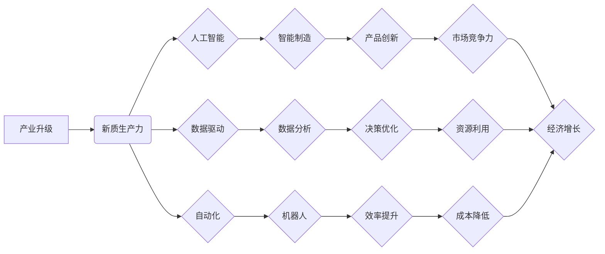

> 产业升级、新质生产力、人工智能、数据驱动、自动化、智能制造、数字孪生、云计算、区块链

## 1. 背景介绍

当前，全球经济发展进入新阶段，传统产业面临着结构性调整和转型升级的压力。一方面，科技进步日新月异，人工智能、大数据、云计算等新兴技术蓬勃发展，为产业升级提供了新的机遇；另一方面，全球竞争加剧，市场需求不断变化，传统产业模式面临挑战。

产业升级是指通过技术创新、管理模式变革、产业结构调整等方式，提升产业整体水平和竞争力。新质生产力是指以新技术、新模式、新要素为基础，实现生产效率、产品质量、资源利用率等方面的显著提升，推动经济高质量发展的新型生产力。

## 2. 核心概念与联系

**2.1 产业升级与新质生产力的关系**

产业升级是实现新质生产力的重要途径。新质生产力是产业升级的内在动力，而产业升级则是新质生产力的应用和释放。两者相互促进，共同推动经济发展。

**2.2 核心概念架构**

**2.3 核心概念解析**

* **产业升级:** 通过技术创新、管理模式变革、产业结构调整等方式，提升产业整体水平和竞争力。
* **新质生产力:** 以新技术、新模式、新要素为基础，实现生产效率、产品质量、资源利用率等方面的显著提升，推动经济高质量发展的新型生产力。
* **人工智能:** 能够模拟人类智能的计算机系统，包括机器学习、深度学习、自然语言处理等技术。
* **数据驱动:** 以数据为基础，通过数据分析、挖掘和应用，指导决策和优化运营。
* **自动化:** 利用机器和程序代替人工完成重复性、高强度的工作，提高生产效率。
* **智能制造:** 将人工智能、大数据、云计算等技术应用于制造业，实现生产过程的智能化、自动化和柔性化。
* **产品创新:** 通过技术创新和市场需求分析，开发出具有竞争力的新产品。
* **决策优化:** 利用数据分析和人工智能技术，帮助企业做出更科学、更有效的决策。
* **效率提升:** 通过自动化、智能化等手段，提高生产效率和资源利用率。
* **成本降低:** 通过效率提升、资源优化等方式，降低生产成本。
* **市场竞争力:** 通过产品创新、效率提升等方式，增强企业的市场竞争力。
* **经济增长:** 通过产业升级和新质生产力的推动，实现经济的持续健康发展。

## 3. 核心算法原理 & 具体操作步骤

**3.1 算法原理概述**

**3.2 算法步骤详解**

**3.3 算法优缺点**

**3.4 算法应用领域**

## 4. 数学模型和公式 & 详细讲解 & 举例说明

**4.1 数学模型构建**

**4.2 公式推导过程**

**4.3 案例分析与讲解**

## 5. 项目实践：代码实例和详细解释说明

**5.1 开发环境搭建**

**5.2 源代码详细实现**

**5.3 代码解读与分析**

**5.4 运行结果展示**

## 6. 实际应用场景

**6.1 智能制造**

**6.2 智慧城市**

**6.3 金融科技**

**6.4 未来应用展望**

## 7. 工具和资源推荐

**7.1 学习资源推荐**

**7.2 开发工具推荐**

**7.3 相关论文推荐**

## 8. 总结：未来发展趋势与挑战

**8.1 研究成果总结**

**8.2 未来发展趋势**

**8.3 面临的挑战**

**8.4 研究展望**

## 9. 附录：常见问题与解答

作者：禅与计算机程序设计艺术 / Zen and the Art of Computer Programming

<end_of_turn>