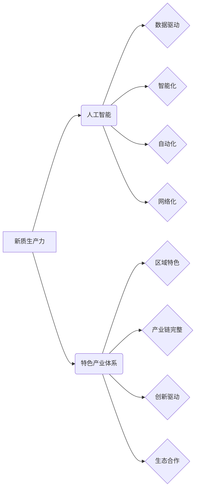

>人工智能、新质生产力、产业体系、深度学习、机器学习、数据驱动、自动化、智能制造

## 1. 背景介绍

当前，全球经济发展进入新阶段，数字化转型和智能化升级成为全球共识。人工智能（AI）作为新一代信息技术的重要组成部分，正在深刻地改变着生产方式、生活方式和社会形态。

新质生产力是基于新技术、新模式、新要素的生产力，其核心特征是智能化、自动化、数据化和网络化。人工智能技术的快速发展为新质生产力的构建提供了强大的技术支撑。

构建特色产业体系是实现高质量发展的重要途径。特色产业体系是指以区域资源禀赋、产业基础和市场需求为导向，形成具有独特优势和竞争力的产业集群。

## 2. 核心概念与联系

**2.1 新质生产力**

新质生产力是指以数据为驱动，以人工智能为核心，以智能化、自动化、网络化和数字化为特征的生产力。其核心特点包括：

* **数据驱动：** 以大数据为基础，利用人工智能算法进行数据分析和挖掘，实现生产过程的智能化控制和优化。
* **智能化：** 通过人工智能技术，实现生产过程的自动化、智能化决策和自适应控制。
* **自动化：** 利用机器人、自动化设备等技术，实现生产过程的自动化操作，提高生产效率和降低生产成本。
* **网络化：** 通过互联网、云计算等技术，实现生产过程的网络化协同，打破地域限制，实现资源共享和协同创新。

**2.2 特色产业体系**

特色产业体系是指以区域资源禀赋、产业基础和市场需求为导向，形成具有独特优势和竞争力的产业集群。其核心特点包括：

* **区域特色：** 基于区域资源禀赋、产业基础和市场需求，形成具有区域特色的产业集群。
* **产业链完整：** 从上游原材料到下游产品销售，形成完整的产业链，实现产业链协同发展。
* **创新驱动：** 以科技创新为核心，推动产业升级和转型，形成具有自主知识产权的产业体系。
* **生态合作：** 政府、企业、科研机构等多方合作，构建良好的产业生态环境，促进产业发展。

**2.3 AI 与特色产业体系的联系**

人工智能技术可以为构建特色产业体系提供强大的支撑，其主要作用包括：

* **提升生产效率：** 通过自动化、智能化等技术，提高生产效率，降低生产成本。
* **优化资源配置：** 利用数据分析和预测技术，优化资源配置，提高资源利用效率。
* **促进产业升级：** 通过人工智能技术，推动传统产业转型升级，发展新兴产业。
* **增强市场竞争力：** 通过智能化产品和服务，增强产业的市场竞争力。

**2.4  核心概念关系图**



## 3. 核心算法原理 & 具体操作步骤

**3.1 算法原理概述**

深度学习是人工智能领域的重要分支，其核心是利用多层神经网络来模拟人类大脑的学习过程。深度学习算法能够从海量数据中自动提取特征，并进行复杂的模式识别和预测。

**3.2 算法步骤详解**

深度学习算法的训练过程主要包括以下步骤：

1. **数据预处理：** 将原始数据进行清洗、转换和格式化，使其适合深度学习模型的训练。
2. **模型构建：** 根据具体任务需求，选择合适的深度学习模型架构，并设置模型参数。
3. **模型训练：** 利用训练数据，通过反向传播算法，调整模型参数，使模型的预测结果与真实值尽可能接近。
4. **模型评估：** 利用测试数据，评估模型的性能，并根据评估结果进行模型调优。
5. **模型部署：** 将训练好的模型部署到实际应用场景中，用于进行预测或决策。

**3.3 算法优缺点**

**优点：**

* **高精度：** 深度学习算法能够从海量数据中自动提取特征，并进行复杂的模式识别，从而实现高精度的预测和分类。
* **自动化学习：** 深度学习算法能够自动学习数据中的模式，无需人工特征工程。
* **泛化能力强：** 深度学习模型能够对新的数据进行泛化，并进行预测。

**缺点：**

* **数据依赖：** 深度学习算法需要大量的训练数据才能达到较高的精度。
* **计算资源消耗大：** 深度学习模型训练需要大量的计算资源。
* **可解释性差：** 深度学习模型的决策过程较为复杂，难以解释其决策依据。

**3.4 算法应用领域**

深度学习算法在各个领域都有广泛的应用，例如：

* **图像识别：** 人脸识别、物体检测、图像分类等。
* **自然语言处理：** 文本分类、机器翻译、语音识别等。
* **推荐系统：** 商品推荐、内容推荐等。
* **医疗诊断：** 疾病诊断、影像分析等。
* **金融风险控制：** 欺诈检测、信用评估等。

## 4. 数学模型和公式 & 详细讲解 & 举例说明

**4.1 数学模型构建**

深度学习模型通常采用多层神经网络结构，每个神经元接收多个输入信号，并通过激活函数进行处理，输出一个信号。神经网络的训练过程是通过调整神经元权重和偏置，使模型的输出与真实值尽可能接近。

**4.2 公式推导过程**

深度学习模型的训练过程主要基于反向传播算法。反向传播算法的核心思想是通过计算误差信号，反向传播到各层神经元，并根据误差信号调整神经元权重和偏置。

**损失函数：** 用于衡量模型预测结果与真实值的差距。常见的损失函数包括均方误差（MSE）、交叉熵损失（Cross-Entropy Loss）等。

**梯度下降：** 用于更新神经元权重和偏置的优化算法。梯度下降算法通过计算损失函数的梯度，沿着梯度方向更新权重和偏置，从而降低损失函数的值。

**4.3 案例分析与讲解**

**举例说明：**

假设我们有一个简单的深度学习模型，用于预测房价。模型输入包括房屋面积、房间数量、地理位置等特征，输出为房屋价格。

在训练过程中，我们使用房价数据集，并利用反向传播算法调整模型参数。

损失函数可以选用均方误差，梯度下降算法可以选用随机梯度下降（SGD）。

通过反复训练，模型的预测结果逐渐接近真实房价，最终达到预期的精度。

## 5. 项目实践：代码实例和详细解释说明

**5.1 开发环境搭建**

* 操作系统：Windows/macOS/Linux
* Python 版本：3.6+
* 深度学习框架：TensorFlow/PyTorch
* 其他依赖库：NumPy、Pandas、Matplotlib等

**5.2 源代码详细实现**

```python
import tensorflow as tf

# 定义模型结构
model = tf.keras.models.Sequential([
    tf.keras.layers.Dense(64, activation='relu', input_shape=(4,)),
    tf.keras.layers.Dense(32, activation='relu'),
    tf.keras.layers.Dense(1)
])

# 定义损失函数和优化器
model.compile(loss='mse', optimizer='adam')

# 训练模型
model.fit(X_train, y_train, epochs=10, batch_size=32)

# 评估模型
loss, accuracy = model.evaluate(X_test, y_test)
print('Loss:', loss)
print('Accuracy:', accuracy)
```

**5.3 代码解读与分析**

* 代码首先定义了深度学习模型的结构，包括输入层、隐藏层和输出层。
* 然后定义了损失函数和优化器，用于训练模型。
* 接着使用`model.fit()`函数训练模型，输入训练数据和超参数。
* 最后使用`model.evaluate()`函数评估模型的性能。

**5.4 运行结果展示**

训练完成后，可以查看模型的损失值和准确率，评估模型的性能。

## 6. 实际应用场景

**6.1 智能制造**

人工智能技术可以应用于智能制造领域，实现生产过程的自动化、智能化控制和优化。例如：

* **机器视觉：** 利用机器视觉技术，实现产品缺陷检测、质量控制等。
* **机器人协作：** 利用机器人技术，实现生产过程中的协作和自动化操作。
* **预测性维护：** 利用数据分析技术，预测设备故障，实现设备的预防性维护。

**6.2 智能物流**

人工智能技术可以应用于智能物流领域，提高物流效率和降低物流成本。例如：

* **自动驾驶车辆：** 利用自动驾驶技术，实现物流运输的自动化和智能化。
* **智能仓储管理：** 利用人工智能技术，实现仓储空间的优化利用和货物管理的智能化。
* **物流路线优化：** 利用数据分析技术，优化物流路线，提高物流效率。

**6.3 智能金融**

人工智能技术可以应用于智能金融领域，提高金融服务效率和降低金融风险。例如：

* **欺诈检测：** 利用机器学习技术，识别金融交易中的欺诈行为。
* **信用评估：** 利用人工智能技术，评估客户的信用风险。
* **个性化金融服务：** 利用数据分析技术，提供个性化的金融产品和服务。

**6.4 未来应用展望**

人工智能技术的应用场景还在不断扩展，未来将应用于更多领域，例如：

* **医疗保健：** 人工智能技术可以辅助医生诊断疾病、制定治疗方案、进行药物研发等。
* **教育培训：** 人工智能技术可以提供个性化的教育内容、智能化的学习辅导等。
* **城市管理：** 人工智能技术可以用于城市交通管理、环境监测、公共安全等。

## 7. 工具和资源推荐

**7.1 学习资源推荐**

* **在线课程：** Coursera、edX、Udacity等平台提供丰富的深度学习课程。
* **书籍：** 《深度学习》、《动手学深度学习》等书籍是深度学习学习的经典教材。
* **开源项目：** TensorFlow、PyTorch等开源深度学习框架提供了丰富的学习资源和示例代码。

**7.2 开发工具推荐**

* **深度学习框架：** TensorFlow、PyTorch、Keras等深度学习框架提供了丰富的功能和工具，用于开发和训练深度学习模型。
* **数据处理工具：** NumPy、Pandas等数据处理工具用于处理和分析数据。
* **可视化工具：** Matplotlib、Seaborn等可视化工具用于可视化数据和模型结果。

**7.3 相关论文推荐**

* **AlexNet：** 《ImageNet Classification with Deep Convolutional Neural Networks》
* **VGGNet：** 《Very Deep Convolutional Networks for Large-Scale Image Recognition》
* **ResNet：** 《Deep Residual Learning for Image Recognition》
* **BERT：** 《BERT: Pre-training of Deep Bidirectional Transformers for Language Understanding》

## 8. 总结：未来发展趋势与挑战

**8.1 研究成果总结**

近年来，人工智能技术取得了长足的进步，深度学习算法在图像识别、自然语言处理、语音识别等领域取得了突破性进展。

**8.2 未来发展趋势**

* **模型规模和复杂度提升：** 未来深度学习模型将更加庞大，更加复杂，能够处理更加复杂的任务。
* **跨模态学习：** 未来深度学习模型将能够处理多种模态数据，例如文本、图像、音频等，实现跨模态的理解和交互。
* **边缘计算：** 未来深度学习模型