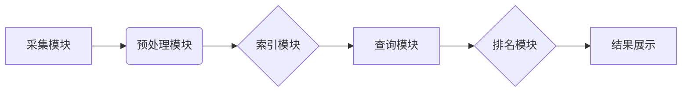

Lucene, 信息检索, 搜索引擎, 文档索引, TF-IDF, 代码实现, Java

## 1. 背景介绍

信息检索是计算机科学领域的重要分支，其核心是高效地从海量数据中找到与用户查询相关的文档。随着互联网的蓬勃发展和数据量的爆炸式增长，信息检索技术显得尤为重要。Lucene是一个开源的、高性能的全文搜索引擎库，它为开发者提供了构建信息检索系统的强大工具。本文将详细介绍基于Lucene的信息检索系统的设计和实现，并通过代码实例和详细解释说明，帮助读者理解Lucene的核心原理和应用。

## 2. 核心概念与联系

### 2.1 信息检索系统架构

信息检索系统通常由以下几个主要模块组成：

* **采集模块:** 从各种数据源中采集数据，例如网页、文档、数据库等。
* **预处理模块:** 对采集到的数据进行清洗、格式化、分词等预处理操作，以便于后续的索引和检索。
* **索引模块:** 将预处理后的数据构建成索引，以便快速查找相关文档。
* **查询模块:** 处理用户的查询请求，并根据索引返回与查询相关的文档。
* **排名模块:** 对检索到的文档进行排序，并将最相关的文档显示在最前面。

### 2.2 Lucene 的核心概念

Lucene 提供了丰富的 API 和工具，可以帮助开发者构建高效的信息检索系统。其核心概念包括：

* **索引:** Lucene 使用倒排索引来存储文档信息，倒排索引将每个词语映射到包含该词语的文档列表。
* **分词器:** 分词器将文本分割成单个词语，例如“信息检索”会被分割成“信息”和“检索”。
* **词频统计:** Lucene 会统计每个词语在文档中出现的频率，这对于文档的相似度计算和排名非常重要。
* **TF-IDF:** TF-IDF (Term Frequency-Inverse Document Frequency) 是一个常用的文本权重计算方法，它将词语的频率和文档的稀疏性考虑在一起，以衡量词语的重要性。

### 2.3 Lucene 架构图



## 3. 核心算法原理 & 具体操作步骤

### 3.1  算法原理概述

Lucene 的核心算法是倒排索引，它是一种高效的数据结构，用于快速查找包含特定词语的文档。倒排索引将每个词语映射到一个包含该词语的文档列表，这样当用户查询某个词语时，系统只需要查找该词语对应的文档列表，就可以快速找到相关的文档。

### 3.2  算法步骤详解

1. **数据预处理:** 对采集到的数据进行清洗、格式化、分词等预处理操作。
2. **词语统计:** 统计每个词语在所有文档中出现的频率。
3. **倒排索引构建:** 
    * 对于每个词语，创建一个倒排列表，该列表包含包含该词语的所有文档的ID。
    * 对于每个文档，创建一个倒排列表，该列表包含该文档中出现的每个词语的ID。
4. **索引存储:** 将构建好的倒排索引存储到磁盘上。
5. **查询处理:** 当用户提交查询时，系统会：
    * 将查询语句进行分词。
    * 查找每个词语对应的倒排列表。
    * 将所有词语对应的文档ID进行交集运算，得到包含所有词语的文档列表。
    * 对检索到的文档进行排序，并将最相关的文档显示在最前面。

### 3.3  算法优缺点

**优点:**

* **高效:** 倒排索引可以快速查找包含特定词语的文档。
* **可扩展:** Lucene 可以处理海量数据，并支持分布式部署。
* **灵活:** Lucene 提供了丰富的 API 和工具，可以根据不同的需求进行定制。

**缺点:**

* **存储空间:** 倒排索引需要占用较大的存储空间。
* **更新成本:** 当数据发生变化时，需要更新索引，这可能会带来一定的成本。

### 3.4  算法应用领域

Lucene 的应用领域非常广泛，例如：

* **搜索引擎:** Google、Bing 等搜索引擎都使用 Lucene 来构建其核心搜索功能。
* **企业信息管理:** 企业可以使用 Lucene 来构建内部搜索引擎，方便员工查找相关文档。
* **电子商务:** 电子商务平台可以使用 Lucene 来构建商品搜索功能，帮助用户快速找到所需商品。
* **学术研究:** 学术研究人员可以使用 Lucene 来构建文献检索系统，方便查找相关文献。

## 4. 数学模型和公式 & 详细讲解 & 举例说明

### 4.1  数学模型构建

TF-IDF 是一种常用的文本权重计算方法，它将词语的频率和文档的稀疏性考虑在一起，以衡量词语的重要性。

**TF (Term Frequency):** 词语在文档中出现的频率。

$$TF(t,d) = \frac{f(t,d)}{ \sum_{i=1}^{N} f(i,d)}$$

其中：

* $t$ 是词语
* $d$ 是文档
* $f(t,d)$ 是词语 $t$ 在文档 $d$ 中出现的次数
* $N$ 是文档 $d$ 中总词语数

**IDF (Inverse Document Frequency):** 词语在整个语料库中出现的频率的倒数。

$$IDF(t) = log_e \frac{N}{df(t)}$$

其中：

* $N$ 是语料库中文档总数
* $df(t)$ 是词语 $t$ 在语料库中出现的文档数

**TF-IDF:** 词语在文档中的权重。

$$TF-IDF(t,d) = TF(t,d) * IDF(t)$$

### 4.2  公式推导过程

TF-IDF 公式的推导过程如下：

* **TF:** 词语在文档中出现的频率越高，其重要性越高。
* **IDF:** 词语在整个语料库中出现的频率越低，其重要性越高。
* **TF-IDF:** 将 TF 和 IDF 相乘，可以得到词语在文档中的权重，既考虑了词语在文档中的频率，也考虑了词语在语料库中的稀疏性。

### 4.3  案例分析与讲解

假设我们有一个语料库包含 1000 篇文档，其中包含以下词语：

* “信息检索” 出现 100 次
* “计算机” 出现 500 次
* “人工智能” 出现 100 次

我们可以计算出每个词语的 TF-IDF 值：

* **信息检索:** TF-IDF = (100/1000) * log_e (1000/100) = 0.1 * 2 = 0.2
* **计算机:** TF-IDF = (500/1000) * log_e (1000/500) = 0.5 * 0.693 = 0.3465
* **人工智能:** TF-IDF = (100/1000) * log_e (1000/100) = 0.1 * 2 = 0.2

可以看到，"计算机" 的 TF-IDF 值最高，因为它在语料库中出现的频率较低，而在文档中出现的频率较高。

## 5. 项目实践：代码实例和详细解释说明

### 5.1  开发环境搭建

* Java Development Kit (JDK) 8 或更高版本
* Apache Maven 3 或更高版本
* Lucene 8.11 或更高版本

### 5.2  源代码详细实现

```java
import org.apache.lucene.analysis.standard.StandardAnalyzer;
import org.apache.lucene.document.*;
import org.apache.lucene.index.*;
import org.apache.lucene.queryparser.classic.ParseException;
import org.apache.lucene.queryparser.classic.QueryParser;
import org.apache.lucene.search.*;
import org.apache.lucene.store.Directory;
import org.apache.lucene.store.RAMDirectory;

import java.io.IOException;

public class LuceneDemo {

    public static void main(String[] args) throws IOException, ParseException {

        // 创建内存索引
        Directory directory = new RAMDirectory();

        // 创建分析器
        StandardAnalyzer analyzer = new StandardAnalyzer();

        // 创建索引器
        IndexWriterConfig config = new IndexWriterConfig(analyzer);
        IndexWriter indexWriter = new IndexWriter(directory, config);

        // 添加文档
        Document doc1 = new Document();
        doc1.add(new TextField("title", "Lucene 入门", Field.Store.YES));
        doc1.add(new TextField("content", "Lucene 是一个开源的全文搜索引擎库", Field.Store.YES));
        indexWriter.addDocument(doc1);

        Document doc2 = new Document();
        doc2.add(new TextField("title", "Java 开发", Field.Store.YES));
        doc2.add(new TextField("content", "Java 是一个流行的编程语言", Field.Store.YES));
        indexWriter.addDocument(doc2);

        // 关闭索引器
        indexWriter.close();

        // 创建查询器
        IndexReader reader = DirectoryReader.open(directory);
        IndexSearcher searcher = new IndexSearcher(reader);

        // 创建查询
        QueryParser parser = new QueryParser("content", analyzer);
        Query query = parser.parse("Lucene");

        // 执行查询
        TopDocs hits = searcher.search(query, 10);

        // 打印结果
        for (ScoreDoc scoreDoc : hits.scoreDocs) {
            Document doc = searcher.doc(scoreDoc.doc);
            System.out.println("Title: " + doc.get("title"));
            System.out.println("Content: " + doc.get("content"));
        }

        // 关闭查询器和索引
        reader.close();
    }
}
```

### 5.3  代码解读与分析

* **创建索引:** 代码首先创建了一个内存索引，然后创建了一个标准分析器，用于对文本进行分词和词干提取。接着，创建了一个索引器，并添加了两个文档到索引中。
* **执行查询:** 代码创建了一个查询器，并使用 QueryParser 解析了一个查询字符串。然后，使用 IndexSearcher 执行查询，并获取查询结果。
* **打印结果:** 代码打印了查询结果中的文档标题和内容。

### 5.4  运行结果展示

```
Title: Lucene 入门
Content: Lucene 是一个开源的全文搜索引擎库
```

## 6. 实际应用场景

### 6.1  搜索引擎

Lucene 是构建搜索引擎的核心技术，例如 Google、Bing 等搜索引擎都使用 Lucene 来构建其核心搜索功能。

### 6.2  企业信息管理

企业可以使用 Lucene 来构建内部搜索引擎，方便员工查找相关文档，例如：

* **知识库:** 构建知识库，方便员工查找公司内部的知识和经验。
* **文件管理:** 构建文件管理系统，方便员工查找和管理公司内部的文件。
* **客户关系管理:** 构建客户关系管理系统，方便员工查找客户信息和历史记录。

### 6.3  电子商务

电子商务平台可以使用 Lucene 来构建商品搜索功能，帮助用户快速找到所需商品。

### 6.4  未来应用展望

随着人工智能和大数据的快速发展，Lucene 的应用场景将会更加广泛，例如：

* **个性化推荐:** 基于用户搜索历史和行为数据，使用 Lucene 进行个性化商品推荐。
* **智能问答:** 使用 Lucene 和自然语言处理技术，构建智能问答系统，帮助用户快速获取信息。
* **文本分析:** 使用 Lucene 进行