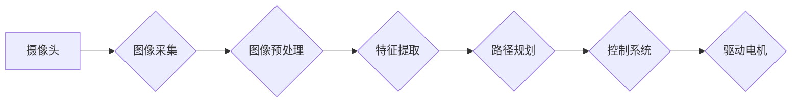

> OpenCV,图像处理,智能小车,寻迹算法,路径规划,机器人

## 1. 背景介绍

随着人工智能和机器学习技术的快速发展，智能小车在各个领域得到了广泛的应用，例如物流配送、环境监测、农业作业等。然而，智能小车在复杂户外环境中的自主导航仍然是一个具有挑战性的问题。传统的导航方式，例如GPS定位，在遮挡物或信号弱的情况下精度较低，难以满足智能小车在复杂环境下的自主导航需求。

基于图像处理的智能小车寻迹算法能够利用摄像头获取环境信息，并通过图像分析和处理技术，实现自主导航。该算法能够克服GPS定位的局限性，在复杂户外环境中提供更精准的导航服务。

## 2. 核心概念与联系

**2.1 核心概念**

* **OpenCV:**  Open Source Computer Vision Library，是一个开源的计算机视觉库，提供丰富的图像处理和计算机视觉算法，例如图像识别、特征提取、目标跟踪等。
* **图像处理:**  对图像进行数字化处理，以提取图像中的有用信息，例如边缘、纹理、颜色等。
* **寻迹算法:**  指智能小车根据环境信息，规划并执行导航路径的算法。

**2.2 架构图**



**2.3 核心概念联系**

智能小车户外寻迹算法的核心是利用OpenCV库进行图像处理，提取环境信息，并根据提取的信息规划导航路径。

* 摄像头采集图像，OpenCV库进行图像预处理，去除噪声、调整亮度等，提高图像质量。
* 通过OpenCV库提供的算法，提取图像中的特征信息，例如边缘、纹理、颜色等。
* 根据提取的特征信息，规划导航路径，例如寻找目标、避开障碍物等。
* 控制系统根据规划的路径，控制驱动电机，使智能小车沿着规划的路径行驶。

## 3. 核心算法原理 & 具体操作步骤

**3.1 算法原理概述**

本算法基于OpenCV库的图像处理功能，结合路径规划算法，实现智能小车户外寻迹。

* **图像处理:** 利用OpenCV库对采集到的图像进行预处理，例如灰度化、二值化、形态学操作等，提取图像中的边缘、轮廓等特征信息。
* **特征提取:**  利用OpenCV库提供的特征提取算法，例如SIFT、SURF等，提取图像中的关键点和描述子，用于识别和匹配环境特征。
* **路径规划:**  根据提取的特征信息，利用路径规划算法，例如A*算法、Dijkstra算法等，规划智能小车行驶的路径。
* **控制系统:**  根据规划的路径，控制智能小车的驱动电机，使智能小车沿着规划的路径行驶。

**3.2 算法步骤详解**

1. **图像采集:**  智能小车摄像头采集图像。
2. **图像预处理:**  对采集到的图像进行预处理，例如灰度化、二值化、形态学操作等，去除噪声、增强边缘等。
3. **特征提取:**  利用OpenCV库提供的特征提取算法，提取图像中的关键点和描述子。
4. **特征匹配:**  根据提取的特征信息，匹配环境中的特征点，构建环境地图。
5. **路径规划:**  利用路径规划算法，规划智能小车行驶的路径，例如寻找目标、避开障碍物等。
6. **控制系统:**  根据规划的路径，控制智能小车的驱动电机，使智能小车沿着规划的路径行驶。

**3.3 算法优缺点**

* **优点:**
    * 能够克服GPS定位的局限性，在复杂户外环境中提供更精准的导航服务。
    * 能够适应动态环境变化，例如障碍物移动等。
* **缺点:**
    * 算法复杂度较高，计算量较大。
    * 对环境光照条件敏感，在光照变化较大的情况下，算法性能可能会下降。

**3.4 算法应用领域**

* **无人驾驶汽车:**  用于环境感知、路径规划和避障。
* **机器人:**  用于自主导航、环境探索和任务执行。
* **无人机:**  用于自主飞行、目标跟踪和环境监测。
* **智能家居:**  用于机器人导航、物体识别和场景理解。

## 4. 数学模型和公式 & 详细讲解 & 举例说明

**4.1 数学模型构建**

本算法的核心是利用图像处理技术提取环境特征，并根据提取的特征信息规划导航路径。

* **特征点检测:**  利用OpenCV库提供的特征点检测算法，例如SIFT、SURF等，检测图像中的关键点。
* **特征描述:**  利用OpenCV库提供的特征描述算法，例如SIFT、SURF等，描述图像中的关键点。
* **特征匹配:**  利用特征描述信息，匹配图像中的特征点，构建环境地图。
* **路径规划:**  利用路径规划算法，例如A*算法、Dijkstra算法等，规划智能小车行驶的路径。

**4.2 公式推导过程**

* **SIFT特征点检测:**  SIFT算法利用图像梯度方向和尺度空间特征，检测图像中的关键点。其核心公式包括：
    * **差分金字塔:**  将图像进行多尺度分解，构建差分金字塔。
    * **关键点检测:**  在差分金字塔中检测图像的极值点，作为关键点候选。
    * **关键点定位:**  利用泰勒级数近似，精确定位关键点。
    * **关键点描述:**  利用关键点周围的图像梯度方向和尺度信息，构建关键点描述子。

* **A*算法路径规划:**  A*算法是一种启发式路径规划算法，其核心公式包括：
    * **评估函数:**  评估节点到目标节点的总代价，包括已走过的代价和估计的剩余代价。
    * **开放列表:**  存储待探索的节点，按照评估函数值排序。
    * **关闭列表:**  存储已探索的节点。
    * **算法步骤:**  从起点节点开始，不断选择评估函数值最小的节点，将其添加到关闭列表中，并更新其邻居节点的评估函数值。

**4.3 案例分析与讲解**

假设智能小车需要在室内环境中寻找一个红色的物体。

* **图像处理:**  摄像头采集图像，OpenCV库进行灰度化和二值化处理，提取图像中的红色区域。
* **特征提取:**  利用OpenCV库的SIFT算法，提取红色区域的关键点和描述子。
* **特征匹配:**  根据提取的特征信息，匹配环境中的红色物体特征，定位目标物体的位置。
* **路径规划:**  利用A*算法，规划智能小车行驶的路径，使智能小车能够到达目标物体的位置。
* **控制系统:**  根据规划的路径，控制智能小车的驱动电机，使智能小车沿着规划的路径行驶，最终到达目标物体的位置。

## 5. 项目实践：代码实例和详细解释说明

**5.1 开发环境搭建**

* 操作系统: Ubuntu 18.04
* 编程语言: Python 3.6
* OpenCV 库: 4.5.5

**5.2 源代码详细实现**

```python
import cv2
import numpy as np

# 初始化摄像头
cap = cv2.VideoCapture(0)

# 设置图像预处理参数
kernel = np.ones((5,5),np.uint8)

while True:
    # 读取摄像头图像
    ret, frame = cap.read()

    # 图像灰度化
    gray = cv2.cvtColor(frame, cv2.COLOR_BGR2GRAY)

    # 图像二值化
    _, thresh = cv2.threshold(gray, 127, 255, cv2.THRESH_BINARY)

    # 形态学操作，去除噪声
    opening = cv2.morphologyEx(thresh, cv2.MORPH_OPEN, kernel, iterations = 2)

    # 查找轮廓
    contours, hierarchy = cv2.findContours(opening, cv2.RETR_EXTERNAL, cv2.CHAIN_APPROX_SIMPLE)

    # 绘制轮廓
    cv2.drawContours(frame, contours, -1, (0,255,0), 2)

    # 显示图像
    cv2.imshow('frame', frame)

    # 按键退出
    if cv2.waitKey(1) & 0xFF == ord('q'):
        break

# 释放资源
cap.release()
cv2.destroyAllWindows()
```

**5.3 代码解读与分析**

* 代码首先初始化摄像头，并设置图像预处理参数。
* 然后，代码读取摄像头图像，并进行灰度化、二值化和形态学操作，去除噪声。
* 接着，代码使用OpenCV库的`cv2.findContours()`函数查找图像中的轮廓，并使用`cv2.drawContours()`函数绘制轮廓。
* 最后，代码显示图像，并使用按键退出循环。

**5.4 运行结果展示**

运行代码后，将显示摄像头采集到的图像，并绘制图像中的轮廓。

## 6. 实际应用场景

**6.1 智能小车寻迹应用**

* **环境监测:**  智能小车可以利用图像处理技术，识别环境中的目标，例如污染物、危险物品等，并进行监测和报警。
* **农业作业:**  智能小车可以利用图像处理技术，识别农作物，并进行精准施肥、喷洒农药等作业。
* **物流配送:**  智能小车可以利用图像处理技术，识别道路和障碍物，并进行自主导航，实现高效的物流配送。

**6.2 其他应用场景**

* **无人驾驶汽车:**  图像处理技术是无人驾驶汽车的核心技术之一，用于环境感知、目标识别和路径规划。
* **机器人:**  图像处理技术可以帮助机器人进行环境感知、目标跟踪和任务执行。
* **医疗诊断:**  图像处理技术可以帮助医生进行病灶识别、肿瘤分割等诊断工作。

**6.4 未来应用展望**

随着人工智能和机器学习技术的不断发展，基于图像处理的智能小车寻迹算法将有更广泛的应用场景。例如，

* **更智能的路径规划:**  利用深度学习技术，实现更智能的路径规划，例如避开人群、识别交通信号灯等。
* **更精准的定位:**  结合GPS定位和图像处理技术，实现更精准的定位，例如在室内环境中进行导航。
* **更强大的环境感知:**  利用深度学习技术，实现更强大的环境感知，例如识别不同类型的物体、理解场景语义等。

## 7. 工具和资源推荐

**7.1 学习资源推荐**

* **OpenCV官方文档:** https://docs.opencv.org/
* **Python编程教程:** https://www.python.org/
* **机器学习教程:** https://www.coursera.org/learn/machine-learning

**7.2 开发工具推荐**

* **Visual Studio Code:** https://code.visualstudio.com/
* **PyCharm:** https://www.jetbrains.com/pycharm/

**7.3 相关论文推荐**

* **Real-Time Monocular Visual Odometry for Autonomous Navigation:** https://arxiv.org/abs/1604.01883
* **Deep Learning for Autonomous Driving:** https://arxiv.org/abs/1604.07316

## 8. 总结：未来发展趋势与挑战

**8.1 研究成果总结**

本文章介绍了基于OpenCV图像处理的智能小车户外寻迹算法的设计，并详细阐述了算法原理、步骤、数学模型、代码实现以及实际应用场景。该算法能够有效地