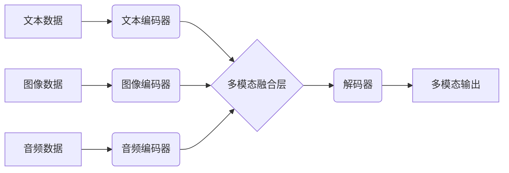

> 多模态大模型、LLM、自然语言处理、计算机视觉、音频处理、软件开发、人工智能

## 1. 背景介绍

近年来，人工智能（AI）技术取得了飞速发展，特别是深度学习的兴起，为多模态大模型的构建提供了强大的技术支撑。多模态大模型（Multimodal Large Language Models，MLLMs）是指能够处理多种模态数据（如文本、图像、音频、视频等）的大型语言模型。与传统的单模态大模型相比，MLLMs具有更强的语义理解能力和泛化能力，能够更好地理解和生成人类语言和多模态信息。

LLM（Large Language Models）作为多模态大模型的重要组成部分，在自然语言处理（NLP）领域取得了显著成就。例如，GPT-3、LaMDA等模型能够进行流畅的对话、生成高质量的文本、翻译语言等。然而，LLMs仍然局限于文本模态，无法处理其他模态数据。

多模态大模型的出现，弥补了LLMs的不足，为人工智能的更广泛应用提供了新的可能性。例如，在软件开发领域，MLLMs可以帮助开发者更好地理解用户需求、生成代码、测试软件、进行代码修复等。

## 2. 核心概念与联系

多模态大模型的核心概念包括：

* **模态数据:** 指不同形式的信息表示，例如文本、图像、音频、视频等。
* **多模态融合:** 指将不同模态数据进行融合，以获得更丰富的语义信息。
* **跨模态理解:** 指模型能够理解不同模态数据之间的关系，并进行跨模态推理。
* **多模态生成:** 指模型能够根据输入的多模态数据，生成新的多模态内容。

**多模态大模型架构**



## 3. 核心算法原理 & 具体操作步骤

### 3.1  算法原理概述

多模态大模型的训练主要基于深度学习算法，常用的算法包括：

* **Transformer:** Transformer是一种基于注意力机制的深度学习模型，能够有效地处理序列数据，在自然语言处理领域取得了显著成就。
* **CNN:** 卷积神经网络（CNN）是一种专门用于处理图像数据的深度学习模型，能够提取图像特征。
* **RNN:**循环神经网络（RNN）是一种能够处理序列数据的深度学习模型，能够捕捉序列中的时间依赖关系。

多模态大模型通常将不同的模态数据分别编码为特征向量，然后将这些特征向量进行融合，最终生成多模态输出。

### 3.2  算法步骤详解

1. **数据预处理:** 将多模态数据进行预处理，例如文本数据进行分词、图像数据进行裁剪和增强、音频数据进行降噪等。
2. **模态编码:** 使用不同的深度学习模型对不同模态数据进行编码，例如使用Transformer对文本数据进行编码，使用CNN对图像数据进行编码，使用RNN对音频数据进行编码。
3. **多模态融合:** 将不同模态的特征向量进行融合，可以使用多种融合方法，例如加法融合、乘法融合、注意力融合等。
4. **解码:** 使用解码器将融合后的特征向量解码为多模态输出，例如生成文本、图像、音频等。
5. **模型训练:** 使用交叉熵损失函数对模型进行训练，优化模型参数。

### 3.3  算法优缺点

**优点:**

* 能够处理多种模态数据，理解和生成更丰富的语义信息。
* 具有更强的泛化能力，能够应用于更广泛的场景。

**缺点:**

* 训练成本高，需要大量的计算资源和数据。
* 模型复杂度高，难以理解和调试。

### 3.4  算法应用领域

多模态大模型在多个领域都有广泛的应用，例如：

* **自然语言处理:** 文本摘要、机器翻译、对话系统等。
* **计算机视觉:** 图像识别、目标检测、图像生成等。
* **语音识别:** 语音转文本、语音合成等。
* **软件开发:** 代码生成、代码修复、软件测试等。

## 4. 数学模型和公式 & 详细讲解 & 举例说明

### 4.1  数学模型构建

多模态大模型的数学模型通常基于深度学习框架，例如TensorFlow、PyTorch等。模型的结构通常由多个层组成，例如编码器、融合层、解码器等。

### 4.2  公式推导过程

多模态大模型的训练过程涉及到许多数学公式，例如交叉熵损失函数、梯度下降算法等。这些公式的推导过程比较复杂，需要一定的数学基础。

### 4.3  案例分析与讲解

我们可以通过一个具体的案例来分析多模态大模型的数学模型和公式。例如，我们可以使用一个图像 captioning 的任务来举例说明。

**图像 captioning** 是一种多模态任务，目标是根据给定的图像生成相应的文本描述。

在图像 captioning 任务中，我们可以使用一个多模态大模型来处理图像和文本数据。模型的结构通常包括以下几个部分：

* **图像编码器:** 使用 CNN 对图像进行编码，提取图像特征。
* **文本编码器:** 使用 Transformer 对文本进行编码，提取文本特征。
* **融合层:** 将图像特征和文本特征进行融合，生成多模态特征。
* **解码器:** 使用 Transformer 对多模态特征进行解码，生成文本描述。

在训练过程中，我们使用交叉熵损失函数来衡量模型的性能。交叉熵损失函数计算模型预测的文本描述与真实文本描述之间的差异。

## 5. 项目实践：代码实例和详细解释说明

### 5.1  开发环境搭建

为了实现多模态大模型的开发，我们需要搭建一个合适的开发环境。

* **操作系统:** Linux 或 macOS
* **编程语言:** Python
* **深度学习框架:** TensorFlow 或 PyTorch
* **硬件:** GPU

### 5.2  源代码详细实现

以下是一个使用 TensorFlow 实现多模态大模型的简单代码示例：

```python
import tensorflow as tf

# 定义图像编码器
image_encoder = tf.keras.Sequential([
    tf.keras.layers.Conv2D(32, (3, 3), activation='relu'),
    tf.keras.layers.MaxPooling2D((2, 2)),
    tf.keras.layers.Conv2D(64, (3, 3), activation='relu'),
    tf.keras.layers.MaxPooling2D((2, 2)),
    tf.keras.layers.Flatten(),
    tf.keras.layers.Dense(128, activation='relu')
])

# 定义文本编码器
text_encoder = tf.keras.Sequential([
    tf.keras.layers.Embedding(vocab_size, embedding_dim),
    tf.keras.layers.LSTM(128)
])

# 定义融合层
fusion_layer = tf.keras.layers.Concatenate()

# 定义解码器
decoder = tf.keras.Sequential([
    tf.keras.layers.Dense(vocab_size, activation='softmax')
])

# 定义多模态大模型
model = tf.keras.Model(inputs=[image_input, text_input], outputs=decoder(fusion_layer([image_encoder(image_input), text_encoder(text_input)])))

# 编译模型
model.compile(optimizer='adam', loss='sparse_categorical_crossentropy', metrics=['accuracy'])

# 训练模型
model.fit(train_data, epochs=10)
```

### 5.3  代码解读与分析

这段代码展示了如何使用 TensorFlow 实现一个简单的多模态大模型。

* 首先，我们定义了图像编码器和文本编码器，分别对图像和文本数据进行编码。
* 然后，我们定义了一个融合层，将图像特征和文本特征进行融合。
* 最后，我们定义了一个解码器，将融合后的特征向量解码为文本描述。

### 5.4  运行结果展示

训练完成后，我们可以使用模型对新的图像和文本数据进行预测，生成相应的文本描述。

## 6. 实际应用场景

### 6.1  软件开发领域

多模态大模型在软件开发领域具有广泛的应用场景，例如：

* **代码生成:** 根据用户需求，自动生成代码。
* **代码修复:** 自动修复代码中的错误。
* **软件测试:** 自动生成测试用例，提高软件测试效率。
* **代码文档生成:** 自动生成代码文档，提高代码可读性。

### 6.2  其他领域

除了软件开发领域，多模态大模型还可以在其他领域得到应用，例如：

* **医疗保健:** 辅助医生诊断疾病、分析医学图像。
* **教育:** 个性化学习、自动批改作业。
* **娱乐:** 生成游戏场景、制作视频剪辑。

### 6.4  未来应用展望

随着多模态大模型技术的不断发展，其应用场景将会更加广泛，例如：

* **虚拟助手:** 更智能、更人性化的虚拟助手。
* **增强现实:** 更沉浸式的增强现实体验。
* **自动驾驶:** 更安全的自动驾驶系统。

## 7. 工具和资源推荐

### 7.1  学习资源推荐

* **书籍:**
    * 《深度学习》
    * 《自然语言处理》
* **在线课程:**
    * Coursera: 深度学习
    * Udacity: 自然语言处理
* **博客:**
    * TensorFlow Blog
    * PyTorch Blog

### 7.2  开发工具推荐

* **深度学习框架:** TensorFlow, PyTorch
* **数据处理工具:** Pandas, NumPy
* **可视化工具:** Matplotlib, Seaborn

### 7.3  相关论文推荐

* 《BERT: Pre-training of Deep Bidirectional Transformers for Language Understanding》
* 《GPT-3: Language Models are Few-Shot Learners》
* 《DALL-E: Creating Images from Text》

## 8. 总结：未来发展趋势与挑战

### 8.1  研究成果总结

近年来，多模态大模型取得了显著的进展，在多个领域取得了突破性的应用。

### 8.2  未来发展趋势

未来，多模态大模型的发展趋势包括：

* **模型规模的进一步扩大:** 更大的模型规模能够带来更好的性能。
* **多模态融合方法的改进:** 探索更有效的多模态融合方法。
* **跨模态推理能力的增强:** 提升模型的跨模态推理能力。
* **可解释性与安全性:** 提高模型的可解释性和安全性。

### 8.3  面临的挑战

多模态大模型的发展也面临着一些挑战，例如：

* **数据获取和标注:** 多模态数据的获取和标注成本高。
* **模型训练和推理效率:** 多模态大模型的训练和推理效率较低。
* **模型可解释性和安全性:** 多模态大模型的决策过程难以解释，存在安全风险。

### 8.4  研究展望

未来，我们需要继续探索多模态大模型的理论基础、算法方法和应用场景，以推动人工智能技术的进步。

## 9. 附录：常见问题与解答

### 9.1  常见问题

* **什么是多模态大模型？**

多模态大模型是指能够处理多种模态数据（如文本、图像、音频等）的大型语言模型。

* **多模态大模型有哪些应用场景？**

多模态大模型在软件开发、医疗保健、教育、娱乐等多个领域都有广泛的应用场景。

* **如何训练多模态大模型？**

训练多模态大模型需要使用大量的多模态数据，并采用合适的深度学习算法