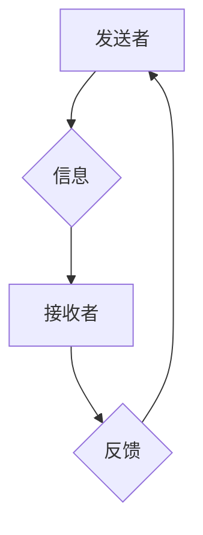

> 沟通技巧，有效沟通，交流技巧，非语言沟通，积极倾听，反馈机制，跨文化沟通，团队合作，冲突管理

## 1. 背景介绍

在当今快速发展的科技时代，沟通已成为至关重要的技能。无论是个人发展还是团队合作，有效的沟通都是取得成功和实现目标的关键。然而，沟通并非易事，它涉及到语言、非语言、文化等多方面因素，需要我们不断学习和提升。

随着人工智能技术的快速发展，沟通方式也在发生着深刻的变化。虚拟助手、聊天机器人等智能化工具正在改变我们与人、与机器的交互方式。这些新兴技术也为我们提供了新的思考和探索空间，让我们能够更深入地理解沟通的本质，并探索更有效、更便捷的沟通方式。

## 2. 核心概念与联系

**2.1 沟通的本质**

沟通是指通过语言、非语言、符号等方式传递信息，以达到相互理解和共同目标的目的。它是一个双向的过程，需要发送者清晰地表达信息，接收者积极地理解和反馈。

**2.2 沟通的要素**

* **发送者:** 沟通信息的来源，需要清晰地表达自己的想法和意图。
* **接收者:** 接收和理解信息的對象，需要积极倾听和反馈。
* **信息:** 沟通的内容，需要准确、完整、清晰地传递。
* **渠道:** 沟通信息的传递方式，例如口头、书面、网络等。
* **反馈:** 接收者对信息的理解和回应，帮助发送者确认信息是否被正确理解。

**2.3 沟通的类型**

* **垂直沟通:** 上下级之间的沟通，例如领导下达指令、员工汇报工作。
* **水平沟通:** 同级之间的沟通，例如同事之间协作、部门之间交流。
* **跨部门沟通:** 不同部门之间沟通，例如销售部门与研发部门沟通产品需求。
* **跨文化沟通:** 不同文化背景的人之间沟通，需要考虑文化差异和语言障碍。

**2.4 沟通的障碍**

* **语言障碍:** 语言不通、表达不清、理解偏差。
* **文化差异:** 不同文化背景的人对沟通方式、表达习惯、价值观等存在差异。
* **心理障碍:** 紧张、焦虑、情绪波动等都会影响沟通效果。
* **环境因素:** 噪音、干扰、时间限制等都会影响沟通质量。

**2.5 沟通的技巧**

* **积极倾听:** 专注于对方所说的话，理解对方的意图和感受。
* **清晰表达:** 使用简洁明了的语言，避免使用专业术语或模糊的表达。
* **非语言沟通:** 注意肢体语言、眼神交流、语气等非语言信号，以增强沟通效果。
* **反馈机制:** 及时反馈信息，确认对方是否理解，并提出自己的观点和建议。
* **换位思考:** 站在对方的角度思考问题，理解对方的立场和需求。

**Mermaid 流程图**



## 3. 核心算法原理 & 具体操作步骤

**3.1 算法原理概述**

有效的沟通是一个复杂的系统，涉及到多个因素的相互作用。我们可以将它抽象成一个算法，并通过分析算法原理来理解沟通的本质和提高沟通效率。

**3.2 算法步骤详解**

1. **信息编码:** 发送者将自己的想法和意图转化为信息，并选择合适的编码方式进行表达。
2. **信息传递:** 发送者通过选择的渠道将信息传递给接收者。
3. **信息解码:** 接收者接收信息后，将其解码成理解的意义。
4. **信息反馈:** 接收者对信息进行理解和回应，并反馈给发送者。
5. **信息确认:** 发送者根据接收者的反馈确认信息是否被正确理解。

**3.3 算法优缺点**

* **优点:** 
    * 提供了沟通过程的清晰框架，有助于理解沟通的各个环节。
    * 可以帮助我们识别沟通中的潜在问题，并采取措施进行改进。
* **缺点:** 
    * 沟通是一个复杂的过程，算法无法完全概括所有情况。
    * 算法的应用需要结合具体的语境和文化背景。

**3.4 算法应用领域**

* **人机交互:** 人工智能系统需要能够理解和响应用户的指令，这需要基于沟通算法的设计。
* **团队协作:** 团队成员之间需要有效地沟通和协作，算法可以帮助提高团队沟通效率。
* **跨文化交流:** 跨文化沟通存在着语言和文化差异，算法可以帮助我们更好地理解和应对这些差异。

## 4. 数学模型和公式 & 详细讲解 & 举例说明

**4.1 数学模型构建**

我们可以使用数学模型来量化沟通的效率和效果。例如，我们可以定义一个沟通效率指标，它可以根据信息传递的准确性、速度和成本进行计算。

**4.2 公式推导过程**

假设我们有一个简单的沟通模型，其中发送者发送信息到接收者，接收者对信息进行理解和反馈。我们可以用以下公式来计算沟通效率：

```
沟通效率 = 信息准确率 * 信息传递速度 / 信息传递成本
```

其中：

* 信息准确率：信息被正确理解的概率。
* 信息传递速度：信息从发送者到接收者传递的时间。
* 信息传递成本：发送信息所需要花费的资源，例如时间、金钱、精力等。

**4.3 案例分析与讲解**

例如，如果发送者发送了一条信息，接收者正确理解了信息，并且信息传递时间很短，那么沟通效率就会很高。反之，如果信息被误解了，或者传递时间很长，那么沟通效率就会很低。

## 5. 项目实践：代码实例和详细解释说明

**5.1 开发环境搭建**

为了演示如何使用代码实现沟通算法，我们可以使用 Python 语言和一些常用的库，例如 `socket` 和 `json`。

**5.2 源代码详细实现**

```python
import socket
import json

# 发送端
def send_message(message, ip, port):
    with socket.socket(socket.AF_INET, socket.SOCK_STREAM) as s:
        s.connect((ip, port))
        s.sendall(json.dumps(message).encode())

# 接收端
def receive_message(ip, port):
    with socket.socket(socket.AF_INET, socket.SOCK_STREAM) as s:
        s.bind((ip, port))
        s.listen()
        conn, addr = s.accept()
        with conn:
            print('Connected by', addr)
            while True:
                data = conn.recv(1024)
                if not data:
                    break
                message = json.loads(data.decode())
                print('Received:', message)

# 示例用法
if __name__ == '__main__':
    send_message({'message': 'Hello, world!'}, '127.0.0.1', 8080)
    receive_message('127.0.0.1', 8080)
```

**5.3 代码解读与分析**

这段代码实现了简单的网络通信，发送端发送一个 JSON 格式的消息，接收端接收并打印消息。

**5.4 运行结果展示**

运行这段代码后，发送端会发送一条消息，接收端会打印接收到的消息。

## 6. 实际应用场景

**6.1 团队协作**

在团队协作中，有效的沟通是至关重要的。我们可以使用沟通算法来设计协作工具，例如聊天机器人、协作文档编辑器等，帮助团队成员更有效地沟通和协作。

**6.2 客户服务**

在客户服务领域，沟通是解决客户问题和提升客户满意度的关键。我们可以使用沟通算法来设计智能客服系统，帮助客户快速获取信息和解决问题。

**6.3 教育培训**

在教育培训领域，沟通是传授知识和培养学生能力的重要手段。我们可以使用沟通算法来设计个性化学习平台，帮助学生更好地理解和掌握知识。

**6.4 未来应用展望**

随着人工智能技术的不断发展，沟通算法将有更广泛的应用场景。例如，我们可以使用沟通算法来设计虚拟助手、增强现实交互系统等，创造更智能、更便捷的沟通体验。

## 7. 工具和资源推荐

**7.1 学习资源推荐**

* **书籍:**
    * 《沟通的艺术》
    * 《非暴力沟通》
    * 《影响力》
* **在线课程:**
    * Coursera: 沟通技巧
    * Udemy: 沟通技巧
    * edX: 沟通技巧

**7.2 开发工具推荐**

* **Python:** 
    * `socket` 库: 用于网络通信
    * `json` 库: 用于数据序列化和反序列化
* **JavaScript:** 
    * `WebSocket` API: 用于实时双向通信
* **其他工具:**
    * Slack: 团队协作工具
    * Zoom: 视频会议工具

**7.3 相关论文推荐**

* **自然语言处理:**
    * Transformer: Attention Is All You Need
* **机器学习:**
    * BERT: Pre-training of Deep Bidirectional Transformers for Language Understanding
* **人机交互:**
    * Dialogue Systems: A Survey

## 8. 总结：未来发展趋势与挑战

**8.1 研究成果总结**

近年来，在沟通算法领域取得了显著的进展，例如自然语言处理、机器学习等技术的发展为更智能、更便捷的沟通提供了技术基础。

**8.2 未来发展趋势**

* **更智能的沟通助手:** 未来，沟通助手将更加智能，能够理解更复杂的语言和情感，并提供更个性化的服务。
* **跨语言沟通:** 跨语言沟通技术将更加成熟，能够帮助人们跨越语言障碍进行交流。
* **沉浸式沟通:** 增强现实和虚拟现实技术将为人们提供更沉浸式的沟通体验。

**8.3 面临的挑战**

* **数据隐私和安全:** 沟通算法需要处理大量个人数据，如何保护数据隐私和安全是一个重要的挑战。
* **算法偏见:** 沟通算法可能会受到训练数据的偏见影响，导致歧视或不公平的结果。
* **伦理问题:** 随着沟通算法的不断发展，一些伦理问题也需要得到重视，例如算法的透明度、责任归属等。

**8.4 研究展望**

未来，沟通算法的研究将继续深入，探索更智能、更人性化的沟通方式，并解决相关伦理和社会问题。

## 9. 附录：常见问题与解答

**9.1 如何提高沟通效率？**

* 积极倾听
* 清晰表达
* 使用合适的沟通渠道
* 及时反馈
* 换位思考

**9.2 如何避免沟通障碍？**

* 注意语言表达
* 了解文化差异
* 保持积极的心态
* 选择合适的沟通环境
* 寻求帮助

**9.3 如何使用沟通算法？**

* 选择合适的工具和技术
* 了解算法原理和应用场景
* 关注数据隐私和安全
* 避免算法偏见
* 关注伦理问题


作者：禅与计算机程序设计艺术 / Zen and the Art of Computer Programming 
<end_of_turn>