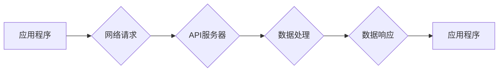

> API, 外部调用, 数据获取, 网络请求, JSON, XML, RESTful API, HTTP

## 1. 背景介绍

在现代软件开发中，应用程序通常需要访问外部数据源以提供更丰富和全面的功能。例如，一个天气预报应用程序需要从天气API获取实时天气信息；一个社交媒体应用程序需要从社交平台API获取用户数据；一个电商平台需要从物流API获取物流信息。

传统的软件开发模式通常依赖于本地数据库或文件存储，但随着互联网的普及和数据量的爆炸式增长，本地存储已经无法满足应用程序对数据获取的需求。因此，调用外部API获取额外信息成为了一种重要的软件开发模式。

## 2. 核心概念与联系

**2.1 核心概念**

* **API (Application Programming Interface)**：应用程序接口，是一种软件组件之间通信和交互的规范。它定义了应用程序如何请求数据、发送命令和接收响应。

* **外部API**：指应用程序与外部系统或服务进行交互的API。

* **网络请求**：应用程序向外部API发送请求的过程，通常通过HTTP协议进行。

* **数据格式**：API返回的数据通常以JSON或XML等格式进行传输。

**2.2 核心概念联系**

外部API调用流程通常包括以下步骤：

1. 应用程序发送网络请求到API服务器。
2. API服务器接收请求并进行验证和授权。
3. API服务器根据请求参数执行相应的逻辑操作。
4. API服务器返回数据响应给应用程序。
5. 应用程序解析数据响应并进行处理。

**2.3 Mermaid 流程图**



## 3. 核心算法原理 & 具体操作步骤

**3.1 算法原理概述**

调用外部API获取额外信息的核心算法原理是基于网络请求和数据解析。应用程序需要使用网络编程库发送HTTP请求到API服务器，并解析API返回的数据。

**3.2 算法步骤详解**

1. **获取API文档**: 首先需要获取目标API的文档，了解API的接口定义、请求参数、返回数据格式等信息。

2. **准备请求参数**: 根据API文档的要求，准备请求参数，并将其编码为URL参数或JSON格式。

3. **发送网络请求**: 使用网络编程库发送HTTP请求到API服务器，指定请求方法（GET、POST等）、请求路径、请求头和请求体。

4. **接收数据响应**: 接收API服务器返回的数据响应，并判断响应状态码是否成功。

5. **解析数据响应**: 解析API返回的数据，将其转换为应用程序可使用的格式，例如JSON对象或数据结构。

6. **处理数据**: 根据应用程序的需求，处理解析后的数据，例如显示数据、存储数据或进行其他操作。

**3.3 算法优缺点**

* **优点**:
    * 可以访问外部数据源，丰富应用程序功能。
    * 可以利用第三方平台的资源和服务，降低开发成本。
    * 可以快速集成新的功能，提高开发效率。

* **缺点**:
    * 依赖于外部API的稳定性和可用性。
    * API文档可能不完整或更新缓慢。
    * API调用可能会产生网络延迟和成本。

**3.4 算法应用领域**

* **天气预报应用程序**
* **社交媒体应用程序**
* **电商平台**
* **地图导航应用程序**
* **金融交易系统**

## 4. 数学模型和公式 & 详细讲解 & 举例说明

**4.1 数学模型构建**

调用外部API获取额外信息的过程可以抽象为一个数学模型，其中：

* **输入**: 请求参数
* **输出**: 数据响应
* **函数**: API逻辑处理函数

**4.2 公式推导过程**

假设API返回的数据是一个JSON对象，其中包含以下字段：

* `status`: 状态码，表示请求是否成功。
* `data`: 数据内容。

我们可以用以下公式表示API调用结果：

```latex
Result = API_Function(Request_Parameters)
```

其中：

* `Result` 表示API调用结果，是一个JSON对象。
* `API_Function` 表示API逻辑处理函数。
* `Request_Parameters` 表示请求参数。

**4.3 案例分析与讲解**

例如，一个天气预报应用程序需要调用天气API获取城市的天气信息。

* **请求参数**: 城市名称
* **API逻辑处理函数**: 根据城市名称查询天气数据
* **数据响应**: 包含城市名称、温度、湿度、风速等天气信息的JSON对象。

如果API调用成功，`status` 字段的值为 `200`，`data` 字段包含天气信息；如果API调用失败，`status` 字段的值为其他值，`data` 字段可能为空或包含错误信息。

## 5. 项目实践：代码实例和详细解释说明

**5.1 开发环境搭建**

* 操作系统：Windows/macOS/Linux
* 编程语言：Python
* 网络库：requests

**5.2 源代码详细实现**

```python
import requests

# 天气API接口地址
api_url = "https://api.example.com/weather"

# 请求参数
city = "北京"

# 发送网络请求
response = requests.get(api_url, params={"city": city})

# 判断请求是否成功
if response.status_code == 200:
    # 解析数据响应
    data = response.json()

    # 处理数据
    print(f"城市：{data['city']}")
    print(f"温度：{data['temperature']}℃")
    print(f"湿度：{data['humidity']}%")
else:
    print(f"请求失败，状态码：{response.status_code}")
```

**5.3 代码解读与分析**

1. 导入 `requests` 库，用于发送网络请求。
2. 定义天气API接口地址和请求参数。
3. 使用 `requests.get()` 方法发送GET请求到API服务器。
4. 判断响应状态码是否为 `200`，表示请求成功。
5. 使用 `response.json()` 方法解析JSON数据响应。
6. 处理解析后的数据，例如打印天气信息。

**5.4 运行结果展示**

如果API调用成功，程序将输出以下信息：

```
城市：北京
温度：25℃
湿度：60%
```

## 6. 实际应用场景

**6.1 天气预报应用程序**

天气预报应用程序需要调用天气API获取实时天气信息，例如温度、湿度、风速、降雨概率等。

**6.2 社交媒体应用程序**

社交媒体应用程序需要调用社交平台API获取用户数据，例如用户信息、好友列表、动态内容等。

**6.3 电商平台**

电商平台需要调用物流API获取物流信息，例如物流状态、配送时间、物流轨迹等。

**6.4 地图导航应用程序**

地图导航应用程序需要调用地图API获取地图数据，例如道路信息、交通状况、POI信息等。

**6.5 金融交易系统**

金融交易系统需要调用金融API获取金融数据，例如汇率、股票价格、债券收益率等。

**6.6 未来应用展望**

随着人工智能、物联网等技术的快速发展，外部API将发挥越来越重要的作用。未来，我们将看到更多基于API的创新应用，例如：

* **个性化推荐系统**: 通过调用用户行为数据API，提供个性化的商品推荐、内容推荐等服务。
* **智能家居系统**: 通过调用智能设备API，实现智能家居的自动化控制和场景化体验。
* **自动驾驶系统**: 通过调用地图数据API、交通状况API等，实现自动驾驶车辆的导航和避障。

## 7. 工具和资源推荐

**7.1 学习资源推荐**

* **RESTful API 设计指南**: https://restfulapi.net/
* **API 文档示例**: https://swagger.io/
* **网络编程教程**: https://www.w3schools.com/python/python_http.asp

**7.2 开发工具推荐**

* **Postman**: https://www.postman.com/
* **Insomnia**: https://insomnia.rest/
* **curl**: https://curl.se/

**7.3 相关论文推荐**

* **RESTful Web Services**: https://www.oreilly.com/library/view/restful-web-services/9780596527205/
* **Designing Data-Intensive Applications**: https://www.oreilly.com/library/view/designing-data-intensive/9781491956155/

## 8. 总结：未来发展趋势与挑战

**8.1 研究成果总结**

调用外部API获取额外信息已经成为一种成熟的软件开发模式，并广泛应用于各种领域。

**8.2 未来发展趋势**

* **API经济的兴起**: API将成为一种重要的商业资源，API市场将不断扩大。
* **微服务架构**: 微服务架构将更加依赖于API调用，API将成为微服务之间通信的关键。
* **人工智能与API的融合**: 人工智能技术将应用于API设计、开发和管理，提高API的智能化水平。

**8.3 面临的挑战**

* **API安全**: API安全是一个重要的挑战，需要采取措施防止API被恶意攻击。
* **API可维护性**: API的维护成本较高，需要建立完善的API文档和测试体系。
* **API标准化**: API标准化程度不高，不同API之间存在兼容性问题。

**8.4 研究展望**

未来，我们需要继续研究API的安全性、可维护性和标准化问题，并探索API与人工智能的融合应用。


## 9. 附录：常见问题与解答

**9.1 如何选择合适的API？**

选择合适的API需要考虑以下因素：

* API的功能是否满足需求
* API的稳定性和可用性
* API的文档是否完整
* API的收费标准

**9.2 如何处理API调用失败？**

API调用失败可能是由于网络问题、服务器问题或请求参数错误等原因。

* 检查网络连接是否正常
* 检查API服务器是否在线
* 检查请求参数是否正确
* 尝试重新发送请求

**9.3 如何保护API安全？**

保护API安全需要采取以下措施：

* 使用API密钥进行身份验证
* 使用HTTPS协议进行加密传输
* 限制API访问权限
* 定期更新API安全补丁


作者：禅与计算机程序设计艺术 / Zen and the Art of Computer Programming 
<end_of_turn>