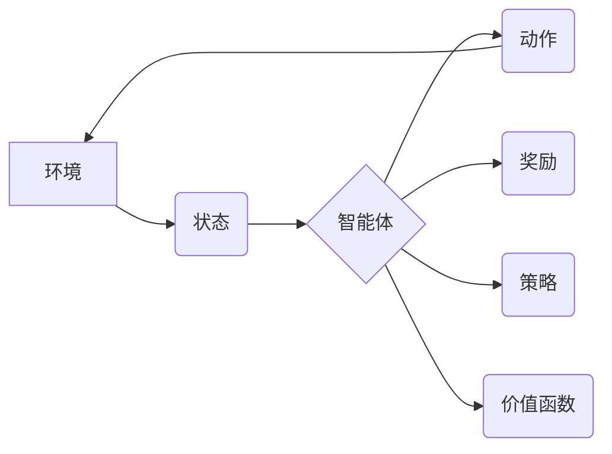

> 强化学习，RL，深度强化学习，Q学习，SARSA，环境，状态，动作，奖励，策略，价值函数

## 1. 背景介绍

在人工智能领域，强化学习 (Reinforcement Learning，RL) 作为一种重要的机器学习范式，近年来取得了显著进展，并在许多应用领域展现出强大的潜力。与监督学习和无监督学习不同，强化学习的核心在于让智能体通过与环境的交互学习最优策略，以最大化累积的奖励。

强化学习的灵感来源于动物行为学和心理学，它模拟了动物通过试错学习和奖励机制来获得最佳行为模式的过程。在强化学习中，智能体被视为一个决策者，它会根据当前状态选择动作，并根据环境的反馈获得奖励或惩罚。通过不断地学习和调整策略，智能体最终能够找到最优策略，从而在环境中取得最佳结果。

## 2. 核心概念与联系

**核心概念：**

* **环境 (Environment):** 强化学习系统中的外部世界，它提供给智能体状态信息和对动作的反馈。
* **智能体 (Agent):** 学习和决策的实体，它会根据环境的状态选择动作并与环境交互。
* **状态 (State):** 环境的当前描述，它包含了所有与智能体决策相关的关键信息。
* **动作 (Action):** 智能体可以采取的行动，它会改变环境的状态。
* **奖励 (Reward):** 环境对智能体动作的反馈，它可以是正向的（奖励）或负向的（惩罚）。
* **策略 (Policy):** 智能体选择动作的规则，它将状态映射到动作。
* **价值函数 (Value Function):** 评估状态或状态-动作对的期望回报，它帮助智能体选择最优动作。

**核心关系：**



## 3. 核心算法原理 & 具体操作步骤

### 3.1  算法原理概述

强化学习算法的核心是通过不断地与环境交互，学习最优策略。常见的强化学习算法包括 Q 学习、SARSA 等。

* **Q 学习:** Q 学习是一种基于价值函数的强化学习算法，它通过学习状态-动作对的 Q 值来选择最优动作。Q 值表示从当前状态执行某个动作后，获得的期望累积奖励。

* **SARSA:** SARSA 是一种基于策略的强化学习算法，它通过学习策略来选择最优动作。策略表示从当前状态选择动作的概率分布。

### 3.2  算法步骤详解

**Q 学习算法步骤：**

1. 初始化 Q 值表，将所有状态-动作对的 Q 值设置为 0。
2. 在环境中进行交互，观察状态、选择动作、获得奖励和下一个状态。
3. 更新 Q 值表：

```
Q(s, a) = Q(s, a) + α * [r + γ * max(Q(s', a')) - Q(s, a)]
```

其中：

* s：当前状态
* a：当前动作
* r：获得的奖励
* s'：下一个状态
* α：学习率
* γ：折扣因子
* max(Q(s', a'))：下一个状态的所有动作的 Q 值的最大值

4. 重复步骤 2 和 3，直到 Q 值表收敛。

**SARSA 算法步骤：**

1. 初始化策略 π，将所有状态-动作对的策略值设置为 0。
2. 在环境中进行交互，观察状态、选择动作、获得奖励和下一个状态。
3. 更新策略值：

```
π(s, a) = π(s, a) + α * [r + γ * π(s', a') - π(s, a)]
```

其中：

* s：当前状态
* a：当前动作
* r：获得的奖励
* s'：下一个状态
* a'：下一个状态选择的动作
* α：学习率
* γ：折扣因子

4. 重复步骤 2 和 3，直到策略收敛。

### 3.3  算法优缺点

**Q 学习:**

* **优点:** 能够学习最优策略，收敛速度快。
* **缺点:** 需要探索所有状态-动作对，容易陷入局部最优。

**SARSA:**

* **优点:** 能够在线学习，不会陷入局部最优。
* **缺点:** 收敛速度慢，可能无法学习到最优策略。

### 3.4  算法应用领域

强化学习算法广泛应用于以下领域：

* **游戏 AI:** 训练游戏 AI 玩家，例如 AlphaGo、AlphaStar 等。
* **机器人控制:** 控制机器人执行复杂任务，例如导航、抓取等。
* **推荐系统:** 建议用户感兴趣的内容，例如电影、音乐、商品等。
* **金融交易:** 自动化交易策略，例如股票投资、期货交易等。

## 4. 数学模型和公式 & 详细讲解 & 举例说明

### 4.1  数学模型构建

强化学习的数学模型主要包括状态空间、动作空间、奖励函数和价值函数。

* **状态空间 (State Space):** 所有可能的系统状态的集合。
* **动作空间 (Action Space):** 智能体可以采取的所有动作的集合。
* **奖励函数 (Reward Function):** 将状态-动作对映射到奖励值，奖励值表示智能体在该状态执行该动作后的收益。
* **价值函数 (Value Function):** 评估状态或状态-动作对的期望累积奖励。

### 4.2  公式推导过程

**Q 值更新公式:**

```
Q(s, a) = Q(s, a) + α * [r + γ * max(Q(s', a')) - Q(s, a)]
```

其中：

* Q(s, a)：状态 s 下执行动作 a 的 Q 值。
* α：学习率，控制学习速率。
* r：获得的奖励。
* γ：折扣因子，控制未来奖励的权重。
* max(Q(s', a')): 下一个状态 s' 下所有动作 a' 的 Q 值的最大值。

**策略更新公式:**

```
π(s, a) = π(s, a) + α * [r + γ * π(s', a') - π(s, a)]
```

其中：

* π(s, a)：状态 s 下执行动作 a 的策略值。

### 4.3  案例分析与讲解

**案例：**

一个智能体在迷宫中寻找出口。

* 状态空间：迷宫中的所有位置。
* 动作空间：向上、向下、向左、向右四个方向。
* 奖励函数：到达出口时奖励 1，否则奖励 0。

**Q 学习算法:**

智能体通过探索迷宫，学习每个位置执行每个动作的 Q 值。最终，智能体能够找到最优路径到达出口。

**SARSA 算法:**

智能体根据当前策略选择动作，并根据环境的反馈更新策略值。最终，智能体能够找到最优策略，并能够在迷宫中导航。

## 5. 项目实践：代码实例和详细解释说明

### 5.1  开发环境搭建

* Python 3.x
* TensorFlow 或 PyTorch

### 5.2  源代码详细实现

```python
import numpy as np

# 定义环境
class Environment:
    def __init__(self):
        self.state = 0
        self.actions = [0, 1, 2, 3]  # 向上、向下、向左、向右

    def step(self, action):
        # 根据动作更新状态
        # ...
        reward = 0  # 奖励
        done = False  # 是否结束
        return self.state, reward, done

# 定义 Q 学习算法
class QLearning:
    def __init__(self, env, alpha=0.1, gamma=0.9, epsilon=0.1):
        self.env = env
        self.alpha = alpha
        self.gamma = gamma
        self.epsilon = epsilon
        self.q_table = np.zeros((env.state_size, len(env.actions)))

    def choose_action(self, state):
        if np.random.uniform(0, 1) < self.epsilon:
            return np.random.choice(self.env.actions)
        else:
            return np.argmax(self.q_table[state, :])

    def learn(self, state, action, reward, next_state):
        self.q_table[state, action] = (1 - self.alpha) * self.q_table[state, action] + self.alpha * (reward + self.gamma * np.max(self.q_table[next_state, :]))

# 创建环境和 Q 学习算法
env = Environment()
agent = QLearning(env)

# 训练
for episode in range(1000):
    state = env.reset()
    done = False
    while not done:
        action = agent.choose_action(state)
        next_state, reward, done = env.step(action)
        agent.learn(state, action, reward, next_state)
        state = next_state

# 测试
state = env.reset()
while True:
    action = agent.choose_action(state)
    next_state, reward, done = env.step(action)
    print(f"State: {state}, Action: {action}, Reward: {reward}")
    state = next_state
    if done:
        break
```

### 5.3  代码解读与分析

* **环境类 (Environment):** 定义了迷宫环境，包括状态空间、动作空间、奖励函数等。
* **Q 学习类 (QLearning):** 实现 Q 学习算法，包括 Q 值表、学习率、折扣因子、探索率等参数。
* **choose_action() 方法:** 根据当前状态和策略选择动作。
* **learn() 方法:** 更新 Q 值表。
* **训练和测试:** 训练智能体在环境中学习，并测试其在环境中的表现。

### 5.4  运行结果展示

运行代码后，智能体将在迷宫中探索，并最终找到最优路径到达出口。

## 6. 实际应用场景

强化学习在许多实际应用场景中取得了成功，例如：

* **游戏 AI:** AlphaGo、AlphaStar 等游戏 AI 都是基于强化学习训练的。
* **机器人控制:** 强化学习可以训练机器人执行复杂任务，例如导航、抓取等。
* **推荐系统:** 强化学习可以个性化推荐用户感兴趣的内容。
* **金融交易:** 强化学习可以用于开发自动交易策略。

### 6.4  未来应用展望

强化学习在未来将有更广泛的应用，例如：

* **自动驾驶:** 强化学习可以训练自动驾驶汽车在复杂环境中安全行驶。
* **医疗保健:** 强化学习可以用于辅助诊断、制定治疗方案等。
* **个性化教育:** 强化学习可以根据学生的学习进度和能力提供个性化学习方案。

## 7. 工具和资源推荐

### 7.1  学习资源推荐

* **书籍:**
    * Reinforcement Learning: An Introduction by Richard S. Sutton and Andrew G. Barto
    * Deep Reinforcement Learning Hands-On by Maxim Lapan
* **在线课程:**
    * Coursera: Reinforcement Learning Specialization by David Silver
    * Udacity: Deep Reinforcement Learning Nanodegree

### 7.2  开发工具推荐

* **TensorFlow:** 深度学习框架，支持强化学习算法的实现。
* **PyTorch:** 深度学习框架，支持强化学习算法的实现。
* **OpenAI Gym:** 强化学习环境库，提供各种标准环境。

### 7.3  相关论文推荐

* Deep Q-Network (DQN)
* Proximal Policy Optimization (PPO)
* Trust Region Policy Optimization (TRPO)

## 8